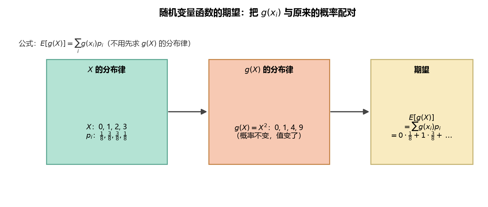

# 《概率论与数理统计》4.1 一维随机变量函数的期望 - 笔记

> 整理自 B 站《概率论与数理统计》教学视频 2.0 版本（up：宋浩老师官方）p34。
> 前置：p33 数学期望的定义；p16/p17 随机变量函数的分布。

## 目录

- [一、 问题引入](#一-问题引入)
- [二、 离散型：$E[g(X)]$ 公式](#二-离散型egx-公式)
- [三、 连续型：$E[g(X)]$ 公式](#三-连续型egx-公式)
- [四、 完整例题（公式熟练度训练）](#四-完整例题公式熟练度训练)
- [本节重点](#本节重点)

---

## 一、 问题引入

$X$ 本身有期望 $EX$；但实际问题常需要求 **$X$ 的函数 $Y=g(X)$ 的期望**，例如"正方形边长是随机变量 $X$，求面积 $X^2$ 的平均大小"。

**两条路线**（对应 p16 的两种做法）：

1. 先求 $Y=g(X)$ 的分布，再按定义算 $E(Y)$——绕路；
2. **直接公式**：$E[g(X)]=\sum g(x_k)p_k$（离散）/ $\int g(x)f(x)dx$（连续）——不用先求 $Y$ 的分布。

## 二、 离散型：$E[g(X)]$ 公式

设 $X$ 的分布律为 $P\{X=x_k\}=p_k$，则

$$E[g(X)]=\sum_{k} g(x_k)\,p_k$$

**白话解读**：和 $EX=\sum x_k p_k$ 长得一样，**只是"取值"从 $x_k$ 换成了 $g(x_k)$，概率 $p_k$ 不变**。

**例八（Y=2X）**：$X$ 取 $-1,0,1$，概率 $0.2,0.3,0.5$，求 $E(Y)$，$Y=2X$。

- 方法一（先求分布）：$Y$ 取 $-2,0,2$，概率仍为 $0.2,0.3,0.5$，$EY=(-2)\times0.2+0\times0.3+2\times0.5=0.6$；
- 方法二（直接公式）：$E(2X)=(-1)\times2\times0.2+0\times2\times0.3+1\times2\times0.5=0.6$。

两种方法殊途同归。直接公式免去"先求 $Y$ 分布"的步骤。

> **图2** 一维函数期望：$g(x_i)$ 与原来的概率 $p_i$ 配对求和——不必先求 $g(X)$ 的分布律（自绘）。

## 三、 连续型：$E[g(X)]$ 公式

设 $X$ 的密度为 $f(x)$，则

$$E[g(X)]=\int_{-\infty}^{+\infty} g(x)\, f(x)\,dx$$

**白话解读**：同样把 $EX=\int x f(x)dx$ 里的"取值" $x$ 换成 $g(x)$，密度不变。

> **记忆法**：四个公式连起来记——$EX=\sum x_kp_k$、$E[g(X)]=\sum g(x_k)p_k$、$EX=\int xf(x)dx$、$E[g(X)]=\int g(x)f(x)dx$。**横竖都是"取值 × 概率/密度"**，差别只在取值用 $x$ 还是 $g(x)$。

## 四、 完整例题（公式熟练度训练）

**例九**：$X$ 取 $0,1,2$，概率 $0.1,0.6,0.3$。

**(1) $E(X^2)$**：取值平方后乘概率：

$$E(X^2)=0^2\times0.1+1^2\times0.6+2^2\times0.3=0+0.6+1.2=1.8$$

**(2) $E(X^3)$**：

$$E(X^3)=0^3\times0.1+1^3\times0.6+2^3\times0.3=0+0.6+2.4=3$$

**(3) $E(X)$**：

$$EX=0\times0.1+1\times0.6+2\times0.3=1.2$$

**(4) $E(X-EX)^2$**：注意这是**新的函数** $g(x)=(x-EX)^2=(x-1.2)^2$：

$$E(X-1.2)^2=(0-1.2)^2\times0.1+(1-1.2)^2\times0.6+(2-1.2)^2\times0.3$$

$$=1.44\times0.1+0.04\times0.6+0.64\times0.3=0.144+0.024+0.192=0.36$$

> **易错点**：$E(X-EX)^2$ 是"随机变量 $X$ 到它的均值 $EX$ 的距离平方的期望"，$EX$ 在这里是一个**已经算出的常数**，代入后 $X$ 的三个取值分别变成 $-1.2,\ -0.2,\ 0.8$。这个量就是下一节的**方差** $D(X)$——第 (4) 问其实提前演示了方差的算法。

---

## 本节重点

> - **核心公式**：$E[g(X)]=\sum g(x_k)p_k$（离散）、$E[g(X)]=\int g(x)f(x)dx$（连续）——取值换成 $g(x)$，概率/密度不动。
> - **不用绕路**：求 $Y=g(X)$ 的期望不必先求 $Y$ 的分布，直接套公式。
> - **$E(X-EX)^2$ 的含义**：$EX$ 是常数，算完 $EX$ 再对 $(X-EX)^2$ 求期望，得到的就是方差 $D(X)$（p37 正式定义）。
> - **常见坑**：别把 $E(X^2)$ 和 $(EX)^2$ 搞混——前者是 $X^2$ 的期望（例九第 1 问 $=1.8$），后者是期望的平方（$1.2^2=1.44$），**两者一般不相等**。
