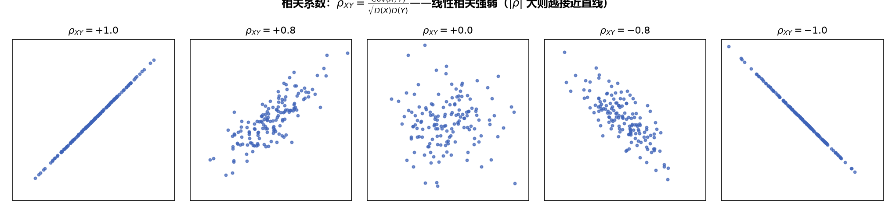

# 《概率论与数理统计》4.3 相关系数 - 笔记

> 整理自 B 站《概率论与数理统计》教学视频 2.0 版本（up：宋浩老师官方）p42。
> 前置：p41 协方差、p37/p38 方差定义与性质。

## 目录

- [一、 相关系数的定义](#一-相关系数的定义)
- [二、 两个常用公式](#二-两个常用公式)
- [三、 相关系数的性质](#三-相关系数的性质)
- [四、 独立与不相关（最重要逻辑）](#四-独立与不相关最重要逻辑)
- [五、 例题](#五-例题)
- [本节重点](#本节重点)

---

## 一、 相关系数的定义

$$\rho_{XY}=\frac{\mathrm{Cov}(X,Y)}{\sqrt{D(X)}\sqrt{D(Y)}}$$

即"协方差 除以 两个标准差之积"——把协方差**标准化**，消除量纲影响。

**标准化视角**：设 $X^*=\dfrac{X-EX}{\sqrt{DX}}$，$Y^*=\dfrac{Y-EY}{\sqrt{DY}}$，则

$$\mathrm{Cov}(X^*,Y^*)=\rho_{XY}$$

> 白话：相关系数就是"标准化后的两个变量"的协方差——它是**无量纲**的协方差，方便跨问题比较。

> **图10** 相关系数直观：$|\rho|$ 越接近 1 数据越贴近直线；$|\rho|$ 小则线性关系弱（自绘）。

## 二、 两个常用公式

**公式 1（方差 ⇄ 相关系数）**：

$$D(X\pm Y)=D(X)+D(Y)\pm 2\,\rho_{XY}\sqrt{D(X)}\sqrt{D(Y)}$$

**公式 2（线性组合）**：

$$D(aX\pm bY)=a^2D(X)+b^2D(Y)\pm 2ab\,\rho_{XY}\sqrt{D(X)}\sqrt{D(Y)}$$

**逆用**：已知 $\rho$ 求 $\mathrm{Cov}$：

$$\mathrm{Cov}(X,Y)=\rho_{XY}\sqrt{D(X)}\sqrt{D(Y)}$$

## 三、 相关系数的性质

1. **有界性**：$|\rho_{XY}|\le 1$；
2. **完全线性相关**：$|\rho_{XY}|=1\iff P\{Y=aX+b\}=1$（以概率 1 呈线性关系）：
   - $\rho=1$：$a>0$，完全**正**相关（同增同减）；
   - $\rho=-1$：$a<0$，完全**负**相关（一增一减）；
3. **$\rho=0$ 称"不相关"**：仅指**没有线性关系**（可能有非线性关系，如 $Y=X^2$、$Y=e^X$）。

**白话解读**：$\rho$ 衡量的是"线性关系的强弱"——越接近 $\pm1$ 越接近一条直线，$\rho=0$ 只是"不像直线"，不代表"没关系"。

## 四、 独立与不相关（最重要逻辑）

$$\text{独立}\ \Rightarrow\ \text{不相关}\qquad\text{不相关}\ \not\Rightarrow\ \text{独立}$$

- 独立：没有任何关系（无线也无非线性）；
- 不相关：只是**没有线性关系**，可能有非线性关系。

**唯一的例外——二维正态分布**：若 $(X,Y)$ 服从二维正态分布，则

$$\text{独立}\iff\rho=0\iff\text{不相关}$$

（二维正态中独立与不相关**等价**——这是考试最爱考的特殊情形。）

> **记忆**：对一般分布，"独立"强于"不相关"；只有二维正态两者等价。看到"判断是否独立/相关"，先问：是不是二维正态？

## 五、 例题

**例四（离散型，抽产品）**：100 件产品中一等品 80、二等品 10、三等品 10，任取一件。$X_i=\begin{cases}1, & \text{抽到 } i \text{ 等品}\\0, & \text{否则}\end{cases}$，求 $\rho_{X_1X_2}$。

关键：**一次只能抽到一种等级**，所以 $P\{X_1=1,X_2=1\}=0$。联合分布：

| $X_1\backslash X_2$ | 0 | 1 |
|---|---|---|
| 0 | 0.1（三等） | 0.1（二等） |
| 1 | 0.8（一等） | 0（不可能） |

边缘分布：$X_1$：$0.2,0.8$；$X_2$：$0.9,0.1$。

$$EX_1=0.8,\quad EX_2=0.1,\quad E(X_1X_2)=1\times1\times0+0=0$$

$$\mathrm{Cov}(X_1,X_2)=0-0.8\times0.1=-0.08$$

$$D(X_1)=E(X_1^2)-(EX_1)^2=0.8-0.64=0.16,\quad D(X_2)=0.1-0.01=0.09$$

$$\rho_{X_1X_2}=\frac{-0.08}{\sqrt{0.16}\sqrt{0.09}}=\frac{-0.08}{0.4\times0.3}=-\frac23$$

（抽到一等品与抽到二等品天然"此消彼长"，相关系数为负。）

**例五（连续型，三角形区域均匀分布）**：$(X,Y)$ 在区域 $D=\{(x,y):0\le x\le1,\ 0\le y\le1,\ y\ge x\}$ 上均匀，$f(x,y)=2$（面积 $1/2$ 的倒数）。

- 边缘密度：$f_X(x)=2(1-x)\ (0<x<1)$，$f_Y(y)=2y\ (0<y<1)$；
- $EX=\int_0^1 x\cdot2(1-x)dx=\dfrac13$，$EY=\int_0^1 y\cdot2y\,dy=\dfrac23$；
- $E(X^2)=\int_0^1 x^2\cdot2(1-x)dx=\dfrac16$，$E(Y^2)=\int_0^1 y^2\cdot2y\,dy=\dfrac12$；
- $D(X)=\dfrac16-\dfrac19=\dfrac1{18}$，$D(Y)=\dfrac12-\dfrac49=\dfrac1{18}$；
- $E(XY)=\int_0^1\int_x^1 xy\cdot2\,dy\,dx=\dfrac14$；
- $\mathrm{Cov}(X,Y)=\dfrac14-\dfrac13\cdot\dfrac23=\dfrac1{36}$；
- $\rho_{XY}=\dfrac{1/36}{\sqrt{1/18}\sqrt{1/18}}=\dfrac12$。

**例六（用 $\rho$ 反推方差）**：$X\sim N(1,4)$，$Y\sim Exp(\lambda)$ 且 $D(Y)=4$，$\rho_{XY}=0.4$，求 $D(3X-2Y)$。

$$\mathrm{Cov}(X,Y)=\rho\sqrt{DX}\sqrt{DY}=0.4\times2\times2=1.6$$

$$D(3X-2Y)=3^2D(X)+2^2D(Y)-2\cdot3\cdot2\cdot\mathrm{Cov}(X,Y)=36+16-19.2=32.8$$

**例七（只给矩与 $\rho$）**：$E(X)=0,\ E(Y)=0,\ E(X^2)=2,\ E(Y^2)=2,\ \rho=0.5$，求 $E(X+Y)^2$。

$$E(X+Y)^2=E(X^2)+2E(XY)+E(Y^2)$$

由 $\mathrm{Cov}(X,Y)=\rho\sqrt{DX}\sqrt{DY}$，其中 $DX=2-0=2$，$DY=2$，故 $\mathrm{Cov}=0.5\times2=2\times0.5=1$？——注意 $\sqrt2\times\sqrt2=2$，$\mathrm{Cov}=0.5\times2=1$，又 $\mathrm{Cov}=E(XY)-EX\cdot EY=E(XY)$，所以 $E(XY)=1$：

$$E(X+Y)^2=2+2\times1+2=6$$

> **易错点**：① $E(XY)$ 要用 $\rho$、$\sqrt{DX}\sqrt{DY}$、$EX\cdot EY$ 三者拼出来，缺一不可；② $D(3X-2Y)$ 中间是"减号时协方差项取负"（$D(aX-bY)=a^2DX+b^2DY-2ab\mathrm{Cov}$）；③ 二维正态中 $\rho=0$ 才可放心用独立结论。

---

## 本节重点

> - **定义**：$\rho=\dfrac{\mathrm{Cov}(X,Y)}{\sqrt{DX}\sqrt{DY}}$，无量纲；标准化变量的协方差就是 $\rho$。
> - **公式**：$D(X\pm Y)=DX+DY\pm2\rho\sqrt{DX}\sqrt{DY}$；$\mathrm{Cov}=\rho\sqrt{DX}\sqrt{DY}$。
> - **性质**：$|\rho|\le1$；$|\rho|=1$ 完全线性相关（$\rho=1$ 正、$-1$ 负）；$\rho=0$ 不相关=无线性关系。
> - **逻辑**：独立 ⇒ 不相关；不相关 ⇏ 独立；**二维正态例外：独立 ⇔ $\rho=0$**。
> - **常见坑**：① 把"不相关"当"独立"；② 忘了 $\mathrm{Cov}=\rho\sqrt{DX}\sqrt{DY}$ 的拼装；③ 二维正态之外用 $\rho=0$ 断言独立。
