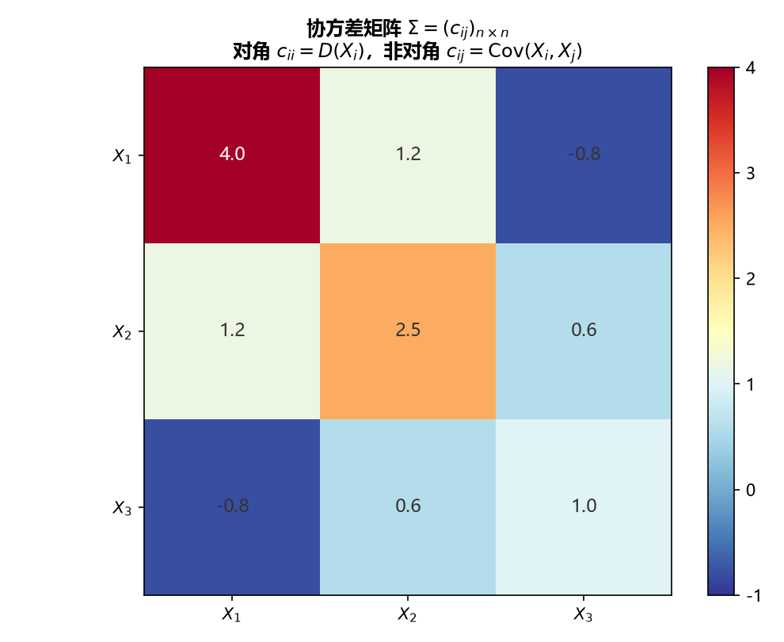

# 《概率论与数理统计》4.4 矩与协方差矩阵 - 笔记

> 整理自 B 站《概率论与数理统计》教学视频 2.0 版本（up：宋浩老师官方）p43。
> 前置：p33 期望、p37 方差、p41 协方差。

## 目录

- [一、 矩的定义](#一-矩的定义)
- [二、 矩速记表](#二-矩速记表)
- [三、 例题（按定义计算）](#三-例题按定义计算)
- [四、 协方差矩阵](#四-协方差矩阵)
- [五、 应用例题（股票投资组合）](#五-应用例题股票投资组合)
- [本节重点](#本节重点)

---

## 一、 矩的定义

**原点矩**（以 0 为中心，即"减 0"）：

$$E(X^k)\ \text{——} X \text{ 的 } k \text{ 阶原点矩}$$

**中心矩**（以期望 $EX$ 为中心）：

$$E\big[(X-EX)^k\big]\ \text{——} X \text{ 的 } k \text{ 阶中心矩}$$

**混合矩**（两个变量）：

$$E(X^kY^l)\ \text{——} k+l \text{ 阶混合（原点）矩}$$

$$E\big[(X-EX)^k(Y-EY)^l\big]\ \text{——} k+l \text{ 阶混合中心矩}$$

**白话解读**：期望 $EX$ 是一阶原点矩；方差 $E(X-EX)^2$ 是二阶中心矩；协方差 $E[(X-EX)(Y-EY)]$ 是 $1+1$ 阶混合中心矩——**矩就是"幂次期望"的统一命名**，把期望、方差、协方差都收进了一个框架。

## 二、 矩速记表

| 名称 | 表达式 | 阶数 |
|---|---|---|
| 一阶原点矩 | $E(X)$ | 1 |
| 二阶原点矩 | $E(X^2)$ | 2 |
| 二阶中心矩 | $E[(X-EX)^2]=D(X)$ | 2 |
| 协方差 | $E[(X-EX)(Y-EY)]$ | 1+1（混合中心） |
| $k$ 阶原点矩 | $E(X^k)$ | k |
| $k$ 阶中心矩 | $E[(X-EX)^k]$ | k |

## 三、 例题（按定义计算）

**例一**：$X$ 取 $-1,0,1,2$，概率 $0.1,0.2,0.3,0.4$。

**(1) 一阶原点矩** $=EX$：

$$EX=(-1)\times0.1+0\times0.2+1\times0.3+2\times0.4=-0.1+0.3+0.8=1$$

**(2) 二阶原点矩** $=E(X^2)$：

$$E(X^2)=1\times0.1+0+1\times0.3+4\times0.4=0.4+1.6=2$$

**(3) 三阶原点矩** $=E(X^3)$：

$$E(X^3)=(-1)\times0.1+0+1\times0.3+8\times0.4=-0.1+0.3+3.2=3.4$$

**(4) 二阶中心矩** $=D(X)$（用方差公式，别用定义硬算）：

$$D(X)=E(X^2)-(EX)^2=2-1^2=1$$

> **易错点**：中心矩优先用 $E(X^2)-(EX)^2$；原点矩按"取值 $k$ 次方 × 概率"逐项算，注意负数的奇次幂仍为负。

## 四、 协方差矩阵

对二维随机向量 $(X_1,X_2)$，把四个协方差排成矩阵：

$$\begin{pmatrix}\mathrm{Cov}(X_1,X_1) & \mathrm{Cov}(X_1,X_2)\\ \mathrm{Cov}(X_2,X_1) & \mathrm{Cov}(X_2,X_2)\end{pmatrix}=\begin{pmatrix}D(X_1) & \mathrm{Cov}(X_1,X_2)\\ \mathrm{Cov}(X_2,X_1) & D(X_2)\end{pmatrix}$$

**关键性质**：

1. **对角线是方差**：$\mathrm{Cov}(X_i,X_i)=D(X_i)$；
2. **对称矩阵**：$\mathrm{Cov}(X_1,X_2)=\mathrm{Cov}(X_2,X_1)$（由协方差对称性）。

**白话解读**：协方差矩阵把"每个变量自己的波动（对角线）"和"变量两两之间的关系（非对角线）"装进一张表——主对角线是方差，副对角线是协方差。

> **图11** 协方差矩阵：对角元是各自方差，非对角元是两两协方差，对称阵（自绘）。

## 五、 应用例题（股票投资组合）

**例三**：两只股票 A、B，收益率 $R_A,R_B$，协方差矩阵为

$$\begin{pmatrix}16 & 6\\ 6 & 9\end{pmatrix}$$

即 $D(R_A)=16$，$D(R_B)=9$，$\mathrm{Cov}(R_A,R_B)=6$。设资金按比例 $X:(1-X)$ 投入 A、B（$X$ 投 A、$1-X$ 投 B），组合收益率 $R_P=XR_A+(1-X)R_B$。

**(1) 相关系数**：

$$\rho_{AB}=\frac{\mathrm{Cov}(R_A,R_B)}{\sqrt{D(R_A)}\sqrt{D(R_B)}}=\frac{6}{\sqrt{16}\sqrt9}=\frac{6}{4\times3}=\frac12$$

**(2) 组合收益率的方差**（用 $D(aX\pm bY)$ 公式）：

$$D(R_P)=X^2\cdot16+(1-X)^2\cdot9+2X(1-X)\cdot6$$

$$=16X^2+9(1-2X+X^2)+12X-12X^2=13X^2-6X+9$$

> 得到 $D(R_P)=13X^2-6X+9$ 后，可用一元二次函数求最优配置 $X$（方差最小化的投资组合），这就是"均值-方差分析"的雏形。

> **易错点**：① 读矩阵时先认准对角线是方差、副对角线是协方差；② 组合方差展开时交叉项系数是 $2ab\cdot\mathrm{Cov}$，系数**直提**不平方；③ 不要把 $\rho$ 和 $\mathrm{Cov}$ 混用——题目给矩阵直接用 $\mathrm{Cov}$，给相关系数才用 $\rho\sqrt{DX}\sqrt{DY}$ 转换。

---

## 本节重点

> - **矩**：原点矩 $E(X^k)$（减 0）、中心矩 $E[(X-EX)^k]$（减均值）；方差是 2 阶中心矩，协方差是 1+1 阶混合中心矩。
> - **协方差矩阵**：对角线 $=D(X_i)$，副对角线 $=\mathrm{Cov}(X_i,X_j)$，必为对称矩阵。
> - **做题**：矩按定义逐项算（注意负值奇次幂）；中心矩优先用方差公式。
> - **应用**：组合收益 $R_P=XR_A+(1-X)R_B$ 的方差 $=X^2D_A+(1-X)^2D_B+2X(1-X)\mathrm{Cov}$，可用于求最优配置。
> - **常见坑**：矩阵读错位置；交叉项漏 $2ab$；把矩阵里的协方差当相关系数用。

---

## 教材深化（《统计学完全教程》第3章）

> 整理自《统计学完全教程》(L. Wasserman) 第3章，为教材比原笔记更深的内容。

### 三、 矩的存在性

- $k$ 阶矩：$\mathbb E(X^k)$（要求 $\mathbb E(|X|^k)<\infty$）；$k$ 阶中心矩：$\mathbb E\big((X-\mu)^k\big)$。
- **定理 3.10**：若 $k$ 阶矩存在，则所有 $j<k$ 阶矩都存在。
  证明：$\int|x|^j f\,dx=\int_{|x|\le1}+\int_{|x|>1}\le 1+\mathbb E(|X|^k)<\infty$。

### 五、 协方差矩阵与线性变换

随机向量 $X=(X_1,\dots,X_k)$：
- 均值向量 $\mu=\big(\mathbb E(X_1),\dots,\mathbb E(X_k)\big)$；
- **协方差矩阵（方差-协方差阵）**：
$$\Sigma=V(X)=\begin{pmatrix}V(X_1) & \text{Cov}(X_1,X_2)&\cdots\\ \text{Cov}(X_2,X_1)&V(X_2)&\cdots\\ \vdots&\vdots&\ddots\end{pmatrix}$$

**Lemma 3.21（线性变换法则）**：
$$\mathbb E(a^TX)=a^T\mu,\qquad V(a^TX)=a^T\Sigma a,\qquad \mathbb E(AX)=A\mu,\qquad V(AX)=A\Sigma A^T$$

> 这是多元正态、回归、主成分分析里反复用的公式；笔记第4章定义了协方差矩阵但没给这些运算法则。

### 十一、 矩母函数 MGF

**定义（Laplace 变换）**：
$$\psi_X(t)=\mathbb E\big(e^{tX}\big)$$
假设在 $t=0$ 的某个开区间内有限。

**求矩**：在可交换微积分与期望的条件下，
$$\psi^{(k)}(0)=\mathbb E(X^k)$$
即 **MGF 在原点的 $k$ 阶导数 = $k$ 阶矩**。

**性质（Lemma 3.31）**：
1. $Y=aX+b\Rightarrow \psi_Y(t)=e^{bt}\psi_X(at)$；
2. $X_1,\dots,X_n$ 独立，$Y=\sum X_i\Rightarrow \psi_Y(t)=\prod_i\psi_i(t)$（**独立和的 MGF = 乘积**）。

**决定分布（Theorem 3.33）**：若 $\psi_X(t)=\psi_Y(t)$（在0附近），则 $X\stackrel{d}{=}Y$。即 **MGF 唯一决定分布**——用来证"独立同族变量之和仍属同族"很方便。

**常见分布 MGF**：

| 分布 | MGF $\psi(t)$ |
|---|---|
| Bernoulli$(p)$ | $pe^t+(1-p)$ |
| Binomial$(n,p)$ | $(pe^t+1-p)^n$ |
| Poisson$(\lambda)$ | $e^{\lambda(e^t-1)}$ |
| Normal$(\mu,\sigma)$ | $\exp\{\mu t+\sigma^2t^2/2\}$ |
| Gamma$(\alpha,\beta)$ | $(1-\beta t)^{-\alpha}$（$t<1/\beta$） |

**例**：$Y_1\sim\text{Poisson}(\lambda_1)$、$Y_2\sim\text{Poisson}(\lambda_2)$ 独立，则 $\psi_Y(t)=e^{(\lambda_1+\lambda_2)(e^t-1)}$，故 $Y_1+Y_2\sim\text{Poisson}(\lambda_1+\lambda_2)$。二项同理：$X_1+X_2\sim\text{Binomial}(n_1+n_2,p)$。

> 相关概念：**特征函数** $\varphi(t)=\mathbb E(e^{itX})$ 对所有 $t$ 都有定义（比 MGF 更稳健），分布决定论的更强版本。

---

