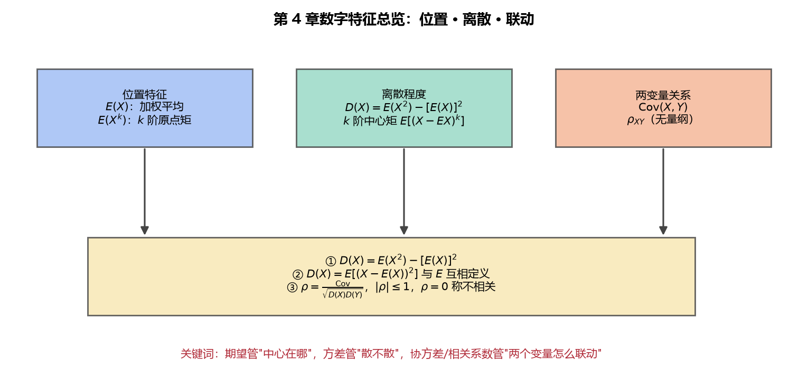

# 《概率论与数理统计》第4章 总结 - 笔记

> 整理自 B 站《概率论与数理统计》教学视频 2.0 版本（up：宋浩老师官方）p33~p43。
> 覆盖：4.1 数学期望（p33~p36）、4.2 方差（p37~p40）、4.3 协方差与相关系数（p41~p42）、4.4 矩与协方差矩阵（p43）。

## 目录

- [一、 知识框架](#一-知识框架)
- [二、 核心公式速查表](#二-核心公式速查表)
- [三、 常见分布期望方差表](#三-常见分布期望方差表)
- [四、 易错点总汇](#四-易错点总汇)
- [五、 解题流程模板](#五-解题流程模板)

---

## 一、 知识框架

```
随机变量的数字特征
├── 期望 E(X)        —— 位置：取值×概率/密度 的加权和
│   ├── 定义：离散 Σxkpk / 连续 ∫xf(x)dx
│   ├── 函数期望：E[g(X)] = Σg(xk)pk / ∫g(x)f(x)dx
│   ├── 二维：E[g(X,Y)] = ΣΣg(xi,yj)pij / ∬g(x,y)f(x,y)dxdy
│   └── 性质：E(C)=C、E(aX+b)=aEX+b、E(X±Y)=EX±EY（无条件）、
│            E(XY)=EX·EY（须独立）
├── 方差 D(X)         —— 分散：离差平方的期望
│   ├── 定义：D(X)=E(X-EX)²；计算公式：D(X)=E(X²)-(EX)²
│   ├── 标准差 σ=√D(X)；标准化 X*=(X-μ)/σ（EX*=0, DX*=1）
│   └── 性质：D(C)=0、D(aX+b)=a²D(X)、独立时 D(X±Y)=DX+DY
├── 协方差 Cov(X,Y)   —— 两变量一起偏离均值
│   ├── 定义：Cov=E[(X-EX)(Y-EY)]=E(XY)-EX·EY
│   ├── 独立 ⇒ Cov=0（反之不成立）
│   └── D(X±Y)=DX+DY±2Cov
├── 相关系数 ρ         —— 标准化的协方差（无量纲）
│   ├── ρ=Cov/(√DX·√DY)，|ρ|≤1
│   ├── |ρ|=1 完全线性相关；ρ=0 不相关（≠独立）
│   └── 二维正态：独立 ⇔ ρ=0
└── 矩与协方差矩阵    —— 统一框架
    ├── k 阶原点矩 E(X^k)；k 阶中心矩 E[(X-EX)^k]
    └── 协方差矩阵 [Cov(Xi,Xj)]，对角线是方差、对称
```

> **图12** 第 4 章数字特征总览：期望管"中心在哪"，方差管"散不散"，协方差/相关系数管"两变量怎么联动"（自绘）。



## 二、 核心公式速查表

| 对象 | 公式 | 条件 |
|---|---|---|
| 期望 | $E(X)=\sum x_kp_k$ / $\int xf(x)dx$ | 绝对收敛 |
| 函数期望 | $E[g(X)]=\sum g(x_k)p_k$ / $\int g(x)f(x)dx$ | — |
| 二维期望 | $E[g(X,Y)]=\sum\sum g(x_i,y_j)p_{ij}$ / $\iint g(x,y)f(x,y)dxdy$ | — |
| 方差 | $D(X)=E(X^2)-(EX)^2$ | — |
| 方差加减 | $D(X\pm Y)=DX+DY\pm2\mathrm{Cov}(X,Y)$ | 任意变量 |
| 方差加减 | $D(X\pm Y)=DX+DY$ | $X,Y$ 独立 |
| 线性 | $E(aX+b)=aEX+b$；$D(aX+b)=a^2D(X)$ | — |
| 协方差 | $\mathrm{Cov}(X,Y)=E(XY)-EX\cdot EY$ | — |
| 相关系数 | $\rho=\mathrm{Cov}/(\sqrt{DX}\sqrt{DY})$ | — |
| 协方差反求 | $\mathrm{Cov}=\rho\sqrt{DX}\sqrt{DY}$ | — |

## 三、 常见分布期望方差表

| 分布 | $E(X)$ | $D(X)$ |
|---|---|---|
| 0-1 $B(1,p)$ | $p$ | $p(1-p)$ |
| 二项 $B(n,p)$ | $np$ | $np(1-p)$ |
| 泊松 $P(\lambda)$ | $\lambda$ | $\lambda$ |
| 几何 $G(p)$ | $1/p$ | $(1-p)/p^2$ |
| 均匀 $U(a,b)$ | $(a+b)/2$ | $(b-a)^2/12$ |
| 指数 $Exp(\lambda)$ | $1/\lambda$ | $1/\lambda^2$ |
| 正态 $N(\mu,\sigma^2)$ | $\mu$ | $\sigma^2$ |

## 四、 易错点总汇

1. **$E(X^2)\neq(EX)^2$**：平方的位置一个在期望里、一个在期望外；方差公式中间是减号。
2. **期望与方差的"加法"条件不同**：$E(X\pm Y)=EX\pm EY$ 无条件；$D(X\pm Y)=DX+DY$ 必须独立，且**中间恒为加号**。
3. **方差系数提平方**：$D(2X)=4D(X)$，不是 $2D(X)$；期望系数直提。
4. **$E(XY)=EX\cdot EY$ 须独立**；不独立时只能直接列表/积分算。
5. **独立 ⇒ 不相关；不相关 ⇏ 独立**；只有二维正态中"独立 ⇔ $\rho=0$"。
6. **协方差为 0 不说明独立**（$Y=X^2$ 类反例）。
7. **分段密度求期望**：逐段 $xf(x)$ 积分，别漏段。
8. **$D(\bar X)=\sigma^2/n$**：样本均值方差缩 $n$ 倍（大数定律的基础）。

## 五、 解题流程模板

**求相关系数（综合题套路）**：

```
1. 求边缘分布/边缘密度 → EX、EY（以及 E(X²)、E(Y²)）
2. 用 D(X)=E(X²)-(EX)² 求 DX、DY
3. 求 E(XY)（离散直接枚举；连续转累次积分/极坐标）
4. Cov = E(XY) - EX·EY
5. ρ = Cov / (√DX·√DY)
6. 若问 D(aX±bY)：a²DX + b²DY ± 2ab·Cov
```

**若题目只给 ρ、EX、EY、EX²、EY²**：用 $\mathrm{Cov}=\rho\sqrt{DX}\sqrt{DY}$ 与 $\mathrm{Cov}=E(XY)-EX\cdot EY$ 反推 $E(XY)$。

---

> **第 4 章小结**：期望管"平均位置"、方差管"波动大小"、协方差与相关系数管"两变量线性关系"。四种运算的"条件"红线（期望加法无条件、方差加法要独立、乘积期望要独立、系数提法不同）是本章最高频丢分点。
