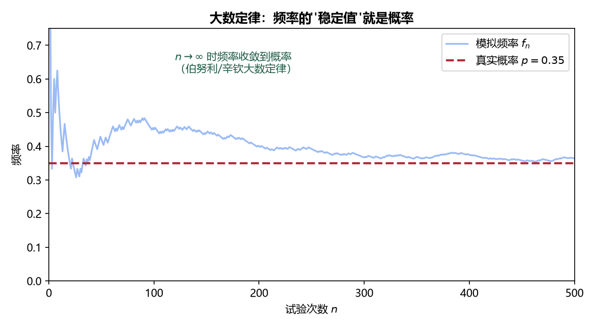

# 《概率论与数理统计》5.2 大数定律 - 笔记

> 整理自 B 站《概率论与数理统计》教学视频 2.0 版本（up：宋浩老师官方）p45。
> 前置：p44 切比雪夫不等式、p38 方差性质。

## 目录

- [一、 依概率收敛](#一-依概率收敛)
- [二、 伯努利大数定律（频率 → 概率）](#二-伯努利大数定律频率--概率)
- [三、 切比雪夫大数定律](#三-切比雪夫大数定律)
- [四、 切比雪夫大数定律的推论](#四-切比雪夫大数定律的推论)
- [五、 辛钦大数定律](#五-辛钦大数定律)
- [本节重点](#本节重点)

---

## 一、 依概率收敛

**定义**：随机变量序列 $X_1,X_2,\dots$ **依概率收敛**于常数 $a$，若对任给 $\varepsilon>0$：

$$\lim_{n\to\infty}P\big\{|X_n-a|<\varepsilon\big\}=1$$

**和高数收敛的区别**：高数收敛要求"某一项之后**所有**点都落在区间里"（严格）；依概率收敛允许**个别点蹦出去**，只要"落进区间的概率趋于 1"即可。

> 白话：序列整体向 $a$ 逼近，但不保证每次都不开小差——"绝大多数时候都在 $a$ 附近"。

## 二、 伯努利大数定律（频率 → 概率）

设 $n$ 重伯努利试验中事件 $A$ 发生 $M_n$ 次，每次发生概率为 $p$，则对任给 $\varepsilon>0$：

$$\lim_{n\to\infty}P\left\{\left|\frac{M_n}{n}-p\right|<\varepsilon\right\}=1$$

即**频率 $M_n/n$ 依概率收敛于概率 $p$**。

**白话解读**：扔硬币 10 次正面可能只有 4 次（频率 0.4 ≠ 概率 0.5）；扔 100 次可能 51 次；扔 1 万次可能 5002 次（频率 0.5002）——**实验次数越多，频率越接近概率**。

**证明要点**：$M_n\sim B(n,p)$，$E(M_n)=np$，$D(M_n)=npq$，于是 $E(M_n/n)=p$，$D(M_n/n)=pq/n$；由切比雪夫不等式：

$$P\left\{\left|\frac{M_n}{n}-p\right|<\varepsilon\right\}\ge1-\frac{pq/n}{\varepsilon^2}\to1$$

> **频率 ≠ 概率**：概率是事件本身的内在属性（常数），频率是大量试验后统计出来的结果（随机）；频率以概率为极限。这就是"用频率估计概率"的理论依据。

> **图2** 大数定律模拟：抛硬币频率随 $n$ 增大波动越来越小，最终稳定在真实概率 $p$（自绘）。

## 三、 切比雪夫大数定律

设 $X_1,X_2,\dots$ **两两不相关**，期望方差均存在且**方差一致有界**（存在 $M$ 使 $D(X_i)\le M$），则对任给 $\varepsilon>0$：

$$\lim_{n\to\infty}P\left\{\left|\frac1n\sum_{i=1}^{n}X_i-\frac1n\sum_{i=1}^{n}E(X_i)\right|<\varepsilon\right\}=1$$

即**随机变量的平均值依概率收敛于期望的平均值**。

**证明要点**：$E\left(\dfrac1n\sum X_i\right)=\dfrac1n\sum EX_i$；两两不相关时

$$D\left(\frac1n\sum X_i\right)=\frac1{n^2}\sum D(X_i)\le\frac1{n^2}\cdot nM=\frac Mn\to0$$

再由切比雪夫不等式取极限即得。

**条件辨析**：①"两两不相关"——只要协方差为 0 即可（比独立弱）；②"方差一致有界"——所有 $D(X_i)$ 不能无限膨胀。

**例（不满足条件的序列）**：$X_n\sim U(0,n)$，则 $E(X_n)=n/2$，$D(X_n)=n^2/12\to\infty$ **无界**——不满足切比雪夫大数定律条件。

## 四、 切比雪夫大数定律的推论

若 $X_1,X_2,\dots$ **独立同分布**，$E(X_i)=\mu$，$D(X_i)=\sigma^2$，则

$$\frac1n\sum_{i=1}^{n}X_i\ \text{依概率收敛于}\ \mu$$

即样本均值 $\bar X$ 依概率收敛于总体均值 $\mu$——**大数定律的常用形态**。

## 五、 辛钦大数定律

若 $X_1,X_2,\dots$ **独立同分布**，且期望 $E(X_i)=\mu$ **存在**（不要求方差存在！），则

$$\frac1n\sum_{i=1}^{n}X_i\ \text{依概率收敛于}\ \mu$$

**与切比雪夫大数定律的区别**：辛钦去掉了"方差存在/有界"的要求，只要求期望存在，结论相同——条件更弱、适用范围更广。

> **应用**：想测一个量（比如身高），测 $n$ 次取平均，次数足够多时平均值就接近真实期望——日常"多次测量取平均"的理论根据。

---

## 本节重点

> - **依概率收敛**：$P\{|X_n-a|<\varepsilon\}\to1$，允许个别点"蹦出去"。
> - **伯努利**：频率 $M_n/n$ 依概率收敛于概率 $p$（大数定律最朴素形式）。
> - **切比雪夫**：两两不相关 + 方差一致有界 → 均值收敛于期望均值；**推论（iid）**：$\bar X\stackrel{P}{\to}\mu$。
> - **辛钦**：iid + 期望存在即可（免方差条件）→ $\bar X\stackrel{P}{\to}\mu$。
> - **常见坑**：① 频率与概率混为一谈；② 忘了"方差一致有界"条件（$U(0,n)$ 反例）；③ 把"依概率收敛"当成"处处收敛"。

---

## 教材深化（《统计学完全教程》第4-5章）

> 整理自《统计学完全教程》(L. Wasserman) 第4-5章，为教材比原笔记更深的内容。

### 三、 收敛的四种类型

设 $X_1,X_2,\dots$ 是随机变量序列，$X$ 是极限随机变量，$F_n,F$ 是 CDF：

1. **依概率收敛（in probability）**，记 $X_n\xrightarrow{p}X$：对每个 $\varepsilon>0$，
   $$\mathbb P\big(|X_n-X|>\varepsilon\big)\to0$$
   （$X_n$ 以高概率接近 $X$）
2. **依分布收敛（in distribution）**，记 $X_n\leadsto X$：
   $$\lim_n F_n(t)=F(t)\ \text{在所有 }F\text{ 的连续点 }t$$
   （$X_n$ 的分布逼近 $X$ 的分布；**不要求随机变量本身接近**）
3. **均方收敛（quadratic mean）**，记 $X_n\xrightarrow{qm}X$：$E\big((X_n-X)^2\big)\to0$
4. **几乎必然收敛（almost surely）**，记 $X_n\xrightarrow{a.s.}X$：$\mathbb P(\{s: X_n(s)\to X(s)\})=1$（附录）

若极限是退化分布（$P(X=c)=1$），写法简化为 $X_n\xrightarrow{p}c$ 等。

**例（$X_n\sim N(0,1/n)$ 收敛到0）**：$F_n(t)\to F(t)$ 对所有 $t\ne0$ 成立（$t=0$ 处 $F_n(0)=1/2\ne F(0)=1$，但 0 不是 $F$ 的连续点，不影响依分布收敛）；依概率用 Markov：$P(|X_n|>\varepsilon)\le\frac{E(X_n^2)}{\varepsilon^2}=\frac{1/n}{\varepsilon^2}\to0$。两种收敛都成立。

### 四、 收敛之间的关系与反例

**定理 5.4**：
$$X_n\xrightarrow{qm}X\ \Rightarrow\ X_n\xrightarrow{p}X\ \Rightarrow\ X_n\leadsto X$$
且若 $X_n\leadsto c$（极限为常数），则 $X_n\xrightarrow{p}c$（**反过来也成立，仅限常数极限**）。一般情形反向都不成立。

**反例1（依概率 $\not\Rightarrow$ 均方）**：$U\sim\text{Unif}(0,1)$，$X_n=\sqrt n\,I_{(0,1/n)}(U)$。则 $P(|X_n|>\varepsilon)=1/n\to0$（依概率），但 $E(X_n^2)=n\cdot\frac1n=1\not\to0$（不均方收敛）。

**反例2（依分布 $\not\Rightarrow$ 依概率）**：$X\sim N(0,1)$，令 $X_n=-X$。$X_n\leadsto X$（同分布），但 $P(|X_n-X|>\varepsilon)=P(|2X|>\varepsilon)\not\to0$。

**警告（期望不随依概率收敛）**：$P(X_n=n^2)=\frac1n$、$P(X_n=0)=1-\frac1n$，则 $X_n\xrightarrow{p}0$ 但 $E(X_n)=n\to\infty$。**依概率收敛推不出期望收敛**（除非一致可积）。

**连续映射定理（定理5.5）**：$g$ 连续，则 $X_n\xrightarrow{p}X\Rightarrow g(X_n)\xrightarrow{p}g(X)$；$X_n\leadsto X\Rightarrow g(X_n)\leadsto g(X)$。
**Slutsky 定理**：$X_n\leadsto X$、$Y_n\xrightarrow{p}c$ ⟹ $X_n+Y_n\leadsto X+c$、$X_nY_n\leadsto cX$。注意：$X_n\leadsto X$、$Y_n\leadsto Y$ 一般**不能**推出 $X_n+Y_n\leadsto X+Y$（习题16）。

### 五、 大数定律：弱 vs 强

$X_1,X_2,\dots$ iid，$\mu=E(X_1)$，$\bar X_n=\frac1n\sum X_i$，$V(X_i)=\sigma^2<\infty$：

- **弱大数定律（WLLN）**：$\bar X_n\xrightarrow{p}\mu$。证明就是切比雪夫：$P(|\bar X_n-\mu|>\varepsilon)\le\frac{\sigma^2}{n\varepsilon^2}\to0$。
- **强大数定律（SLLN，附录）**：$\bar X_n\xrightarrow{a.s.}\mu$（只需 $E|X_1|<\infty$）。更强：以概率1逐点收敛。

**意义**：抛硬币正面比例 $\bar X_n\xrightarrow{p}p$——是"分布集中在 $p$ 附近"，**不是数值相等**。例：$p=1/2$，问 $n$ 多大保证 $P(0.4\le\bar X_n\le0.6)\ge0.7$？切比雪夫给出 $n\ge84$。

