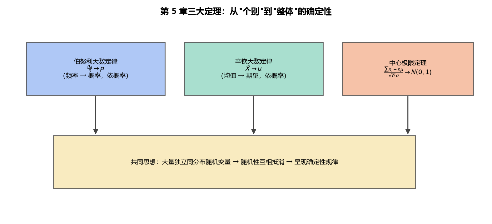

# 《概率论与数理统计》第5章 总结 - 笔记

> 整理自 B 站《概率论与数理统计》教学视频 2.0 版本（up：宋浩老师官方）p44~p46。
> 覆盖：5.1 切比雪夫不等式（p44）、5.2 大数定律（p45）、5.3 中心极限定理（p46）。

## 目录

- [一、 知识框架](#一-知识框架)
- [二、 大数定律三兄弟对比](#二-大数定律三兄弟对比)
- [三、 中心极限定理两个用法](#三-中心极限定理两个用法)
- [四、 易错点总汇](#四-易错点总汇)
- [五、 解题模板](#五-解题模板)

---

## 一、 知识框架

```
第5章 大数定律与中心极限定理
├── 切比雪夫不等式（工具）
│   └── P{|X-EX|≥ε} ≤ DX/ε²；P{|X-EX|<ε} ≥ 1-DX/ε²
├── 大数定律（"均值收敛"）
│   ├── 依概率收敛：P{|Xn-a|<ε} → 1（允许个别点跳出）
│   ├── 伯努利：频率 Mn/n 依概率收敛于 p
│   ├── 切比雪夫：两两不相关+方差有界 → 均值收敛于期望均值
│   ├── 推论(iid)：X̄ 依概率收敛于 μ
│   └── 辛钦：iid + 期望存在 → X̄ 依概率收敛于 μ
└── 中心极限定理（"和近似正态"）
    ├── 林德伯格-列维：ΣXi 近似 N(nμ, nσ²)
    └── 棣莫弗-拉普拉斯：B(n,p) 近似 N(np, npq)
```

**一句话区别**：大数定律说"**均值**（频率）收敛到常数"；中心极限定理说"**和**的分布收敛到正态"。

> **图4** 第 5 章三大定理：伯努利（频率→概率）、辛钦（均值→期望）、中心极限（和→正态）——大量随机性互相抵消呈现确定性（自绘）。



## 二、 大数定律三兄弟对比

| 定律 | 条件 | 结论 |
|---|---|---|
| 伯努利 | $n$ 重独立试验，成功概率 $p$ | $\dfrac{M_n}{n}\xrightarrow{P} p$ |
| 切比雪夫 | 两两不相关，方差一致有界 | $\dfrac1n\sum X_i\xrightarrow{P}\dfrac1n\sum EX_i$ |
| 辛钦 | **独立同分布**，期望存在（免方差） | $\bar X\xrightarrow{P}\mu$ |

**条件强弱**：辛钦 < 切比雪夫（辛钦只要求期望存在 + iid，条件最弱、最常用）。

## 三、 中心极限定理两个用法

**用法 A（和，独立同分布）**：$X_i$ iid，$E=\mu$，$D=\sigma^2$：

$$\sum_{i=1}^{n}X_i\ \text{近似}\ N(n\mu,\,n\sigma^2)$$

**用法 B（二项）**：$X\sim B(n,p)$：

$$X\ \text{近似}\ N(np,\,npq)$$

两者统一套路：先写 $\mu$、$\sigma$ → 标准化 $\dfrac{W-\mu}{\sigma}$ → 查 $\Phi$ 表。

## 四、 易错点总汇

1. **符号严格**：切比雪夫 $|X-EX|\ge\varepsilon$ 与 $|X-EX|<\varepsilon$ 不能互换。
2. **区间不对称**：套切比雪夫前先缩小成对称区间。
3. **大数定律条件**：切比雪夫版要"方差一致有界"（$U(0,n)$ 反例）；辛钦版要"独立同分布"。
4. **频率 ≠ 概率**：频率是随机的试验结果，概率是内在常数。
5. **中心极限是"近似"**：$n$ 要大（一般 $n\ge30$）。
6. **标准化分母**：$\sqrt{n}\sigma$ 或 $\sqrt{npq}$，别漏根号。
7. **$\Phi(-x)=1-\Phi(x)$**：对称区间概率 $=2\Phi(x)-1$。

## 五、 解题模板

**大数定律判断题**：先看条件（独立？同分布？方差有界？）→ 判断属于哪个定律 → 下"均值依概率收敛于 $\mu$"结论。

**中心极限计算题**：

```
1. 识别：ΣXi（独立同分布）还是 X~B(n,p)
2. 写参数：nμ、nσ²（或 np、npq）
3. 目标区间改写成标准化形式 (a-μ)/σ
4. Φ(u2) - Φ(u1)；对称时 2Φ(u)-1
5. 查标准正态表得概率
```

---

> **第 5 章小结**：这章理论味最浓但套路最固定。大数定律抓住"均值收敛"、中心极限定理抓住"和近似正态"，两种题型各练一遍即可拿分；切比雪夫不等式是唯一的计算工具，注意符号与对称化。
