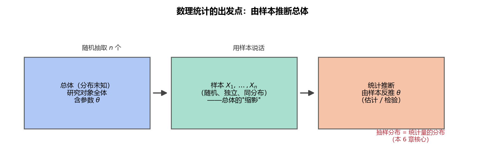

# 《概率论与数理统计》6.1 总体与样本 - 笔记

> 整理自 B 站《概率论与数理统计》教学视频 2.0 版本（up：宋浩老师官方）p47。
> 前置：p11 常用分布、p15 正态分布。本章起进入"数理统计"（由样本推断总体）。

## 目录

- [一、 总体](#一-总体)
- [二、 样本](#二-样本)
- [三、 简单随机样本（做题核心）](#三-简单随机样本做题核心)
- [四、 样本的联合分布](#四-样本的联合分布)
- [五、 例题](#五-例题)
- [本节重点](#本节重点)

---

## 一、 总体

**总体**：研究对象的**全体**。三层含义（递进）：

1. **实体总体**：实实在在的对象（一批灯泡、一批汽车）；
2. **数量指标**：真正关心的是它的某个指标（灯泡的**使用寿命**）——记为 $X$；
3. **指标分布**：指标 $X$ 是一个**随机变量**，我们关心它的分布。

**白话解读**：统计学的"总体"最后落到"随机变量 $X$ 及其分布"上。研究灯泡就是研究随机变量"寿命 $X$"服从什么分布。

## 二、 样本

**样本**：从总体中抽取的 $n$ 个个体 $X_1,X_2,\dots,X_n$，$n$ 叫**样本容量**。

**随机抽样**：每个个体被抽中的机会均等（等可能）。**有偏抽样**（总抽同一个名字回答问题的老师）得到的样本没有代表性。

**关键：观测前 vs 观测后**

| 阶段 | 记号 | 性质 |
|---|---|---|
| 观测前 | $X_1,X_2,\dots,X_n$（**大写**） | **随机变量**（结果未知） |
| 观测后 | $x_1,x_2,\dots,x_n$（**小写**） | 具体数值（观测值） |

> 白话：抽出的 10 个灯泡摆在桌上还没测寿命时，寿命仍是未知的随机变量；测完才有确定数值。**大写是随机变量、小写是观测值**，这个区分贯穿整章。

## 三、 简单随机样本（做题核心）

**定义**：若 $X_1,X_2,\dots,X_n$ 满足：

1. **同分布**：每个 $X_i$ 与总体 $X$ 同分布；
2. **独立**：$X_1,\dots,X_n$ 相互独立。

则称其为来自总体 $X$ 的**简单随机样本**（简称样本）。后面做题都默认这个条件，记为 **iid**（independent identically distributed）。

> **图1** 数理统计的出发点：总体（研究对象全体）→ 随机抽取样本 → 用样本反推总体（自绘）。

## 四、 样本的联合分布

由独立性，联合分布 = 边缘分布**相乘**；由同分布，每个边缘分布就是总体的分布。

**连续型**（总体密度 $f(x)$，样本联合密度）：

$$f(x_1,x_2,\dots,x_n)=f(x_1)f(x_2)\cdots f(x_n)$$

**离散型**（总体分布律 $P\{X=x\}=p(x)$，样本联合分布）：

$$P\{X_1=x_1,\dots,X_n=x_n\}=p(x_1)p(x_2)\cdots p(x_n)$$

**白话解读**：把总体的密度/分布律"抄 $n$ 份相乘"——独立同分布让联合分布变成了乘积。

## 五、 例题

**例一（正态总体）**：总体 $X\sim N(\mu,\sigma^2)$，$X_1,\dots,X_n$ 为样本，求样本联合密度。

$$f(x_1,\dots,x_n)=\prod_{i=1}^{n}\frac{1}{\sqrt{2\pi}\,\sigma}e^{-\frac{(x_i-\mu)^2}{2\sigma^2}}=\left(\frac{1}{\sqrt{2\pi}\,\sigma}\right)^{n}e^{-\frac{1}{2\sigma^2}\sum_{i=1}^{n}(x_i-\mu)^2}$$

**例二（0-1 总体）**：总体 $X\sim B(1,p)$，$P\{X=x\}=p^x(1-p)^{1-x}$（$x=0,1$），样本联合分布：

$$P\{X_1=x_1,\dots,X_n=x_n\}=\prod_{i=1}^{n}p^{x_i}(1-p)^{1-x_i}=p^{\sum x_i}(1-p)^{n-\sum x_i}$$

> **易错点**：① 大写 $X_i$ 与小写 $x_i$ 严格区分；② 联合分布是**乘积**不是求和；③ 0-1 分布写函数形式时指数"捡起来"（$x=1$ 时剩 $p$，$x=0$ 时剩 $1-p$）。

---

## 本节重点

> - **总体 = 随机变量 $X$（及其分布）**；样本 = 与 $X$ 同分布且相互独立的 $n$ 个随机变量。
> - **观测前大写（随机变量）、观测后小写（数值）**。
> - **简单随机样本 = 独立 + 同分布（iid）**，做题默认成立。
> - **联合分布 = 边缘分布相乘**：$f(x_1)\cdots f(x_n)$ 或 $p(x_1)\cdots p(x_n)$。
> - **常见坑**：把联合分布写成求和；把观测值当随机变量；漏掉独立条件。
