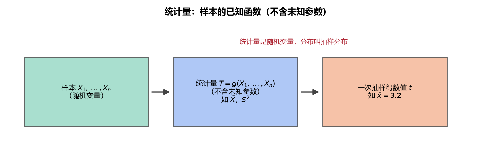

# 《概率论与数理统计》6.2 统计量 - 笔记

> 整理自 B 站《概率论与数理统计》教学视频 2.0 版本（up：宋浩老师官方）p48。
> 前置：p47 总体与样本、p33 期望、p37 方差、p40 常见分布表。

## 目录

- [一、 统计量的定义](#一-统计量的定义)
- [二、 判断练习](#二-判断练习)
- [三、 常用统计量](#三-常用统计量)
- [四、 经验分布函数](#四-经验分布函数)
- [五、 统计量的性质（三大结论）](#五-统计量的性质三大结论)
- [六、 例题](#六-例题)
- [本节重点](#本节重点)

---

## 一、 统计量的定义

**统计量**：由样本 $X_1,\dots,X_n$ 构造的不含**未知参数**的函数 $g(X_1,\dots,X_n)$。

**判断要点（唯一标准）**：函数表达式中**不能含有未知参数**。样本 $X_i$ 本身、样本容量 $n$ 都不算"未知参数"。

> **图2** 统计量的本质：样本的已知函数（不含未知参数），一次抽样得到数值，其分布称抽样分布（自绘）。

## 二、 判断练习

设 $X_1,\dots,X_n$ 来自总体 $X$：

| 表达式 | 是否统计量 | 原因 |
|---|---|---|
| $T_1=X_1$ | ✅ 是 | 只含样本 |
| $T_2=X_1+X_2$ | ✅ 是 | 只含样本 |
| $T_3=\dfrac1n\sum(X_i-\mu)^2$（$\mu$ 未知） | ❌ 否 | 含未知参数 $\mu$ |
| $T_3'=\dfrac1n\sum(X_i-\mu)^2$（$\mu$ 已知） | ✅ 是 | 已知常数不算未知 |
| $T_4=\dfrac1{\sigma^2}\sum(X_i-\bar X)^2$（$\sigma^2$ 已知） | ✅ 是 | $\bar X$ 由样本算出 |
| $T_5=\max(X_1,\dots,X_n)$ | ✅ 是 | 只含样本 |
| $T_6=\max-\min$ | ✅ 是 | 只含样本 |

> **易错点**：$\bar X=\dfrac1n\sum X_i$ 是样本函数，不是未知参数；$\mu$ 是总体期望（未知量），$\sigma^2$ 是总体方差（未知量）——**题目说"已知"才是常数**。

## 三、 常用统计量

设样本 $X_1,\dots,X_n$：

| 名称 | 记号 | 公式 |
|---|---|---|
| 样本均值 | $\bar X$ | $\dfrac1n\sum_{i=1}^{n}X_i$ |
| 修正样本方差 | $S^2$ | $\dfrac1{n-1}\sum_{i=1}^{n}(X_i-\bar X)^2$ |
| 未修正样本方差 | $S_0^2$ | $\dfrac1n\sum_{i=1}^{n}(X_i-\bar X)^2$ |
| 样本标准差 | $S$ | $\sqrt{S^2}$ |
| $k$ 阶原点矩 | $A_k$ | $\dfrac1n\sum_{i=1}^{n}X_i^k$（$A_1=\bar X$） |
| $k$ 阶中心矩 | $B_k$ | $\dfrac1n\sum_{i=1}^{n}(X_i-\bar X)^k$（$B_2=S_0^2$） |
| 顺序统计量 | $X_{(1)}\le X_{(2)}\le\cdots\le X_{(n)}$ | 从小到大排列 |
| 极差 | $R$ | $X_{(n)}-X_{(1)}$（最大减最小） |

**为什么用 $n-1$ 修正**：修正后 $E(S^2)=\sigma^2$（期望恰好等于总体方差），未修正的偏小。**考试默认 $S^2$ 是修正样本方差**。

> 白话：$A_k$ 是"$k$ 次方的平均"（原点矩），$B_k$ 是"离均值 $k$ 次方的平均"（中心矩）——和 p43 总体矩的记号对应，只是把期望换成样本平均。

## 四、 经验分布函数

设观测值 $x_{(1)}\le x_{(2)}\le\cdots\le x_{(n)}$（排好序），**经验分布函数**：

$$F_n(x)=\begin{cases}0, & x<x_{(1)}\\[2pt] \dfrac{k}{n}, & x_{(k)}\le x<x_{(k+1)},\ k=1,\dots,n-1\\[2pt] 1, & x\ge x_{(n)}\end{cases}$$

**性质**：当 $n\to\infty$ 时，$F_n(x)$ **依概率收敛**于总体分布函数 $F(x)$——样本多到一定程度，经验分布函数就是总体的"照片"。

**例（含重复值）**：观测值 $15.5,18.6,18.6,20.5,20.5,21.3,23.4,30.2$（$n=8$）：

$$F_8(x)=\begin{cases}0, & x<15.5\\ \dfrac18, & 15.5\le x<18.6\\ \dfrac38, & 18.6\le x<20.5\quad(\text{重复值处跳两格})\\ \dfrac58, & 20.5\le x<21.3\\ \dfrac68, & 21.3\le x<23.4\\ \dfrac78, & 23.4\le x<30.2\\ 1, & x\ge30.2\end{cases}$$

> **易错点（重复值）**：两个相同的观测值 $18.6,18.6$ 不能写"$2/8$ 到 $3/8$ 之间"——$x=18.6$ 时取值直接跳到 $3/8$（函数右连续，$[18.6,20.5)$ 段为 $3/8$）。图形上"每过一个小台阶跳 $1/8$，重复值合并跳"。

## 五、 统计量的性质（三大结论）

设总体 $E(X)=\mu$，$D(X)=\sigma^2$，样本 iid：

**性质 1**：$E(\bar X)=\mu$——样本均值的期望 = 总体期望。

**性质 2**：$D(\bar X)=\dfrac{\sigma^2}{n}$——样本均值的方差**缩小为 $\dfrac1n$**。

> 白话（平均身高）：班里 50 人身高参差不齐，但各班的平均身高波动很小——**求平均会"抹平"波动**，样本越大，$\bar X$ 越稳。

**性质 3**：$E(S^2)=\sigma^2$——修正样本方差的期望 = 总体方差（这就是用 $n-1$ 的原因）。

**性质 3 证明要点**（$E(S^2)$ 的关键技巧"减 $\mu$ 加 $\mu$"）：

$$\sum(X_i-\bar X)^2=\sum(X_i-\mu)^2-n(\bar X-\mu)^2$$

取期望：$E\big[\sum(X_i-\mu)^2\big]=n\sigma^2$（$n$ 个方差），$E\big[n(\bar X-\mu)^2\big]=n\cdot\dfrac{\sigma^2}{n}=\sigma^2$，故 $E\big[\sum(X_i-\bar X)^2\big]=(n-1)\sigma^2$，除以 $n-1$ 得 $\sigma^2$。

## 六、 例题

**例**：总体 $X\sim P(\lambda)$，$X_1,\dots,X_n$ 为样本，求 $E(\bar X)$、$D(\bar X)$、$E(S^2)$。

由 p40 表：泊松总体 $E(X)=\lambda$，$D(X)=\lambda$。

$$E(\bar X)=\lambda,\qquad D(\bar X)=\frac{\lambda}{n},\qquad E(S^2)=\lambda$$

---

## 本节重点

> - **统计量 = 不含未知参数的样本函数**；$\mu,\sigma^2$ 未知时出现即不是统计量。
> - **三大性质**：$E(\bar X)=\mu$；$D(\bar X)=\sigma^2/n$；$E(S^2)=\sigma^2$（修正的原因）。
> - **常用统计量**：$\bar X$、$S^2$（修正）、$A_k$、$B_k$、极差、顺序统计量、经验分布函数。
> - **经验分布函数**：阶梯状、每格 $1/n$、重复值跳格、右连续；$F_n(x)\xrightarrow{P}F(x)$。
> - **常见坑**：① 把 $\bar X$ 当未知参数；② 重复观测值处经验分布函数写错；③ 用 $1/n$ 代替 $1/(n-1)$ 的 $S^2$。
