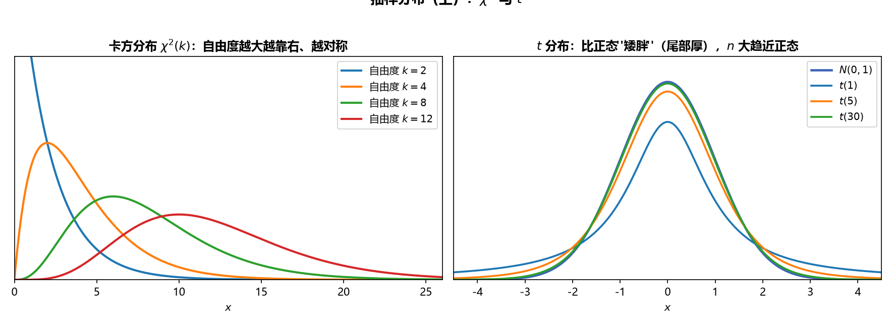

# 《概率论与数理统计》6.3 抽样分布（p49-p50）

> 整理自 B 站《概率论与数理统计》教学视频 2.0 版本（up：宋浩老师官方）p49-p50。

## 抽样分布（上）：分位数、卡方分布、t 分布（p49）

> 前置：p15 正态分布、p48 统计量。本节是"抽样分布"的入场券：三种常见分布 + 各自分位数，后面正态总体抽样分布全要调用。

### 一、 上 $\alpha$ 分位数（通用概念）

设随机变量 $X$ 分布函数为 $F(x)$，给定 $0<\alpha<1$：

**定义**：满足 $P\{X>F_\alpha\}=\alpha$ 的数 $F_\alpha$ 称为 $X$ 的**上 $\alpha$ 分位数**。

**图形理解（核心）**：密度曲线下，**$F_\alpha$ 点右侧阴影面积 = $\alpha$**。$F_\alpha$ 是 $x$ 轴上的一个点，不是面积本身。

**标准正态的特例与对称性**：

- $P\{U>u_\alpha\}=\alpha$，$u_\alpha$ 为标准正态上 $\alpha$ 分位数；
- 由对称性（右侧 $\alpha$ 面积对称到左侧，左侧总面积 $1-\alpha$）：

$$u_{1-\alpha}=-u_\alpha$$

> **易错点**：分位数定义永远是"**大于**该点的概率 = $\alpha$"（右尾）。题目给 $P\{X<\lambda\}=0.95$ 时先转成 $P\{X\ge\lambda\}=0.05$ 再查表。

### 二、 卡方分布 $\chi^2(n)$

### 1. 定义（构造）

设 $X_1,\dots,X_n$ **独立**且都服从**标准正态**分布，则

$$\chi^2=X_1^2+X_2^2+\cdots+X_n^2\sim\chi^2(n)$$

其中 $n$ 为**自由度**——**有几个标准正态变量的平方和，自由度就是几**。

> **白话解读**：卡方分布就是"一堆独立标准正态的平方和"。做题三步走：① 独立？② 标准正态？（不是就先标准化）③ 数个数得自由度。

### 2. 密度曲线与性质

- 曲线**偏态**（不对称），随 $n$ 增大逐渐接近正态；$n$ 足够大时近似 $N(n,2n)$；
- **期望与方差**：$E(\chi^2)=n$，$D(\chi^2)=2n$；
- **可加性**：$\chi^2(n_1)+\chi^2(n_2)\sim\chi^2(n_1+n_2)$（独立时），多个同理（自由度相加）。

### 3. 分位数

定义同前：$P\{\chi^2>\chi^2_\alpha(n)\}=\alpha$。查表使用（右尾面积 $\alpha$）。

### 三、 t 分布

### 1. 定义（构造）

设 $X\sim N(0,1)$，$Y\sim\chi^2(n)$，且 $X,Y$ 独立，则

$$T=\frac{X}{\sqrt{Y/n}}\sim t(n)$$

**记忆口诀**：**标准正态 ÷ √(卡方 ÷ 自由度)**。自由度为 $n$（分母卡方的自由度）。

> 背景：发明者用笔名 "Student" 发表，故称 $t$ 分布（学生分布）。

### 2. 曲线与性质

- 密度关于 $y$ 轴对称；$n\to\infty$ 时趋于标准正态（尾部更厚）；
- $E(T)=0$（$n>1$）；$D(T)=\dfrac{n}{n-2}$（$n>2$）；
- **对称性 ⇒ 分位数关系**：$t_{1-\alpha}(n)=-t_\alpha(n)$。

### 3. 分位数与"绝对值概率"技巧

对对称分布，形如 $P\{|T|>t_0\}=\alpha$ 的题：

$$P\{|T|>t_0\}=P\{T>t_0\}+P\{T<-t_0\}=2P\{T>t_0\}=\alpha\ \Rightarrow\ P\{T>t_0\}=\frac{\alpha}{2}$$

即取一半查表：$t_0=t_{\alpha/2}(n)$。

> **图3** 抽样分布（上）：左图 $\chi^2(k)$ 密度曲线族（自由度越大越靠右越对称）；右图 $t$ 分布与标准正态对比（$t$ 尾厚，$n$ 大趋近正态）（自绘）。

### 四、 综合例题

**例 1（构造 $\chi^2(3)$）**：$X_1,X_2,X_3$ 独立同分布，$X_i\sim N(\mu,\sigma^2)$，构造 $\chi^2(3)$。

非标准正态 → 标准化；独立变量的函数仍独立：

$$\left(\frac{X_1-\mu}{\sigma}\right)^2+\left(\frac{X_2-\mu}{\sigma}\right)^2+\left(\frac{X_3-\mu}{\sigma}\right)^2\sim\chi^2(3)$$

**例 2（卡方期望方差）**：总体 $X\sim N(0,1)$，$X_1,\dots,X_{10}$ 为样本。

$\sum_{i=1}^{10}X_i^2\sim\chi^2(10)$，故 $E=10$，$D=20$。

**例 3（标准化后求概率）**：总体 $X\sim N(0,0.5^2)$，$X_1,\dots,X_{10}$ 为样本，求 $P\left\{\sum_{i=1}^{10}X_i^2>4\right\}$。

$$\frac{X_i}{\sigma}=\frac{X_i}{0.5}\sim N(0,1)\ \Rightarrow\ \sum_{i=1}^{10}\left(\frac{X_i}{0.5}\right)^2=\frac{1}{0.25}\sum_{i=1}^{10}X_i^2\sim\chi^2(10)$$

$$P\left\{\sum X_i^2>4\right\}=P\left\{\frac{\sum X_i^2}{0.25}>16\right\}=P\{\chi^2(10)>16\}=0.1$$

（查表：$\chi^2_{0.1}(10)=16$，反着用分位数定义。）

**例 4（构造 t 分布）**：$X_1,X_2,X_3$ 独立同分布 $N(0,1)$，求 $Y=\dfrac{\sqrt2\,X_1}{\sqrt{X_2^2+X_3^2}}$ 的分布。

$$Y=\frac{X_1}{\sqrt{(X_2^2+X_3^2)/2}}\sim t(2)$$

（分子标准正态；分母：$X_2^2+X_3^2\sim\chi^2(2)$，除以自由度 $2$ 开根。）

**例 5（证明）**：$X\sim N(\mu,\sigma^2)$，$Y/\sigma^2\sim\chi^2(n)$，$X,Y$ 独立，证明 $\dfrac{X-\mu}{\sqrt{Y/n}}\sim t(n)$。

分子标准化 $\dfrac{X-\mu}{\sigma}\sim N(0,1)$；分母凑 $\dfrac{\sqrt{Y/\sigma^2}}{\sqrt n}=\dfrac{\sqrt{Y}}{\sigma\sqrt n}$，分子分母的 $\sigma$ 抵消，得 $\dfrac{X-\mu}{\sqrt{Y/n}}\sim t(n)$。

**例 6（综合求分位数）**：$X\sim N(2,1)$，$Y_i\sim N(0,2^2)$（$i=1,\dots,4$），全部独立，$T=\dfrac{4(X-2)}{\sqrt{Y_1^2+Y_2^2+Y_3^2+Y_4^2}}$。

1. $T=\dfrac{(X-2)/1}{\sqrt{\sum(Y_i/2)^2/4}}\sim t(4)$（分子 $N(0,1)$；分母卡方 $\chi^2(4)$ 除以 $4$ 开根；$\sigma$ 抵消后系数变为 $4$）；
2. 若 $P\{|T|>t_0\}=0.01$，则 $P\{T>t_0\}=0.005$，查表 $t_{0.005}(4)=4.604$。

---

### 本节重点

> - **分位数**：$P\{X>F_\alpha\}=\alpha$，"右侧面积 = $\alpha$"；正态、$t$ 有对称性：$u_{1-\alpha}=-u_\alpha$、$t_{1-\alpha}(n)=-t_\alpha(n)$。
> - **卡方**：独立标准正态平方和，自由度 = 个数；$E=n$、$D=2n$；可加性（自由度相加）；无对称性。
> - **$t$ 分布**：$T=\dfrac{X}{\sqrt{Y/n}}$（$X\sim N(0,1)$、$Y\sim\chi^2(n)$ 独立）；对称；$E=0$、$D=n/(n-2)$。
> - **套路**：不是标准正态就先 $\dfrac{X-\mu}{\sigma}$ 标准化；两个 $\sigma$ 常互相抵消。
> - **常见坑**：① 分位数查表前先看是"大于"还是"小于"；② $P\{|T|>t_0\}$ 取一半 $\alpha/2$；③ 自由度数错（几个平方和就是几）。

---

## 抽样分布（下）：F 分布、正态总体抽样分布（p50）

> 前置：p49 分位数、卡方分布、t 分布。本节是第 6 章压轴：F 分布 + 单/双正态总体的五个常用结论（后两章查表、构造枢轴量的弹药库）。

### 一、 F 分布

### 1. 定义（构造）

设 $X\sim\chi^2(m)$，$Y\sim\chi^2(n)$，且 $X,Y$ 独立，则

$$F=\frac{X/m}{Y/n}\sim F(m,n)$$

**两个自由度**：第一个 $m$ 是分子卡方的自由度，第二个 $n$ 是分母卡方的自由度。

### 2. 曲线与性质

- 密度曲线只在**第一象限**（两个平方和之比恒正），无对称性，形状随 $m,n$ 变化；
- **倒数性质**：$F\sim F(m,n)\ \Rightarrow\ \dfrac1F\sim F(n,m)$（自由度交换）。

### 3. 分位数（含一个重要公式）

定义同前：$P\{F>F_\alpha(m,n)\}=\alpha$，查表。

**倒位数公式**（$\alpha$ 较大、表中查不到时用）：

$$F_{1-\alpha}(m,n)=\frac{1}{F_\alpha(n,m)}$$

**证明思路**：$P\{F\le F_{1-\alpha}(m,n)\}=\alpha$ → 取倒数变方向（正数）→ $P\left\{\dfrac1F\ge \dfrac1{F_{1-\alpha}(m,n)}\right\}=\alpha$，而 $\dfrac1F\sim F(n,m)$，对照分位数定义即得。

> **易错点**：查表只能查较小的 $\alpha$（如 $0.05,0.025,0.01$）。$\alpha=0.95$ 之类先转 $1-\alpha=0.05$，再"取倒数 + 交换自由度"。

### 二、 一个正态总体的抽样分布

设总体 $X\sim N(\mu,\sigma^2)$，$X_1,\dots,X_n$ 为样本，$\bar X=\dfrac1n\sum X_i$，$S^2=\dfrac1{n-1}\sum(X_i-\bar X)^2$：

**结论 1**：$\bar X\sim N\left(\mu,\dfrac{\sigma^2}{n}\right)$，标准化：

$$\frac{\bar X-\mu}{\sigma/\sqrt n}\sim N(0,1)$$

> 白话：样本均值还是正态，期望不变、方差缩为 $\dfrac1n$（p48 性质），标准化照做。

**结论 2（$\mu$ 未知）**：$S^2$ 与 $\sigma^2$ 挂钩——**自由度 $n-1$**：

$$\frac{(n-1)S^2}{\sigma^2}=\frac{\sum_{i=1}^n(X_i-\bar X)^2}{\sigma^2}\sim\chi^2(n-1)$$

**结论 3**：$\bar X$ 与 $S^2$ **相互独立**。

**结论 4（$\mu$ 已知）**：自由度是 $n$（不用估计 $\mu$，少一个约束）：

$$\frac{\sum_{i=1}^n(X_i-\mu)^2}{\sigma^2}\sim\chi^2(n)$$

> **为什么自由度差 1**：$\sum(X_i-\bar X)^2$ 中 $X_i$ 受 $\bar X$ 这一个约束"拽住"，自由变量少一个；$\sum(X_i-\mu)^2$ 用已知 $\mu$，不受约束，$n$ 个全自由。**记：分母里是 $\bar X$ 就 $n-1$，是 $\mu$ 就 $n$。**

**结论 5（最重要）**：$\sigma$ 未知时用 $S$ 代替 $\sigma$，由结论 1、2、3 拼出 $t$ 分布：

$$\frac{\bar X-\mu}{S/\sqrt n}\sim t(n-1)$$

**证明骨架**：分子 $\dfrac{\bar X-\mu}{\sigma/\sqrt n}\sim N(0,1)$，分母 $\sqrt{\dfrac{(n-1)S^2/\sigma^2}{n-1}}=\dfrac{S}{\sigma}$，$\sigma$ 抵消，得 $t(n-1)$。

### 三、 两个正态总体的抽样分布

设 $X_1,\dots,X_m$ iid $\sim N(\mu_1,\sigma_1^2)$，$Y_1,\dots,Y_n$ iid $\sim N(\mu_2,\sigma_2^2)$，两样本独立；$\bar X,S_1^2$ 与 $\bar Y,S_2^2$ 为各自样本均值、修正方差。

**结论 6-1（均值差，方差已知）**：

$$\frac{(\bar X-\bar Y)-(\mu_1-\mu_2)}{\sqrt{\sigma_1^2/m+\sigma_2^2/n}}\sim N(0,1)$$

（$\bar X-\bar Y\sim N\left(\mu_1-\mu_2,\ \sigma_1^2/m+\sigma_2^2/n\right)$ 标准化：独立正态相减，期望相减、**方差相加**。）

**结论 6-2（方差比）**：

$$\frac{S_1^2/\sigma_1^2}{S_2^2/\sigma_2^2}\sim F(m-1,n-1)$$

特别地，若 $\sigma_1^2=\sigma_2^2$：

$$\frac{S_1^2}{S_2^2}\sim F(m-1,n-1)$$

**结论 6-3（方差相等时的 $t$ 分布）**：设 $\sigma_1^2=\sigma_2^2=\sigma^2$：

$$\frac{(\bar X-\bar Y)-(\mu_1-\mu_2)}{S_w\sqrt{\dfrac1m+\dfrac1n}}\sim t(m+n-2),\qquad S_w^2=\frac{(m-1)S_1^2+(n-1)S_2^2}{m+n-2}$$

**证明骨架**：$\dfrac{(\bar X-\bar Y)-(\mu_1-\mu_2)}{\sigma\sqrt{1/m+1/n}}\sim N(0,1)$（结论 6-1 化简）；$\dfrac{(m-1)S_1^2+(n-1)S_2^2}{\sigma^2}\sim\chi^2(m+n-2)$（结论 2 + 卡方可加性）；两者独立（$\bar X\perp S^2$），按 $t$ 分布构造拼出，$\sigma$ 抵消。

> **图4** F 分布密度曲线：非对称、只取正值（两个卡方之比），自由度决定形状（自绘）。

### 四、 例题

**例 1（F 分布构造）**：$X_1,\dots,X_5$ iid $\sim N(0,1)$，求 $Y=\dfrac{3(X_1^2+X_2^2)}{2(X_3^2+X_4^2+X_5^2)}$ 的分布。

分子 $\dfrac{X_1^2+X_2^2}{2}\sim F$ 的分子（$\chi^2(2)/2$），分母 $\dfrac{X_3^2+X_4^2+X_5^2}{3}$（$\chi^2(3)/3$），故 $Y\sim F(2,3)$。

**例 2（F 分布查表）**：$F\sim F(15,8)$，$P\{F>3.22\}=0.05$，即 $F_{0.05}(15,8)=3.22$。

**例 3（倒位数公式）**：$F\sim F(5,10)$，求 $F_{0.95}(5,10)$。

$$F_{0.95}(5,10)=\frac{1}{F_{0.05}(10,5)}=\frac{1}{4.74}$$

**例 4（非标准正态先标准化）**：$X_1,\dots,X_6$ iid $\sim N(0,\sigma^2)$，求 $Y=\dfrac{2(X_1^2+X_2^2)}{X_3^2+X_4^2+X_5^2+X_6^2}$ 的分布。

标准化：$\dfrac{X_i}{\sigma}\sim N(0,1)$；分子 $\dfrac{X_1^2+X_2^2}{2}$、分母 $\dfrac{X_3^2+\cdots+X_6^2}{4}$ 相除，$\sigma^2$ 抵消：

$$Y=\frac{(X_1^2+X_2^2)/2}{(X_3^2+\cdots+X_6^2)/4}\sim F(2,4)$$

**例 5（t 分布分位数 + 对称性）**：$X\sim N(\mu,\sigma^2)$，$n=16$，求 $K$ 使 $P\{\bar X>\mu+KS\}=0.95$。

由结论 5：$\dfrac{\bar X-\mu}{S/\sqrt{16}}=\dfrac{4(\bar X-\mu)}{S}\sim t(15)$。

$$P\{\bar X>\mu+KS\}=P\left\{\frac{4(\bar X-\mu)}{S}>4K\right\}=P\{T>4K\}=0.95$$

右侧面积 $0.95$ 在左尾 ⇒ 由对称性 $P\{T<-4K\}=0.05$，查表 $t_{0.05}(15)=1.7531$：

$$-4K=1.7531\ \Rightarrow\ K\approx-0.4383$$

---

### 本节重点

> - **F 分布**：$F=\dfrac{X/m}{Y/n}$，自由度 $(m,n)$；取倒数交换自由度；**$F_{1-\alpha}(m,n)=\dfrac{1}{F_\alpha(n,m)}$**。
> - **单正态总体四件套**：$\bar X\sim N(\mu,\sigma^2/n)$；$\dfrac{\sum(X_i-\mu)^2}{\sigma^2}\sim\chi^2(n)$（$\mu$ 已知）；$\dfrac{(n-1)S^2}{\sigma^2}\sim\chi^2(n-1)$（$\mu$ 未知，**自由度少 1**）；$\dfrac{\bar X-\mu}{S/\sqrt n}\sim t(n-1)$。
> - **双正态总体**：均值差标准化 $\sim N(0,1)$（方差相加）；$\dfrac{S_1^2/\sigma_1^2}{S_2^2/\sigma_2^2}\sim F(m-1,n-1)$；方差相等时 $\sim t(m+n-2)$。
> - **自由度数对**：卡方自由度"有几个平方和就是几"；出现 $\bar X$ 少一个自由度。
> - **常见坑**：① 查表 $\alpha$ 太大先取倒数转小 $\alpha$；② $\sigma$ 未知要用 $S$ 从而落到 $t$ 分布而非正态；③ 两总体时别把 $m,n$ 与 $m-1,n-1$ 混用。
