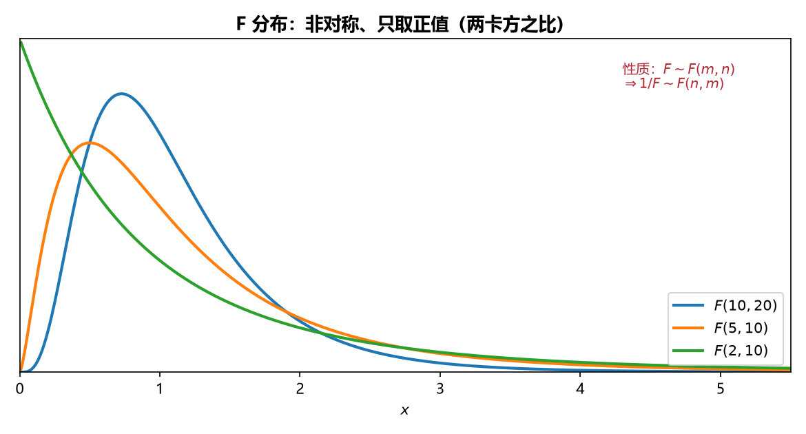

# 《概率论与数理统计》6.3 抽样分布（下）：F 分布、正态总体抽样分布 - 笔记

> 整理自 B 站《概率论与数理统计》教学视频 2.0 版本（up：宋浩老师官方）p50。
> 前置：p49 分位数、卡方分布、t 分布。本节是第 6 章压轴：F 分布 + 单/双正态总体的五个常用结论（后两章查表、构造枢轴量的弹药库）。

## 目录

- [一、 F 分布](#一-f-分布)
- [二、 一个正态总体的抽样分布](#二-一个正态总体的抽样分布)
- [三、 两个正态总体的抽样分布](#三-两个正态总体的抽样分布)
- [四、 例题](#四-例题)
- [本节重点](#本节重点)

---

## 一、 F 分布

### 1. 定义（构造）

设 $X\sim\chi^2(m)$，$Y\sim\chi^2(n)$，且 $X,Y$ 独立，则

$$F=\frac{X/m}{Y/n}\sim F(m,n)$$

**两个自由度**：第一个 $m$ 是分子卡方的自由度，第二个 $n$ 是分母卡方的自由度。

### 2. 曲线与性质

- 密度曲线只在**第一象限**（两个平方和之比恒正），无对称性，形状随 $m,n$ 变化；
- **倒数性质**：$F\sim F(m,n)\ \Rightarrow\ \dfrac1F\sim F(n,m)$（自由度交换）。

### 3. 分位数（含一个重要公式）

定义同前：$P\{F>F_\alpha(m,n)\}=\alpha$，查表。

**倒位数公式**（$\alpha$ 较大、表中查不到时用）：

$$F_{1-\alpha}(m,n)=\frac{1}{F_\alpha(n,m)}$$

**证明思路**：$P\{F\le F_{1-\alpha}(m,n)\}=\alpha$ → 取倒数变方向（正数）→ $P\left\{\dfrac1F\ge \dfrac1{F_{1-\alpha}(m,n)}\right\}=\alpha$，而 $\dfrac1F\sim F(n,m)$，对照分位数定义即得。

> **易错点**：查表只能查较小的 $\alpha$（如 $0.05,0.025,0.01$）。$\alpha=0.95$ 之类先转 $1-\alpha=0.05$，再"取倒数 + 交换自由度"。

## 二、 一个正态总体的抽样分布

设总体 $X\sim N(\mu,\sigma^2)$，$X_1,\dots,X_n$ 为样本，$\bar X=\dfrac1n\sum X_i$，$S^2=\dfrac1{n-1}\sum(X_i-\bar X)^2$：

**结论 1**：$\bar X\sim N\left(\mu,\dfrac{\sigma^2}{n}\right)$，标准化：

$$\frac{\bar X-\mu}{\sigma/\sqrt n}\sim N(0,1)$$

> 白话：样本均值还是正态，期望不变、方差缩为 $\dfrac1n$（p48 性质），标准化照做。

**结论 2（$\mu$ 未知）**：$S^2$ 与 $\sigma^2$ 挂钩——**自由度 $n-1$**：

$$\frac{(n-1)S^2}{\sigma^2}=\frac{\sum_{i=1}^n(X_i-\bar X)^2}{\sigma^2}\sim\chi^2(n-1)$$

**结论 3**：$\bar X$ 与 $S^2$ **相互独立**。

**结论 4（$\mu$ 已知）**：自由度是 $n$（不用估计 $\mu$，少一个约束）：

$$\frac{\sum_{i=1}^n(X_i-\mu)^2}{\sigma^2}\sim\chi^2(n)$$

> **为什么自由度差 1**：$\sum(X_i-\bar X)^2$ 中 $X_i$ 受 $\bar X$ 这一个约束"拽住"，自由变量少一个；$\sum(X_i-\mu)^2$ 用已知 $\mu$，不受约束，$n$ 个全自由。**记：分母里是 $\bar X$ 就 $n-1$，是 $\mu$ 就 $n$。**

**结论 5（最重要）**：$\sigma$ 未知时用 $S$ 代替 $\sigma$，由结论 1、2、3 拼出 $t$ 分布：

$$\frac{\bar X-\mu}{S/\sqrt n}\sim t(n-1)$$

**证明骨架**：分子 $\dfrac{\bar X-\mu}{\sigma/\sqrt n}\sim N(0,1)$，分母 $\sqrt{\dfrac{(n-1)S^2/\sigma^2}{n-1}}=\dfrac{S}{\sigma}$，$\sigma$ 抵消，得 $t(n-1)$。

## 三、 两个正态总体的抽样分布

设 $X_1,\dots,X_m$ iid $\sim N(\mu_1,\sigma_1^2)$，$Y_1,\dots,Y_n$ iid $\sim N(\mu_2,\sigma_2^2)$，两样本独立；$\bar X,S_1^2$ 与 $\bar Y,S_2^2$ 为各自样本均值、修正方差。

**结论 6-1（均值差，方差已知）**：

$$\frac{(\bar X-\bar Y)-(\mu_1-\mu_2)}{\sqrt{\sigma_1^2/m+\sigma_2^2/n}}\sim N(0,1)$$

（$\bar X-\bar Y\sim N\left(\mu_1-\mu_2,\ \sigma_1^2/m+\sigma_2^2/n\right)$ 标准化：独立正态相减，期望相减、**方差相加**。）

**结论 6-2（方差比）**：

$$\frac{S_1^2/\sigma_1^2}{S_2^2/\sigma_2^2}\sim F(m-1,n-1)$$

特别地，若 $\sigma_1^2=\sigma_2^2$：

$$\frac{S_1^2}{S_2^2}\sim F(m-1,n-1)$$

**结论 6-3（方差相等时的 $t$ 分布）**：设 $\sigma_1^2=\sigma_2^2=\sigma^2$：

$$\frac{(\bar X-\bar Y)-(\mu_1-\mu_2)}{S_w\sqrt{\dfrac1m+\dfrac1n}}\sim t(m+n-2),\qquad S_w^2=\frac{(m-1)S_1^2+(n-1)S_2^2}{m+n-2}$$

**证明骨架**：$\dfrac{(\bar X-\bar Y)-(\mu_1-\mu_2)}{\sigma\sqrt{1/m+1/n}}\sim N(0,1)$（结论 6-1 化简）；$\dfrac{(m-1)S_1^2+(n-1)S_2^2}{\sigma^2}\sim\chi^2(m+n-2)$（结论 2 + 卡方可加性）；两者独立（$\bar X\perp S^2$），按 $t$ 分布构造拼出，$\sigma$ 抵消。

> **图4** F 分布密度曲线：非对称、只取正值（两个卡方之比），自由度决定形状（自绘）。

## 四、 例题

**例 1（F 分布构造）**：$X_1,\dots,X_5$ iid $\sim N(0,1)$，求 $Y=\dfrac{3(X_1^2+X_2^2)}{2(X_3^2+X_4^2+X_5^2)}$ 的分布。

分子 $\dfrac{X_1^2+X_2^2}{2}\sim F$ 的分子（$\chi^2(2)/2$），分母 $\dfrac{X_3^2+X_4^2+X_5^2}{3}$（$\chi^2(3)/3$），故 $Y\sim F(2,3)$。

**例 2（F 分布查表）**：$F\sim F(15,8)$，$P\{F>3.22\}=0.05$，即 $F_{0.05}(15,8)=3.22$。

**例 3（倒位数公式）**：$F\sim F(5,10)$，求 $F_{0.95}(5,10)$。

$$F_{0.95}(5,10)=\frac{1}{F_{0.05}(10,5)}=\frac{1}{4.74}$$

**例 4（非标准正态先标准化）**：$X_1,\dots,X_6$ iid $\sim N(0,\sigma^2)$，求 $Y=\dfrac{2(X_1^2+X_2^2)}{X_3^2+X_4^2+X_5^2+X_6^2}$ 的分布。

标准化：$\dfrac{X_i}{\sigma}\sim N(0,1)$；分子 $\dfrac{X_1^2+X_2^2}{2}$、分母 $\dfrac{X_3^2+\cdots+X_6^2}{4}$ 相除，$\sigma^2$ 抵消：

$$Y=\frac{(X_1^2+X_2^2)/2}{(X_3^2+\cdots+X_6^2)/4}\sim F(2,4)$$

**例 5（t 分布分位数 + 对称性）**：$X\sim N(\mu,\sigma^2)$，$n=16$，求 $K$ 使 $P\{\bar X>\mu+KS\}=0.95$。

由结论 5：$\dfrac{\bar X-\mu}{S/\sqrt{16}}=\dfrac{4(\bar X-\mu)}{S}\sim t(15)$。

$$P\{\bar X>\mu+KS\}=P\left\{\frac{4(\bar X-\mu)}{S}>4K\right\}=P\{T>4K\}=0.95$$

右侧面积 $0.95$ 在左尾 ⇒ 由对称性 $P\{T<-4K\}=0.05$，查表 $t_{0.05}(15)=1.7531$：

$$-4K=1.7531\ \Rightarrow\ K\approx-0.4383$$

---

## 本节重点

> - **F 分布**：$F=\dfrac{X/m}{Y/n}$，自由度 $(m,n)$；取倒数交换自由度；**$F_{1-\alpha}(m,n)=\dfrac{1}{F_\alpha(n,m)}$**。
> - **单正态总体四件套**：$\bar X\sim N(\mu,\sigma^2/n)$；$\dfrac{\sum(X_i-\mu)^2}{\sigma^2}\sim\chi^2(n)$（$\mu$ 已知）；$\dfrac{(n-1)S^2}{\sigma^2}\sim\chi^2(n-1)$（$\mu$ 未知，**自由度少 1**）；$\dfrac{\bar X-\mu}{S/\sqrt n}\sim t(n-1)$。
> - **双正态总体**：均值差标准化 $\sim N(0,1)$（方差相加）；$\dfrac{S_1^2/\sigma_1^2}{S_2^2/\sigma_2^2}\sim F(m-1,n-1)$；方差相等时 $\sim t(m+n-2)$。
> - **自由度数对**：卡方自由度"有几个平方和就是几"；出现 $\bar X$ 少一个自由度。
> - **常见坑**：① 查表 $\alpha$ 太大先取倒数转小 $\alpha$；② $\sigma$ 未知要用 $S$ 从而落到 $t$ 分布而非正态；③ 两总体时别把 $m,n$ 与 $m-1,n-1$ 混用。
