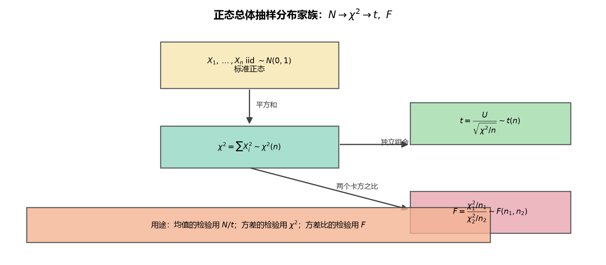

# 第6章 总结 数理统计的基本概念

> 整理自 B 站《概率论与数理统计》教学视频 2.0 版本（up：宋浩老师官方）p47~p50。
> 覆盖：总体与样本（p47）、统计量（p48）、抽样分布（p49~p50）。

## 一、 本章地图

从"样本"到"抽样分布"的三层结构：

1. **总体与样本**（p47）：总体 = 随机变量 $X$；简单随机样本 = 独立 + 同分布；联合分布 = 边缘分布乘积。
2. **统计量**（p48）：不含未知参数的样本函数；常用统计量 $\bar X,S^2,A_k,B_k$ 等；三大性质 $E(\bar X)=\mu$、$D(\bar X)=\sigma^2/n$、$E(S^2)=\sigma^2$。
3. **抽样分布**（p49~p50）：分位数概念 + 四大分布（正态、$\chi^2$、$t$、$F$）+ 正态总体抽样分布结论。

> **图5** 正态总体抽样分布家族：标准正态的平方和 → $\chi^2$，$\chi^2$ 与 $N$ 组合 → $t$，两个 $\chi^2$ 之比 → $F$（自绘）。

## 二、 四大分布速查表

| 分布 | 构造 | 自由度/参数 | 期望 | 方差 | 对称性 |
|---|---|---|---|---|---|
| $N(0,1)$ | 标准化 | — | 0 | 1 | ✅ |
| $\chi^2(n)$ | $n$ 个独立 $N(0,1)$ 平方和 | $n$（个数） | $n$ | $2n$ | ❌ |
| $t(n)$ | $\dfrac{N(0,1)}{\sqrt{\chi^2(n)/n}}$（独立） | $n$（分母卡方自由度） | 0（$n>1$） | $\dfrac{n}{n-2}$（$n>2$） | ✅ |
| $F(m,n)$ | $\dfrac{\chi^2(m)/m}{\chi^2(n)/n}$（独立） | $(m,n)$ | — | — | ❌（仅第一象限） |

## 三、 分位数关系一览

| 分布 | 对称性公式 | 大 $\alpha$ 转换 |
|---|---|---|
| 正态 | $u_{1-\alpha}=-u_\alpha$ | 直接查表 |
| $t$ | $t_{1-\alpha}(n)=-t_\alpha(n)$ | 直接查表 |
| $\chi^2$ | 无 | 无（表中只有常用 $\alpha$） |
| $F$ | 无 | $F_{1-\alpha}(m,n)=\dfrac{1}{F_\alpha(n,m)}$ |

**通用技巧**：题目给"小于 $\lambda$ 的概率 $=p$"，先转成"大于"再查表；给"$|T|>t_0$"，取一半。

## 四、 正态总体抽样分布（必背结论）

**一个总体** $X\sim N(\mu,\sigma^2)$，样本 $X_1,\dots,X_n$：

| 结论 | 分布 | 记忆 |
|---|---|---|
| $\dfrac{\bar X-\mu}{\sigma/\sqrt n}$ | $N(0,1)$ | 均值标准化（$\sigma$ 已知） |
| $\dfrac{(n-1)S^2}{\sigma^2}=\dfrac{\sum(X_i-\bar X)^2}{\sigma^2}$ | $\chi^2(n-1)$ | 出现 $\bar X$ ⇒ 少一个自由度 |
| $\dfrac{\sum(X_i-\mu)^2}{\sigma^2}$ | $\chi^2(n)$ | $\mu$ 已知 ⇒ $n$ 个自由度 |
| $\dfrac{\bar X-\mu}{S/\sqrt n}$ | $t(n-1)$ | $\sigma$ 未知 ⇒ 换 $S$ |

**两个总体** $X_1,\dots,X_m\sim N(\mu_1,\sigma_1^2)$、$Y_1,\dots,Y_n\sim N(\mu_2,\sigma_2^2)$：

| 结论 | 分布 |
|---|---|
| $\dfrac{(\bar X-\bar Y)-(\mu_1-\mu_2)}{\sqrt{\sigma_1^2/m+\sigma_2^2/n}}$ | $N(0,1)$ |
| $\dfrac{S_1^2/\sigma_1^2}{S_2^2/\sigma_2^2}$（$\sigma_1^2=\sigma_2^2$ 时 $\dfrac{S_1^2}{S_2^2}$） | $F(m-1,n-1)$ |
| $\dfrac{(\bar X-\bar Y)-(\mu_1-\mu_2)}{S_w\sqrt{1/m+1/n}}$（$\sigma_1^2=\sigma_2^2$） | $t(m+n-2)$ |

## 五、 证明套路总结

1. **凑构造式**：看到目标分布，先"凑"定义式（$\chi^2$：平方和；$t$：$\dfrac{N(0,1)}{\sqrt{\chi^2/n}}$；$F$：两个 $\chi^2$ 之比）；
2. **非标准正态先标准化**：$\dfrac{X-\mu}{\sigma}$；
3. **$\sigma$ 抵消**：标准化后分子分母常各带一个 $\sigma$，开根后抵消；
4. **自由度**：数平方和个数；有 $\bar X$ 少 1；
5. **独立性**：$\bar X$ 与 $S^2$ 独立、两样本独立，是 $t$、$F$ 构造的前提。

## 六、 本章易错点汇总

- **大写小写**：$X_i$ 随机变量 vs $x_i$ 观测值；
- **统计量判据**：含未知参数 $\mu,\sigma^2$ 就不是统计量（题目明确"已知"除外）；
- **$S^2$ 修正**：$E(S^2)=\sigma^2$ 靠 $n-1$；
- **自由度**：$\bar X$ 出现少 1；两总体用 $m-1,n-1$；
- **查表方向**：分位数永远"大于 = $\alpha$"，$\alpha$ 大时用对称性/倒数公式转小 $\alpha$。
