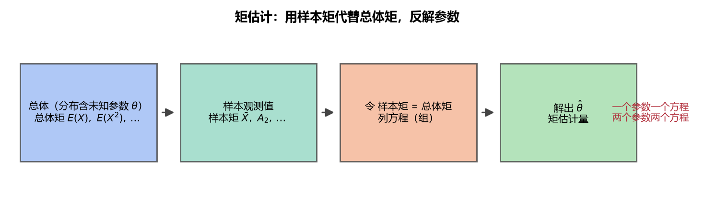

# 《概率论与数理统计》7.1 矩估计 - 笔记

> 整理自 B 站《概率论与数理统计》教学视频 2.0 版本（up：宋浩老师官方）p51。
> 前置：p33 期望、p48 统计量。进入第 7 章"参数估计"——分布已知、参数未知，用样本"猜"参数。

## 目录

- [一、 参数估计是什么](#一-参数估计是什么)
- [二、 估计量与估计值](#二-估计量与估计值)
- [三、 矩的复习](#三-矩的复习)
- [四、 矩估计法（核心思想）](#四-矩估计法核心思想)
- [五、 例题](#五-例题)
- [本节重点](#本节重点)

---

## 一、 参数估计是什么

**背景**：知道总体服从什么分布（如 $0-1$、正态、泊松），但分布里的**参数未知**（$p$、$\mu,\sigma^2$、$\lambda$）。参数可能一个、也可能两个。要用**样本**来估计这些参数。

**点估计 vs 区间估计**（猜宋老师身高）：

| 方法 | 说法 | 特点 |
|---|---|---|
| 点估计 | "1 米 83" | 猜一个**具体数值** |
| 区间估计 | "1 米 80 到 1 米 90 之间" | 给一个**范围**，几乎必然正确 |

## 二、 估计量与估计值

**估计量**（变量）：由样本构造的统计量 $\hat\theta(X_1,\dots,X_n)$（**大写** $X_i$）。

**估计值**（数值）：把观测值代入后得到的数 $\hat\theta(x_1,\dots,x_n)$（**小写** $x_i$）。

> 白话：用"样本的东西"估计"总体的东西"。估计量是"公式"，估计值是"算出来的数"。

## 三、 矩的复习

| 类别 | 总体（未知） | 样本（已知） |
|---|---|---|
| 一阶原点矩 | $E(X)$ | $A_1=\bar X=\dfrac1n\sum X_i$ |
| 二阶原点矩 | $E(X^2)$ | $A_2=\dfrac1n\sum X_i^2$ |
| 一阶中心矩 | $E[(X-EX)]$ | $B_1=\dfrac1n\sum(X_i-\bar X)$ |
| 二阶中心矩 | $E[(X-EX)^2]=DX$ | $B_2=\dfrac1n\sum(X_i-\bar X)^2$ |

> 原点 = 到"0"的距离（$X^k$），中心 = 到"均值"的距离（$(X-\bar X)^k$）。

## 四、 矩估计法（核心思想）

**一句话：用样本的各阶矩来估计总体的各阶矩**（令它们相等），解出参数。

**一个参数** $\theta$：只需一个方程（一阶原点矩）

$$E(X)=A_1=\bar X$$

**两个参数** $\theta_1,\theta_2$：需要两个方程

$$\begin{cases}E(X)=A_1\\[4pt] E(X^2)=A_2\end{cases}$$

**为什么够用**：$E(X)$、$E(X^2)$ 都是参数的函数（未知量），样本矩 $A_1,A_2$ 可算（已知量）。一个参数一个未知数 → 一个方程；两个参数两个未知数 → 两个方程。

**常用恒等式**（后文反复用）：

$$A_2-\bar X^2=B_2$$

**证明**：展开 $\dfrac1n\sum(X_i-\bar X)^2=\dfrac1n\sum X_i^2-2\bar X\cdot\dfrac1n\sum X_i+\bar X^2=A_2-2\bar X^2+\bar X^2=A_2-\bar X^2$。

> **图1** 矩估计流程：样本矩 = 总体矩 → 列方程 → 反解参数（自绘）。

## 五、 例题

**例 1（0-1 分布）**：$X\sim B(1,p)$，样本 $X_1,\dots,X_n$，求 $p$ 的矩估计。

$$E(X)=p=\bar X\ \Rightarrow\ \hat p=\bar X$$

**例 2（正态分布，两个参数）**：$X\sim N(\mu,\sigma^2)$，求 $\mu,\sigma^2$ 的矩估计。

$$\begin{cases}E(X)=\mu=\bar X\\[4pt] E(X^2)=DX+(EX)^2=\sigma^2+\mu^2=A_2\end{cases}\ \Rightarrow\ \begin{cases}\hat\mu=\bar X\\[4pt] \hat{\sigma}^2=A_2-\bar X^2=B_2\end{cases}$$

> **易错点**：$E(X^2)$ 不是"直接等于方差"，要用 $E(X^2)=DX+(EX)^2$ 拆开。

**例 3（泊松分布）**：$X\sim P(\lambda)$，$E(X)=\lambda$，$\lambda>0$。

$$\hat\lambda=\bar X\quad(\text{也可用二阶：}\hat\lambda=B_2)$$

泊松是唯一"期望 = 方差 = $\lambda$"的分布，一阶二阶都能估计。**一般取低阶**（估计更稳定）。

**例 4（连续型，具体数值）**：$f(x)=\theta x^{-\theta-1}$（$x>1$，$\theta>1$），观测值 $4.4,\ 5.1,\ 8,\ 6.3,\ 5.2$，求 $\theta$ 的矩估计。

$$E(X)=\int_1^{+\infty}x\cdot\theta x^{-\theta-1}\,dx=\frac{\theta}{\theta-1}=\bar X\ \Rightarrow\ \hat\theta=\frac{\bar X}{\bar X-1}$$

$$\bar X=\frac{4.4+5.1+8+6.3+5.2}{5}=5.8\ \Rightarrow\ \hat\theta=\frac{5.8}{4.8}\approx1.21$$

**例 5（离散型）**：$X$ 取 $1,2,3$，概率分别为 $\theta^2,\ 2\theta(1-\theta),\ (1-\theta)^2$；观测值 $1,2,1$，求 $\theta$ 的矩估计。

$$E(X)=1\cdot\theta^2+2\cdot2\theta(1-\theta)+3(1-\theta)^2=3-2\theta$$

$$\bar X=\frac{1+2+1}{3}=\frac43\ \Rightarrow\ \hat\theta=\frac{3-\bar X}{2}=\frac{3-\frac43}{2}=\frac56$$

**直观验证**：$\hat\theta=\frac56$ 时 $P\{X=1\}=\frac{25}{36}$（最大）、$P\{X=3\}=\frac1{36}$（最小）——观测里 1 出现两次、3 没出现，与估计吻合。

> **补充**：离散情况也可用"频率估计概率"（$1$ 出现 $2/3$），但样本太少时误差大；矩估计是系统化的做法。

---

## 本节重点

> - **矩估计 = 令样本矩 = 总体矩，解参数**：一个参数用一阶，两个参数用一二阶。
> - **核心恒等式**：$A_2-\bar X^2=B_2$；正态 $\hat\mu=\bar X$、$\hat\sigma^2=B_2$。
> - **大写在公式、小写代入数**：估计量 vs 估计值。
> - **常见坑**：① $E(X^2)$ 忘记拆成 $DX+(EX)^2$；② 把 $A_2$ 当方差（那是 $B_2$）；③ 观测值代入时用错 $\bar X$。
