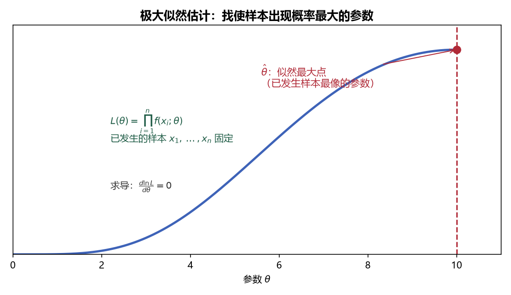

# 《概率论与数理统计》7.1 极大似然估计 - 笔记

> 整理自 B 站《概率论与数理统计》教学视频 2.0 版本（up：宋浩老师官方）p52。
> 前置：p47 样本联合分布、p51 矩估计。极大似然估计 = "让已发生的事件的概率最大"。

## 目录

- [一、 核心思想](#一-核心思想)
- [二、 似然函数](#二-似然函数)
- [三、 解题流程（套路）](#三-解题流程套路)
- [四、 例题](#四-例题)
- [本节重点](#本节重点)

---

## 一、 核心思想

**思想**：一次抽样中"已经发生"的观测值 $(x_1,\dots,x_n)$，其出现的概率（似然）应当**最大**——参数取什么值时，这个样本最"像"会抽出来，就取什么值。

> 白话（查考勤）：老师只查了一次课，结果只有 A 来了——那 A 就是"好学生"（出勤概率大）。**已经发生了，就说明它概率大**。反过来，如果参数让已发生事件的概率很小，这参数就不合理。

## 二、 似然函数

设样本观测值 $x_1,\dots,x_n$ 已知、参数 $\theta$ 未知，**似然函数**：

**离散型**：$L(\theta)=p(x_1;\theta)p(x_2;\theta)\cdots p(x_n;\theta)$

**连续型**：$L(\theta)=f(x_1;\theta)f(x_2;\theta)\cdots f(x_n;\theta)$

即：联合分布（边缘分布相乘）看成**关于 $\theta$ 的函数**。目标是找 $\theta$ 使 $L(\theta)$ 最大。

## 三、 解题流程（套路）

1. **构造似然函数** $L(\theta)=\prod p(x_i;\theta)$ 或 $\prod f(x_i;\theta)$；
2. **两边取对数** $\ln L(\theta)=\sum\ln p(x_i;\theta)$——乘法变加法，求导容易；
3. **求导/偏导 = 0**：
   - 一个参数：$\dfrac{d\ln L}{d\theta}=0$；
   - 两个参数：$\dfrac{\partial\ln L}{\partial\theta_1}=0$，$\dfrac{\partial\ln L}{\partial\theta_2}=0$；
4. **解出 $\hat\theta$**（估计量），代入观测值得估计值。

> **易错点**：$\ln$ 把"乘"变成"加"后，求和符号别丢；对数里 $\theta$ 的系数（$\sum x_i$、$n$）都是已知常数。若求导后解不出 $\theta$，回到原始定义——直接让 $L(\theta)$ 的**单调性/端点**取最大（见本节末尾说明）。

> **图2** 极大似然的几何意义：已发生的样本固定，参数 $\theta$ 取使似然函数 $L(\theta)$ 最大的点 $\hat\theta$（自绘）。

## 四、 例题

**例 1（泊松分布）**：$X\sim P(\lambda)$，观测值 $x_1,\dots,x_n$，求 $\lambda$ 的极大似然估计。

$$p(x;\lambda)=\frac{\lambda^x e^{-\lambda}}{x!},\qquad L(\lambda)=\frac{\lambda^{\sum x_i}e^{-n\lambda}}{\prod x_i!}$$

$$\ln L=\Big(\sum x_i\Big)\ln\lambda-n\lambda-\sum\ln(x_i!)$$

$$\frac{d\ln L}{d\lambda}=\frac{\sum x_i}{\lambda}-n=0\ \Rightarrow\ \hat\lambda=\frac1n\sum x_i=\bar x$$

与矩估计**结果一致**：$\hat\lambda=\bar X$。

**例 2（正态分布，两个参数）**：$X\sim N(\mu,\sigma^2)$，观测值 $x_1,\dots,x_n$，求 $\mu,\sigma^2$ 的极大似然估计。

$$L(\mu,\sigma^2)=\left(\frac{1}{\sqrt{2\pi}\sigma}\right)^n e^{-\frac{1}{2\sigma^2}\sum(x_i-\mu)^2}$$

$$\ln L=-\frac n2\ln(2\pi)-\frac n2\ln\sigma^2-\frac{1}{2\sigma^2}\sum_{i=1}^n(x_i-\mu)^2$$

**对 $\mu$ 求偏导**（$\sigma^2$ 视为常数，系数 $\dfrac{1}{2\sigma^2}$ 提出来）：

$$\frac{\partial\ln L}{\partial\mu}=\frac{1}{\sigma^2}\sum_{i=1}^n(x_i-\mu)=0\ \Rightarrow\ \sum x_i-n\mu=0\ \Rightarrow\ \hat\mu=\bar x$$

**对 $\sigma^2$ 求偏导**（$\mu$ 视为常数；把 $\sigma^2$ 当成一个整体变量 $T$，$\dfrac{d\ln T}{dT}=\dfrac1T$）：

$$\frac{\partial\ln L}{\partial\sigma^2}=-\frac{n}{2\sigma^2}+\frac{1}{2\sigma^4}\sum_{i=1}^n(x_i-\mu)^2=0\ \Rightarrow\ \hat\sigma^2=\frac1n\sum_{i=1}^n(x_i-\bar x)^2=B_2$$

**结论**：$\hat\mu=\bar X$，$\hat\sigma^2=B_2$（**未修正**样本方差）——与矩估计完全一致。

> **易错点**：① 对 $\sigma^2$ 求偏导时不要写成对 $\sigma$ 求导（$\ln\sigma^2$ 求导是 $\dfrac1{\sigma^2}$，不是 $\dfrac{2}{\sigma}$）；② 最后 $\hat\sigma^2$ 是 $B_2$（除以 $n$），**不是** $S^2$（除以 $n-1$）——极大似然天然偏向 $B_2$。

**例 3（解不出的情况）**：若似然方程解不出 $\hat\theta$（例如 $\theta$ 在区间端点取极值），直接考察 $L(\theta)$ 随 $\theta$ 的单调性：

- 若 $L(\theta)$ 关于 $\theta$ 单调，则取定义域**端点**（如 $\hat\theta=\max X_i$ 之类的顺序统计量）为极大似然估计；
- 记住原则：**回到"使 $L(\theta)$ 最大"本身**，而非死磕求导。

---

## 本节重点

> - **极大似然**：让已发生的观测值出现概率最大 → $\max L(\theta)$。
> - **流程**：构造 $L$ → 取 $\ln$ → 求导/偏导 = 0 → 解 $\hat\theta$。
> - **正态结论**：$\hat\mu=\bar X$、$\hat\sigma^2=B_2$；泊松 $\hat\lambda=\bar X$——与矩估计一致。
> - **常见坑**：① $\ln$ 后丢掉求和；② 对 $\sigma^2$ 求偏导时误用链式法则；③ 解不出时忘记回到"单调性/端点"。
