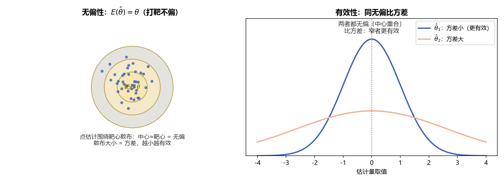

# 《概率论与数理统计》7.2 估计量的评价标准 - 笔记

> 整理自 B 站《概率论与数理统计》教学视频 2.0 版本（up：宋浩老师官方）p53。
> 前置：p51 矩估计、p52 极大似然估计、p45 大数定律。同一参数常有多套估计（如 $\hat\lambda=\bar X$ 或 $B_2$），需要标准评判优劣。

## 目录

- [一、 无偏性](#一-无偏性)
- [二、 有效性](#二-有效性)
- [三、 相合性（一致性）](#三相合性一致性)
- [四、 重要结论汇总](#四-重要结论汇总)
- [本节重点](#本节重点)

---

## 一、 无偏性

**定义**：若 $E(\hat\theta)=\theta$，则 $\hat\theta$ 是 $\theta$ 的**无偏估计量**；否则**有偏**。

> 白话：估计量（抽样前是随机变量）的"平均表现"要等于真实参数。如果平均来看都偏了，估计就没有意义。

**例**：总体 $E(X)=\mu$，$X_1,X_2,X_3$ 为样本，验证 $\hat\mu=\dfrac15X_1+\dfrac{3}{10}X_2+\dfrac12X_3$ 是 $\mu$ 的无偏估计。

$$E(\hat\mu)=\frac15E(X_1)+\frac{3}{10}E(X_2)+\frac12E(X_3)=\left(\frac15+\frac{3}{10}+\frac12\right)\mu=\mu\quad\checkmark$$

**关键条件**：系数和 = 1（$\dfrac15+\dfrac{3}{10}+\dfrac12=1$）。

## 二、 有效性

**定义**：$\hat\theta_1,\hat\theta_2$ 都是 $\theta$ 的无偏估计，若 $D(\hat\theta_1)<D(\hat\theta_2)$，则称 $\hat\theta_1$ 比 $\hat\theta_2$ **更有效**。

> 白话：都无偏（期望都等于 $\theta$），谁的波动小（方差小）谁更好——"更稳"。

**例**：比较两个估计量哪个更有效（$D(X_i)=\sigma^2$，独立同分布）：

$$\hat\mu_1=\frac12X_1+\frac13X_2+\frac16X_3,\qquad \hat\mu_2=\frac13(X_1+X_2+X_3)=\bar X$$

两者都无偏（系数和都是 1）。方差（独立变量相加方差直接相加，**系数提出来要平方**）：

$$D(\hat\mu_1)=\left(\frac14+\frac19+\frac1{36}\right)\sigma^2=\frac{7}{18}\sigma^2$$

$$D(\hat\mu_2)=\left(\frac19+\frac19+\frac19\right)\sigma^2=\frac13\sigma^2<\frac{7}{18}\sigma^2$$

**结论**：$\bar X$ 比 $\hat\mu_1$ 更有效。这也说明：**样本均值 $\bar X$ 是所有"系数和为 1 的线性组合"中最有效的**（方差最小）。

> **图3** 评价标准直观：左图——估计值围绕靶心 $\theta$ 散布，中心不偏 = 无偏；右图——两个都无偏的估计比方差，峰更尖者更有效（自绘）。

## 三、 相合性（一致性）

**定义**：若对任意 $\varepsilon>0$，

$$\lim_{n\to\infty}P\{|\hat\theta_n-\theta|<\varepsilon\}=1$$

则称 $\hat\theta_n$ 是 $\theta$ 的**相合估计量**（一致估计量），即 $\hat\theta_n\xrightarrow{P}\theta$。

> 白话：样本足够多（$n\to\infty$），估计量"几乎必然"逼近真实参数——把 10 万个灯泡全测了，平均寿命就是总体期望。由**辛钦大数定律**直接得到（$\bar X\xrightarrow{P}\mu$）。

## 四、 重要结论汇总

| 估计量 | 估计对象 | 是否无偏 | 说明 |
|---|---|---|---|
| $\bar X=\dfrac1n\sum X_i$ | $\mu$ | ✅ | 无偏 + 相合 |
| $S^2=\dfrac1{n-1}\sum(X_i-\bar X)^2$ | $\sigma^2$ | ✅ | **修正的目的就是无偏** |
| $S_0^2=B_2=\dfrac1n\sum(X_i-\bar X)^2$ | $\sigma^2$ | ❌ | 偏小（除以 $n$） |
| $S=\sqrt{S^2}$ | $\sigma$ | ❌ | **开根号不保无偏** |

**$S$ 不是 $\sigma$ 的无偏估计**（证明要点）：由方差公式 $E(S^2)=D(S)+[E(S)]^2$：

$$E(S)=\sqrt{\sigma^2-D(S)}<\sigma$$

因为 $D(S)>0$，$E(S)$ 严格小于 $\sigma$（$S$ 的波动越大偏得越多）。

> **易错点**：$S^2$ 无偏于 $\sigma^2$，**推不出** $S$ 无偏于 $\sigma$——"开根号"和"取期望"不可交换（期望是线性运算，开根号不是）。

---

## 本节重点

> - **无偏性**：$E(\hat\theta)=\theta$；线性组合"系数和 = 1"即无偏于 $\mu$。
> - **有效性**：同为无偏时比方差，小者更有效；$\bar X$ 是线性无偏估计中最有效的。
> - **相合性**：$n\to\infty$ 时 $\hat\theta\xrightarrow{P}\theta$（辛钦大数定律）。
> - **记住三对**：$\bar X\leftrightarrow\mu$ 无偏；$S^2\leftrightarrow\sigma^2$ 无偏；$S_0^2$、$S$ 有偏。
> - **常见坑**：① 方差中系数提出来要平方；② 认为 $S$ 是 $\sigma$ 的无偏估计。

---

## 教材深化（《统计学完全教程》第6-7、9章）

> 整理自《统计学完全教程》(L. Wasserman) 第6-7、9章，为教材比原笔记更深的内容。

### 三、 估计量的评价体系：偏、标准误、MSE

$\hat\theta_n$ 是 $\theta$ 的点估计（数据函数，随机变量；$\theta$ 是**固定未知**的）：

- **偏（bias）**：$\text{bias}(\hat\theta_n)=\mathbb E_\theta(\hat\theta_n)-\theta$；无偏 ⟺ $\mathbb E(\hat\theta_n)=\theta$。教材提示：无偏性如今已不是最重要标准（很多好估计量是有偏的）。
- **一致（consistent）**：$\hat\theta_n\xrightarrow{p}\theta$（数据越多越接近真值）——更重要的要求。
- **抽样分布**：$\hat\theta_n$ 的分布。
- **标准误（standard error）**：$\text{se}=\sqrt{V(\hat\theta_n)}$；若含未知量则估计 $\widehat{\text{se}}$。
- **渐近正态**：$\frac{\hat\theta_n-\theta}{\text{se}}\leadsto N(0,1)$（很多估计量满足）。

**例**：$X_1,\dots,X_n\sim\text{Bernoulli}(p)$，$\hat p_n=\bar X_n$：无偏，$\text{se}=\sqrt{p(1-p)/n}$，$\widehat{\text{se}}=\sqrt{\hat p(1-\hat p)/n}$。

### 四、 MSE 分解：bias² + variance

**定理 6.9（重要）**：均方误差
$$\boxed{\text{MSE}=\mathbb E_\theta(\hat\theta_n-\theta)^2=\text{bias}^2(\hat\theta_n)+V(\hat\theta_n)}$$
证明：$\hat\theta_n-\theta=(\hat\theta_n-\mathbb E\hat\theta_n)+(\mathbb E\hat\theta_n-\theta)$，交叉项期望为0。

**定理 6.10**：若 $\text{bias}\to0$ 且 $\text{se}\to0$（$n\to\infty$），则 $\hat\theta_n\xrightarrow{p}\theta$（一致）。
证明：MSE→0 ⟹ 均方收敛 ⟹ 依概率收敛。

> 这就是"偏差-方差权衡（bias-variance tradeoff）"的出处：好的估计要同时压低偏差和方差。后面 Bootstrap、回归里反复出现。

### MLE 的最优性（《统计学完全教程》第9章）

#### 五、 MLE 的最优性：效率与 ARE

**渐近相对效率（ARE）**：两个估计量 $T_n,U_n$ 满足 $\sqrt n(T_n-\theta)\leadsto N(0,t^2)$、$\sqrt n(U_n-\theta)\leadsto N(0,u^2)$，则
$$\text{ARE}(U,T)=\frac{t^2}{u^2}$$
**例**：$N(\theta,\sigma^2)$ 中 MLE $\bar X$ 与样本中位数的 ARE：$\text{ARE}(\hat\theta_{\text{med}},\bar X)=\frac{2}{\pi}\approx0.63$——**用中位数等于只用约 63% 的数据**。

**定理 9.23**：MLE 在所有良态估计量中渐近方差最小（**有效/渐近最优**）。证明框架是 Cramér–Rao 下界：$V(\hat\theta)\ge\frac1{nI(\theta)}$，MLE 渐近达到下界。

> 代价：最优性依赖模型正确。第12章决策理论再一般化。

