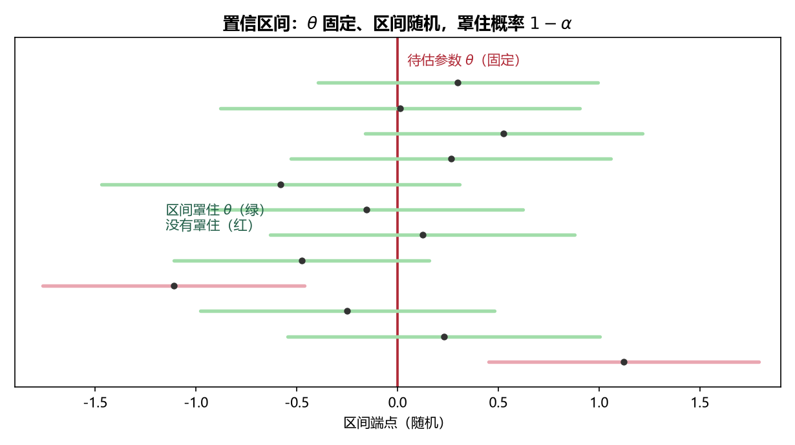

# 《概率论与数理统计》7.3 区间估计与枢轴变量法 - 笔记

> 整理自 B 站《概率论与数理统计》教学视频 2.0 版本（up：宋浩老师官方）p54。
> 前置：p49~p50 分位数与三大分布、p51 点估计。本节是第 7 章后半（p55）所有区间估计题的方法论基础。

## 目录

- [一、 区间估计的直觉](#一-区间估计的直觉)
- [二、 置信区间（两个关键区分）](#二-置信区间两个关键区分)
- [三、 枢轴变量法（四步）](#三-枢轴变量法四步)
- [四、 双侧置信区间的分位数取法](#四-双侧置信区间的分位数取法)
- [本节重点](#本节重点)

---

## 一、 区间估计的直觉

**点估计**：猜一个数（"宋老师 1 米 83"）。
**区间估计**：猜一个区间（"1 米 80 到 1 米 85"）。

**两个矛盾的追求**：

1. **覆盖率**：区间罩住真实参数的概率越大越好（区间拉满到 $1.4m\sim2m$ 概率 100% 但没用）；
2. **长度**：区间越短越好。

两者矛盾 ⇒ 实际做法：**先固定置信度（覆盖率）$1-\alpha$，再找长度最短的区间**。

## 二、 置信区间（两个关键区分）

**定义**：由样本构造 $\hat\theta_1<\hat\theta_2$，若

$$P\{\hat\theta_1<\theta<\hat\theta_2\}=1-\alpha$$

则 $[\hat\theta_1,\hat\theta_2]$ 是 $\theta$ 的**置信水平为 $1-\alpha$ 的置信区间**；$1-\alpha$ 称为**置信度/置信系数**（常取 $0.9,0.95,0.99$）。

**区分 1（谁是随机的）**：$\theta$ 是**固定常数**（宋老师身高就是 1 米 83），**区间是随机的**（每次抽样算出的端点不同）。正确说法是"**区间罩住 $\theta$ 的概率是 $1-\alpha$**"，不是"$\theta$ 落在区间内的概率"。

> 比喻（撒网捞鱼）：鱼（$\theta$）在河里不动，网（区间）每次撒的位置不同。$1-\alpha$ 是"这一网罩住鱼"的概率，不是鱼自己跳进网。

**区分 2（重复抽样的频率解释）**：$\alpha=0.01$ 时置信度 $0.99$——重复抽样 1000 次得到 1000 个区间，约 990 个罩住 $\theta$，约 10 个没罩住。

> **图4** 重复抽样直观：每次抽样得到一个区间（横线），$\theta$ 固定不动；绿色区间罩住 $\theta$、红色没有——罩住比例约 $1-\alpha$（自绘）。

## 三、 枢轴变量法（四步）

设总体分布 $F(x;\theta)$ 已知、参数 $\theta$ 未知，求 $\theta$ 的置信区间：

**第一步：构造统计量**——由样本构造含 $\theta$ 的统计量 $T(X_1,\dots,X_n;\theta)$。

**第二步：构造枢轴量 $G$**——$T$ 的某个函数 $G(T,\theta)$，满足：

1. 分布**完全已知**（$N(0,1)$、$t$、$\chi^2$、$F$ 等）；
2. 只含 $\theta$ 一个未知参数（**不能再含别的未知参数**）。

**第三步：定分位数**——给定 $1-\alpha$，找 $a<b$ 使

$$P\{a<G<b\}=1-\alpha$$

（双侧取法见下节：对称分布 $\pm u_{\alpha/2}$，非对称分布左 $\chi^2_{1-\alpha/2}$、右 $\chi^2_{\alpha/2}$。）

**第四步：反解 $\theta$**——把不等式 $a<G<b$ 变形为 $\hat\theta_1<\theta<\hat\theta_2$，即得置信区间。

> **"枢轴"二字的含义**：就像门轴一转、门就开——把"$G$ 的不等式"转成"$\theta$ 的不等式"，$\theta$ 被单独解出来。例：若 $G=\dfrac{\theta+1}{2}$，则 $1<G<3\Rightarrow 1<\theta<5$。

## 四、 双侧置信区间的分位数取法

置信度 $1-\alpha$ ⇒ 中间面积 $1-\alpha$，左右尾各 $\dfrac{\alpha}{2}$：

**对称分布（正态、$t$）**：左右两点互为相反数

$$P\{-u_{\alpha/2}<G<u_{\alpha/2}\}=1-\alpha$$

**非对称分布（$\chi^2$、$F$）**：左边取**下** $\dfrac{\alpha}{2}$ 分位（右侧面积 $1-\dfrac{\alpha}{2}$）

$$P\{\chi^2_{1-\alpha/2}(n)<G<\chi^2_{\alpha/2}(n)\}=1-\alpha$$

> **易错点**：非对称分布左端点**不是** $-\chi^2_{\alpha/2}$（$\chi^2$ 没有负值），而是 $\chi^2_{1-\alpha/2}$（小分位点在左侧）；查表 $\alpha$ 大时用对称/倒数公式转换（p50 的 $F_{1-\alpha}$ 公式在此用得上）。

---

## 本节重点

> - **置信区间**：$P\{\hat\theta_1<\theta<\hat\theta_2\}=1-\alpha$；$\theta$ 固定、区间随机，"罩住"而非"落入"。
> - **置信度 vs 区间长度**：先定 $1-\alpha$，再求最短区间。
> - **枢轴变量法四步**：构造含 $\theta$ 统计量 → 造分布已知的枢轴量 $G$（不含其他未知参数）→ 由 $1-\alpha$ 定分位数 → 反解 $\theta$ 得区间。
> - **双侧分位数**：对称 $\pm u_{\alpha/2}$（或 $\pm t_{\alpha/2}$）；非对称 $\chi^2_{1-\alpha/2}$ 与 $\chi^2_{\alpha/2}$。
> - **常见坑**：① 把"落入区间概率"当"罩住概率"；② 非对称分布左端取错；③ 枢轴量里残留第二个未知参数。
