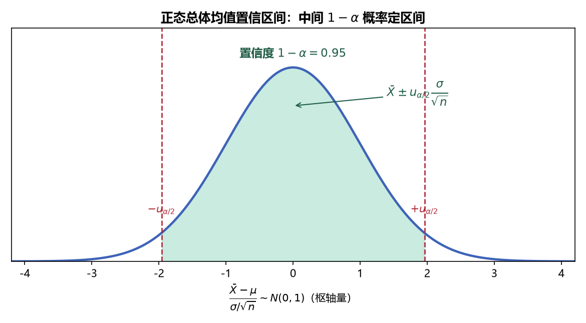

# 《概率论与数理统计》7.4 正态总体的区间估计 - 笔记

> 整理自 B 站《概率论与数理统计》教学视频 2.0 版本（up：宋浩老师官方）p55。
> 前置：p50 正态总体抽样分布（全部结论）、p54 枢轴变量法。本节就是"套模板"：六种情况，每个都有固定的枢轴量 → 分布 → 区间公式。

## 目录

- [一、 做题总纲](#一-做题总纲)
- [二、 单个正态总体：估计 μ](#二-单个正态总体估计-μ)
- [三、 单个正态总体：估计 σ²](#三-单个正态总体估计-σ²)
- [四、 两个正态总体：估计 μ₁-μ₂](#四-两个正态总体-估计-μ₁-μ₂)
- [五、 两个正态总体：估计 σ₁²/σ₂²](#五-两个正态总体-估计-σ₁²σ₂²)
- [六、 例题](#六-例题)
- [本节重点](#本节重点)

---

## 一、 做题总纲

1. **分清已知/未知**：枢轴量里**除待估参数外不得含其他未知参数**——这是选公式的唯一依据；
2. **选枢轴量**：查第 6 章抽样分布结论（σ² 已知用正态、σ² 未知用 $t$、方差不谈均值用 $\chi^2$、方差比用 $F$）；
3. **定分位数**：对称分布（$N,t$）取 $\pm u_{\alpha/2}$；非对称分布（$\chi^2,F$）左侧取 $1-\alpha/2$ 分位；
4. **反解区间**（"枢轴"）：把不等式转成参数的置信区间。

> **图5** 置信区间的来源：枢轴量服从已知分布，取中间 $1-\alpha$ 概率区域反解出 $\bar X\pm u_{\alpha/2}\dfrac{\sigma}{\sqrt n}$（自绘）。

## 二、 单个正态总体：估计 μ

设 $X_1,\dots,X_n$ iid $\sim N(\mu,\sigma^2)$，置信度 $1-\alpha$：

| 情况 | 枢轴量 | 分布 | 置信区间 |
|---|---|---|---|
| $\sigma^2$ **已知** | $U=\dfrac{\bar X-\mu}{\sigma/\sqrt n}$ | $N(0,1)$ | $\left[\bar X-u_{\alpha/2}\dfrac{\sigma}{\sqrt n},\ \bar X+u_{\alpha/2}\dfrac{\sigma}{\sqrt n}\right]$ |
| $\sigma^2$ **未知** | $T=\dfrac{\bar X-\mu}{S/\sqrt n}$ | $t(n-1)$ | $\left[\bar X-t_{\alpha/2}(n-1)\dfrac{S}{\sqrt n},\ \bar X+t_{\alpha/2}(n-1)\dfrac{S}{\sqrt n}\right]$ |

**直观规律**：σ² 已知（信息多）时区间**更窄**；σ² 未知用 $S$ 代替（信息少）时区间**更宽**——同一个置信度下，知道得越少，只能把区间拉大。

## 三、 单个正态总体：估计 σ²

| 情况 | 枢轴量 | 分布 | 置信区间 |
|---|---|---|---|
| $\mu$ **已知** | $\dfrac{\sum(X_i-\mu)^2}{\sigma^2}$ | $\chi^2(n)$ | $\left[\dfrac{\sum(X_i-\mu)^2}{\chi^2_{\alpha/2}(n)},\ \dfrac{\sum(X_i-\mu)^2}{\chi^2_{1-\alpha/2}(n)}\right]$ |
| $\mu$ **未知** | $\dfrac{(n-1)S^2}{\sigma^2}$ | $\chi^2(n-1)$ | $\left[\dfrac{(n-1)S^2}{\chi^2_{\alpha/2}(n-1)},\ \dfrac{(n-1)S^2}{\chi^2_{1-\alpha/2}(n-1)}\right]$ |

> **易错点（非对称！）**：$\chi^2$ 分布不对称，左端点是 $\chi^2_{1-\alpha/2}$（小分位）不是 $-\chi^2_{\alpha/2}$；**分母位置**：左边端点除的是大分位 $\chi^2_{\alpha/2}$，右边端点除的是小分位 $\chi^2_{1-\alpha/2}$（因为取倒数后不等式反向）。

## 四、 两个正态总体：估计 μ₁-μ₂

设 $X_1,\dots,X_{n_1}$ iid $\sim N(\mu_1,\sigma_1^2)$，$Y_1,\dots,Y_{n_2}$ iid $\sim N(\mu_2,\sigma_2^2)$，两样本独立：

| 情况 | 枢轴量 | 分布 | 置信区间 |
|---|---|---|---|
| $\sigma_1^2,\sigma_2^2$ **已知** | $U=\dfrac{(\bar X-\bar Y)-(\mu_1-\mu_2)}{\sqrt{\sigma_1^2/n_1+\sigma_2^2/n_2}}$ | $N(0,1)$ | $(\bar X-\bar Y)\pm u_{\alpha/2}\sqrt{\dfrac{\sigma_1^2}{n_1}+\dfrac{\sigma_2^2}{n_2}}$ |
| $\sigma_1^2=\sigma_2^2$ **未知** | $T=\dfrac{(\bar X-\bar Y)-(\mu_1-\mu_2)}{S_w\sqrt{1/n_1+1/n_2}}$ | $t(n_1+n_2-2)$ | $(\bar X-\bar Y)\pm t_{\alpha/2}(n_1+n_2-2)\,S_w\sqrt{\dfrac1{n_1}+\dfrac1{n_2}}$ |

其中合并方差 $S_w^2=\dfrac{(n_1-1)S_1^2+(n_2-1)S_2^2}{n_1+n_2-2}$。

> **注意**：两个总体样本容量 $n_1,n_2$ 可以不同；自由度是 $n_1+n_2-2$。

## 五、 两个正态总体：估计 σ₁²/σ₂²

设 $\mu_1,\mu_2$ 未知（实际最常见）：

| 枢轴量 | 分布 | 置信区间 |
|---|---|---|
| $\dfrac{S_1^2/\sigma_1^2}{S_2^2/\sigma_2^2}$ | $F(n_1-1,n_2-1)$ | $\left[\dfrac{S_1^2}{S_2^2}\cdot\dfrac{1}{F_{\alpha/2}(n_1-1,n_2-1)},\ \dfrac{S_1^2}{S_2^2}\cdot F_{\alpha/2}(n_2-1,n_1-1)\right]$ |

（右端点用到倒数公式：$F_{1-\alpha/2}(m,n)=\dfrac{1}{F_{\alpha/2}(n,m)}$，注意**两个自由度交换**。）

> $\mu_1,\mu_2$ 已知时，把 $S_1^2,S_2^2$ 换成 $\dfrac{\sum(X_i-\mu_1)^2}{n_1-1}$、$\dfrac{\sum(Y_i-\mu_2)^2}{n_2-1}$ 即可，结构相同。

## 六、 例题

**例（单个总体估计 μ，两种情况的对比）**：机床加工零件长度 $X\sim N(\mu,\sigma^2)$，取 $n=16$ 个样本，$X_1,\dots,X_{16}$。

**情况 1**：$\sigma^2=0.3$ 已知，$\alpha=0.05$：

$$\bar X=100.375,\quad \sigma=\sqrt{0.3},\quad u_{0.025}=1.96$$

$$\text{区间}=\left[100.375-1.96\cdot\frac{\sqrt{0.3}}4,\ 100.375+1.96\cdot\frac{\sqrt{0.3}}4\right]=[100.107,\ 100.643]$$

**情况 2**：$\sigma^2$ 未知，$S^2=0.62^2$（$S=0.62$），$t_{0.025}(15)=2.1315$：

$$\text{区间}=\left[100.375-2.1315\cdot\frac{0.62}4,\ 100.375+2.1315\cdot\frac{0.62}4\right]=[100.045,\ 100.705]$$

**对比**：情况 2 区间更宽（$100.045$ 更靠左、$100.705$ 更靠右）——**$\sigma^2$ 未知、信息更少，区间被迫放大**。

> **计算细节**：$\bar X=\dfrac{1}{16}\sum X_i$；$S^2=\dfrac1{15}\sum(X_i-\bar X)^2$（修正）；$t$ 分布查表自由度 $n-1=15$。

---

## 本节重点

> - **六套模板**：μ（σ² 已知 → $N$；未知 → $t(n-1)$）、σ²（μ 已知 → $\chi^2(n)$；未知 → $\chi^2(n-1)$）、μ₁-μ₂（方差已知 → $N$；相等未知 → $t(n_1+n_2-2)$）、σ₁²/σ₂² → $F(n_1-1,n_2-1)$。
> - **分位数取法**：对称 $\pm$ 同值；$\chi^2$、$F$ 左端取 $1-\alpha/2$ 分位（独立查表）。
> - **区间宽度规律**：信息越少、区间越宽；$n$ 越大、区间越窄（$\sqrt n$ 在分母）。
> - **常见坑**：① 非对称分布左端点取错；② 分母除哪个分位数搞反；③ 两总体自由度写成 $n_1+n_2$；④ 忘记 $F$ 倒数公式要交换自由度。
