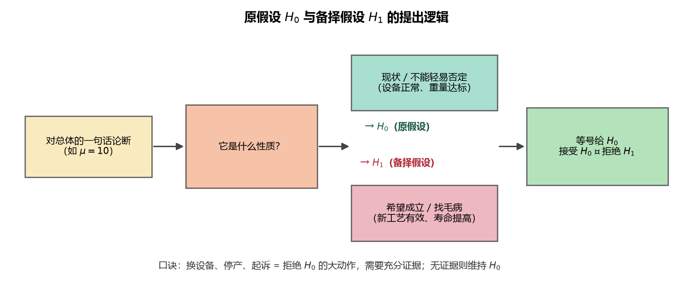
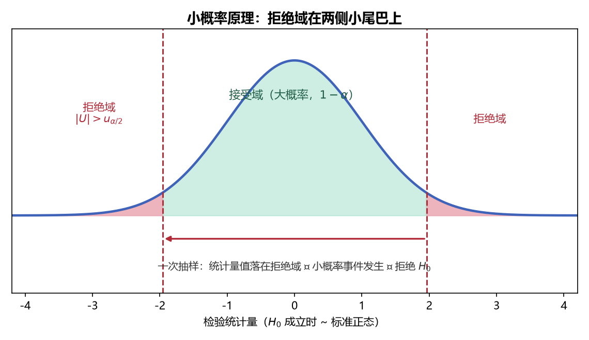
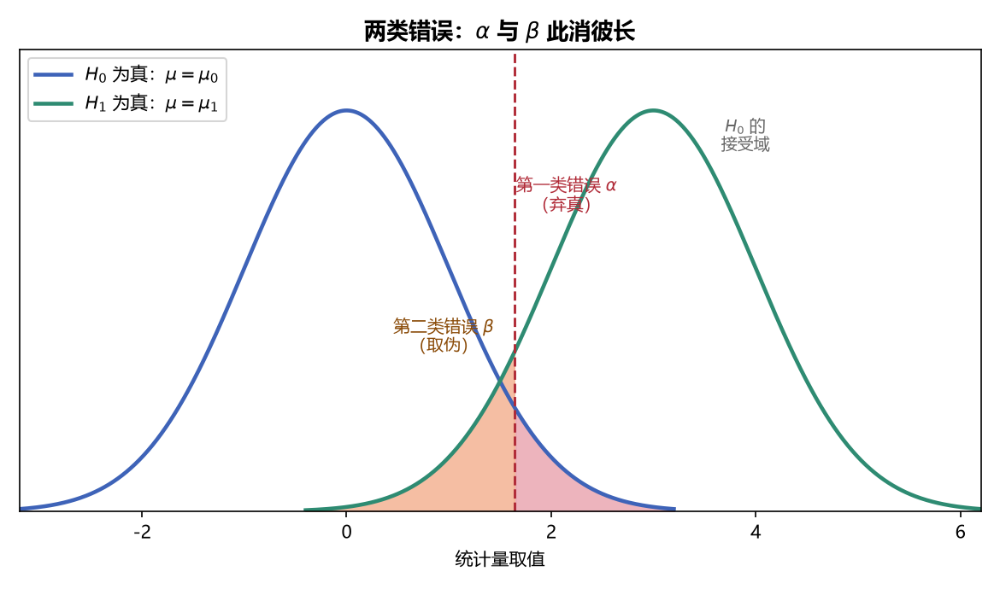

# 《概率论与数理统计》8.1 假设检验的基本概念（p56-p59）

> 整理自 B 站《概率论与数理统计》教学视频 2.0 版本（up：宋浩老师官方）p56-p59。

## 假设检验问题（p56）

> 前置：p47 总体与样本。最后一章——考研数一必考（数三不考）。本节先解决"怎么提原假设/备择假设"。

### 一、 统计推断的两大内容

1. **参数估计**（第 7 章）：由样本估计总体的未知参数（点估计 + 区间估计）；
2. **假设检验**（第 8 章）：先对总体提出一个论断（假设），再用样本信息判断接受还是拒绝。

**假设是名词**：对总体分布的一句话、一个式子（如"$\mu=10$"），不是动词"假设……"。

### 二、 原假设与备择假设

| 名称 | 记号 | 含义 |
|---|---|---|
| 原假设（零假设） | $H_0$ | **不能轻易被否定**的论断（没有足够理由不怀疑它） |
| 备择假设（对立假设） | $H_1$ | $H_0$ 的对立面，二者**必居其一** |

**提出原则（关键）**：

1. **没有足够理由去怀疑的** → 原假设 $H_0$（如设备正常、包装机正常）；
2. **希望成立 / 可能成立的** → 备择假设 $H_1$（找毛病的一方把它放 $H_1$）；
3. 接受 $H_0$ ⇔ 拒绝 $H_1$；拒绝 $H_0$ ⇔ 接受 $H_1$。

> 白话：换设备、停产、起诉都是大代价动作，不能轻易做——所以"设备正常"这类现状总是 $H_0$，要有充分证据才能拒绝它。

> **图1** 原假设 $H_0$ 与备择假设 $H_1$ 的提出逻辑：先判断论断是"现状"还是"希望成立"，再对号入座（自绘）。

### 三、 七个例题（提出假设）

**例 1（味精包装机）**：$X\sim N(\mu,\sigma^2)$（$\sigma^2=0.015^2$ 已知），标准重量 $\mu=0.5$kg，抽 9 袋测重，问包装机是否正常。

实际重量与标准重量有误差，原因二选一：**随机误差**（电压不稳、秤不准——不用换设备）vs **条件误差**（设备老化、磨损——要换设备）。没有充分理由怀疑条件误差 ⇒ 设备正常是 $H_0$：

$$H_0:\ \mu=0.5,\qquad H_1:\ \mu\ne0.5$$

**例 2（灯管新工艺）**：原寿命 $\mu=1500$ 小时，采用新工艺后抽 25 支，$\bar X=1675$，问寿命是否**显著提高**。

厂方希望新工艺有效（寿命提高），从"希望成立"角度放 $H_1$；"没提高、还是 1500" 是现状放 $H_0$：

$$H_0:\ \mu=1500,\qquad H_1:\ \mu>1500$$

**例 3（零件标准直径）**：标准直径 10cm，质检员检查机床是否正常：

$$H_0:\ \mu=10,\qquad H_1:\ \mu\ne10$$

（质检员"找毛病"，希望 $\mu\ne10$ ⇒ 放 $H_1$。）

**例 4（洗涤剂净含量）**：说明书声称"平均重量不少于 500 克"（$\mu\ge500$），市场监管局抽检验证。

消费者/监管部门角度希望发现问题（$\mu<500$）⇒ 放 $H_1$：

$$H_0:\ \mu\ge500,\qquad H_1:\ \mu<500$$

**做题技巧**：$H_0$ 里 $\mu\ge500$ 在数学上不好处理，实际检验时取**边界等号** $\mu=500$ 计算。

**例 5（汽车比例）**：某机构估计家庭汽车比例 $p>60\%$，验证估计：

$$H_0:\ p>0.6,\qquad H_1:\ p\le0.6$$

**例 6（两种温度强力）**：70°C 与 80°C 下针织品断裂强力 $X\sim N(\mu_1,\sigma^2)$、$Y\sim N(\mu_2,\sigma^2)$，问温度有无显著性影响（两正态总体均值检验）：

$$H_0:\ \mu_1=\mu_2,\qquad H_1:\ \mu_1\ne\mu_2$$

（对应 8.3 的 $t$ 检验。）

**例 7（骰子均匀）**：掷骰子 100 次，问骰子是否均匀（$X$ 取值 $1\sim6$ 概率均为 $1/6$）：

$$H_0:\ P\{X=k\}=\frac16\ (k=1,\dots,6),\qquad H_1:\ \text{至少有一个 }k\text{ 不满足}$$

**类型小结**：例 1~6 都是**参数假设**（对参数 $\mu,p$ 提出论断）；例 7 是**非参数假设**（对分布类型提出论断）。

---

### 本节重点

> - **假设 = 对总体的论断（名词）**；$H_0$ 是不能轻易否定的现状，$H_1$ 是希望/怀疑的方向。
> - **判断口诀**：换设备、停产、起诉等"大动作"对应拒绝 $H_0$——没有充分证据不动 $H_0$。
> - **提出假设是检验四步的第一步**：先写 $H_0,H_1$，后面才有检验方法。
> - **常见坑**：① 把"希望成立的"误放 $H_0$；② 单边检验方向写反（$\mu>1500$ 写成 $\mu<1500$）；③ 含不等号的原假设实际计算时取等号边界。

---

## 假设检验的基本概念（p57）

> 前置：p56 假设检验问题（七个例子）。

### 一、 统计假设的分类

**统计假设**（简称假设）：关于总体分布的任何一种说法（一个式子，如 $\mu=10$）。

按"针对什么"分两类：

| 类型 | 针对对象 | 例子 |
|---|---|---|
| **参数假设** | 分布中的**参数** | $\mu=10$、$p>0.6$、$\mu_1=\mu_2$ |
| **非参数假设** | 分布的**类型** | "骰子服从均匀分布"、"总体是正态分布" |

> 本讲义（及大多数教材）**只讲参数假设检验**，即 $H_0,H_1$ 都是关于参数的论断。

按"提几个假设"又分：原假设/备择假设（另一角度，见下文）。

### 二、 假设检验的定义

**假设检验**：判断假设是否成立的方法（或过程）。

- 提出假设 → 用样本信息判断 → 接受或拒绝。

**两类检验问题**：

1. **显著性检验**：只提出一个假设 $H_0$，仅判断它是否成立（不研究对立面）；
2. **$H_0$ 对 $H_1$ 检验**：提出两个假设，**二者必居其一**——接受 $H_0$ 即拒绝 $H_1$，拒绝 $H_0$ 即接受 $H_1$。第 8 章主要讨论这类。

### 三、 假设检验的检验过程

一般教材把过程分**四步**，这里先建立骨架（后续各节填肉）：

**第一步：提出假设**——写出 $H_0$ 与 $H_1$（可只提一个，显著性检验）；
**第二步：构造检验统计量**——由样本构造、分布已知的统计量；
**第三步：确定拒绝域**——给定显著性水平 $\alpha$，定出"拒绝 $H_0$"的区域；
**第四步：下结论**——由样本观测值算出统计量值，落入拒绝域则拒绝 $H_0$（接受 $H_1$），否则接受 $H_0$。

> 白话：法官判案——"无罪推定"（$H_0$ 无罪），证据（样本）足够充分才判有罪（拒绝 $H_0$）；证据不足就维持无罪。

> **图2** 假设检验四步骤流程——全章所有检验（U/T/χ²/F）都套这套流程，变的只是统计量与分布（自绘）。

---

### 本节重点

> - **参数假设 vs 非参数假设**：前者针对参数（本讲义只讲这种），后者针对分布类型。
> - **假设检验 = 判断假设是否成立的过程**；四步：提假设 → 造统计量 → 定拒绝域 → 下结论。
> - **两类问题**：显著性检验（单个 $H_0$）与 $H_0/H_1$ 检验（二者必居其一）。
> - **核心观念**：$H_0$ 是"现状/无罪"，拒绝它需要充分证据（由样本说话）。
> - **常见坑**：把"接受 $H_0$"理解成"证明 $H_0$ 为真"——实际是"没有足够证据拒绝"，两者不等价。

---

## 假设检验的基本思想（p58）

> 前置：p57 基本概念。本节揭示假设检验的灵魂："小概率事件在一次抽样中实际不发生"。

### 一、 基本思想（逻辑链）

**前提**：构造检验统计量 $T$（样本的已知函数），并**假定 $H_0$ 成立**时 $T$ 的分布已知。

**小概率事件原理**：概率很小的事件在一次试验中**几乎不发生**。

**检验法则的确定**：

1. 由 $T$ 的分布，划出**小概率范围** $W$（$P\{T\in W\}=\alpha$，$\alpha$ 很小，如 $0.1,0.05,0.01$），叫**拒绝域**；
2. 样本值（统计量的取值）落入 $W$ ⇒ 小概率事件**发生了** ⇒ 与"小概率实际不发生"原理矛盾；
3. 矛盾的根源是"假定 $H_0$ 成立" ⇒ **拒绝 $H_0$，接受 $H_1$**；
4. 样本值落入接受域 $\bar W$ ⇒ 大概率事件发生，**没有理由怀疑 $H_0$** ⇒ 接受 $H_0$。

**逻辑本质**：这是**反证法** + 小概率事件原理——先假设 $H_0$ 真，推出小概率事件发生（荒谬），于是推翻假设。

> 白话（法庭）：$H_0$="无罪"。若证据强到"无罪"假设下几乎不可能出现，就推翻无罪推定、判有罪；证据平平就不推翻。

### 二、 图形直观

设 $H_0:\mu=50$，$\bar X$ 是 $\mu$ 的优良估计量。若 $H_0$ 真，$\bar X$ 应大概率落在 50 附近（中间区域概率 $1-\alpha$，两侧各 $\frac\alpha2$）。

- 若一次抽样得 $\bar X=20$——远离 50，处于小概率区域 → 小概率发生 → **拒绝 $H_0:\mu=50$**；
- 若 $\bar X=50.3$ 附近 → 大概率区域 → **接受 $H_0$**。

> **图3** 小概率原理：拒绝域是分布两侧的小尾巴（合计概率 $\alpha$），中间是大概率接受域（$1-\alpha$）（自绘）。

### 三、 假设检验四步骤（通用于全章）

| 步骤 | 内容 |
|---|---|
| ① 提出假设 | 写出 $H_0$ 与 $H_1$（见 p56） |
| ② 选统计量 | 构造样本的已知函数 $T$，**假定 $H_0$ 成立时 $T$ 分布已知**（$N(0,1)$、$t$、$\chi^2$、$F$） |
| ③ 定拒绝域 | 给定显著性水平 $\alpha$，查表得分位点，确定拒绝域 $W$（$P\{T\in W\}=\alpha$） |
| ④ 下结论 | 由样本算出 $t$ 值：落入 $W$ ⇒ 拒绝 $H_0$（接受 $H_1$）；否则接受 $H_0$ |

> **易错点**：第②步"分布已知"是**在 $H_0$ 成立的前提下**——这正是第 6 章抽样分布结论的用武之地（如 $\sigma^2$ 已知用 $U$，未知用 $t$）。

### 四、 左侧/右侧/双侧检验

**判断口诀**：看 $H_1$ 的方向，**拒绝域就在 $H_1$ 那一侧**（拒绝 $H_0$ 即接受 $H_1$）。

| 类型 | $H_1$ 形式 | 拒绝域位置 | 示例 |
|---|---|---|---|
| 右侧检验 | $\theta>\theta_0$ | 右侧（$T>t_\alpha$） | 灯管寿命 $\mu>1500$ |
| 左侧检验 | $\theta<\theta_0$ | 左侧（$T<-t_\alpha$） | 洗涤剂 $\mu<500$ |
| 双侧检验 | $\theta\ne\theta_0$ | 两侧（$\mid T\mid>t_{\alpha/2}$） | 包装机 $\mu\ne0.5$ |

**拒绝域概率**：单侧 $\alpha$ 集中在一边；双侧两边各 $\frac\alpha2$。

---

### 本节重点

> - **核心逻辑**：假定 $H_0$ 真 → $T$ 分布已知 → 样本落入拒绝域（小概率发生）→ 反证 → 拒绝 $H_0$。
> - **四步骤**：提假设 → 选统计量（$H_0$ 下分布已知）→ 定拒绝域 → 算值下结论。
> - **拒绝域方向看 $H_1$**：$H_1$ 含"$>$"拒绝域在右、"$<$"在左、"$\ne$"在两侧。
> - **常见坑**：① 拒绝域单双侧取错（$u_\alpha$ vs $u_{\alpha/2}$）；② 忘记"分布已知"的前提是 $H_0$ 成立；③ 把"接受 $H_0$"当"证明 $H_0$ 真"。

---

## 两类错误（p59）

> 前置：p58 基本思想。样本是随机抽样，判断就可能出错——两类错误是本章的理论基石。

### 一、 两类错误的定义

**第一类错误（弃真）**：$H_0$ 本身为真，但样本落入拒绝域，**拒绝了正确的 $H_0$**。发生概率即**显著性水平 $\alpha$**。

**第二类错误（纳伪/取伪）**：$H_0$ 本身为假，但样本落入接受域，**接受了错误的 $H_0$**。发生概率记为 $\beta$。

> 白话：弃真 = 冤枉好人（无罪判有罪）；纳伪 = 放走坏人（有罪判无罪）。

### 二、 四种情况总表

|  | 接受 $H_0$ | 拒绝 $H_0$ |
|---|---|---|
| **$H_0$ 为真** | ✅ 正确，概率 $1-\alpha$ | ❌ **第一类错误（弃真）**，概率 $\alpha$ |
| **$H_0$ 为假** | ❌ **第二类错误（纳伪）**，概率 $\beta$ | ✅ 正确，概率 $1-\beta$ |

每行/每列两个事件互为对立，概率和为 1：

- $P\{\text{接受}H_0\mid H_0\text{真}\}=1-\alpha$；
- $P\{\text{拒绝}H_0\mid H_0\text{假}\}=1-\beta$（称**检验的功效**）。

> **图4** 两类错误的几何直观：$H_0$ 与 $H_1$ 两个分布重叠区——拒绝 $H_0$ 但 $H_0$ 真（右尾阴影）= 弃真 $\alpha$；接受 $H_0$ 但 $H_0$ 假（左尾阴影）= 纳伪 $\beta$（自绘）。

### 三、 奈曼-皮尔逊原则

**矛盾**：样本容量固定时，$\alpha$ 与 $\beta$ **不能同时任意小**（此消彼长）；增大样本容量两者都能减小，但成本高、不现实。

**原则**：**先控制 $\alpha$（第一类错误）**，在这个前提下再使 $\beta$ 尽可能小。

**为什么弃真更"严重"**：

1. $H_0$ 是经过深思熟虑、有充分理由的现状，不应轻易推翻；
2. 拒绝 $H_0$ 的后果代价大（换设备、停产、判罪），必须"证据确凿"才行动。

> **易错点**：不是"$\alpha$ 越小越好"的绝对命题——$\alpha$ 太小会让 $\beta$ 变大、检验功效变差；而是"**固定 $\alpha$，最小化 $\beta$**"。

---

### 本节重点

> - **两类错误**：弃真（$H_0$ 真被拒，概率 $\alpha$）、纳伪（$H_0$ 假被收，概率 $\beta$）。
> - **四格表**：正确概率 $1-\alpha$、$1-\beta$；拒绝域概率 $\alpha$、接受域概率 $1-\alpha$。
> - **奈曼-皮尔逊原则**：控制 $\alpha$，使 $\beta$ 尽量小；样本容量固定时 $\alpha,\beta$ 不能同时小。
> - **常见坑**：① 把 $\alpha$ 当"犯错误的概率"笼统说（只指第一类）；② 认为 $\alpha$ 越小越好（忽略 $\beta$）。

---

---

## 教材深化（《统计学完全教程》第10章）

> 整理自《统计学完全教程》(L. Wasserman) 第10章，为教材比原笔记更深的内容。

### 八、 多重检验：Bonferroni 与 FDR

做 $m$ 个检验（如 2,638 个基因），各以 level $\alpha$ 检验 → **至少一个假阳性的概率远超 $\alpha$**（多重检验问题）。

**Bonferroni 法**：$p_i<\alpha/m$ 才拒绝 $H_{0i}$。定理 10.24：假阳性总数概率 ≤ $\alpha$。缺点：**保守**（例：$\alpha=0.05$，$m=2638$ 时阈值 $0.05/2638=1.9\times10^{-5}$）。

**FDR（Benjamini–Hochberg，1995）**：控制**错误发现率**——被拒绝中"假阳性比例"的期望 $\text{FDR}=\mathbb E(\text{FDP})\le\alpha$。

**BH 算法**：
1. 排序 p 值 $p_{(1)}\le\cdots\le p_{(m)}$；
2. 找最大 $i$ 使 $p_{(i)}\le\frac{i\alpha}{m}$（独立时系数 $c_m=1$；一般 $c_m=\sum_{j=1}^m\frac1j$）；
3. 阈值 $T=p_{(\hat i)}$，拒绝所有 $p_i\le T$。

**例**：10 个检验 p 值有序，$\alpha=0.05$：Bonferroni 阈值 $0.005$ 拒绝前 2 个；BH 找到 $i=5$（$p_{(5)}=0.0122\le5\times0.005=0.025$）拒绝前 5 个。

---

### 一、 形式化：拒绝域、power、size

把参数空间分成 $\Theta_0$ 与 $\Theta_1$，检验 $H_0:\theta\in\Theta_0$ vs $H_1:\theta\in\Theta_1$。

- **拒绝域** $R\subset\mathcal X$：$X\in R$ 拒绝 $H_0$；通常 $R=\{X:\ T(X)>c\}$（$T$ 检验统计量、$c$ 临界值）。
- **两类错误**：$H_0$ 真却拒绝 = **I 型错误**；$H_1$ 真却保留 = **II 型错误**。
- **Power 函数**：$\beta(\theta)=\mathbb P_\theta(X\in R)$（每个 $\theta$ 下拒绝的概率）。
- **Size（显著性水平）**：$\alpha=\sup_{\theta\in\Theta_0}\beta(\theta)$——$H_0$ 内最大的 I 型错误概率；size ≤ α 的检验称 **level α** 检验。
- **简单假设**（$\theta=\theta_0$）vs **复合假设**（$\theta>\theta_0$ 等）；单侧/双侧检验。

**例**：$X_1,\dots,X_n\sim N(\mu,\sigma^2)$，$\sigma$ 已知，$H_0:\mu\le0$ vs $H_1:\mu>0$，拒绝域 $\bar X>c$。Power 函数 $\beta(\mu)=1-\Phi\!\left(\frac{\sqrt n(c-\mu)}{\sigma}\right)$ 随 $\mu$ 递增，size=$\beta(0)$，令其等于 $\alpha$ 解得 $c=\frac{\sigma\Phi^{-1}(1-\alpha)}{\sqrt n}$——即拒绝 $\sqrt n(\bar X-0)/\sigma>z_\alpha$。

### 三、 检验 ⟺ 置信区间；统计显著 ≠ 科学显著

**定理 10.10**：size α 的 Wald 检验拒绝 $H_0:\theta=\theta_0$ **当且仅当** $\theta_0\notin C=(\hat\theta-z_{\alpha/2}\widehat{\text{se}},\ \hat\theta+z_{\alpha/2}\widehat{\text{se}})$。

**重要警示**：
1. **统计显著 ≠ 科学/实际显著**——大样本下很小的效应也会"显著"；
2. **置信区间比检验信息量大**（既看是否含 $\theta_0$，也看区间离 $\theta_0$ 多远）；
3. 教材建议：**只在有明确假设要检验时才用检验**，很多时候估计+置信区间更合适。

### 四、 p 值的严格定义与 Uniform(0,1) 性质

**定义（定理 10.12）**：若检验形式为"$T(X^n)\ge c_\alpha$ 时拒绝"，则
$$p\text{-value}=\sup_{\theta\in\Theta_0}\mathbb P_\theta\big(T(X^n)\ge T(x^n)\big)$$
简单 $H_0:\theta=\theta_0$ 时即 $p=\mathbb P_{\theta_0}(T\ge t_{\rm obs})$。口语化：**p 值是 $H_0$ 下观测到"与当前一样或更极端"统计量的概率**。

**Wald 检验的 p 值**：$p=\mathbb P_{\theta_0}(|W|>|w|)\approx2\Phi(-|w|)$（$w$ 为观测值）。

**定理 10.14（重要性质）**：若检验统计量连续，则 $H_0$ 下 **p 值 ~ Uniform(0,1)**。因此：$H_0$ 真时 p 值像均匀随机数；$H_1$ 真时 p 值分布向 0 集中。也正因如此，拒绝 $p<\alpha$ 的 I 型错误率恰为 $\alpha$。

**两个警示**：
1. 大 p 值**不是** $H_0$ 成立的强证据——可能只是检验 power 低；
2. **p 值不是 $\mathbb P(H_0|\text{data})$**（那是贝叶斯量，第11章）。

### 本节重点

> - **power/size/level**：$\beta(\theta)=P_\theta(\text{拒绝})$；$\alpha=\sup_{\Theta_0}\beta$。
> - **Wald 检验**：$W=(\hat\theta-\theta_0)/\widehat{\text{se}}$，拒绝 $|W|>z_{\alpha/2}$——估计+标准误即可检验（两比例/配对/两均值/两中位数）。
> - **检验 ⟺ 置信区间**：拒绝 $H_0$ ⟺ $\theta_0\notin\hat\theta\pm z\widehat{\text{se}}$；统计显著 ≠ 科学显著。
> - **p 值**：$H_0$ 下观测到更极端值的概率；连续统计量下 $H_0$ 时 p~Uniform(0,1)；不是 $P(H_0|\text{data})$。
> - **Pearson χ²**：$\sum(X_j-E_j)^2/E_j\sim\chi^2_{k-1}$（多项拟合检验）。
> - **置换检验**：非参数、精确，小样本神器：p=打乱数据后统计量超过观测值的比例。
> - **LRT**：$\Lambda=2\log\frac{\ell(\hat\theta)}{\ell(\hat\theta_0)}\sim\chi^2_{r-q}$。
> - **多重检验**：Bonferroni（$p<\alpha/m$，保守）；**FDR/BH**（控制假阳性比例，$p_{(i)}\le i\alpha/m$）。
> - **NP 引理**：简单对简单时似然比检验最优；t 检验是大样本 Wald 的小样本正态版本。

---
