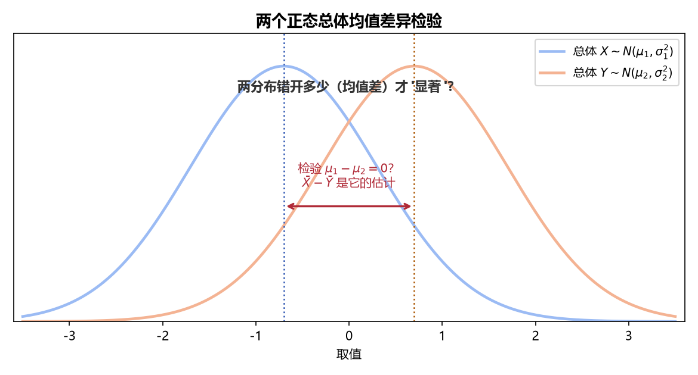

# 《概率论与数理统计》8.3 两个正态总体的均值差异检验（U 检验 / T 检验） - 笔记

> 整理自 B 站《概率论与数理统计》教学视频 2.0 版本（up：宋浩老师官方）p62。
> 前置：p60 一个正态总体均值检验、p50 两总体抽样分布结论。本节把"一个总体"平行搬到"两个总体"。

## 目录

- [一、 前提与假设形式](#一-前提与假设形式)
- [二、 方差已知：U 检验法](#二-方差已知u-检验法)
- [三、 方差未知但相等：T 检验法](#三-方差未知但相等t-检验法)
- [四、 例题](#四-例题)
- [本节重点](#本节重点)

---

## 一、 前提与假设形式

**前提**：$X_1,\dots,X_{n_1}$ iid $\sim N(\mu_1,\sigma_1^2)$，$Y_1,\dots,Y_{n_2}$ iid $\sim N(\mu_2,\sigma_2^2)$，两组样本独立（可放宽为样本间独立）。

**假设三种形式**（$\mu_1-\mu_2$ 视作一个新参数）：

| 类型 | $H_0$ | $H_1$ | 等价形式 |
|---|---|---|---|
| 双边 | $\mu_1=\mu_2$ | $\mu_1\ne\mu_2$ | $\mu_1-\mu_2=0$ vs $\ne0$ |
| 右侧 | $\mu_1\le\mu_2$ | $\mu_1>\mu_2$ | $\mu_1-\mu_2\le0$ vs $>0$ |
| 左侧 | $\mu_1\ge\mu_2$ | $\mu_1<\mu_2$ | $\mu_1-\mu_2\ge0$ vs $<0$ |

## 二、 方差已知：U 检验法

**检验统计量**（$\sigma_1^2,\sigma_2^2$ 已知）：

$$U=\frac{\bar X-\bar Y}{\sqrt{\sigma_1^2/n_1+\sigma_2^2/n_2}}\sim N(0,1)\quad(\text{假定 }H_0\text{ 成立，}\mu_1-\mu_2=0)$$

**推导逻辑**：$\bar X-\bar Y\sim N\left(\mu_1-\mu_2,\ \dfrac{\sigma_1^2}{n_1}+\dfrac{\sigma_2^2}{n_2}\right)$——独立正态相减，期望相减、**方差相加**，标准化即得。

**拒绝域**（同单总体 U 检验）：双边 $\lvert U\rvert>u_{\alpha/2}$；右侧 $U>u_\alpha$；左侧 $U<-u_\alpha$。

## 三、 方差未知但相等：T 检验法

**前提**：$\sigma_1^2=\sigma_2^2=\sigma^2$ 但未知（题目会说"方差相等"）。

**检验统计量**：

$$T=\frac{\bar X-\bar Y}{S_w\sqrt{\dfrac1{n_1}+\dfrac1{n_2}}}\sim t(n_1+n_2-2)$$

**合并方差**：

$$S_w^2=\frac{(n_1-1)S_1^2+(n_2-1)S_2^2}{n_1+n_2-2}$$

**拒绝域**：双边 $\lvert T\rvert>t_{\alpha/2}(n_1+n_2-2)$；右侧 $T>t_\alpha(n_1+n_2-2)$；左侧 $T<-t_\alpha(n_1+n_2-2)$。

> **记忆**：与 p55 置信区间的枢轴量同一个公式（$\sigma$ 未知且相等就合并两个样本方差）。自由度 $n_1+n_2-2$。

> **图7** 两总体均值差异的直观：两个分布错开多少（$\bar X-\bar Y$ 估计 $\mu_1-\mu_2$）才算"显著"（自绘）。

## 四、 例题

**例 1（U 检验·双边）**：A、B 两种烟草尼古丁含量，$n_1=n_2=5$，$\sigma_1^2=5$，$\sigma_2^2=8$，$\alpha=0.05$，含量是否相同？

$$\bar X=24.4,\qquad \bar Y=27$$

$$U=\frac{24.4-27}{\sqrt{5/5+8/5}}=\frac{-2.6}{\sqrt{13/5}}\approx-1.612,\qquad \lvert U\rvert=1.612<u_{0.025}=1.96$$

**接受 $H_0$**：两种烟草尼古丁平均含量无差异。

**解法二（配对差法，仅 $n_1=n_2$ 可用）**：令 $Z=X-Y\sim N(\mu_1-\mu_2,\ 5+8)$，配对作差得样本 $-3,-1,3,-10,-2$，$\bar Z=-13/5$，$U=\dfrac{-13/5}{\sqrt{13/5}}=-1.612$，结论相同。此法是"化两总体为单总体"的技巧（$H_0:\mu_Z=0$）。

**例 2（T 检验·双边）**：A、B 型灯泡寿命，$n_1=n_2=5$，$\bar X=1262.8$，$\bar Y=1268.2$，$S_1^2=965.2$，$S_2^2=1076.2$，方差相等但未知，$\alpha=0.05$，两种灯泡平均寿命有无差异？

$$S_w^2=\frac{4\times965.2+4\times1076.2}{8}=1020.7$$

$$T=\frac{1262.8-1268.2}{\sqrt{1020.7\times(1/5+1/5)}}\approx-0.267,\qquad \lvert T\rvert=0.267<t_{0.025}(8)=2.306$$

**接受 $H_0$**：两种灯泡平均寿命无显著性差异。

> **计算细节**：$t_{0.025}(8)=2.306$（自由度 $n_1+n_2-2=8$）；先算 $S_w^2$ 再代小根号 $\sqrt{1/n_1+1/n_2}$。

---

## 本节重点

> - **选法**：检验 $\mu_1-\mu_2$ 时——方差**已知** → U 检验（$N(0,1)$）；方差**未知但相等** → T 检验（$t(n_1+n_2-2)$，合并方差 $S_w^2$）。
> - **统计量**：$U=\dfrac{\bar X-\bar Y}{\sqrt{\sigma_1^2/n_1+\sigma_2^2/n_2}}$；$T=\dfrac{\bar X-\bar Y}{S_w\sqrt{1/n_1+1/n_2}}$。
> - **拒绝域方向看 $H_1$**（同前两节）；自由度 $n_1+n_2-2$。
> - **常见坑**：① 把 $\sigma_1^2/n_1+\sigma_2^2/n_2$ 写成 $\sigma^2(1/n_1+1/n_2)$（仅在方差相等时成立）；② 合并方差忘除 $n_1+n_2-2$；③ $n_1\ne n_2$ 时误用配对差法。
