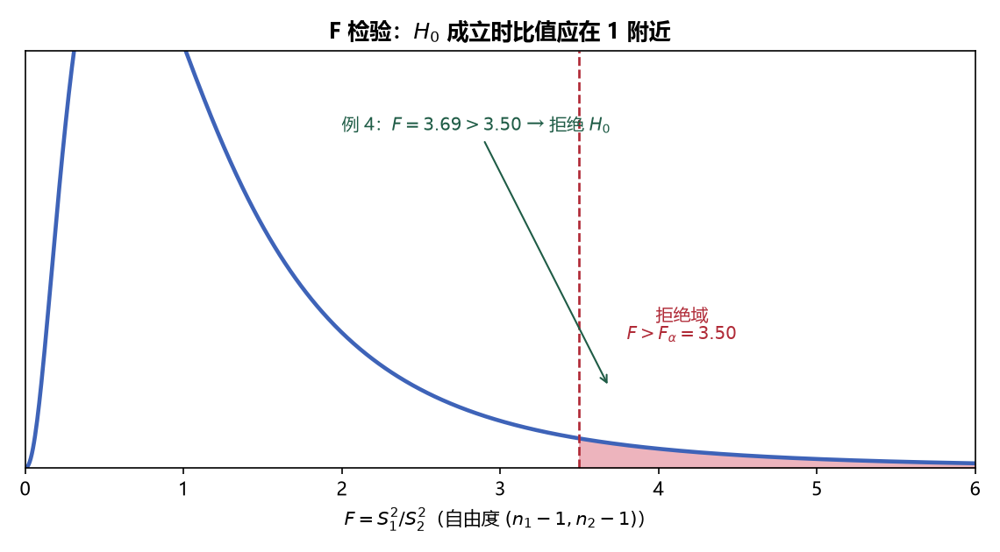

# 《概率论与数理统计》8.3 两个正态总体的方差差异检验（F 检验法） - 笔记

> 整理自 B 站《概率论与数理统计》教学视频 2.0 版本（up：宋浩老师官方）p63。
> 前置：p61 卡方检验法、p62 两总体均值检验。检验 $\sigma_1^2$ 与 $\sigma_2^2$ 的大小关系 → **F 检验法**；本节还带一道"一题两解"综合题与区间估计对照。

## 目录

- [一、 假设的两种形式](#一-假设的两种形式)
- [二、 F 检验法](#二-f-检验法)
- [三、 例题](#三-例题)
- [四、 区间估计 ↔ 假设检验对照](#四-区间估计--假设检验对照)
- [本节重点](#本节重点)

---

## 一、 假设的两种形式

设两组样本独立：$X_1,\dots,X_{n_1}\sim N(\mu_1,\sigma_1^2)$，$Y_1,\dots,Y_{n_2}\sim N(\mu_2,\sigma_2^2)$，$\mu_1,\mu_2$ 均未知。

| 类型 | $H_0$ | $H_1$ | 拒绝域方向 |
|---|---|---|---|
| 双边 | $\sigma_1^2=\sigma_2^2$ | $\sigma_1^2\ne\sigma_2^2$ | 两侧 |
| 右侧 | $\sigma_1^2\le\sigma_2^2$ | $\sigma_1^2>\sigma_2^2$ | 右侧 |

左侧情形 $\sigma_1^2\ge\sigma_2^2$ vs $\sigma_1^2<\sigma_2^2$ 可由"把总体 1、2 对调"化为右侧——所以**只记右侧即可**（拒绝域方向永远跟着 $H_1$ 的严格不等号）。

## 二、 F 检验法

**检验统计量**（一般形式，含未知参数不能直接用）：

$$F=\frac{S_1^2/\sigma_1^2}{S_2^2/\sigma_2^2}\sim F(n_1-1,\ n_2-1)$$

**假定 $H_0$ 成立**（$\sigma_1^2=\sigma_2^2$，约分）→ 检验统计量：

$$F=\frac{S_1^2}{S_2^2}\sim F(n_1-1,\ n_2-1)$$

**直觉**：$S_1^2,S_2^2$ 分别是两个总体方差的无偏估计；若 $\sigma_1^2=\sigma_2^2$，比值应在 1 附近——**太大或太小都怀疑**。

**拒绝域**：

| 检验 | 拒绝域 |
|---|---|
| 双边 | $F>F_{\alpha/2}(n_1-1,n_2-1)$ **或** $F<F_{1-\alpha/2}(n_1-1,n_2-1)$ |
| 右侧 | $F>F_\alpha(n_1-1,n_2-1)$ |

**左侧临界值用倒数性质**（F 分布表只给大概率的小分位）：

$$F_{1-\alpha/2}(n_1-1,\,n_2-1)=\frac{1}{F_{\alpha/2}(n_2-1,\,n_1-1)}$$

> **易错点**：倒数性质要**交换自由度**再取倒数；单边检验查 $F_\alpha$（不是 $F_{\alpha/2}$）。

> **图8** F 检验的拒绝域：$H_0$ 成立时 $S_1^2/S_2^2$ 应在 1 附近，太大（或双边时太小）就拒绝（自绘）。

## 三、 例题

**例 3（双边）**：两处煤矿含灰率，$n_1=5,\ n_2=4$，$S_1^2=7.505$，$S_2^2=2.593$，$\alpha=0.05$，方差是否有显著差异？

$$H_0:\sigma_1^2=\sigma_2^2\ \text{vs}\ H_1:\sigma_1^2\ne\sigma_2^2,\qquad F=\frac{7.505}{2.593}\approx2.894$$

临界值：$F_{0.025}(4,3)=15.10$，$F_{0.975}(4,3)=\dfrac{1}{F_{0.025}(3,4)}=\dfrac{1}{9.98}\approx0.10$：

$$0.10<2.894<15.10$$

**接受 $H_0$**：两处煤矿含灰率的方差无显著差异。

**例 4（右侧）**：甲、乙车床滚珠直径，$n_1=8,\ n_2=9$，$S_1^2=0.096$，$S_2^2=0.026$，$\alpha=0.05$，甲车床方差是否**不超过**乙车床？

$$H_0:\sigma_1^2\le\sigma_2^2\ \text{vs}\ H_1:\sigma_1^2>\sigma_2^2,\qquad F=\frac{0.096}{0.026}\approx3.69>F_{0.05}(7,8)=3.50$$

**拒绝 $H_0$**：认为甲车床滚珠直径方差**超过**乙车床（回答原问题：不是"不超过"）。

**例 5（一题两解综合题，期末重点）**：平炉炼钢得率，原方法/新方法各 $n_1=n_2=10$ 炉，$\bar X=76.23$，$\bar Y=79.43$，$S_1^2=3.325$，$S_2^2=2.225$，$\alpha=0.01$，问两种方法平均得率是否相同？

**第 1 步：先验方差相等（F 检验，为第 2 步铺路）**

$$H_0:\sigma_1^2=\sigma_2^2\ \text{vs}\ H_1:\sigma_1^2\ne\sigma_2^2,\qquad F=\frac{3.325}{2.225}\approx1.49$$

$$F_{0.005}(9,9)=6.54,\qquad F_{0.995}(9,9)=1/6.54\approx0.153$$

$0.153<1.49<6.54$ → **接受 $H_0$**：方差相等。

**第 2 步：再验均值（T 检验）**

$$H_0:\mu_1=\mu_2\ \text{vs}\ H_1:\mu_1\ne\mu_2$$

$$S_w^2=\frac{9\times3.325+9\times2.225}{18}=2.775,\qquad T=\frac{76.23-79.43}{\sqrt{2.775\times(1/10+1/10)}}\approx-4.296$$

$$\lvert T\rvert=4.296>t_{0.005}(18)=2.8784$$

**拒绝 $H_0$**：两种方法钢的平均得率**不相同**（新方法得率显著更高）。

> **易错点**：题干只给"两样本独立、正态总体"，没给方差信息——T 检验要求"方差未知但相等"，所以**必须先做 F 检验证明方差相等**，再做均值检验；若第一步 F 检验拒绝，则不能直接套 T 检验。

## 四、 区间估计 ↔ 假设检验对照

| | 区间估计 | 假设检验 |
|---|---|---|
| 同一个公式 | 枢轴量（含未知参数） | 检验统计量（$H_0$ 成立代入参数值） |
| 关注 | 大概率（置信区间内部） | 小概率（拒绝域） |
| 关系 | 置信区间就是 $H_0$ 的接受域 | 落在区间外 ⇒ 拒绝 $H_0$ |

> **例**：方差已知检验 $\mu=\mu_0$ 的 $U=\dfrac{\bar X-\mu_0}{\sigma/\sqrt n}$ 与 $\mu$ 的置信区间枢轴量 $\dfrac{\bar X-\mu}{\sigma/\sqrt n}$ 只差"$\mu_0$ 已知/$\mu$ 未知"——**一个公式两用**。区间估计学得好，假设检验的公式自然背得下来。

---

## 本节重点

> - **检验 $\sigma_1^2$ 与 $\sigma_2^2$ → F 检验**：$F=\dfrac{S_1^2}{S_2^2}\sim F(n_1-1,n_2-1)$（$H_0$ 成立时）。
> - **拒绝域**：双边 $F>F_{\alpha/2}$ 或 $<F_{1-\alpha/2}$；右侧 $F>F_\alpha$；**左侧临界值 $F_{1-\alpha/2}(m,n)=1/F_{\alpha/2}(n,m)$（交换自由度）**。
> - **一题两解流程**：均值检验需要方差相等未知 → 先 F 检验方差、再 T 检验均值（例 5）。
> - **常见坑**：① F 分布表方向（第一自由度 $n_1-1$、第二 $n_2-1$ 别反）；② 单边查 $F_\alpha$ 而非 $F_{\alpha/2}$；③ 单边方向写反（"不超过" vs "小于"）结论相反。
