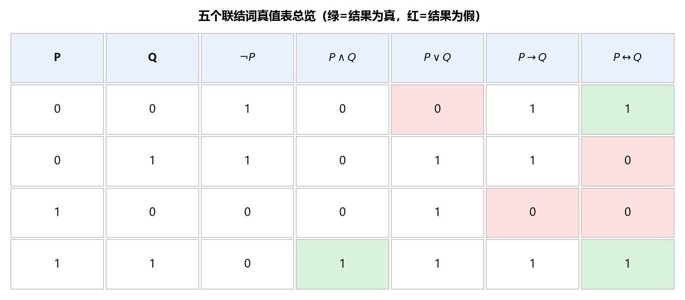
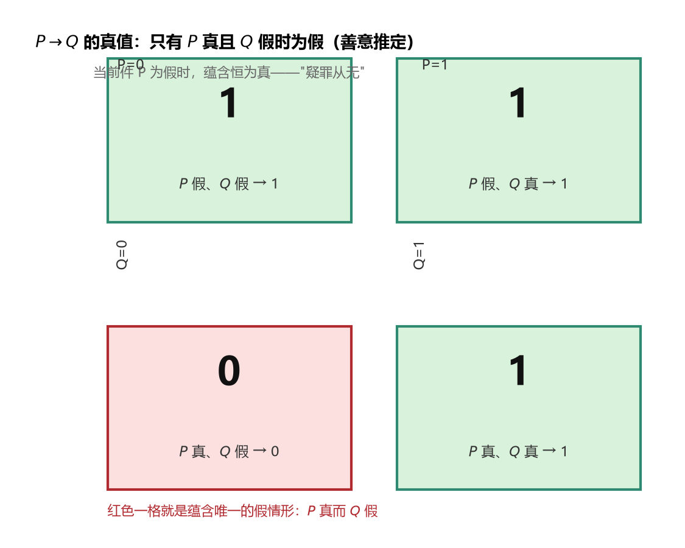
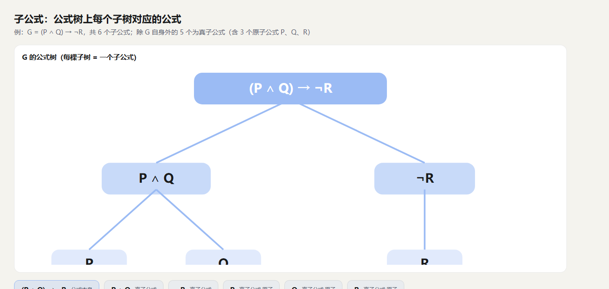
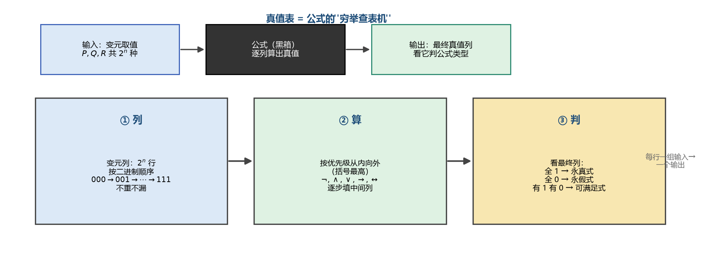
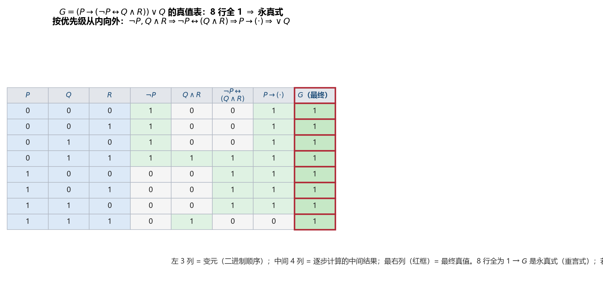
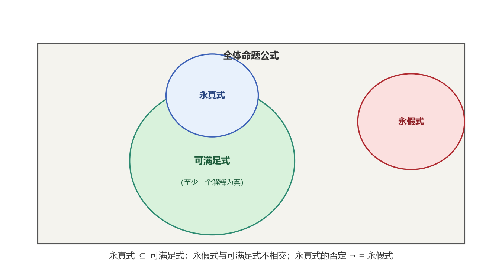
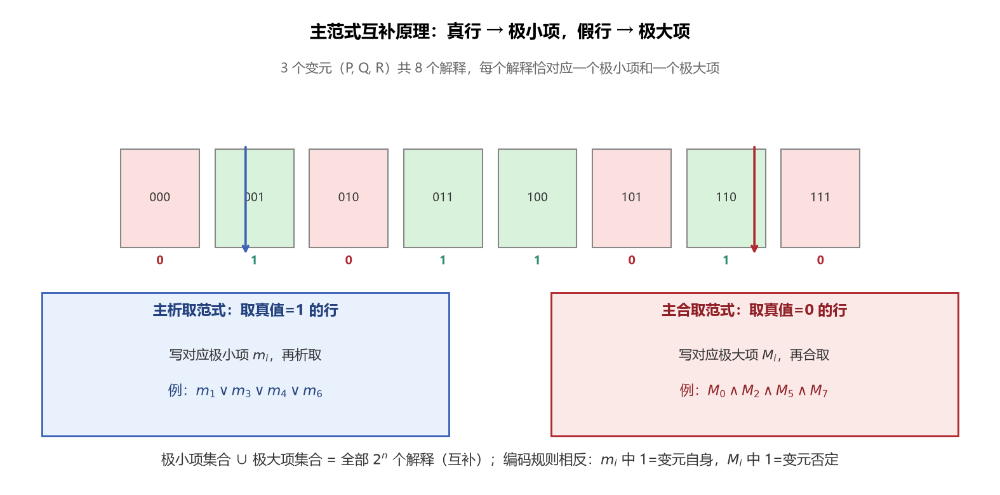

# 第2章 命题逻辑 - 学习笔记

> 整理自 B站《【电子科技大学】《离散数学》全63讲》（BV16Btc6VEpE）P6-P15，参考武汉大学《命题逻辑》课件（2026.9）
> 字幕来源：AI字幕，已核对数学逻辑

## 目录

- [1. 命题符号化](#1-命题符号化)
  - [1.1 命题的定义](#11-命题的定义)
  - [1.2 命题符号化](#12-命题符号化)
  - [1.3 逻辑联结词](#13-逻辑联结词)
  - [1.4 合式公式的形式文法](#14-合式公式的形式文法)
  - [1.5 公式简化规则](#15-公式简化规则)
  - [1.6 合式公式的形式语义](#16-合式公式的形式语义)
- [2. 永真公式](#2-永真公式)
  - [2.1 公式的分类](#21-公式的分类)
  - [2.2 逻辑等价](#22-逻辑等价)
  - [2.3 基本等价公式](#23-基本等价公式)
  - [2.4 代入规则与替换规则](#24-代入规则与替换规则)
  - [2.5 永真蕴含](#25-永真蕴含)
  - [2.6 对偶性](#26-对偶性)
- [3. 范式](#3-范式)
  - [3.1 范式的动机](#31-范式的动机)
  - [3.2 基本定义与判断示例](#32-基本定义与判断示例)
  - [3.3 求范式](#33-求范式)
  - [3.4 主范式](#34-主范式)
  - [3.5 主范式的应用](#35-主范式的应用)
- [4. 联结词的扩充和归约](#4-联结词的扩充和归约)
  - [4.1 联结词的扩充](#41-联结词的扩充)
  - [4.2 联结词的归约](#42-联结词的归约)
- [5. 推理和证明方法](#5-推理和证明方法)
  - [5.1 有效结论](#51-有效结论)
  - [5.2 自然推理的形式证明](#52-自然推理的形式证明)
  - [5.3 证明方法](#53-证明方法)
- [6. 本节重点](#6-本节重点)

---

## 1. 命题符号化

### 1.1 命题的定义

**命题**：具有确切真值的陈述句（Declarative Sentence）。

- **真值**：命题的取值，可能为真（T/1）也可能为假（F/0）
- 真值不是"一定为真的值"，而是"命题真正具有的值"

**是命题的条件**：
1. 必须是陈述句（命令句、祈使句、感叹句、疑问句都不是命题）
2. 真值必须是确定的（无二义性）

**非命题的例子**：
- "把门关上"（命令句/祈使句）
- "你要出去吗？"（疑问句）
- "这个语句是假的"（悖论，说谎者悖论——若真则假，若假则真，无法确定真值）
- "x + y ≤ 4"（含未限定变量，无法确定真假）

**悖论示例**："我正在说谎"——如果这句话是真的，那"我正在说谎"就是真的，说明这句话是假的，矛盾；如果这句话是假的，那"我正在说谎"就是假的，说明我没说谎，这句话是真的，矛盾。这就是典型的说谎者悖论。

> **注意区分**：一个句子**有真假**和我们**知道它的真假**是两回事。只要知道它有真假就是命题，不需要确切知道是真是假。
> - "我喜欢踢足球"（依赖具体情况，但有真假）→ 命题
> - "地球外的星球也有人"（不知道真假，但有真假）→ 命题
> - "1+1=10"（依赖进制，但有真假）→ 命题

**原子命题与复合命题**：
- **原子命题（简单命题）**：不能再分解的命题
- **复合命题**：由原子命题通过联结词组合而成的命题

### 1.2 命题符号化

**命题符号化**：将自然语言中的命题用符号表示，只关心命题的真值，不关心其具体含义。

- **命题常元**：有具体内容的命题，真值确定。用 $\mathbb{T}$（真命题）、$\mathbb{F}$（假命题）表示
- **命题变元**：没有具体内容的变量 $P$，真值可以是 0 或 1，用大写字母表示：$P, Q, R, P_1, Q_2$ 等
- **原子（atom）**：将不能再分的最小命题单位称为原子

原子通过**联结词**（connectives），按照一定的规则组成复合命题。

> 数理逻辑是用符号化的方法研究逻辑，也称符号逻辑，是数理逻辑的基础。

**符号化方法：剥洋葱法**

从句子最外层结构开始，一层一层向内分析。


> **图1** 符号化"剥洋葱法"示意（自绘）：从最外层联结词开始，逐层向内分解，直到原子命题。每一层确定一个联结词和它的左右操作数。

**例**：设 P=你陪伴我，Q=你带我叫车子，R=我将出去。

"如果你陪伴我并且带我叫辆车子，则我将出去"
- 最外层：如果...则... → 蕴含
- 前件：你陪伴我并且带我叫车子 → $P \land Q$
- 后件：我将出去 → $R$
- 结果：$(P \land Q) \rightarrow R$（合取优先级高于蕴含，括号可省：$P \land Q \rightarrow R$）

"除非你陪伴我或带我叫车子，否则我将不出去"
- "除非Q否则非P" 对应 $P \rightarrow Q$
- 结果：$R \rightarrow (P \lor Q)$，等价于 $\neg P \land \neg Q \rightarrow \neg R$

**例（课件）**："你可以上网，仅当你是计算机专业的学生或者你不是一年级的学生"
- A: 你可以上网
- C: 你是计算机专业的学生
- F: 你是一年级的学生
- 你不是一年级的学生：$\neg F$
- 你是计算机专业的学生或者你不是一年级的学生：$C \lor \neg F$
- 原命题：$A \rightarrow (C \lor \neg F)$

### 1.3 逻辑联结词



> **图2** 五个联结词的真值表总览（自绘）：绿色=结果为真，红色=结果为假。记忆口诀：合取同真才真、析取同假才假、蕴含只有"真→假"为假、等价同真同假才真。

常用的逻辑联结词：

| 名称 | 英文 | 符号 | 解释 |
|------|------|------|------|
| 否定词 | negation | $\neg P$ | 非P，否定P |
| 析取词 | disjunction | $P \lor Q$ | P或者Q（兼或） |
| 合取词 | conjunction | $P \land Q$ | P并且Q |
| 蕴含词 | implication | $P \rightarrow Q$ | 如果P，则Q；P是Q的充分条件，Q是P的必要条件 |
| 等值词 | bicondition | $P \leftrightarrow Q$ | P当且仅当Q；P是Q的充分必要条件 |

复合命题的真值由其中的原子和联结词的含义决定。

#### 1.3.1 否定联结词 $\neg$

$\neg P$（读作"非P"）：P的否定。

| $P$ | $\neg P$ |
|-----|----------|
| 0 | 1 |
| 1 | 0 |

对应自然语言：非、不、没有。

#### 1.3.2 合取联结词 $\land$

$P \land Q$（读作"P合取Q"）：P并且Q。

| $P$ | $Q$ | $P \land Q$ |
|-----|-----|-------------|
| 0 | 0 | 0 |
| 0 | 1 | 0 |
| 1 | 0 | 0 |
| 1 | 1 | 1 |

**为真当且仅当P和Q同时为真。**

对应自然语言：并且、既...又、和、与、不仅...而且、一面...一面。

> **注意**："但""虽然...但是"在逻辑上也是合取！转折存在于命题内容中，逻辑上只关心两个事实是否同时成立。
> 例："虽然天气很冷，但是室内很暖和" = 天气很冷 $\land$ 室内很暖和。

> **不是所有"和""与"都用合取**："2和3的最小公倍数是6"不能拆分，是简单命题。

#### 1.3.3 析取联结词 $\lor$

$P \lor Q$（读作"P析取Q"）：P或者Q。

| $P$ | $Q$ | $P \lor Q$ |
|-----|-----|-------------|
| 0 | 0 | 0 |
| 0 | 1 | 1 |
| 1 | 0 | 1 |
| 1 | 1 | 1 |

**为假当且仅当P和Q同时为假。**

对应自然语言：或、或者。

**可兼或（同或）vs 不可兼或（异或）**：
- 析取联结词表示的是**可兼或**（允许P和Q同时为真）
- "张宏生于1982年或1983年"是不可兼或（不能同时成立），本课程暂用析取代替，不严格区分

#### 1.3.4 蕴含联结词 $\rightarrow$

$P \rightarrow Q$（读作"P蕴含Q"）：如果P则Q。

- $P$ 称为**前件**，$Q$ 称为**后件**

| $P$ | $Q$ | $P \rightarrow Q$ |
|-----|-----|-------------------|
| 0 | 0 | 1 |
| 0 | 1 | 1 |
| 1 | 0 | 0 |
| 1 | 1 | 1 |

**为假当且仅当P为真且Q为假。**

**善意推定**：当前件P为假时，无论Q真假，$P \rightarrow Q$ 都为真。
- 理解：类似"疑罪从无"——没有充分证据证明为假，就推定为真
- 例："如果角A和角B是对顶角，则角A等于角B"是定理（真命题）。当角A和角B不是对顶角时，定理依然成立。



> **图3** 蕴含 $P \rightarrow Q$ 的"善意推定"四象限（自绘）：四种解释中只有 $P$ 真且 $Q$ 假时蕴含为假，其余三种都为真。

**形式蕴含**：由于简单命题在符号化为原子时，剥离了原子之间可能存在的语义关系，蕴含式的真假仅与条件和结论的真假有关，而与条件和结论是否有语意关联无关。

**例**：
- "如果今天再给一次重来机会，我一定要..." → 若前件为真、后件为假，则该蕴含式不成立，即为假；若前件为假，后件为真或假，都为真
- "If today is Friday, then 2 + 3 = 5."（True）
- "If today is Friday, then 2 + 3 = 6."（True, except for Friday）

**充分条件与必要条件**：
- $P \rightarrow Q$ 表示：P是Q的充分条件，Q是P的必要条件

**蕴含的多种自然语言表达**（都表示 $P \rightarrow Q$）：

| 表达 | 前件 | 后件 |
|------|------|------|
| 如果P则Q | P | Q |
| 因为P所以Q | P | Q |
| 只要P就Q | P | Q |
| P仅当Q | P | Q |
| 只有Q才P | P | Q（Q在前面出现！） |
| 除非Q才P | P | Q（Q在前面出现！） |
| 除非Q，否则非P | P | Q（P以否定形式出现） |

> **易错点**："只有Q才P"和"除非Q才P"中，Q出现在句子前面，但它是蕴含的后件！

#### 1.3.5 等值联结词 $\leftrightarrow$

$P \leftrightarrow Q$（读作"P等值于Q"）：P当且仅当Q。也叫双条件联结词。

| $P$ | $Q$ | $P \leftrightarrow Q$ |
|-----|-----|----------------------|
| 0 | 0 | 1 |
| 0 | 1 | 0 |
| 1 | 0 | 0 |
| 1 | 1 | 1 |

**为真当且仅当P和Q同真或同假。**

对应自然语言：当且仅当、充分必要条件、等价。

#### 1.3.6 联结词的对称性

| 联结词 | 对称性 |
|--------|--------|
| 合取 $\land$ | 有（$P \land Q = Q \land P$） |
| 析取 $\lor$ | 有（$P \lor Q = Q \lor P$） |
| 等值 $\leftrightarrow$ | 有（$P \leftrightarrow Q = Q \leftrightarrow P$） |
| 否定 $\neg$ | 一元，不考虑 |
| 蕴含 $\rightarrow$ | **无**（$P \rightarrow Q \neq Q \rightarrow P$） |

> 复合命题的真值只取决于各简单命题的真值，与内容无关。"雪是白的当且仅当北京是中国的首都"在数理逻辑中是合法的真命题。

### 1.4 合式公式的形式文法

命题符号化的结果是**合式公式**（Well-Formed Formulas, WFFs），是命题"语言"中的"句子"。

**字母表**：
- 常元：$\mathbb{T}, \mathbb{F}$
- 变元：$P, Q, R, \dots$
- 联结词：$\neg, \land, \lor, \rightarrow, \leftrightarrow$
- 辅助符号：$(, )$

**定义（合式公式 WFFs）**：

1. **递归基础**：常元和变元是 WFFs；
2. **递归规则**：若 $A, B$ 是 WFFs，则 $(\neg A), (A \lor B), (A \land B), (A \rightarrow B), (A \leftrightarrow B)$ 是 WFFs；
3. **极小性条款**：由以上规则在有限步生成的都是 WFFs。

**例**：$(A \rightarrow (C \lor (\neg F)))$ 是公式。

证明：
1. $A, C, F$ 是公式，根据规则①；
2. $(\neg F)$ 是公式，根据①和规则②；
3. $(C \lor (\neg F))$ 是公式，根据①和规则②；
4. $(A \rightarrow (C \lor (\neg F)))$ 是公式，根据①③和规则②。$\square$

**反例**：
- $\rightarrow (C \lor \neg F)$ 不是公式，因为没有生成 $(\rightarrow A)$ 的规则；
- $(A \Rightarrow (C \lor \neg F))$ 不是公式，因为 $\Rightarrow$ 不是联结词。

**子公式（补充定义）**：

设 G 是命题公式。G 的**子公式**递归定义为：

1. G 本身是 G 的子公式；
2. 若 G 是 $\neg H$，则 H 以及 H 的所有子公式都是 G 的子公式；
3. 若 G 是 $H \circ S$（$\circ \in \{\land, \lor, \rightarrow, \leftrightarrow\}$），则 H、S 以及它们的所有子公式都是 G 的子公式；
4. 仅由上述规则得到的才是 G 的子公式。

**真子公式**：除 G 本身以外的子公式。

**例**：$G = (P \land Q) \rightarrow \neg R$ 的全部子公式为 $(P \land Q) \rightarrow \neg R$、$P \land Q$、$\neg R$、$P$、$Q$、$R$——后 5 个是真子公式，其中 P、Q、R 是原子公式。



> **图4** 子公式的公式树表示（自绘）：每个子树对应一个子公式；例中含根共 6 个子公式，除根外都是真子公式。注意子公式必须是合式公式，不是任意一段连续字符（如 "P ∧ Q)" 不是子公式）。

### 1.5 公式简化规则

**约定**：
- 最外层的括号可以省略；
- 运算的优先级由高到低：括号, $\neg, \land, \lor, \rightarrow, \leftrightarrow$；
- 同一个二元运算符从左到右进行结合。

**例**：
- $(A \rightarrow (C \lor (\neg F)))$ 可以简化为：$A \rightarrow C \lor \neg F$
- $((P \lor Q) \lor R)$ 可以简化为：$P \lor Q \lor R$

**注意**：
- $P \lor Q \land R = P \lor (Q \land R) \neq (P \lor Q) \land R$（$\land$ 优先级高于 $\lor$，不能随意加括号）
- $P \rightarrow Q \rightarrow R = (P \rightarrow Q) \rightarrow R \neq P \rightarrow (Q \rightarrow R)$（蕴含从左到右结合，不满足结合律）

### 1.6 合式公式的形式语义

#### 1.6.1 指派（assignment）

设 $G(P_1, P_2, \dots, P_n)$ 是含 $n$ 个原子 $P_1, P_2, \dots, P_n$ 的公式。

**定义（指派）**：对 $P_1, P_2, \dots, P_n$ 的一次取值 $(x_1, x_2, \dots, x_n), x_i \in \{0, 1\}$，称为公式 $G(P_1, P_2, \dots, P_n)$ 的一个**指派**（assignment），记为 $I = x_1x_2\dots x_n$。

**性质**：
- 公式 $G(P_1, P_2, \dots, P_n)$ 一共有 $2^n$ 种不同的指派。
- 注意：指派的下标与对应指派间的关系。

**例**：$G(P, Q) = \neg((P \lor Q) \land P)$ 的 4 个指派是：
$I_0 = 00,\ I_1 = 01,\ I_2 = 10,\ I_3 = 11$。

- **成真赋值**：使公式真值为真的指派
- **成假赋值**：使公式真值为假的指派

#### 1.6.2 公式在解释下的真值

**定义（G在解释I下的真值 $I(G)$）**：

设 $I = x_1x_2\dots x_n$ 为公式 $G(P_1, P_2, \dots, P_n)$ 的一个指派，则公式 $G$ 在指派 $I$ 下的值记为 $I(G)$，其递归定义如下：

- $I(\mathbb{T}) = 1,\ I(\mathbb{F}) = 0$；
- $I(G) = x_i$，如果 $G \equiv P_i$；

其他情况按联结词递归定义：

$$I(G) = \begin{cases} \neg I(A), & \text{if } G = \neg A \\ I(A) \land I(B), & \text{if } G = A \land B \\ I(A) \lor I(B), & \text{if } G = A \lor B \\ I(A) \rightarrow I(B), & \text{if } G = A \rightarrow B \\ I(A) \leftrightarrow I(B), & \text{if } G = A \leftrightarrow B \end{cases}$$

#### 1.6.3 真值表

**定义**：公式 $G(P_1, P_2, \dots, P_n)$ 在 $2^n$ 个指派下的值所构成的表称为公式 $G$ 的**真值表**。

**一句话形象理解**：真值表就是把公式当成一台"**穷举查表机**"——变元是输入，公式是机器，真值是输出。$n$ 个变元有 $2^n$ 种输入组合，全部试一遍：逐列算出中间结果，最后一列得到输出。**变元列按二进制顺序列（$00\cdots0$ 到 $11\cdots1$），不重不漏。**

**构造方法（三步法）**：
1. **列**：左边列出所有命题变元的 $2^n$ 种取值组合（按二进制顺序）
2. **算**：按运算优先级逐步计算中间结果（优先级 $\neg > \land > \lor > \rightarrow > \leftrightarrow$，括号最高）
3. **判**：最后一列是公式的最终真值——看它就能判定公式类型（全 1 永真 / 全 0 永假 / 有 1 有 0 可满足）



> **图5** 真值表构造三步法（自绘）：列（穷举变元组合）→ 算（按优先级逐列填中间结果）→ 判（看最终列定公式类型）。每一行 = 这台"查表机"的一次运行。

**例**：公式 $G = \neg((P \lor Q) \land P)$ 的真值表：

| 指派 | $P$ | $Q$ | $P \lor Q$ | $(P \lor Q) \land P$ | $G$ |
|------|:---:|:---:|:---:|:---:|:---:|
| $I_0=00$ | 0 | 0 | 0 | 0 | 1 |
| $I_1=01$ | 0 | 1 | 1 | 0 | 1 |
| $I_2=10$ | 1 | 0 | 1 | 1 | 0 |
| $I_3=11$ | 1 | 1 | 1 | 1 | 0 |

**判定口诀**（看最终列）：
- 全 1 → **永真式**（重言式）
- 全 0 → **永假式**（矛盾式）
- 有 1 有 0 → **可满足式**（非永假）

> **⚠️ 常见坑**：
> - **漏行**：$n$ 个变元必须有 $2^n$ 行（3 变元 8 行，不是 6 行）；变元列按二进制顺序写就不容易漏
> - **跳步**：中间列必须按优先级从内向外算，直接"心算"最终列极易错——多写一列中间结果，就多一分正确
> - **蕴含不对称**：$P \rightarrow Q$ 与 $Q \rightarrow P$ 不同；$\leftrightarrow$ 才对称
> - **变元列顺序不影响结论**：行顺序可能因教材而异，但最终列的判定结果不变

**更复杂的示例**：3 个变元的公式有 8 行，中间列更多，构造方法完全相同——按优先级从内向外逐列计算。



> **图6** 3 变元真值表构造全景（自绘）：8 行解释，按优先级逐步计算中间列，最终列判定公式类型。变元越多，中间列越多，但"列→算→判"三步法不变。

#### 1.6.4 布尔函数视角

- 公式 $G(P_1, P_2, \dots, P_n)$ 的语义解释实际上是一个函数：$\underbrace{\{0,1\} \times \{0,1\} \times \dots \times \{0,1\}}_{n\text{次}} \rightarrow \{0,1\}$，即 $(x_1, x_2, \dots, x_n) \mapsto G(x_1, x_2, \dots, x_n)$。
- 这样的函数称为**布尔函数**（Boolean Function）。
- 真值表的指派排列次序最好按二进制数从小到大的次序。
- **形式系统的构成**："形式结构 + 语义"。
- 逻辑问题转化为"计算问题"。

---

## 2. 永真公式

### 2.1 公式的分类

| 类型 | 定义 | 别名 |
|------|------|------|
| 永真公式 | 所有解释下真值都为真 | 重言式（Tautology） |
| 永假公式 | 所有解释下真值都为假 | 矛盾式、不可满足式 |
| 可满足公式 | 不是永假公式（至少有一个解释使其为真） | — |

**关系**：
- 永真公式的否定是永假公式，反之亦然
- 永真式一定是可满足式，可满足式不一定是永真式
- 永假式一定不是可满足式



> **图7** 公式分类的包含关系（自绘）：永真式 $\subseteq$ 可满足式；永假式与可满足式不相交。

**可判定性**：命题逻辑的判定问题（公式类型、公式等价）是**可判定的**——因为变元有限，解释数有限（$2^n$），真值表方法总能在有限步内完成。

### 2.2 逻辑等价

**定义**：设G、H是两个命题公式，若在所有 $2^n$ 个解释下G和H的真值都相同，则称G与H**逻辑等价**，记为 $G = H$（或 $G \Leftrightarrow H$）。

**判定定理**：$G = H$ 当且仅当 $G \leftrightarrow H$ 是永真公式。

> **重要区分**：
> - $=$（或 $\Leftrightarrow$）是两个公式之间的**关系**，不是运算符
> - $\leftrightarrow$ 是**运算符**，可以参与运算
> 类似集合中 $A = B$（关系）vs $A \cap B$（运算）

### 2.3 基本等价公式

设G、H、S为任意命题公式，0表示永假式，1表示永真式。

| 编号 | 名称 | 公式 |
|------|------|------|
| 1 | 幂等律 | $G \lor G = G$，$G \land G = G$ |
| 2 | 交换律 | $G \lor H = H \lor G$，$G \land H = H \land G$ |
| 3 | 结合律 | $(G \lor H) \lor S = G \lor (H \lor S)$，$(G \land H) \land S = G \land (H \land S)$ |
| 4 | 同一律 | $G \lor 0 = G$，$G \land 1 = G$ |
| 5 | 零律 | $G \lor 1 = 1$，$G \land 0 = 0$ |
| 6 | 分配律 | $G \lor (H \land S) = (G \lor H) \land (G \lor S)$，$G \land (H \lor S) = (G \land H) \lor (G \land S)$ |
| 7 | 吸收律 | $G \lor (G \land H) = G$，$G \land (G \lor H) = G$ |
| 8 | 矛盾律 | $G \land \neg G = 0$ |
| 9 | 排中律 | $G \lor \neg G = 1$ |
| 10 | 双重否定律 | $\neg \neg G = G$ |
| 11 | 德摩根律 | $\neg(G \lor H) = \neg G \land \neg H$，$\neg(G \land H) = \neg G \lor \neg H$ |
| 12 | 蕴含式 | $G \rightarrow H = \neg G \lor H$ |
| 13 | 假言易位 | $G \rightarrow H = \neg H \rightarrow \neg G$（逆否命题） |
| 14 | 等价式 | $G \leftrightarrow H = (G \rightarrow H) \land (H \rightarrow G)$ |
| 15 | 等价否定等式 | $G \leftrightarrow H = \neg G \leftrightarrow \neg H$ |
| 16 | 归谬论 | $(G \rightarrow H) \land (G \rightarrow \neg H) = \neg G$（反证法原理） |

> **记忆技巧**：前11组与集合运算定律完全对应——析取$\lor$对应并$\cup$，合取$\land$对应交$\cap$，0对应空集$\varnothing$，1对应全集$U$。

**公式推导的基本思路**：
1. **消去**蕴含和等价联结词（用蕴含式、等价式）
2. **移入**否定符号（用德摩根律、双重否定律）
3. **整理**（用分配律、交换律、结合律）
4. **化简**（用吸收律、幂等律、矛盾律、排中律、同一律、零律）

**应用**：
- **判定公式类型**：通过等价变换化简，看最终等于1（永真）、0（永假）还是其他（可满足）
- **证明公式等价**：从一个公式出发，通过等价变换得到另一个
- **电路化简**：开关电路和逻辑电路的设计简化
- **推理问题**：如侦探证人问题，列出前提的复合命题，找使所有前提为真的解释

### 2.4 代入规则与替换规则

做公式推导前，必须分清两个容易混淆的规则：

| 维度 | **代入规则**（Substitution） | **替换规则**（Replacement，等价置换） |
|------|------|------|
| 适用对象 | **仅永真公式**（重言式） | **任意公式** |
| 替换什么 | 某个**命题变元** $P$ | 某个**子公式** $A$ |
| 替换成什么 | **任意公式** $A$ | 与 $A$ **等价**的公式 $B$（$A=B$） |
| 是否必须处处替换 | **是**，$P$ 出现的每一处都要换 | **否**，可以只替换某一处出现 |
| 保持什么 | 保持**永真性** | 保持**等价性** |
| 典型用途 | 从已知永真式生成新永真式 | 公式等价变换、化简、求范式 |

**代入规则示例**：

$P \lor \neg P$ 是永真式。将变元 $P$ **处处替换**为 $(Q \land R)$：

$$(Q \land R) \lor \neg(Q \land R) \quad \text{仍然是永真式}$$

> 如果只把第一个 $P$ 换成 $(Q \land R)$，第二个 $P$ 不换，得到 $(Q \land R) \lor \neg P$，这就**不是**永真式了——代入必须处处替换。

**替换规则示例**：

公式 $(P \lor Q) \land R$ 中，子公式 $P \lor Q$ 与 $Q \lor P$ 等价（交换律）。可以**只替换这一处**：

$$(P \lor Q) \land R \quad \Rightarrow \quad (Q \lor P) \land R$$

两式等价。不需要把公式中所有"$P \lor Q$ 形式"的地方都换掉。

> **一句话区分**：代入是"把永真式里的某个变元全部换成别的公式"，替换是"把任意公式里的某个子公式换成和它等价的另一个，可以只换一处"。

### 2.5 永真蕴含

**定义**：设 $G, H$ 是两个命题公式，若 $G \rightarrow H$ 是永真公式，则称 $G$ **永真蕴含** $H$，记为 $G \Rightarrow H$（读作"G推出H"）。

**判定定理**：$G \Rightarrow H$ 当且仅当对任意解释 $I$，若 $I$ 使 $G$ 为真，则 $I$ 也使 $H$ 为真。

> **重要区分**：
> - $\Rightarrow$ 是公式间的**关系**（推理有效性），不是运算符
> - $\rightarrow$ 是**运算符**，可以参与运算
> - $G \Rightarrow H$ 等价于 $G \rightarrow H$ 是永真式

**基本推理定律（永真蕴含式）**：

| 编号 | 名称 | 公式 |
|------|------|------|
| $I_1$ | 简化规则 | $G \land H \Rightarrow G$，$G \land H \Rightarrow H$ |
| $I_2$ | 添加规则 | $G \Rightarrow G \lor H$，$H \Rightarrow G \lor H$ |
| $I_3$ | 合取引入 | $G, H \Rightarrow G \land H$ |
| $I_4$ | 选言三段论 | $G \lor H, \neg G \Rightarrow H$，$G \lor H, \neg H \Rightarrow G$ |
| $I_5$ | 假言推理（分离规则） | $G \rightarrow H, G \Rightarrow H$ |
| $I_6$ | 否定后件式（拒取式） | $G \rightarrow H, \neg H \Rightarrow \neg G$ |
| $I_7$ | 假言三段论（传递规则） | $G \rightarrow H, H \rightarrow S \Rightarrow G \rightarrow S$ |
| $I_8$ | 二难推论 | $G \lor H, G \rightarrow S, H \rightarrow S \Rightarrow S$ |

**永真蕴含的性质**：
1. 永真蕴含具有传递性：若 $G \Rightarrow H$ 且 $H \Rightarrow S$，则 $G \Rightarrow S$
2. 若 $G \Rightarrow H$ 且 $G \Rightarrow S$，则 $G \Rightarrow H \land S$
3. 若 $G \Rightarrow H$ 且 $S \Rightarrow H$，则 $G \lor S \Rightarrow H$
4. $G = H$ 当且仅当 $G \Rightarrow H$ 且 $H \Rightarrow G$（等价 = 双向永真蕴含）

### 2.6 对偶性

**定义（对偶公式）**：设 $G$ 是仅含联结词 $\neg, \land, \lor$ 的命题公式，将 $G$ 中的 $\land$ 换成 $\lor$，$\lor$ 换成 $\land$，0 换成 1，1 换成 0，得到的新公式称为 $G$ 的**对偶公式**，记为 $G^*$。

**例**：
- $G = P \land (Q \lor R)$，则 $G^* = P \lor (Q \land R)$
- $G = (P \land Q) \lor 0$，则 $G^* = (P \lor Q) \land 1$
- $G = \neg P \lor (Q \land R)$，则 $G^* = \neg P \land (Q \lor R)$（否定不变）

**对偶原理**：
1. 若 $G = H$，则 $G^* = H^*$（等价公式的对偶也等价）
2. 若 $G \Rightarrow H$，则 $H^* \Rightarrow G^*$（永真蕴含的对偶反向蕴含）

**例**：
- 已知分配律 $G \land (H \lor S) = (G \land H) \lor (G \land S)$，其对偶为 $G \lor (H \land S) = (G \lor H) \land (G \lor S)$，也是分配律（另一个方向）
- 已知吸收律 $G \lor (G \land H) = G$，其对偶为 $G \land (G \lor H) = G$，也是吸收律

> **对偶性的意义**：证明了一个等价式或蕴含式，就自动得到了它的对偶式，事半功倍。16组基本等价公式中，很多都是成对出现的对偶式。

---

## 3. 范式

### 3.1 范式的动机

同一个真值情况可以有多种等价的公式表达（类似同一个人不同装扮）。需要一种**标准形式**来研究公式，替代庞大的真值表（n=8时256行，n=100时不可能）。

### 3.2 基本定义与判断示例

| 概念 | 定义 | 连接词 |
|------|------|--------|
| 文字 | 命题变元或其否定（如 $P, \neg P, Q, \neg Q$） | — |
| 简单析取式（子句） | 有限个文字的析取（如 $P \lor \neg Q \lor R$） | 只有 $\lor$ |
| 简单合取式（短语） | 有限个文字的合取（如 $\neg P \land Q \land \neg R$） | 只有 $\land$ |
| 析取范式 | 有限个短语的析取（如 $(P \land Q) \lor (\neg P \land R)$） | 外层$\lor$，内层$\land$ |
| 合取范式 | 有限个子句的合取（如 $(P \lor Q) \land (\neg P \lor R)$） | 外层$\land$，内层$\lor$ |

> **注意**：
> - "有限个"包含1个——单个文字既是子句也是短语，既是析取范式也是合取范式
> - 范式只含 $\neg, \land, \lor$ 三种联结词，否定只出现在文字中（命题变元之前）
> - 范式关注的是**当前书写形式**，多一个括号都不行（严格按定义判定）

**范式判断示例**：

| 公式 | 文字 | 短语 | 子句 | 析取范式 | 合取范式 | 判断理由 |
|------|:----:|:----:|:----:|:--------:|:--------:|----------|
| $P,\ \neg P$ | ✓ | ✓ | ✓ | ✓ | ✓ | 单个文字同时满足所有定义（"有限个"=1） |
| $P \lor Q \lor \neg R$ | ✗ | ✗ | ✓ | ✓ | ✓ | 是子句（文字的析取）；单个子句即合取范式；每个析取项都是文字=短语，故也是析取范式 |
| $(P \lor Q \lor \neg R)$ | ✗ | ✗ | ✓ | ✗ | ✓ | 加括号后外层不是析取，故不是析取范式；但整体仍是一个子句，单个子句即合取范式 |
| $\neg P \land Q \land R$ | ✗ | ✓ | ✗ | ✓ | ✓ | 是短语（文字的合取）；单个短语即析取范式；每个合取项都是文字=子句，故也是合取范式 |
| $(\neg P \land Q \land R)$ | ✗ | ✓ | ✗ | ✓ | ✗ | 加括号后外层不是合取，故不是合取范式；但整体仍是一个短语，单个短语即析取范式 |
| $P \lor (Q \lor \neg R)$ | ✗ | ✗ | ✗ | ✗ | ✗ | 嵌套括号不符合范式的严格书写形式；去掉内层括号化为 $P \lor Q \lor \neg R$ 后即是范式 |

> **关键启示**：范式判定看的是**书写形式**而非逻辑等价。$P \lor Q \lor \neg R$ 和 $(P \lor Q \lor \neg R)$ 逻辑上完全等价，但前者是析取范式、后者不是——差一个括号就不行。

**范式存在定理**：任何命题公式都存在与其等价的析取范式和合取范式。

### 3.3 求范式

**求范式三步法**：
1. **消去** $\rightarrow$ 和 $\leftrightarrow$：
   - $G \rightarrow H \Rightarrow \neg G \lor H$
   - $G \leftrightarrow H \Rightarrow (\neg G \lor H) \land (\neg H \lor G)$
2. **移入否定**（德摩根律 + 双重否定律），使否定只出现在变元前
3. **分配律整理**：
   - 求析取范式：用 $G \land (H \lor S) = (G \land H) \lor (G \land S)$
   - 求合取范式：用 $G \lor (H \land S) = (G \lor H) \land (G \lor S)$

**范式的作用**：
- **析取范式**：指出公式何时为真——每个短语（合取项）恰好对应一组使公式为真的真值指派，外层析取表示"只要有一组成真就真"
- **合取范式**：指出公式何时为假——每个子句（析取项）为假恰好对应一组使公式为假的真值指派，外层合取表示"只要有一组成假就假"

**为什么能替代真值表**：真值表的全部信息就是"公式在哪些指派下为真、在哪些指派下为假"。析取范式枚举了所有成真指派，合取范式枚举了所有成假指派——两者以紧凑的代数形式编码了真值表的完整信息，因此**范式可以替代真值表**，而且当变元数很大时（n=10 时真值表 1024 行，n=20 时百万行），范式远比逐行罗列的真值表实用。

> **范式不唯一**——同一个公式可以有多个等价的范式。需要唯一性就要用主范式。

### 3.4 主范式

#### 3.4.1 极小项与极大项

在含有n个命题变元的短语/子句中，若每个变元与其否定**不同时存在**，但**恰好出现一次**，且次序一致，则称为**极小项**（短语）或**极大项**（子句）。

n个变元有 $2^n$ 个极小项和 $2^n$ 个极大项。

#### 3.4.2 编码规则

| 类型 | 符号 | 命题变元自身 | 命题变元的否定 | 编码含义 |
|------|------|-------------|---------------|----------|
| 极小项 | $m_i$（小写m） | 对应 **1** | 对应 **0** | 使极小项为**真**的解释 |
| 极大项 | $M_i$（大写M） | 对应 **0** | 对应 **1** | 使极大项为**假**的解释 |

**例**（变元P, Q, R）：

| 极小项 | 编码(二进制) | 编码(十进制) |
|--------|-------------|-------------|
| $\neg P \land Q \land R$ | 011 | $m_3$ |
| $P \land \neg Q \land R$ | 101 | $m_5$ |
| $P \land Q \land \neg R$ | 110 | $m_6$ |

| 极大项 | 编码(二进制) | 编码(十进制) |
|--------|-------------|-------------|
| $\neg P \lor Q \lor R$ | 100 | $M_4$ |
| $P \lor \neg Q \lor R$ | 010 | $M_2$ |

> **记忆技巧**：极小项编码 = 使其为真的那组解释；极大项编码 = 使其为假的那组解释。两者编码规则刚好相反，不要混淆。

#### 3.4.3 性质

1. 任意两个不同极小项的合取 = 0（不可能同时为真）
2. 任意两个不同极大项的析取 = 1（不可能同时为假）
3. 所有极小项的析取 = 1（任何解释下恰有一个极小项为真）
4. 所有极大项的合取 = 0（任何解释下恰有一个极大项为假）
5. $\neg m_i = M_i$（极小项的否定等于同编号的极大项）

#### 3.4.4 主析取范式与主合取范式

- **主析取范式**：析取范式中每个短语都是极小项，按编码从小到大排列
- **主合取范式**：合取范式中每个子句都是极大项，按编码从小到大排列
- **主范式是唯一的**

#### 3.4.5 求主范式的方法

**方法一：公式转换法**
1. 先求析取范式/合取范式
2. 补缺少的变元：
   - 短语缺P：$B_i = B_i \land (\neg P \lor P)$，再用分配律展开
   - 子句缺P：$B_i = B_i \lor (\neg P \land P)$，再用分配律展开
3. 化简（幂等律消重复，矛盾律/排中律消0/1）
4. 按编码排序

**方法二：真值表技术**
- **主析取范式**：选出真值表中公式为**真**的所有行，写出对应极小项，析取起来
- **主合取范式**：选出真值表中公式为**假**的所有行，写出对应极大项，合取起来

#### 3.4.6 完整例题一：$G = (P \rightarrow Q) \land P$（2 变元）

**方法一：真值表法**

| $P$ | $Q$ | $P \rightarrow Q$ | $G = (P \rightarrow Q) \land P$ | 极小项 | 极大项 |
|:---:|:---:|:---:|:---:|:---:|:---:|
| 0 | 0 | 1 | **0** | | $M_0 = P \lor Q$ |
| 0 | 1 | 1 | **0** | | $M_1 = P \lor \neg Q$ |
| 1 | 0 | 0 | **0** | | $M_2 = \neg P \lor Q$ |
| 1 | 1 | 1 | **1** | $m_3 = P \land Q$ | |

- **主析取范式**：取 G=1 的行 → $m_3 = P \land Q$
- **主合取范式**：取 G=0 的行 → $M_0 \land M_1 \land M_2 = (P \lor Q) \land (P \lor \neg Q) \land (\neg P \lor Q)$

**方法二：公式转换法（求主析取范式）**

$$
\begin{aligned}
G &= (P \rightarrow Q) \land P \\
&= (\neg P \lor Q) \land P \quad \text{（消去 } \rightarrow\text{）} \\
&= (\neg P \land P) \lor (Q \land P) \quad \text{（分配律）} \\
&= 0 \lor (P \land Q) \quad \text{（矛盾律）} \\
&= P \land Q = m_3
\end{aligned}
$$

$P \land Q$ 中两个变元都恰好出现一次，已经是极小项，无需补变元。

**公式转换法（求主合取范式）**：

$$G = (\neg P \lor Q) \land P$$

- 第一个子句 $\neg P \lor Q$：两个变元都出现了，已经是极大项 $M_2$
- 第二个子句 $P$：缺少 $Q$，需要补变元：

$$
\begin{aligned}
P &= P \lor (\neg Q \land Q) \quad \text{（排中律，} \neg Q \land Q = 0\text{，析取0不变）} \\
&= (P \lor \neg Q) \land (P \lor Q) \quad \text{（分配律展开）} \\
&= M_1 \land M_0
\end{aligned}
$$

所以 $G = M_2 \land M_1 \land M_0$，按编码排序为 $M_0 \land M_1 \land M_2$，与真值表法结果一致。

> **互补关系验证**：主析取含 $\{3\}$，主合取含 $\{0,1,2\}$，并集 $=\{0,1,2,3\}=$ 全部 $2^2=4$ 个解释 ✓

#### 3.4.7 完整例题二：$G = (P \land Q) \lor (\neg P \land R)$（3 变元，重点练补变元）

这个公式已经是析取范式，但每个短语都缺少一个变元，需要补元才能成为极小项。

**第一个短语 $P \land Q$ 缺少 $R$**：

$$
\begin{aligned}
P \land Q &= P \land Q \land (\neg R \lor R) \quad \text{（合取1不变）} \\
&= (P \land Q \land \neg R) \lor (P \land Q \land R) \quad \text{（分配律展开）} \\
&= m_6 \lor m_7
\end{aligned}
$$

编码验证：$P\land Q\land\neg R$ 对应 110 = $m_6$；$P\land Q\land R$ 对应 111 = $m_7$ ✓

**第二个短语 $\neg P \land R$ 缺少 $Q$**：

$$
\begin{aligned}
\neg P \land R &= \neg P \land R \land (\neg Q \lor Q) \\
&= (\neg P \land \neg Q \land R) \lor (\neg P \land Q \land R) \\
&= m_1 \lor m_3
\end{aligned}
$$

编码验证：$\neg P\land\neg Q\land R$ 对应 001 = $m_1$；$\neg P\land Q\land R$ 对应 011 = $m_3$ ✓

**主析取范式**：$m_1 \lor m_3 \lor m_6 \lor m_7$（按编码从小到大排列）

**主合取范式（用互补关系直接写出）**：3 个变元共 $2^3=8$ 个解释，主析取取了 $\{1,3,6,7\}$，剩下的就是主合取：

$$M_0 \land M_2 \land M_4 \land M_5$$

> **补变元口诀**：短语缺哪个变元，就"合取上（该变元 ∨ 该变元的否定）"再展开；子句缺哪个变元，就"析取上（该变元 ∧ 该变元的否定）"再展开。核心是利用 $A \lor \neg A = 1$（析取范式补元用合取1）和 $A \land \neg A = 0$（合取范式补元用析取0），不改变公式真值。

#### 3.4.8 主析取与主合取的互补关系

主析取范式选了真值为真的行，主合取范式选了真值为假的行，两者刚好覆盖所有 $2^n$ 个解释。

**因此：求出一个，另一个可以直接写出。**
- 若主析取范式含极小项编号 $\{0,1,3,4,6,7\}$，则主合取范式含极大项编号 $\{2,5\}$（补集）



> **图8** 主范式互补原理（自绘）：真值表中真值为 1 的行写极小项 $m_i$ 构成主析取范式，真值为 0 的行写极大项 $M_i$ 构成主合取范式；两者覆盖全部 $2^n$ 个解释。

### 3.5 主范式的应用

1. **判定公式类型**：
   - 主析取范式含所有 $2^n$ 个极小项 → 永真公式
   - 主合取范式含所有 $2^n$ 个极大项 → 永假公式
2. **判断公式等价**：主范式相同则等价
3. **实际问题**：如选派方案问题，主析取范式的每个极小项对应一种可行方案

---

## 4. 联结词的扩充和归约

### 4.1 联结词的扩充

前面介绍了 5 种基本联结词（$\neg, \land, \lor, \rightarrow, \leftrightarrow$），但在实际应用中还会用到其他联结词。

#### 4.1.1 不可兼或（异或，XOR）

$P \oplus Q$（读作"P异或Q"）：P和Q恰好一个为真。

| $P$ | $Q$ | $P \oplus Q$ |
|-----|-----|-------------|
| 0 | 0 | 0 |
| 0 | 1 | 1 |
| 1 | 0 | 1 |
| 1 | 1 | 0 |

**等价表示**：$P \oplus Q = (P \land \neg Q) \lor (\neg P \land Q) = \neg(P \leftrightarrow Q)$

> 异或在计算机中应用广泛：加法器的本位和、奇偶校验、位翻转等。

#### 4.1.2 与非（NAND）

$P \uparrow Q$（读作"P与非Q"）："P并且Q"的否定。

| $P$ | $Q$ | $P \uparrow Q$ |
|-----|-----|---------------|
| 0 | 0 | 1 |
| 0 | 1 | 1 |
| 1 | 0 | 1 |
| 1 | 1 | 0 |

**等价表示**：$P \uparrow Q = \neg(P \land Q)$

> 与非门是数字电路中最常用的门电路之一，因为只用与非门就能实现所有逻辑运算。

#### 4.1.3 或非（NOR）

$P \downarrow Q$（读作"P或非Q"）："P或者Q"的否定。

| $P$ | $Q$ | $P \downarrow Q$ |
|-----|-----|-----------------|
| 0 | 0 | 1 |
| 0 | 1 | 0 |
| 1 | 0 | 0 |
| 1 | 1 | 0 |

**等价表示**：$P \downarrow Q = \neg(P \lor Q)$

> 或非门同样可以单独实现所有逻辑运算。CMOS 电路中常用或非门。

### 4.2 联结词的归约

**定义（联结词完备集）**：设 $S$ 是一个联结词集合，如果任何命题公式都可以用仅含 $S$ 中联结词的公式等价表示，则称 $S$ 是**联结词完备集**（功能完备集）。

**常见的完备集**：
1. $\{\neg, \land, \lor\}$ —— 基本完备集（范式只含这三种联结词）
2. $\{\neg, \land\}$ —— 因为 $P \lor Q = \neg(\neg P \land \neg Q)$（德摩根律）
3. $\{\neg, \lor\}$ —— 因为 $P \land Q = \neg(\neg P \lor \neg Q)$（德摩根律）
4. $\{\neg, \rightarrow\}$ —— 因为 $P \lor Q = \neg P \rightarrow Q$，$P \land Q = \neg(P \rightarrow \neg Q)$
5. $\{\uparrow\}$ —— 仅与非门就是完备集！
6. $\{\downarrow\}$ —— 仅或非门就是完备集！

**证明 $\{\uparrow\}$ 是完备集**：

因为 $\{\neg, \land\}$ 是完备集，只需用与非表示出 $\neg$ 和 $\land$：

1. $\neg P = P \uparrow P$（因为 $P \uparrow P = \neg(P \land P) = \neg P$）
2. $P \land Q = \neg(P \uparrow Q) = (P \uparrow Q) \uparrow (P \uparrow Q)$（先与非，再否定）

所以仅用与非门就能表示所有公式，$\{\uparrow\}$ 是完备集。

**证明 $\{\downarrow\}$ 是完备集**：

1. $\neg P = P \downarrow P$（因为 $P \downarrow P = \neg(P \lor P) = \neg P$）
2. $P \lor Q = \neg(P \downarrow Q) = (P \downarrow Q) \downarrow (P \downarrow Q)$

所以仅用或非门也能表示所有公式，$\{\downarrow\}$ 是完备集。

> **实际意义**：数字电路中，与非门和或非门是最基本的门电路，因为它们单独就能实现所有逻辑功能。这也是为什么 CPU 中大量使用与非门/或非门的原因。

---

## 5. 推理和证明方法

### 5.1 有效结论

**推理**：从一组前提出发，合乎逻辑地推出结论的思维过程。

设 $G_1, G_2, \dots, G_n$ 是前提，$H$ 是结论。称 $H$ 是 $G_1, \dots, G_n$ 的**逻辑结果**（有效结论），当且仅当：对任意解释 $I$，若 $I$ 使 $G_1 \land G_2 \land \dots \land G_n$ 为真，则 $I$ 也使 $H$ 为真。

记为：$G_1, G_2, \dots, G_n \Rightarrow H$（读作"推出"）。

**判定定理**：$G_1, \dots, G_n \Rightarrow H$ 当且仅当 $(G_1 \land \dots \land G_n) \rightarrow H$ 是永真公式。

**判定方法**：
1. 真值表法
2. 公式等价变换法
3. 主析取范式法（含所有极小项则永真）

**推理有效性 vs 结论真实性**：
- **推理有效**：前提为真时结论必然为真
- **结论真实**：结论本身为真
- 有效的推理不一定得到真实结论——如果前提中有假，结论可能为假
- 推理理论只管推理形式，不管命题内容

### 5.2 自然推理的形式证明

#### 5.2.1 推理规则

| 规则 | 名称 | 内容 |
|------|------|------|
| 规则P | 前提引用规则 | 推导过程中可随时引入任意前提 |
| 规则T | 逻辑结果引用规则 | 可随时引入由前面公式推导出的逻辑结果 |
| 规则CP | 附加前提规则 | 若结论是 $P \rightarrow S$，可把P作为附加前提，推出S即可 |

**CP规则原理**：$P \rightarrow (Q \rightarrow R) = (P \land Q) \rightarrow R$。
- 结论是蕴含式时，把前件加入前提，证明后件
- 结论是析取式时也可用（先转化为蕴含式）

#### 5.2.2 演绎的定义

从前提集合 $\Gamma$ 推出结论 $H$ 的**演绎**，是构造命题公式的一个有限序列 $H_1, H_2, \dots, H_n$，其中：
- 每个 $H_i$ 要么是前提（规则P），要么是由前面公式推导的结果（规则T）
- 最后一个公式 $H_n$ 就是结论 $H$

#### 5.2.3 演绎的标注格式

```
序号  公式          规则  依据    推导类型
1     P→S           P             (前提)
2     ¬S            P             (前提)
3     ¬P            T    (1)(2)   I  (否定后件式)
4     P∨Q           P             (前提)
5     Q             T    (3)(4)   I  (选言三段论)
```

- **I**：使用基本蕴涵关系（推理定律）推导
- **E**：使用等价变换推导

#### 5.2.4 证明思路

通常采用**倒推法**：从结论出发，分析需要哪些子公式，再从前提中找如何得到这些子公式。

### 5.3 证明方法

#### 5.3.1 直接证明法

从前提出发，利用推理规则和等价变换，直接推出结论。

**例**：前提 $P \rightarrow Q,\ P$，证明 $Q$。
1. $P \rightarrow Q$ （P规则，前提）
2. $P$ （P规则，前提）
3. $Q$ （T规则，(1)(2)，假言推理 $I_5$）

#### 5.3.2 反证法（归谬法）

把结论的否定 $\neg H$ 加入前提集合，若能推出矛盾（$R \land \neg R$），则原推理有效。

**原理**：$G_1 \land \dots \land G_n \rightarrow H$ 永真 $\iff$ $G_1 \land \dots \land G_n \land \neg H$ 永假。

**例**：前提 $P \rightarrow Q,\ \neg Q$，证明 $\neg P$。
1. $P$ （附加前提，结论的否定）
2. $P \rightarrow Q$ （P规则，前提）
3. $Q$ （T规则，(1)(2)，假言推理）
4. $\neg Q$ （P规则，前提）
5. $Q \land \neg Q$ （T规则，(3)(4)，合取引入）——矛盾！
6. 所以 $\neg P$ 成立

> 在命题逻辑中，反证法等价于直接证明法（反证法可看作CP规则的变形）。但在一般数学证明中，反证法有时不可替代。

#### 5.3.3 CP规则法（附加前提法）

当结论是蕴含式 $P \rightarrow S$ 时，把 $P$ 作为附加前提加入前提集合，证明 $S$ 即可。

**例**：前提 $P \rightarrow (Q \rightarrow R),\ P \lor S,\ Q$，证明 $S \rightarrow R$。
1. $S$ （附加前提，结论的前件）
2. $P \lor S$ （P规则，前提）
3. $P$ （T规则，(1)(2)，选言三段论）
4. $P \rightarrow (Q \rightarrow R)$ （P规则，前提）
5. $Q \rightarrow R$ （T规则，(3)(4)，假言推理）
6. $Q$ （P规则，前提）
7. $R$ （T规则，(5)(6)，假言推理）
8. 所以 $S \rightarrow R$ 成立（CP规则）

---

## 6. 本节重点

> **本节重点**：
> - **要点1**：命题是具有确切真值的陈述句；原子命题vs复合命题；悖论和含未限定变量的句子不是命题
> - **要点2**：五个联结词的真值表必须熟记——尤其是蕴含 $P \rightarrow Q$（仅当P真Q假时为假，善意推定）和等价（同真同假为真）
> - **要点3**：蕴含的多种自然语言表达——"只有Q才P""除非Q才P"中Q是后件；优先级 $\neg > \land > \lor > \rightarrow > \leftrightarrow$
> - **要点4**：合式公式的形式文法（递归基础+递归规则+极小性条款）和形式语义（指派、真值递归定义、布尔函数视角）
> - **要点5**：n个变元有 $2^n$ 种指派；真值表是判定公式类型和等价的基本工具
> - **要点6**：16组基本等价公式（重点：蕴含式 $G \rightarrow H = \neg G \lor H$、德摩根律、假言易位=逆否命题、归谬论=反证法）
> - **要点7**：代入规则（仅永真式、必须处处替换）vs 替换规则（任意公式、可只换一处）
> - **要点8**：永真蕴含 $G \Rightarrow H$ 等价于 $G \rightarrow H$ 永真；8条基本推理定律（假言推理、否定后件式、假言三段论、选言三段论）
> - **要点9**：对偶性——等价公式的对偶也等价，永真蕴含的对偶反向蕴含
> - **要点10**：范式（析取/合取）和主范式（主析取/主合取）的定义与求法；主范式唯一；极小项编码1=变元自身，极大项编码1=变元否定
> - **要点11**：主析取范式选真值为真的行，主合取范式选真值为假的行，两者互补
> - **要点12**：联结词扩充（异或$\oplus$、与非$\uparrow$、或非$\downarrow$）和归约（$\{\uparrow\}$和$\{\downarrow\}$都是完备集）
> - **要点13**：演绎法三规则（P/T/CP）和标注格式；CP规则用于结论是蕴含式的情况；反证法把结论否定加入前提推矛盾
> - **常见坑**：蕴含没有对称性（$P \rightarrow Q \neq Q \rightarrow P$）；"但"是合取不是别的；范式判定严格看书写形式（多括号不行）；极小项和极大项编码规则相反；代入必须处处替换，替换可只换一处
