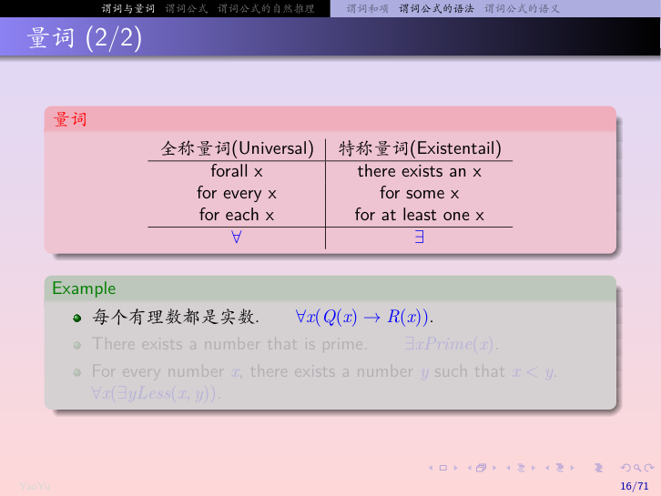
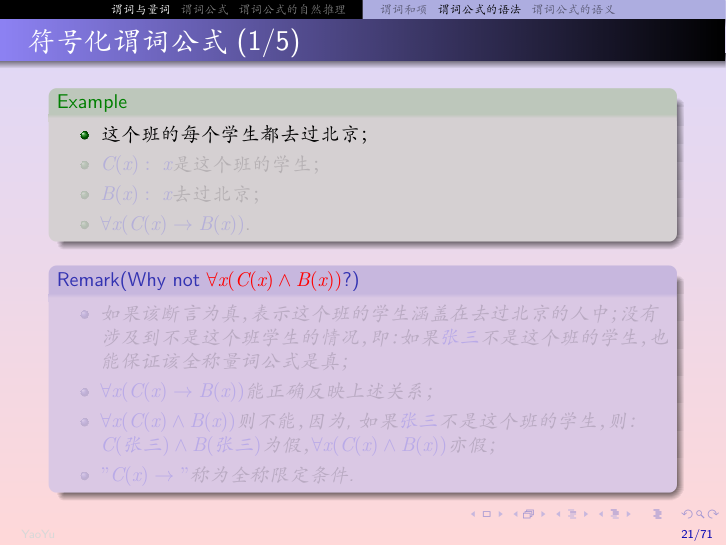
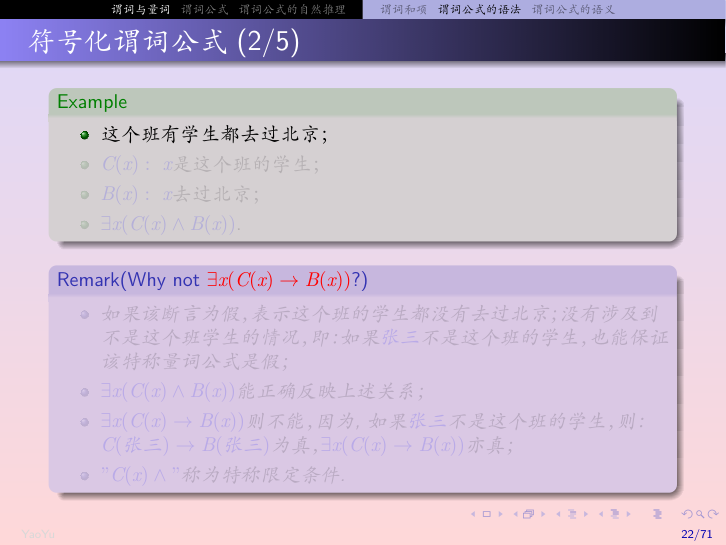
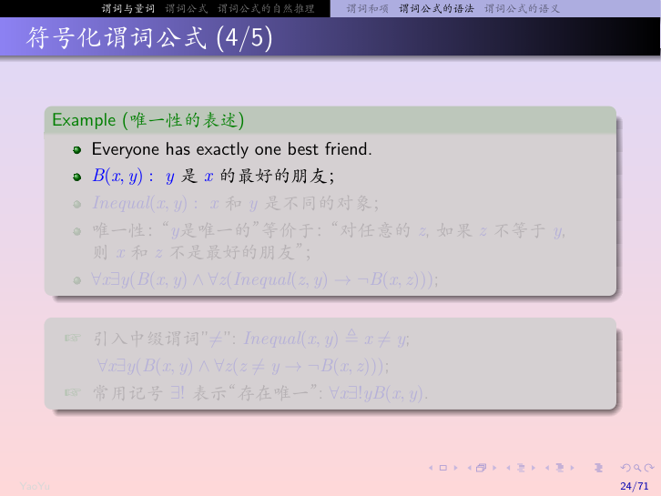
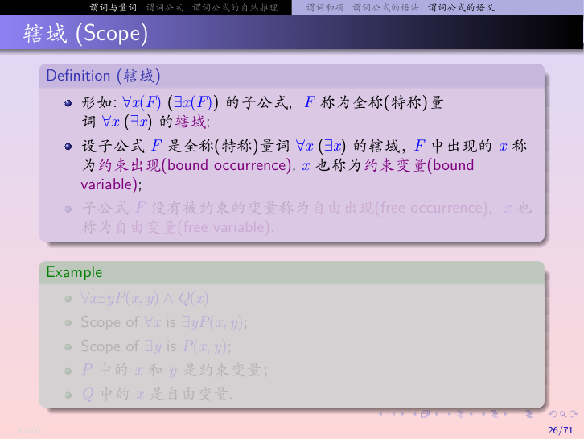
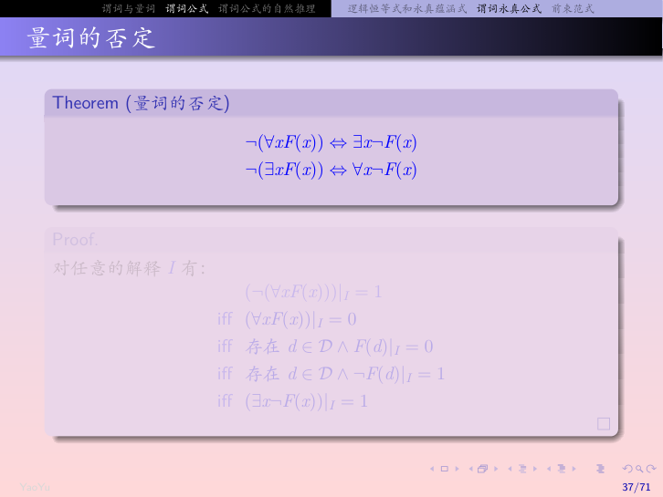
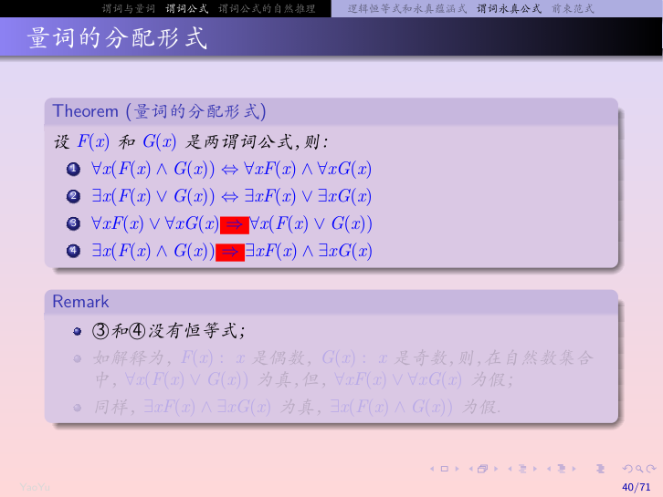
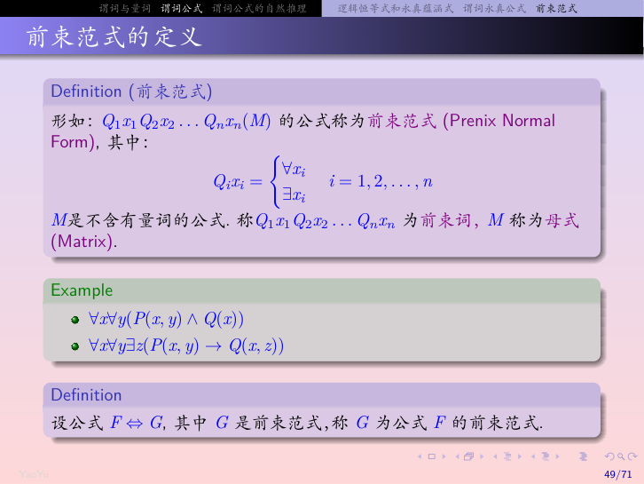
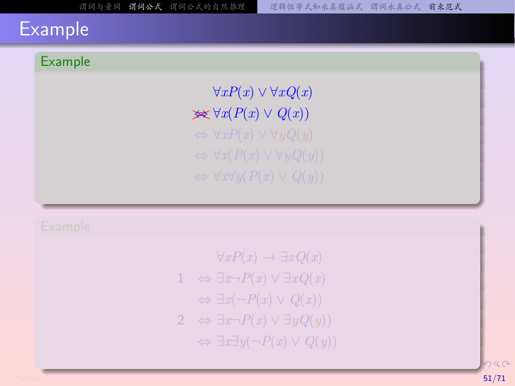
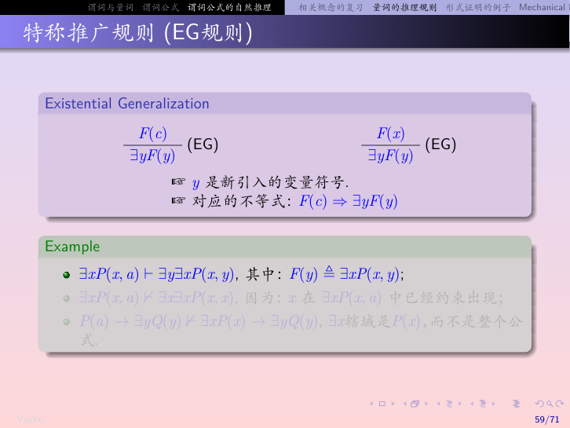

# 03 谓词逻辑（教材 1.4–1.5）

> 教材：Rosen《离散数学及其应用》第8版，1.4 谓词和量词、1.5 嵌套量词
> 课件：武大姚羽《谓词逻辑》（02-pred.pdf）
> 录音：老师补充细节已嵌入正文

---

> **目录**
>
> - [1.4 谓词和量词](#14-谓词和量词)
>   - [为什么需要谓词逻辑](#141-为什么需要谓词逻辑) · [谓词与命题函数](#142-谓词与命题函数) · [量词](#143-量词) · [受限量词](#144-受限量词) · [唯一性量词](#145-唯一性量词)
>   - [量词的优先级](#146-量词的优先级) · [量词的德摩根律](#147-量词的德摩根律) · [前束范式](#148-前束范式prenex-normal-form) · [语句翻译](#149-语句翻译)
>   - [系统规范说明](#1410-系统规范说明) · [路易斯·卡罗尔的例子](#1411-路易斯卡罗尔的例子) · [Prolog](#1412-prolog)
> - [1.5 嵌套量词](#15-嵌套量词)
>   - [理解嵌套量词](#151-理解嵌套量词语句) · [量词的顺序](#152-量词的顺序) · [翻译](#153-数学语句到嵌套量词的翻译) · [否定](#156-嵌套量词的否定)

---

## 1.4 谓词和量词

### 1.4.1 为什么需要谓词逻辑

命题逻辑只能处理完整的命题，无法刻画"个体的性质"和"数量关系"。例如：

> 苏格拉底是人。所有人都是要死的。所以苏格拉底是要死的。

这个推理在命题逻辑中是不可证的——因为它把三个命题当作独立原子，看不出"苏格拉底"和"所有人"之间的联系。

谓词逻辑把命题拆成 **个体词（主语）+ 谓词（谓语）**，并引入量词来表达"所有""存在"，从而能刻画这类推理。

> **课件补充**：命题逻辑的局限（Limitations of Propositional Logic）
>
> 课件用经典三段论引入："Every man is mortal. Since Confucius is a man, Confucius is mortal." 命题逻辑无法推出这个结论，因为它看不到"人"这个概念在两个前提中的重复。

---

### 1.4.2 谓词与命题函数

**谓词（predicate）**：表示个体的性质或个体之间关系的词。

**命题函数（propositional function）**：含变量的表达式。一旦给变量赋上确定值，它就变成一个命题。

例：
- $P(x)$："$x$ 大于 3"——给 $x$ 赋值后才是命题
- $Q(x, y)$："$x = y + 3$"
- $R(x, y)$："$x + y = 3$"

给变量赋值后的结果：
- $P(4)$："4 > 3"——真
- $P(2)$："2 > 3"——假
- $Q(1, 2)$："1 = 2 + 3"——假
- $R(3, 0)$："3 + 0 = 3"——真

**n 元谓词**：含 $n$ 个变量的命题函数，如 $P(x_1, x_2, \ldots, x_n)$。

> **课件补充**：项（Terms）的归纳定义
>
> 课件把"项"（term）单独定义：常量、变量是项；若 $f$ 是 $n$ 元函数符号，$t_1, \ldots, t_n$ 是项，则 $f(t_1, \ldots, t_n)$ 也是项。例如 $x$ 的父亲是项 $\text{father}(x)$。
>
> **原子公式**：若 $P$ 是 $n$ 元谓词，$t_1, \ldots, t_n$ 是项，则 $P(t_1, \ldots, t_n)$ 是原子公式。

**论域（domain / universe of discourse）**：变量的取值范围。同一个命题函数在不同论域下含义不同。

---

### 1.4.3 量词

#### 全称量词（universal quantifier）

$\forall x\, P(x)$ 表示"对论域中**所有** $x$，$P(x)$ 为真"。

读作："对所有 $x$，$P(x)$" 或 "对每个 $x$，$P(x)$"。

**何时为真**：$P(x)$ 对论域中每个 $x$ 都为真。
**何时为假**：存在至少一个 $x$ 使 $P(x)$ 为假（这个 $x$ 称为**反例**）。

#### 存在量词（existential quantifier）

$\exists x\, P(x)$ 表示"论域中**存在**至少一个 $x$ 使 $P(x)$ 为真"。

读作："存在 $x$，使得 $P(x)$"。

**何时为真**：至少存在一个 $x$ 使 $P(x)$ 为真。
**何时为假**：对论域中所有 $x$，$P(x)$ 都为假。



#### 有限论域下的量词

若论域是有限集合 $\{a_1, a_2, \ldots, a_n\}$，则：

$$\forall x\, P(x) \equiv P(a_1) \land P(a_2) \land \cdots \land P(a_n)$$

$$\exists x\, P(x) \equiv P(a_1) \lor P(a_2) \lor \cdots \lor P(a_n)$$

也就是说，**全称量词 = 合取，存在量词 = 析取**。

> **一眼记住**：$\forall$ 是"所有人都"——缺一不可（合取）；$\exists$ 是"至少有一个"——有一个就行（析取）。

#### 量词与逻辑联结词的搭配（核心考点）

这是谓词逻辑最容易出错的地方，老师反复强调：

| 量词类型 | 特性谓词的加入方式 | 例子 |
| --- | --- | --- |
| 全称量词 $\forall x$ | 作为**蕴含式的前件**加入 | $\forall x\,(T(x) \rightarrow P(x))$：如果 $x$ 是老虎，则 $x$ 要吃人 |
| 存在量词 $\exists x$ | 作为**合取式的合取项**加入 | $\exists x\,(H(x) \land R(x))$：存在 $x$ 既是人又登上过月球 |

**为什么不能乱搭？**

- 如果"所有人都聪明"写成 $\forall x\,(\text{Student}(x) \land \text{Smart}(x))$，那就意味着论域里**所有东西**都是学生且聪明——这显然不对。
- 如果"有人登过月球"写成 $\exists x\,(\text{Human}(x) \rightarrow \text{OnMoon}(x))$，那只要论域里有一个不是人的东西，这个蕴含式就为真（前件为假），整个式子就失去了意义。

**规则口诀**：**全称用蕴含，存在用合取**。





> **录音补充（老师强调）**：这个搭配规则是考试必考点。全称量词后面跟蕴含，是因为"所有 $A$ 都是 $B$"的意思是"只要是 $A$，就一定是 $B$"；存在量词后面跟合取，是因为"存在 $A$ 是 $B$"要求同时满足两个条件。
>
> 反例：$\exists x\,(\text{Student}(x) \rightarrow \text{Smart}(x))$ 恒真（只要论域里有一个非学生即可），完全表达不出"有学生聪明"的意思。

---

### 1.4.4 受限量词

有时候我们想限制变量只在某个子集里取值。

- $\forall x > 0\, P(x)$：表示"对所有 $x > 0$，$P(x)$ 为真"
- $\exists y \neq 0\, Q(y)$：表示"存在 $y \neq 0$，使 $Q(y)$ 为真"

展开成标准量词：

$$\forall x > 0\, P(x) \equiv \forall x\,(x > 0 \rightarrow P(x))$$

$$\exists y \neq 0\, Q(y) \equiv \exists y\,(y \neq 0 \land Q(y))$$

> 注意：受限量词只是简写，展开后仍然遵循"全称用蕴含、存在用合取"的规则。

---

### 1.4.5 唯一性量词

$\exists ! x\, P(x)$ 表示"**恰好存在一个** $x$ 使 $P(x)$ 为真"。

等价展开：

$$\exists ! x\, P(x) \equiv \exists x\,(P(x) \land \forall y\,(P(y) \rightarrow y = x))$$

意思是：存在一个 $x$ 满足 $P$，并且任何满足 $P$ 的 $y$ 都等于这个 $x$（即没有第二个）。



例："每个人恰好有一个最好的朋友"可以写成：

$$\forall x\, \exists ! y\, B(x, y)$$

其中 $B(x, y)$ 表示"$y$ 是 $x$ 最好的朋友"。

---

### 1.4.6 量词的优先级

量词 $\forall$ 和 $\exists$ 的优先级**高于**所有逻辑联结词。

例如：$\forall x\, P(x) \land Q(x)$ 的意思是 $(\forall x\, P(x)) \land Q(x)$，而不是 $\forall x\,(P(x) \land Q(x))$。

> **注意**：第二个 $Q(x)$ 中的 $x$ 不受 $\forall$ 约束（因为 $Q(x)$ 在量词作用域之外）。这就是下一节要讲的"约束变量 vs 自由变量"。

---

### 1.4.7 量词的德摩根律

**变量绑定**：$\forall x$ 或 $\exists x$ 后面紧跟着的公式是该量词的**作用域**。在作用域内出现的 $x$ 称为**约束变量**；不在任何量词作用域内的 $x$ 称为**自由变量**。



**量词否定的德摩根律**：

$$\neg \forall x\, P(x) \equiv \exists x\, \neg P(x)$$

$$\neg \exists x\, P(x) \equiv \forall x\, \neg P(x)$$

直觉理解：
- "不是所有人都及格了" = "有人没及格"
- "没有人及格" = "所有人都没及格"



**量词与命题联结词的分配律**：

| 等价式 | 名称 |
| --- | --- |
| $\forall x\,(P(x) \land Q(x)) \equiv \forall x\, P(x) \land \forall x\, Q(x)$ | 全称对合取分配 |
| $\exists x\,(P(x) \lor Q(x)) \equiv \exists x\, P(x) \lor \exists x\, Q(x)$ | 存在对析取分配 |

注意：全称对析取**不分配**，存在对合取**不分配**！

$$\forall x\, P(x) \lor \forall x\, Q(x) \Rightarrow \forall x\,(P(x) \lor Q(x))$$

（反过来不成立："所有人都及格或所有人都不及格"推不出"所有人要么及格要么不及格"——不对，等一下，正确理解是：如果每个人要么及格要么不及格，不一定是所有人都及格或所有人都不及格。）

$$\exists x\,(P(x) \land Q(x)) \Rightarrow \exists x\, P(x) \land \exists x\, Q(x)$$

（反过来不成立："有人高且有人瘦"推不出"有人又高又瘦"。）



> **录音补充（老师强调）**：量词分配律是考试重点。记住"全称只能分配给合取，存在只能分配给析取"。另外两个方向只能推单向蕴含，不能反向。

---

### 1.4.8 前束范式（Prenex Normal Form）

> 教材在1.5节练习中引入了前束范式的概念，这里按PPT内容展开。

**定义**：形如

$$Q_1 x_1\, Q_2 x_2\, \cdots\, Q_n x_n\, M$$

的公式称为**前束范式**（PNF），其中每个 $Q_i$ 是全称量词 $\forall$ 或存在量词 $\exists$，$M$ 是不含量词的公式。

- $Q_1 x_1 \cdots Q_n x_n$ 称为**前束词**（前缀）
- $M$ 称为**母式**（Matrix）

例：
- $\forall x\, \forall y\, (P(x, y) \land Q(x))$ —— 是前束范式
- $\forall x\, \exists y\, (P(x) \rightarrow Q(x, y))$ —— 是前束范式
- $\exists x\, P(x) \lor \forall x\, Q(x)$ —— **不是**前束范式（量词不都在最前面）



**定理**：任意谓词公式都存在与之等价的前束范式。

**求解步骤**：

1. **消除蕴含和等值**：把 $\rightarrow$ 和 $\leftrightarrow$ 换成 $\neg, \land, \lor$
2. **否定内移**：用德摩根律把否定词移到谓词前面
3. **变量更名**：对约束变量重新命名，避免变量名冲突
4. **量词外提**：用量词的扩张、收缩、分配律把所有量词移到最前面


**例 1**：求 $\forall x\, P(x) \lor \forall x\, Q(x)$ 的前束范式。

$$\forall x\, P(x) \lor \forall x\, Q(x)$$

$$\Leftrightarrow \forall x\, P(x) \lor \forall y\, Q(y) \quad \text{（变量更名）}$$

$$\Leftrightarrow \forall x\, (P(x) \lor \forall y\, Q(y)) \quad \text{（量词外提：} y \text{ 不在 } P(x) \text{ 中出现）}$$

$$\Leftrightarrow \forall x\, \forall y\, (P(x) \lor Q(y)) \quad \text{（量词外提：} x \text{ 不在 } Q(y) \text{ 中出现）}$$

> 注意：第一步不能直接写成 $\forall x\, (P(x) \lor Q(x))$——全称对析取不分配！必须先更名再外提。

**例 2**：求 $\forall x\, P(x) \rightarrow \exists x\, Q(x)$ 的前束范式。

$$\forall x\, P(x) \rightarrow \exists x\, Q(x)$$

$$\Leftrightarrow \neg \forall x\, P(x) \lor \exists x\, Q(x) \quad \text{（消除 $\rightarrow$）}$$

$$\Leftrightarrow \exists x\, \neg P(x) \lor \exists x\, Q(x) \quad \text{（否定内移）}$$

$$\Leftrightarrow \exists x\, \neg P(x) \lor \exists y\, Q(y) \quad \text{（变量更名）}$$

$$\Leftrightarrow \exists x\, (\neg P(x) \lor \exists y\, Q(y)) \quad \text{（量词外提）}$$

$$\Leftrightarrow \exists x\, \exists y\, (\neg P(x) \lor Q(y)) \quad \text{（量词外提）}$$



> **录音补充（老师强调）**：前束范式求解的关键是"先更名，再外提"。同名变量在不同量词作用域里是不同的变量，必须先改名避免冲突，然后才能把量词提到最前面。考试常考的就是 $\forall x P(x) \lor \forall x Q(x)$ 这种形式。

---

### 1.4.9 语句翻译

把自然语言语句翻译成谓词逻辑表达式的步骤：

1. 找出谓词（性质/关系）
2. 找出量词（所有/存在/恰好一个）
3. 确定论域
4. 按"全称用蕴含、存在用合取"的规则组合

例："这班上的每个学生都已学过微积分"

- 设 $S(x)$：$x$ 是这个班的学生
- 设 $C(x)$：$x$ 学过微积分
- 翻译：$\forall x\,(S(x) \rightarrow C(x))$

例："这个班上有个学生已去过加拿大"

- 翻译：$\exists x\,(S(x) \land G(x))$，其中 $G(x)$：$x$ 去过加拿大

例："这个班上的每个学生都去过加拿大或墨西哥"

- $\forall x\,(S(x) \rightarrow (C(x) \lor M(x)))$

---

### 1.4.10 系统规范说明

用量词表达计算机系统的规范。

例："每个用户可以访问邮箱"

- 设 $U(x)$：$x$ 是用户
- 设 $A(x, y)$：$x$ 可以访问邮箱 $y$
- 翻译：$\forall x\,(U(x) \rightarrow \exists y\, A(x, y))$

---

### 1.4.11 路易斯·卡罗尔的例子

《爱丽丝梦游仙境》作者路易斯·卡罗尔也是逻辑学家。他的经典例子：

> "所有狮子都是凶猛的。有些狮子不喝咖啡。"

设：
- $L(x)$：$x$ 是狮子
- $F(x)$：$x$ 是凶猛的
- $C(x)$：$x$ 喝咖啡

翻译：
- $\forall x\,(L(x) \rightarrow F(x))$
- $\exists x\,(L(x) \land \neg C(x))$

结论："有些凶猛的动物不喝咖啡。"
$\exists x\,(F(x) \land \neg C(x))$

---

### 1.4.12 Prolog

Prolog（Programming in Logic）是一种逻辑编程语言，它用事实和规则来描述世界，然后回答查询。

Prolog 中的规则形如：

```
人类 Socrates.
人类 Confucius.
要会死(X) :- 人类(X).
```

查询 `?- 要会死(Socrates)` 会返回真。

> Prolog 的推理就是谓词逻辑的自动演绎。它把知识库表示为一组 Horn 子句（一个原子目标是多个原子条件的合取），然后用归结法回答查询。

---

## 1.5 嵌套量词

### 1.5.1 理解嵌套量词语句

**嵌套量词**：一个量词出现在另一个量词的作用域内。

例如 $\forall x\, \exists y\,(x + y = 0)$。

理解方法：把它看成**嵌套循环**。

| 量化式 | 循环理解 |
| --- | --- |
| $\forall x\, \forall y\, P(x,y)$ | 对所有 $x$，对所有 $y$，$P$ 都为真（两层循环全跑完） |
| $\forall x\, \exists y\, P(x,y)$ | 对每个 $x$，在 $y$ 的循环里找到一个使 $P$ 为真的 $y$ |
| $\exists x\, \forall y\, P(x,y)$ | 在 $x$ 的循环里找到一个 $x$，使 $P$ 对所有 $y$ 都为真 |
| $\exists x\, \exists y\, P(x,y)$ | 在 $x$ 循环里找到一个 $x$，再在 $y$ 循环里找到一个 $y$ 使 $P$ 为真 |

> **直觉**：$\forall$ 是"外层全跑"，$\exists$ 是"找到就行"。

---

### 1.5.2 量词的顺序

**关键：量词顺序很重要，除非所有量词都是全称或都是存在。**

例：论域是实数，$Q(x, y)$ 表示 "$x + y = 0$"。

- $\exists y\, \forall x\, Q(x, y)$：存在一个 $y$，使得对所有 $x$，$x + y = 0$。**假**（没有这样的 $y$）
- $\forall x\, \exists y\, Q(x, y)$：对每个 $x$，存在一个 $y$ 使 $x + y = 0$。**真**（$y = -x$）

**核心区别**：
- $\exists y\, \forall x$：$y$ 是**固定的、与 $x$ 无关的常数**
- $\forall x\, \exists y$：$y$ **可以依赖于 $x$**（每个 $x$ 对应不同的 $y$）

**蕴含关系**：
$$\exists y\, \forall x\, P(x,y) \Rightarrow \forall x\, \exists y\, P(x,y)$$

反过来不成立。

**两个变量的四种量化式总结**：

| 量化式 | 含义 |
| --- | --- |
| $\forall x\, \forall y\, P(x,y)$ | 对所有 $x, y$，$P$ 都成立 |
| $\forall y\, \forall x\, P(x,y)$ | 同上，顺序无关 |
| $\forall x\, \exists y\, P(x,y)$ | 每个 $x$ 都有某个 $y$ 使 $P$ 成立（$y$ 依赖 $x$） |
| $\exists y\, \forall x\, P(x,y)$ | 存在一个固定的 $y$，使 $P$ 对所有 $x$ 成立 |
| $\exists x\, \forall y\, P(x,y)$ | 存在一个固定的 $x$，使 $P$ 对所有 $y$ 成立 |
| $\forall y\, \exists x\, P(x,y)$ | 每个 $y$ 都有某个 $x$ 使 $P$ 成立（$x$ 依赖 $y$） |
| $\exists x\, \exists y\, P(x,y)$ | 存在某对 $x, y$ 使 $P$ 成立 |
| $\exists y\, \exists x\, P(x,y)$ | 同上，顺序无关 |

> **录音补充（老师强调）**：量词顺序是谓词逻辑的灵魂。$\forall x \exists y$ 和 $\exists y \forall x$ 完全不同——前者"每个人都有妈妈"，后者"有一个人是所有人的妈妈"。

超过两个变量的量词同理。例如：

- $\forall x\, \forall y\, \exists z\, (x + y = z)$：**真**（对任意 $x, y$，$z = x + y$）
- $\exists z\, \forall x\, \forall y\, (x + y = z)$：**假**（没有一个固定 $z$ 等于所有 $x + y$）

---

### 1.5.3 数学语句到嵌套量词的翻译

**例：两个正整数的和总是正数**

重写："对每两个整数，如果它们都是正的，那么它们的和是正的。"

$$\forall x\, \forall y\, ((x > 0) \land (y > 0) \rightarrow (x + y > 0))$$

**例：除了 0 以外的每个实数都有乘法逆元**

$$\forall x\, (x \neq 0 \rightarrow \exists y\, (x \cdot y = 1))$$

**例（极限定义）**：$\lim_{x \to a} f(x) = L$ 意味着：

> 对每个实数 $\varepsilon > 0$，存在一个实数 $\delta > 0$，使得对所有 $x$，只要 $0 < |x - a| < \delta$，就有 $|f(x) - L| < \varepsilon$。

用量词表示：

$$\forall \varepsilon > 0\, \exists \delta > 0\, \forall x\, (0 < |x - a| < \delta \rightarrow |f(x) - L| < \varepsilon)$$

> **这是微积分的核心定义，也是嵌套量词最经典的应用。** 注意量词顺序：$\forall \varepsilon \exists \delta \forall x$——先定误差容限，再找响应精度，最后检查所有 $x$。

---

### 1.5.4 嵌套量词到自然语言的翻译

**例**：$\forall x\, (C(x) \lor \exists y\, (C(y) \land F(x,y)))$

其中 $C(x)$：$x$ 有计算机；$F(x,y)$：$x$ 和 $y$ 是朋友。

翻译："学校的每个学生或者有一台计算机，或者有一个有计算机的朋友。"

**例**：$\exists x\, \forall y\, \forall z\, ((F(x,y) \land F(x,z) \land y \neq z) \rightarrow \neg F(y,z))$

其中 $F(a,b)$：$a$ 和 $b$ 是朋友。

翻译："有一个学生，他的朋友之间互相都不是朋友。"（这是一个"孤立社交圈"的描述。）

---

### 1.5.5 汉语语句到逻辑表达式的翻译

**例："如果某人是女性且是家长，那么她是某人的母亲"**

设 $F(x)$：$x$ 是女性；$P(x)$：$x$ 是家长；$M(x,y)$：$x$ 是 $y$ 的母亲。

$$\forall x\, ((F(x) \land P(x)) \rightarrow \exists y\, M(x,y))$$

**例："每个人恰好有一个最好的朋友"**

设 $B(x,y)$：$y$ 是 $x$ 最好的朋友。

$$\forall x\, \exists y\, (B(x,y) \land \forall z\, (z \neq y \rightarrow \neg B(x,z)))$$

等价于 $\forall x\, \exists ! y\, B(x,y)$。

**例："有一位妇女已搭乘过世界上每一条航线上的一个航班"**

设 $P(w,f)$：$w$ 搭乘过航班 $f$；$Q(f,a)$：$f$ 是航线 $a$ 上的航班。

$$\exists w\, \forall a\, \exists f\, (P(w,f) \land Q(f,a))$$

> 注意量词顺序：$\exists w \forall a \exists f$——先找这位妇女，然后对每条航线，都能找到一个她搭乘过的该航线上的航班。

---

### 1.5.6 嵌套量词的否定

连续应用量词德摩根律即可：

$$\neg \forall x\, \exists y\, P(x,y) \equiv \exists x\, \neg \exists y\, P(x,y) \equiv \exists x\, \forall y\, \neg P(x,y)$$

**规则**：否定词每越过一个量词，$\forall$ 变 $\exists$，$\exists$ 变 $\forall$。

**例："没有妇女搭乘过每条航线上的航班"**

原句（例13）：$\exists w\, \forall a\, \exists f\, (P(w,f) \land Q(f,a))$

否定：

$$\neg \exists w\, \forall a\, \exists f\, (P(w,f) \land Q(f,a))$$

$$\equiv \forall w\, \neg \forall a\, \exists f\, (P(w,f) \land Q(f,a))$$

$$\equiv \forall w\, \exists a\, \neg \exists f\, (P(w,f) \land Q(f,a))$$

$$\equiv \forall w\, \exists a\, \forall f\, \neg (P(w,f) \land Q(f,a))$$

$$\equiv \forall w\, \exists a\, \forall f\, (\neg P(w,f) \lor \neg Q(f,a))$$

读作："对每位妇女，存在一条航线，使得对所有航班，这位妇女要么没搭乘过该航班，要么该航班不在这条航线上。"

**例（极限不存在）**：$\lim_{x \to a} f(x) \neq L$ 的否定就是极限定义的否定：

$$\neg \forall \varepsilon > 0\, \exists \delta > 0\, \forall x\, (0 < |x-a| < \delta \rightarrow |f(x)-L| < \varepsilon)$$

$$\equiv \exists \varepsilon > 0\, \forall \delta > 0\, \exists x\, (0 < |x-a| < \delta \land |f(x)-L| \geq \varepsilon)$$

读作："存在一个 $\varepsilon > 0$，使得对所有 $\delta > 0$，都存在 $x$ 满足 $0 < |x-a| < \delta$ 但 $|f(x)-L| \geq \varepsilon$。"

---

## 量词推理规则（课件补充）

> 教材 1.6 节会讲推理规则，这里先把谓词逻辑特有的四条量词规则列出来，方便查阅。

| 规则 | 名称 | 公式 | 说明 |
| --- | --- | --- | --- |
| US | 全称指定 | $\forall x\, P(x) \Rightarrow P(c)$ | 从"所有都成立"推出"某个特定 $c$ 成立" |
| ES | 存在指定 | $\exists x\, P(x) \Rightarrow P(c)$ | 从"存在"推出"某个新常量 $c$ 成立" |
| UG | 全称推广 | $P(c) \Rightarrow \forall x\, P(x)$ | 从"任意 $c$ 成立"推出"所有都成立" |
| EG | 存在推广 | $P(c) \Rightarrow \exists x\, P(x)$ | 从"某个 $c$ 成立"推出"存在成立" |





**使用顺序**：先 ES 再 US（因为 ES 引入的常量是"新的"，而 US 可以指定任意常量）。

---

## 本节重点

> **1.4 谓词和量词**
> - 谓词把命题拆成"个体 + 性质"，量词表达"所有/存在/恰好一个"
> - **全称用蕴含，存在用合取**——这是最容易错的考点
> - 量词德摩根律：$\neg \forall \equiv \exists \neg$，$\neg \exists \equiv \forall \neg$
> - 全称对合取分配，存在对析取分配；反过来只能单向推
>
> **1.5 嵌套量词**
> - 量词顺序不能随便换：$\forall x \exists y \neq \exists y \forall x$
> - $\exists y \forall x$ 的 $y$ 是固定常数；$\forall x \exists y$ 的 $y$ 可以依赖 $x$
> - 极限定义是嵌套量词最经典的应用：$\forall \varepsilon \exists \delta \forall x$
> - 否定嵌套量词：否定词每越过一个量词，量词类型就翻转
>
> **常见坑**
> - 把 $\forall x\,(S(x) \land P(x))$ 当"所有 $S$ 都是 $P$"——错！应该是 $\forall x\,(S(x) \rightarrow P(x))$
> - 把 $\exists x\,(S(x) \rightarrow P(x))$ 当"有 $S$ 是 $P$"——错！应该是 $\exists x\,(S(x) \land P(x))$
> - 交换 $\forall$ 和 $\exists$ 的顺序——意思完全变了
