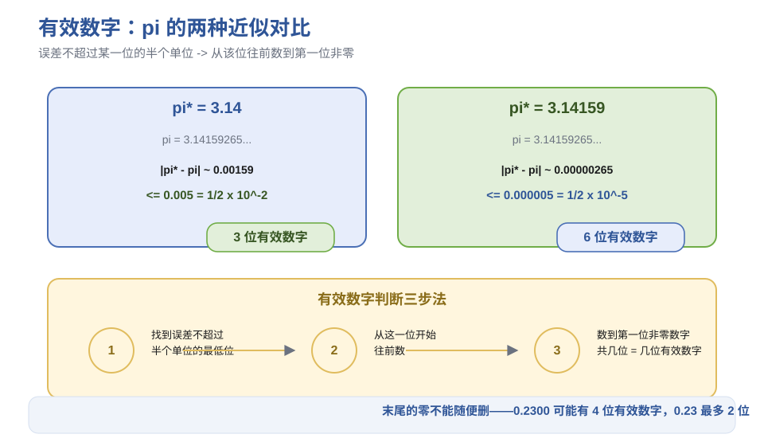
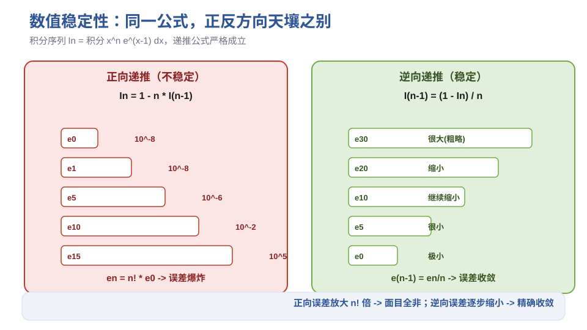

# 第1章 误差与数值计算基础 - 笔记

> 课程：数值计算方法（中国石油大学华东，国家级精品课，BV1NvYSzEEYd）
> 对应视频：p001-p005（1.1 误差 ~ 1.5 计算机的数系结构）

## 目录

- [1. 误差的来源与分类](#1-误差的来源与分类)
- [2. 误差的度量：绝对误差 / 相对误差 / 有效数字](#2-误差的度量绝对误差--相对误差--有效数字)
- [3. 数值稳定性](#3-数值稳定性)
- [4. 误差分析的四种方法](#4-误差分析的四种方法)
- [5. 近似计算的五大原则](#5-近似计算的五大原则)
- [6. 计算机的数系结构](#6-计算机的数系结构)
- [7. 本节重点](#7-本节重点)

---

## 1. 误差的来源与分类

数值计算方法 = **近似计算**，误差不可避免。关键是知道误差从哪来、有多大、会不会放大。

### 四种误差来源

| 误差类型 | 产生原因 | 本课程是否研究 |
|---------|---------|--------------|
| **模型误差** | 从实际问题抽象数学模型时忽略次要因素 | 否（建模课的事） |
| **观测误差** | 模型中的参量/常数通过测量得到 | 否（测量课的事） |
| **截断误差**（方法误差） | 用近似方法求解，如无穷级数取前N项 | **是，核心** |
| **舍入误差** | 计算机字长有限，无限位小数四舍五入 | **是，核心** |

> **口诀**：模型和观测不是我们的事，截断（方法）和舍入（机器）才是。

### 截断误差 vs 舍入误差（直观理解）

- **截断误差**：方法本身造成的。比如 $e^x = 1 + x + \frac{x^2}{2!} + \cdots$，你只取前 3 项，后面的都"截断"了。
- **舍入误差**：机器造成的。比如 $1/3 = 0.333333\cdots$，计算机只能存有限位，第 8 位之后四舍五入。

---


> **图1** 误差的四种来源（自绘）。

## 2. 误差的度量：绝对误差 / 相对误差 / 有效数字

### 2.1 绝对误差与绝对误差限

**绝对误差**（简称误差）：

$$e^* = x^* - x$$

其中 $x^*$ 是近似值，$x$ 是精确值。

- 可正可负（近似值可大于或小于精确值）
- 常常是无限位，无法确定具体值

**绝对误差限**：绝对误差的上界，即 $|e^*| \le \varepsilon^*$。

- 不唯一（0.1 是上界，0.11 也是）
- 实际中取尽可能小的上界

**例**：$\pi^* = 3.14159$，则 $|\pi^* - \pi| \le \frac{1}{2} \times 10^{-5} = 0.000005$。

> 理解：四舍五入到第 n 位，误差不超过该位的**半个单位**。

### 2.2 相对误差与相对误差限

绝对误差不能完全反映近似值的好坏——还要看近似值本身有多大。

**相对误差**：

$$e_r^* = \frac{e^*}{x} = \frac{x^* - x}{x}$$

实际中精确值 $x$ 未知，常用近似值代替：

$$e_r^* \approx \frac{x^* - x}{x^*}$$

**相对误差限**：$|e_r^*| \le \varepsilon_r^*$。

**例**：测量 1000m 误差 1m（相对误差 0.1%），比测量 10m 误差 1m（相对误差 10%）好得多。

### 2.3 有效数字

这是最常用、最直观的精度描述方式。

**定义**：若近似值 $x^*$ 与精确值 $x$ 的误差绝对值不超过某一位的半个单位，则从该位开始，往前数到第一位非零数字，共有 N 位，称 $x^*$ 有 **N 位有效数字**。

**判断三步法**：

1. 找到误差不超过"半个单位"的最低位
2. 从这一位开始往前数
3. 数到第一位非零数字，共几位就是几位有效数字

**例 1**：$\pi = 3.14159265\cdots$

| 近似值 | 误差 | 有效数字位数 |
|--------|------|------------|
| 3.14 | $\mid3.14-\pi\mid \le 0.005 = \frac{1}{2}\times10^{-2}$ | 3 位（3,1,4） |
| 3.14159 | $\mid3.14159-\pi\mid \le 0.000005 = \frac{1}{2}\times10^{-5}$ | 6 位（3,1,4,1,5,9） |
| 3.141592 | 第 7 位 6 该进未进，超过半个单位 → 从第 6 位开始算 | 6 位 |

**例 2**：$x^* = 0.00105$

- 第 5 位（5）该进未进，超过半个单位 → 不算
- 第 4 位（0）误差不超过半个单位 → 从这一位开始
- 往前数到第一位非零数字（1）→ 1 和 0，共 **2 位有效数字**


> **图2** 有效数字判断：π 的两种近似对比 + 三步法（自绘）。

### 2.4 三个重要结论（末尾的零不能随便删！）

| 写法 | 有效数字 | 说明 |
|------|---------|------|
| 0.2300 | 最多 4 位 | 末尾两个零含信息 |
| 0.23 | 最多 2 位 | 删零 = 丢精度 |
| 0.0023 | 最多 2 位 | 前面的零不算 |
| 12300 | 可能 5 位 | 末尾零是否有效不明确 |
| $0.123 \times 10^5$ | 最多 3 位 | 科学计数法明确 |

> **关键提醒**：数字末尾的零**不可以随意去掉**——它可能是有效数字，去掉就等于声称精度降低了。

### 2.5 三者关系定理

将近似值表示为规格化浮点数：

$$x^* = \pm 0.a_1a_2\cdots a_k\cdots \times 10^m \quad (a_1 \neq 0)$$

若 $a_k$ 是有效数字（误差不超过该位半个单位），则：

- **绝对误差限**：$|x^* - x| \le \frac{1}{2} \times 10^{m-k}$
- **相对误差限**：$|e_r^*| \le \frac{1}{2a_1} \times 10^{-(k-1)}$

反过来，知道相对误差限也可以推出有效数字位数。

> 这个定理揭示了：**有效数字位数越多，相对误差限越小**——有效数字和相对误差本质上是一回事的两种表述。

---

## 3. 数值稳定性

这是数值计算方法**特有的、最重要的概念**。

### 3.1 定义

一个算法，如果初始数据的误差或计算过程中某步产生的误差，在传播过程中**不增长**（误差不超过上一步），则称该算法是**数值稳定的**；否则称为**数值不稳定的**。

### 3.2 经典案例：积分序列 $I_n = \int_0^1 x^n e^{x-1} dx$

**递推公式**（分部积分得到，严格成立）：

$$I_n = 1 - n \cdot I_{n-1}$$

**正向递推**（从 $I_0$ 算到 $I_n$）：

- $I_0 = 1 - e^{-1} \approx 0.63212056$（初始误差很小，不超过 $10^{-8}$）
- $I_1 = 1 - 1 \times I_0$
- $I_2 = 1 - 2 \times I_1$
- ...

**误差传播分析**：

$$e_n = I_n^* - I_n = -n(I_{n-1}^* - I_{n-1}) = n \cdot e_{n-1}$$

递推得：

$$e_n = n! \cdot e_0$$

> 尽管初始误差 $e_0$ 很小（$10^{-8}$），但乘以 $n!$ 后，到 $n=15$ 时误差已经是 $10^{-8} \times 15! \approx 10^5$——**结果面目全非**。

实际计算中，$I_{13}$ 已经变成负数（理论上 $I_n > 0$），$I_{15}$ 达到 -1423。

**逆向递推**（从大 N 算到小 n）：

$$I_{n-1} = \frac{1 - I_n}{n}$$

误差传播：$e_{n-1} = \frac{1}{n} e_n$，误差**逐步缩小**。

- 先取一个粗略的 $I_N$（比如用区间中点近似，误差可能很大）
- 从 $N$ 倒着算到 $n$，误差不断除以 $N, N-1, \ldots, n+1$
- 当 $N \gg n$ 时，$I_n$ 的误差已经非常小

> **同一个公式，正反两个方向用，稳定性完全不同**——正向不稳定，逆向稳定。这就是数值稳定性的威力。

### 3.3 一句话记住

> **稳定算法 = 误差不增长；不稳定算法 = 误差放大到面目全非。选算法先看稳定性。**

---


> **图3** 数值稳定性：积分序列正向递推（不稳定）vs 逆向递推（稳定）（自绘）。

## 4. 误差分析的四种方法

### 4.1 向前误差分析（最常用）

利用误差限，随着计算过程逐步向前推进，直至估计最后结果的误差。

**四则运算的误差传播**：

| 运算 | 绝对误差限 | 相对误差限 |
|------|----------|----------|
| $x_1^* \pm x_2^*$ | $\varepsilon_1 + \varepsilon_2$ | $\frac{\varepsilon_1 + \varepsilon_2}{\midx_1^* \pm x_2^*\mid}$ |
| $x_1^* \times x_2^*$ | $\midx_2^*\mid\varepsilon_1 + \midx_1^*\mid\varepsilon_2$ | $\varepsilon_{r1} + \varepsilon_{r2}$ |
| $x_1^* / x_2^*$ | $\frac{\midx_2^*\mid\varepsilon_1 + \midx_1^*\mid\varepsilon_2}{\midx_2^*\mid^2}$ | $\varepsilon_{r1} + \varepsilon_{r2}$ |

> 乘法和除法的**相对误差限是各因子相对误差限之和**——这个结论很常用。

**函数误差与条件数**：

对 $y = f(x)$，用 $x^*$ 代替 $x$，由中值定理：

$$f(x^*) - f(x) \approx f'(x^*) \cdot (x^* - x)$$

- **绝对条件数**：$|f'(x^*)|$——自变量误差的放大/缩小倍数
- **相对条件数**：$\left|\frac{x^* f'(x^*)}{f(x^*)}\right|$

条件数小 = 好条件（误差影响小）；条件数大 = 坏条件（误差影响大）。

**例**：$f(x) = \sqrt[N]{x}$，$x \approx 10$，绝对误差限 5%，则相对误差限 $\approx \frac{0.005}{N}$——N 越大，相对误差越小（好条件）。

### 4.2 向后误差分析（Wilkinson，1960s-70s）

把舍入误差的累积看成是初始数据的某个扰动，即：计算得到的近似值 $f(x^*)$ 恰好等于某个扰动数据 $x + \delta x$ 的精确值 $f(x + \delta x)$。然后估计 $\delta x$ 的大小。

- 优点：不需要逐步估计每一步的误差，一次给出总误差界
- 代表人物：James Wilkinson（英国数值分析专家，图灵奖得主）

### 4.3 区间分析方法（1990s）

把参加运算的数都看成区间（如 $\pi \in [3.14, 3.15]$），根据区间运算法则，估计出结果的区间和误差限。

### 4.4 概率分析方法（统计方法）

将数据和运算中的舍入误差视为服从某种分布的随机变量，根据统计规律确定计算结果的误差分布。

> **四种方法对比**：向前分析最直观但计算量大；向后分析优雅但需要技巧；区间分析严格但结果偏保守；概率分析实用但需要分布假设。

---

## 5. 近似计算的五大原则

不需要每次都做定量误差分析，记住这五条大原则就能避开大部分坑。

### 原则 1：避免两个相近的数直接相减

**原因**：两个相近数相减，有效数字会大量损失。

**例**：$a_1 = 0.12345$，$a_2 = 0.12346$，各有 5 位有效数字，但 $a_2 - a_1 = 0.00001$——只剩 1 位有效数字。

**避免方法**（代数变形）：

| 原式（不好） | 变形后（好） |
|------------|------------|
| $\sqrt{x+\varepsilon} - \sqrt{x}$ | $\frac{\varepsilon}{\sqrt{x+\varepsilon} + \sqrt{x}}$（分子有理化） |
| $\ln(x+\varepsilon) - \ln x$ | $\ln(1 + \frac{\varepsilon}{x})$ |
| $1 - \cos x$（$x$ 很小时） | $2\sin^2\frac{x}{2}$ |
| $e^x - 1$（$x$ 很小时） | $x + \frac{x^2}{2!} + \cdots$（泰勒展开） |

**经典案例**：$(\sqrt{2}-1)^6$ 的 6 个恒等式，用 $\sqrt{2}=1.4$ 代入：

| 计算方式 | 结果 | 效果 |
|---------|------|------|
| $(\sqrt{2}-1)^6$ | 0.004096 | 差（相近数相减） |
| $(3-2\sqrt{2})^3$ | 偏离 0.005 | 更差 |
| $99-70\sqrt{2}$ | 1.0 | 最差（误差被放大） |
| $1/(\sqrt{2}+1)^6$ | 0.00523 | 好 |
| $1/(3+2\sqrt{2})^3$ | 0.0051 | 更好 |
| $1/(99+70\sqrt{2})$ | 更接近 | 最好 |

> 精确值约 0.00505。**左边三个都是相近数相减，越来越差；右边三个避免了相减，越来越好。**

### 原则 2：避免绝对值小的数做分母

**原因**：分母很小，分子的微小误差会被极大放大；还可能溢出。

**例**：$\frac{10^4}{10^{-4}} = 10^8$，若分母有 $10^{-5}$ 的误差，结果偏差可达 $10^7$——1000 万的误差来自十万分之一的分母误差。

### 原则 3：避免大数吃小数

**原因**：浮点数加法需要对阶（指数小的向指数大的对齐），大数的尾数会把小数的尾数"挤掉"。

**经典案例**：求解 $x^2 - (10^9 + 1)x + 10^9 = 0$

- 理论根：$x_1 = 10^9$，$x_2 = 1$
- 用求根公式直接算：$x_2 = \frac{-b - \sqrt{b^2-4ac}}{2a}$ 中，$10^9 + 1$ 对阶后 1 被吃掉，结果 $x_2 = 0$（错误！）
- **改进**：先算不发生相近数相减的那个根 $x_1 = 10^9$，再用韦达定理 $x_1 x_2 = c/a$ 得 $x_2 = 1$（正确）

> **求和时从小到大加**：$1 + 2 + \cdots + 10^9$，如果把 $10^9$ 放最前面，后面的小数全被吃掉；先加小数再加大数就不会。

### 原则 4：先化简再计算

- 减少运算步骤 → 节省时间
- 更重要：运算步数越少，产生误差的机会越小，避免误差积累

### 原则 5：选用数值稳定的算法

不稳定的算法会让结果面目全非（见第 3 节积分序列的例子）。选算法时，稳定性是第一考量。

### 其他经验性细节

- 避免死循环
- 尽量节省存储空间（有时宁愿多算一点，也要少存一点）
- 减少中间结果的显示和输出（加快速度）
- **避免两个实数直接比较相等**（计算机中实数是不完整的，$a == b$ 可能永远为假；应该用 $|a-b| < \varepsilon$）
- 为保持精度，常用双精度

---


> **图4** 近似计算五大原则卡片（自绘）。

## 6. 计算机的数系结构

### 6.1 浮点数系统的四要素

计算机里的数是**不完整的数系**——只能表示有限个数，精度有限。

**规格化浮点数**：

$$x = \pm 0.d_1 d_2 \cdots d_t \times \beta^j$$

其中：

| 符号 | 含义 | 说明 |
|------|------|------|
| $\beta$ | 基底（进制） | 通常 $\beta=2$（二进制） |
| $t$ | 精度位数（字长） | 尾数部分的位数 |
| $L$ | 阶码下界 | $j \ge L$ |
| $U$ | 阶码上界 | $j \le U$ |

约束：$d_1 \neq 0$（规格化），$0 \le d_i < \beta$。

- **尾数部分**：$0.d_1d_2\cdots d_t$，决定精度
- **指数部分**：$\beta^j$，决定范围

### 6.2 机器零与溢出

计算机能表示的数在数轴上是**有限、离散**的，超出范围就会溢出或下溢：

```
   -∞      -M       -m      0      +m       +M      +∞
    |-------|--------|------|------|--------|-------|
     上溢区  正常表示  机器零区  正常表示  上溢区
            (负数)            (正数)
```

- **$|x| > M$**：上溢（overflow），绝对值太大超出表示范围，计算机视为 $\pm\infty$
- **$|x| < m$**：下溢（underflow），绝对值太小低于最小规格化数，计算机视为 0（**机器零不一定是数学上的真零**，只是太小被截断了）
- **$m \le |x| \le M$**：正常表示范围

**最大正数 M 的推导**：尾数取最大（每一位都是 $\beta-1$），阶码取最大 $U$：

$$\text{最大尾数} = 0.\underbrace{(\beta-1)(\beta-1)\cdots(\beta-1)}_{t\text{位}} = 1 - \beta^{-t}$$

$$M = (1 - \beta^{-t}) \times \beta^U = \beta^U(1 - \beta^{-t})$$

**最小正数 m 的推导**：尾数取最小规格化（第一位 $d_1=1$，其余为0，即 $\beta$ 进制的 $0.1$），阶码取最小 $L$：

$$\text{最小规格化尾数} = 0.\underbrace{100\cdots0}_{t\text{位（}\beta\text{进制）}} = \beta^{-1}$$

$$m = \beta^{-1} \times \beta^L = \beta^{L-1}$$

> 注意：这里的 "$0.1$" 是 **$\beta$ 进制**的 0.1（即 $\beta^{-1}$），不是十进制的 0.1。例如二进制下最小规格化尾数是 $0.1_2 = 1/2$。

### 6.3 计算机能表示多少个数？

**例**：$\beta=2, t=3, L=1, U=2$

- 尾数：$d_1=1$（规格化），$d_2, d_3 \in \{0,1\}$，共 4 种：0.100, 0.101, 0.110, 0.111
- 阶码：$j \in \{1, 2\}$，共 2 种
- 符号：$\pm$，共 2 种
- 加上零：1 个
- 总数：$4 \times 2 \times 2 + 1 = 33$ 个数

> 这个计算机里只能存 33 个数！实际计算机的 $t$ 和 $U-L$ 大得多，但原理一样——**能表示的数是有限的、离散的**。

### 6.4 单精度 vs 双精度

| 项目 | 单精度（float） | 双精度（double） |
|------|---------------|----------------|
| 总位数 | 32 位 | 64 位 |
| 尾数符号位 | 1 位 | 1 位 |
| 阶码位 | 7 位 | 10 位 |
| 尾数位 | 23 位 | 52 位 |
| 十进制有效数字 | 约 7 位 | 约 15 位 |
| 数值范围 | 约 $10^{-38} \sim 10^{38}$ | 约 $10^{-308} \sim 10^{308}$ |

> **重要提醒**：单精度精度不超过 7 位十进制有效数字，双精度不超过 15 位。要求更高精度，计算机达不到——需要用任意精度库（如 Python 的 decimal、GMP 等）。

---


> **图5** 浮点数系统：四要素 + 单双精度位分配（自绘）。

## 7. 本节重点

> **本节重点**：
> - **误差分类**：四种来源中，截断误差和舍入误差是本课程核心
> - **三个度量**：绝对误差（可正可负）、相对误差（反映精度）、有效数字（最直观）
> - **有效数字判断**：误差不超过某一位半个单位 → 从该位往前数到第一位非零
> - **数值稳定性**：误差不增长=稳定，误差放大=不稳定；同一公式正反方向可能稳定性不同
> - **五大原则**：避免相近数相减、避免小数做分母、避免大数吃小数、先化简再计算、选稳定算法
> - **浮点数系统**：$\beta, t, L, U$ 四要素；单精度≈7位有效数字，双精度≈15位
> - **常见坑**：
>   - 末尾的零不能随便删（可能是有效数字）
>   - 两个实数不要直接 `==` 比较（用 $|a-b|<\varepsilon$）
>   - 求和从小到大加（避免大数吃小数）
>   - 相近数相减要先做代数变形（分子有理化、泰勒展开等）

---

> **竞赛模板 → ICPC/数值计算**：浮点数精度处理、条件数分析、稳定算法选择是编程竞赛中几何题和数值题的基础。
