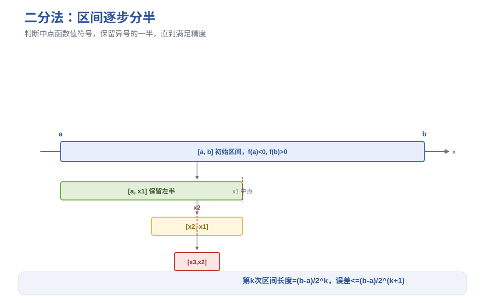
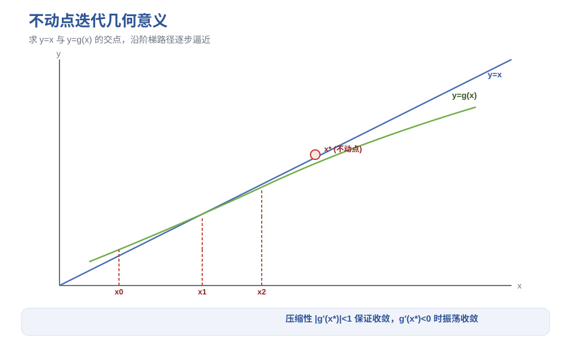
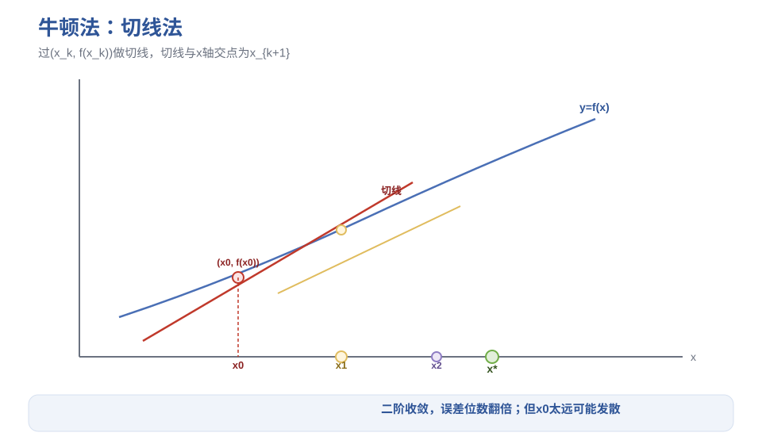
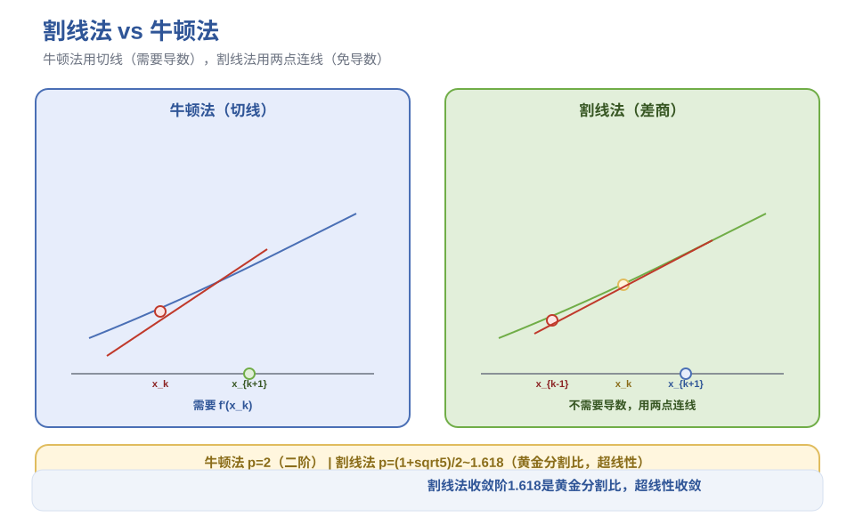
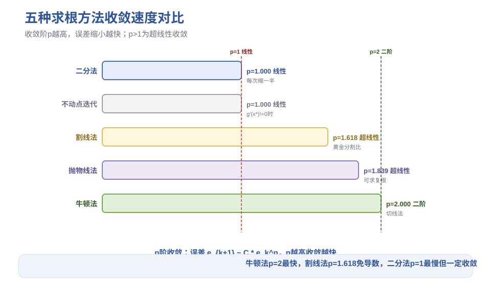

# 第2章 非线性方程求根 - 笔记

> 课程：数值计算方法（中国石油大学华东，国家级精品课，BV1NvYSzEEYd）
> 对应视频：p006-p011（2.1 二分法 ~ 2.6 割线法与抛物线法）

## 目录

- [1. 二分法](#1-二分法)
- [2. 不动点迭代法](#2-不动点迭代法)
- [3. 迭代加速](#3-迭代加速)
- [4. 牛顿迭代法](#4-牛顿迭代法)
- [5. 割线法与抛物线法](#5-割线法与抛物线法)
- [6. 五种方法对比总结](#6-五种方法对比总结)
- [7. 本节重点](#7-本节重点)

---

## 1. 二分法

### 1.1 原理

连续函数 $f(x)$，若区间端点函数值异号（$f(a) \cdot f(b) < 0$），则区间内至少有一个实根。

**基本思想**：逐步将区间分半，通过判断中点函数值的符号，把搜索区间缩小一半，直到满足精度要求。

### 1.2 算法步骤

1. 取区间中点 $x_1 = \frac{a+b}{2}$，计算 $f(x_1)$
2. 若 $f(x_1)$ 与 $f(a)$ 异号 → 根在左半区间，令 $b = x_1$
3. 否则 → 根在右半区间，令 $a = x_1$
4. 重复，直到区间长度满足精度

### 1.3 停机准则

| 准则 | 公式 | 注意事项 |
|------|------|---------|
| 相邻两步差 | $\Vertx_{k+1} - x_k\Vert < \varepsilon$ | 最常用 |
| 函数值很小 | $\Vertf(x_k)\Vert < \varepsilon$ | **不保险**：扁平函数 f 很小但离根还远 |
| 混合策略 | 两者结合 + 相对误差 | 推荐 |

### 1.4 误差估计与对分次数

第 $k$ 次对分后，区间长度：

$$|b_k - a_k| = \frac{b-a}{2^k}$$

近似值 $x_{k+1}$ 与真根 $x^*$ 的误差：

$$|x_{k+1} - x^*| \le \frac{b-a}{2^{k+1}}$$

**对分次数公式**（要求误差不超过 $\varepsilon$）：

$$k \ge \frac{\ln(b-a) - \ln\varepsilon}{\ln 2} - 1$$

**例**：求 $x^3 - x - 1 = 0$ 在 $[1, 1.5]$ 上的根，要求误差 $\le 10^{-2}$。

$a=1, b=1.5, \varepsilon=0.01$，代入得 $k \ge 4.64$，取 $k=5$ 次。

### 1.5 优缺点

| 优点 | 缺点 |
|------|------|
| 简单，编程容易 | 不能求复根（负数不能比较大小） |
| 对函数要求低（只要连续） | 不能求偶重根（如 $y=x^2$，两端同号） |
| 一定收敛 | 收敛慢（线性收敛，每次只缩一半） |

### 1.6 多根情况

先画草图或用搜索程序找出**隔根区间**（每个区间内只有一个根，两端异号），再对每个小区间调用二分法，各个击破。

---

> **图1** 二分法区间分半过程（自绘）。

## 2. 不动点迭代法

### 2.1 基本思想

将 $f(x) = 0$ 等价变换为 $x = g(x)$，求 $g$ 的**不动点**（$g$ 作用在 $x^*$ 上结果还是 $x^*$）。

**迭代格式**：

$$x_{k+1} = g(x_k)$$

从初始值 $x_0$ 出发，新值冲旧值，得到序列 $\{x_k\}$。若序列收敛于 $x^*$，且 $g$ 连续，则 $x^* = g(x^*)$，即 $x^*$ 是 $f(x)=0$ 的根。

> **关键**：$g(x)$ 和 $f(x)$ 是两个不同的函数。同一个方程可以有多种 $x=g(x)$ 的变换方式，收敛性差别很大。

### 2.2 全局收敛定理（充分条件）

若 $g(x)$ 满足：

1. **映内性**：对任意 $x \in [a,b]$，有 $g(x) \in [a,b]$（迭代值不跑出区间）
2. **压缩性**：存在常数 $L \in [0,1)$，使得对任意 $x \in [a,b]$，$|g'(x)| \le L$

则对任意 $x_0 \in [a,b]$，迭代序列 $\{x_k\}$ 收敛于 $g$ 在 $[a,b]$ 上的**唯一不动点**。

> 注意：压缩性条件是 $|g'(x)| \le L < 1$，不能写成 $|g'(x)| < 1$（后者可能在边界趋近于1，不保证收敛）。

**利普希茨条件**可代替导数条件：$|g(x_1)-g(x_2)| \le L|x_1-x_2|$，$L<1$（体现压缩性，函数不可导时也能用）。

### 2.3 误差估计式

$$|x_k - x^*| \le \frac{|x_{k+1} - x_k|}{1-L} \quad \text{（事后估计）}$$

$$|x_k - x^*| \le \frac{L^k}{1-L}|x_1 - x_0| \quad \text{（事前估计）}$$

> $L$ 越小，收敛越快。从第二式可见，$L<1$ 时 $L^k \to 0$，保证收敛。

### 2.4 局部收敛性

**定义**：假设不动点 $x^*$ 存在，且存在 $x^*$ 的某个邻域，对任意 $x_0$ 在该邻域内，迭代序列都收敛 → 称**局部收敛**。

**局部收敛定理**：已知 $x^*$ 是 $g$ 的不动点，$g'$ 在 $x^*$ 邻域连续，且 $|g'(x^*)| < 1$ → 迭代法局部收敛（**不需要验证映内性**）。

### 2.5 收敛阶（收敛速度的度量）

设 $e_k = x_k - x^*$，若存在 $p \ge 1$ 和 $C > 0$，使得：

$$\lim_{k \to \infty} \frac{|e_{k+1}|}{|e_k|^p} = C$$

则称迭代法是 **$p$ 阶收敛**，$C$ 为渐近误差常数。

| 收敛阶 | 名称 | 特点 |
|--------|------|------|
| $p=1$ | 线性收敛 | 要求 $0<C<1$，误差按比例缩小 |
| $p>1$ | 超线性收敛 | 误差缩小越来越快 |
| $p=2$ | 平方收敛 | 误差位数翻倍（如 0.1→0.01→0.0001） |

> **直观理解**：若当前误差约 0.1，$p=3$ 时下一步误差约 $0.1^3=0.001$，$p$ 越高收敛越快。

**$p$ 阶收敛的充要条件**：$g$ 在 $x^*$ 处有直到 $p$ 阶连续导数，且 $g'(x^*)=g''(x^*)=\cdots=g^{(p-1)}(x^*)=0$，$g^{(p)}(x^*) \neq 0$。

> 一般不动点迭代通常是**线性收敛**（$g'(x^*) \neq 0$）。要超线性收敛，需要 $g'(x^*)=0$。

---

> **图2** 不动点迭代几何意义：y=x 与 y=g(x) 的交点（自绘）。

## 3. 迭代加速

用于**线性收敛**的迭代法（收敛已经很快的无需加速）。

### 3.1 两个迭代值的组合（加权平均）

改造不动点形式 $x = g(x)$，两端减 $\theta x$：

$$x_{k+1} = \frac{g(x_k) - \theta x_k}{1 - \theta}$$

相当于把 $x_k$ 和 $g(x_k)$ 做加权平均。

**特殊情况 $\theta=1$**：取前后两次迭代值的平均值 $x_{k+1} = \frac{x_k + g(x_k)}{2}$。

> 对**振荡收敛**（$g'(x^*) < 0$，迭代值在根两侧来回跳）特别有效——两个振荡点的中点离根很近。

### 3.2 史蒂芬森（Stephenson）加速（三个迭代值组合）

从 $x_k$ 出发，先迭代两次：

$$y_k = g(x_k), \quad z_k = g(y_k)$$

然后用三个值组合：

$$x_{k+1} = x_k - \frac{(y_k - x_k)^2}{z_k - 2y_k + x_k}$$

**特点**：
- **二阶收敛**（比原迭代法快）
- 有时能把**不收敛**的迭代改进为收敛
- 每步需要两次函数求值（$g(x_k)$ 和 $g(y_k)$）

**理论保证**：若 $g$ 在 $x^*$ 邻域二阶连续可微，且 $g'(x^*) \neq 0$ 且 $g'(x^*) \neq 1$，则史蒂芬森加速后二阶收敛到 $x^*$。

### 3.3 艾特肯（Aitken）加速

与史蒂芬森思想相同，但出发点不同：已知迭代序列 $\{x_k\}$（不知道迭代函数 $g$），直接对序列加速。

| 方法 | 已知什么 | 适用场景 |
|------|---------|---------|
| 史蒂芬森加速 | 已知迭代函数 $g$ | 有迭代格式，想加速 |
| 艾特肯加速 | 已知迭代序列 $\{x_k\}$ | 只有数据，没有迭代公式 |

---

## 4. 牛顿迭代法

### 4.1 推导

**方式一：待定函数法**

构造 $g(x) = x + c(x)f(x)$，令 $g'(x^*) = 0$（保证至少二阶收敛），解得 $c(x) = -\frac{1}{f'(x)}$。

**方式二：泰勒展开（线性化）**

将 $f(x)$ 在 $x_k$ 处泰勒展开，取线性项：

$$f(x) \approx f(x_k) + f'(x_k)(x - x_k)$$

令其为 0，解得：

$$x_{k+1} = x_k - \frac{f(x_k)}{f'(x_k)}$$

### 4.2 几何意义：切线法

过点 $(x_k, f(x_k))$ 做曲线 $y=f(x)$ 的切线，切线与 $x$ 轴的交点即为 $x_{k+1}$。

切线方程：$y = f(x_k) + f'(x_k)(x - x_k)$，令 $y=0$ 即得迭代公式。

### 4.3 收敛性

**局部收敛定理**：$f$ 在 $x^*$ 邻域二阶连续可微，$f'(x^*) \neq 0$ → 牛顿法局部收敛，且**不低于二阶**。

- 若 $f''(x^*) \neq 0$ → 恰好二阶收敛
- 若 $f''(x^*) = 0$ → 更高阶收敛

**全局收敛充分条件**（在 $[a,b]$ 上）：

1. $f(a) \cdot f(b) < 0$（两端异号，保证有根）
2. $f''(x)$ 不变号，$f'(x) \neq 0$（单调，根唯一）
3. 选取 $x_0$ 满足 $f(x_0) \cdot f''(x_0) > 0$（保证迭代序列单调有界）

> 牛顿法**严重依赖初始值** $x_0$ 的选择——$x_0$ 离根太远可能发散。

### 4.4 经典应用：求平方根

求 $\sqrt{a}$，即解方程 $f(x) = x^2 - a = 0$，$f'(x) = 2x$。

代入牛顿公式：

$$x_{k+1} = \frac{1}{2}\left(x_k + \frac{a}{x_k}\right)$$

> 这就是手算开平方的公式！只用加法和除法。

**例**：求 $\sqrt{101}$，取 $x_0=10$：
- $x_1 = \frac{1}{2}(10 + 101/10) = 10.05$
- $x_2 = \frac{1}{2}(10.05 + 101/10.05) \approx 10.0499$
- $x_3 \approx 10.0499$（六位有效数字已收敛）

**求 $1/\sqrt{a}$**：构造 $f(x) = a - 1/x^2$，可得**既无除法又无开方**的迭代格式。

---

> **图3** 牛顿法切线法几何意义（自绘）。

## 5. 割线法与抛物线法

牛顿法每步需要计算 $f(x_k)$ 和 $f'(x_k)$，当导数难以计算或无法计算时，用函数值构造导数的近似。

### 5.1 割线法（弦割法）

用**差商**代替导数：

$$f'(x_k) \approx \frac{f(x_k) - f(x_{k-1})}{x_k - x_{k-1}}$$

代入牛顿公式：

$$x_{k+1} = x_k - f(x_k) \cdot \frac{x_k - x_{k-1}}{f(x_k) - f(x_{k-1})}$$

**几何意义**：过 $(x_{k-1}, f(x_{k-1}))$ 和 $(x_k, f(x_k))$ 做割线，割线与 $x$ 轴交点为 $x_{k+1}$。

| 项目 | 牛顿法 | 割线法 |
|------|--------|--------|
| 初始值 | 1 个 | 2 个 |
| 导数 | 需要计算 | 不需要（用差商代替） |
| 收敛阶 | 2（二阶） | $\frac{1+\sqrt{5}}{2} \approx 1.618$ |
| 每步函数求值 | 2 次（f 和 f'） | 1 次（复用前一步的 f） |

> 割线法的收敛阶 1.618 是**黄金分割比**！超线性收敛，介于二分法（线性）和牛顿法（二阶）之间。

**局部收敛定理**：$f'(x^*) \neq 0$，$f''$ 在 $x^*$ 附近连续 → 割线法局部收敛。

### 5.2 抛物线法（缪勒/Muller 方法）

用**三个点**构造抛物线，抛物线与 $x$ 轴的交点作为下一步迭代值。

- 需要 3 个初始值 $x_{k-2}, x_{k-1}, x_k$
- 过这三个点做二次插值多项式（抛物线，见第4章拉格朗日插值）
- 求抛物线的零点作为 $x_{k+1}$
- 若抛物线与 $x$ 轴有两个交点，选离 $x_k$ 最近的那个

**收敛阶**：$p \approx 1.839$（比割线法快，比牛顿法慢）。

**独特优点**：可以求**复根**——抛物线可能有两个交点（包括共轭复根），这是割线法和牛顿法做不到的。

---

> **图4** 割线法 vs 牛顿法对比（自绘）。

## 6. 五种方法对比总结

| 方法 | 初始值 | 需要导数 | 收敛阶 | 函数求值/步 | 特点 |
|------|--------|---------|--------|------------|------|
| 二分法 | 1个区间 | 否 | 1（线性） | 1次 | 简单一定收敛，但慢，不能求复根/偶重根 |
| 不动点迭代 | 1个 | 否 | 1（线性） | 1次 | 灵活，依赖g的选择，可加速 |
| 牛顿法 | 1个 | 是 | 2（二阶） | 2次 | 收敛快，依赖初始值，需要导数 |
| 割线法 | 2个 | 否 | ≈1.618 | 1次 | 免导数，超线性收敛 |
| 抛物线法 | 3个 | 否 | ≈1.839 | 1次 | 免导数，可求复根 |

**选择策略**：
- 不知道根在哪 → 先用二分法缩小区间，再用牛顿法/割线法精化
- 导数好算 → 牛顿法（最快）
- 导数难算 → 割线法（免导数，超线性）
- 需要求复根 → 抛物线法
- 线性收敛太慢 → 史蒂芬森加速

---

> **图5** 五种方法收敛速度对比（自绘）。

## 7. 本节重点

> **本节重点**：
> - **二分法**：两端异号+连续→有根；每次缩一半；误差 $\le (b-a)/2^{k+1}$；线性收敛；不能求复根/偶重根
> - **不动点迭代**：$f(x)=0 \to x=g(x)$；收敛两条件=映内性+压缩性（$|g'|\le L<1$）；一般线性收敛
> - **收敛阶**：$p$ 阶收敛意味着误差按 $p$ 次方缩小；$p=1$ 线性，$p=2$ 平方，$p$ 越高越快
> - **迭代加速**：史蒂芬森加速（三个值组合）→ 二阶收敛，有时能救不收敛的迭代
> - **牛顿法**：$x_{k+1}=x_k-f(x_k)/f'(x_k)$；切线法；二阶收敛；严重依赖初始值
> - **割线法**：用差商代替导数；收敛阶 $\approx 1.618$（黄金分割比）；免导数
> - **抛物线法**：三点构造抛物线；收敛阶 $\approx 1.839$；可求复根
> - **常见坑**：
>   - 用 $|f(x_k)|<\varepsilon$ 停机不保险（扁平函数）
>   - 压缩性条件是 $|g'|\le L<1$，不是 $|g'|<1$
>   - 牛顿法 $x_0$ 选太远会发散，不要盲目选初始值
>   - 求 $\sqrt{a}$ 用 $x_{k+1}=(x_k+a/x_k)/2$，不要硬算开方

---

> **竞赛模板 → ICPC/数值计算**：二分答案、牛顿迭代求平方根、割线法免导数求根是编程竞赛中数值题的常用技巧。
