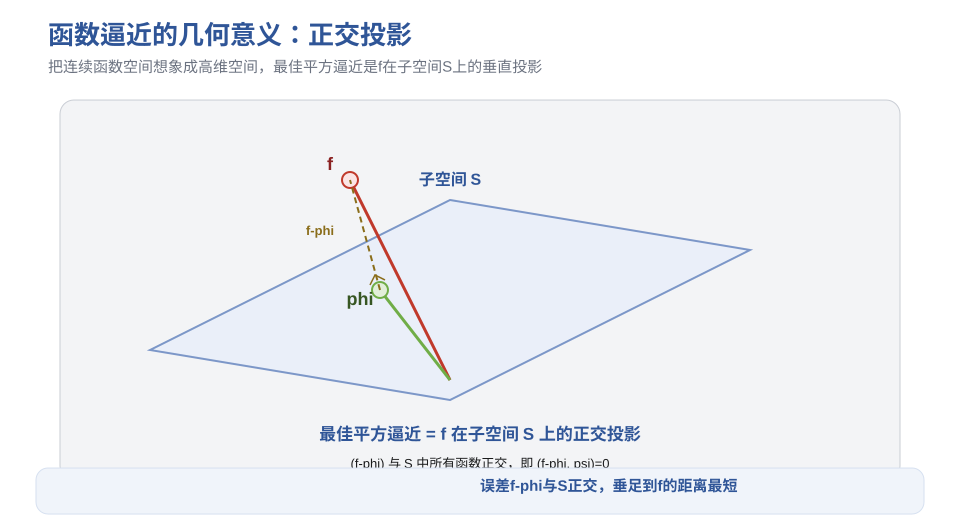
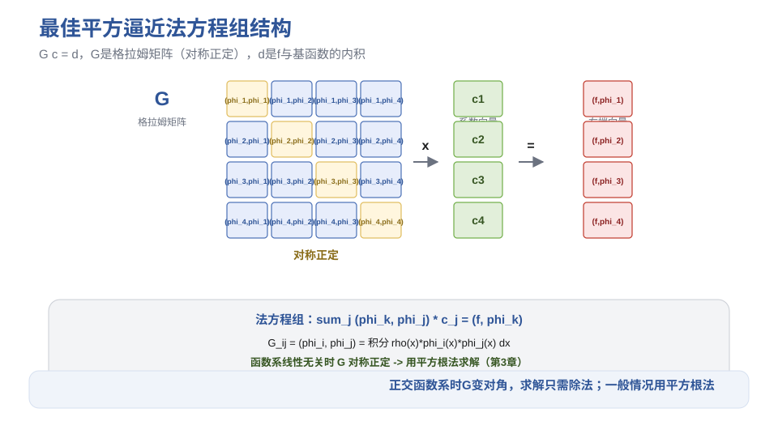
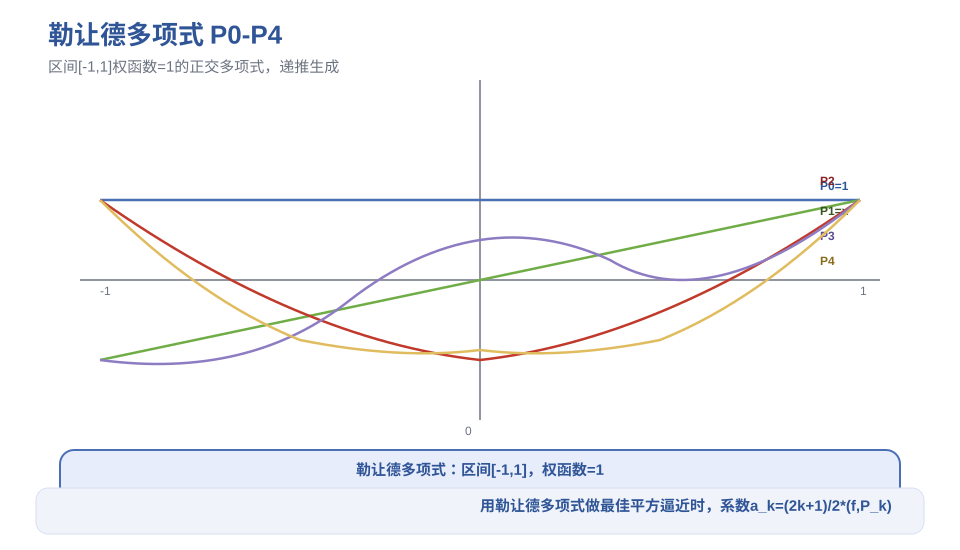
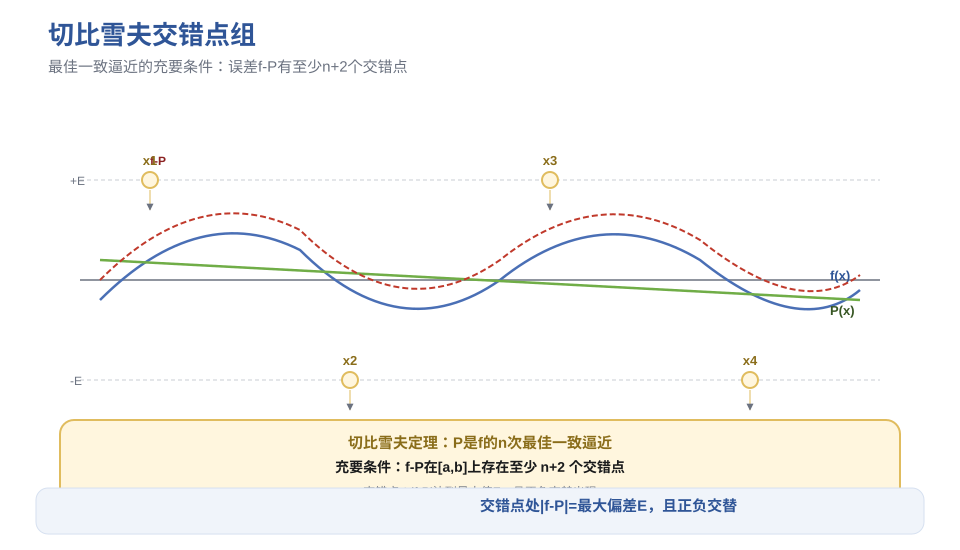
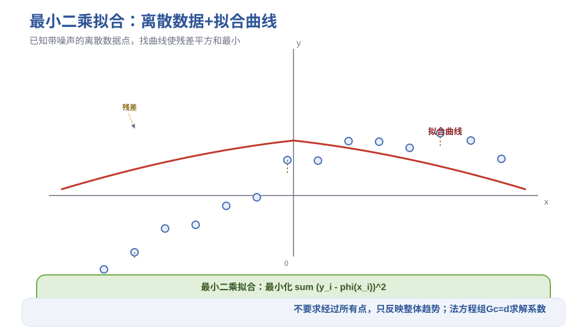

# 第5章 函数逼近与曲线拟合 - 笔记

> 课程：数值计算方法（中国石油大学华东，国家级精品课，BV1NvYSzEEYd）
> 对应视频：p030-p034（5.1 函数逼近问题 ~ 5.5 数据拟合的最小二乘法）

## 目录

- [1. 函数逼近问题概述](#1-函数逼近问题概述)
- [2. 最佳平方逼近](#2-最佳平方逼近)
- [3. 正交多项式](#3-正交多项式)
- [4. 最佳一致逼近](#4-最佳一致逼近)
- [5. 数据拟合的最小二乘法](#5-数据拟合的最小二乘法)
- [6. 本节重点](#6-本节重点)

---

## 1. 函数逼近问题概述

### 1.1 问题背景

给定区间 $[a,b]$ 上的连续函数 $f(x)$，在某个函数集中找一个简单函数 $\varphi(x)$ 近似 $f(x)$——既要求接近程度高，又要求计算简单。

**三个子问题**：

1. **确定逼近函数类型**（所在函数集）：通常选有限维子空间，如多项式、三角函数、指数函数
2. **确定度量标准**：用什么范数度量两个函数的"距离"
3. **求逼近函数**：在选定标准下求最优逼近

### 1.2 连续函数空间的范数

**P 范数**：

$$\|f\|_p = \left( \int_a^b |f(x)|^p dx \right)^{1/p}, \quad p \ge 1$$

常用：
- **1范数**：$\|f\|_1 = \int_a^b |f(x)| dx$
- **2范数**：$\|f\|_2 = \sqrt{\int_a^b f(x)^2 dx}$
- **无穷范数**：$\|f\|_\infty = \max_{x \in [a,b]} |f(x)|$

带权函数 $\rho(x)$ 的 P 范数：$\|f\|_{p,\rho} = \left( \int_a^b \rho(x)|f(x)|^p dx \right)^{1/p}$。

### 1.3 内积与正交

**内积**：$(f,g) = \int_a^b \rho(x) f(x) g(x) dx$，满足线性、对称、正定。

内积诱导范数：$\|f\| = \sqrt{(f,f)}$。

**正交**：$(f,g) = 0$ 称 $f$ 与 $g$ 正交。

### 1.4 两类函数逼近

| 类型 | 度量标准 | 名称 |
|------|---------|------|
| 用二范数 | $\min \Vertf-\varphi\Vert_2$ | **最佳平方逼近** |
| 用无穷范数 | $\min \Vertf-\varphi\Vert_\infty$ | **最佳一致逼近** |

---

> **图1** 函数逼近的几何意义：f 在子空间 S 上的正交投影（自绘）。

## 2. 最佳平方逼近

### 2.1 问题描述

设 $\varphi_1, \dots, \varphi_n$ 是 $[a,b]$ 上线性无关的函数系，生成子空间 $S$。求 $\varphi = \sum c_j \varphi_j \in S$，使

$$\|f - \varphi\|_2^2 = \int_a^b \left(f(x) - \sum_{j=1}^n c_j \varphi_j(x)\right)^2 dx$$

最小。

### 2.2 法方程组

对每个 $c_k$ 求偏导并令其为零，得到：

$$\sum_{j=1}^n (\varphi_k, \varphi_j) c_j = (f, \varphi_k), \quad k=1,2,\dots,n$$

写成矩阵形式 $G c = d$，其中：

- **格拉姆矩阵** $G$：$G_{kj} = (\varphi_k, \varphi_j)$，**对称正定**（函数系线性无关时）
- 右端向量 $d$：$d_k = (f, \varphi_k)$

> 法方程组有唯一解，对应唯一的最佳平方逼近函数。

### 2.3 最佳平方逼近的性质

1. **正交性**：$(f - \varphi, \psi) = 0$ 对任意 $\psi \in S$——误差 $f-\varphi$ 与子空间 $S$ 正交
2. **投影性质**：$\varphi$ 是 $f$ 在子空间 $S$ 上的**正交投影**
3. **勾股定理**：$\|f-\varphi\|_2^2 = \|f\|_2^2 - \|\varphi\|_2^2$（用于计算逼近误差，节省计算量）

> **几何理解**：把连续函数空间想象成高维空间，$S$ 是其中一个子空间（平面），$f$ 是空间中一个向量，最佳平方逼近就是 $f$ 在 $S$ 上的垂直投影——垂足到 $f$ 的距离最短。

### 2.4 算法

1. 构造法方程组（计算所有内积）
2. 求解法方程组（对称正定，用**平方根法/改进平方根法**，见第3章）
3. 得到系数 $c_j$，写出逼近函数 $\varphi$

**多项式逼近的优化**：用 $\{1, x, \dots, x^{n-1}\}$ 时，系数矩阵只有 $2n-1$ 个不同元素（$s_k = \int x^k dx$），预先计算后复制赋值，避免重复运算。

---

> **图2** 最佳平方逼近法方程组结构：格拉姆矩阵对称正定（自绘）。

## 3. 正交多项式

### 3.1 正交函数系的优势

若 $\varphi_1, \dots, \varphi_n$ 是正交函数系（$(\varphi_i, \varphi_j)=0, i\neq j$），则法方程组变为**对角方程组**：

$$(\varphi_k, \varphi_k) c_k = (f, \varphi_k) \implies c_k = \frac{(f, \varphi_k)}{(\varphi_k, \varphi_k)}$$

只需做除法，不需要解方程组！

### 3.2 施密特正交化

从线性无关函数系 $\{\varphi_j\}$ 构造正交函数系 $\{\psi_j\}$：

$$\psi_1 = \varphi_1$$

$$\psi_k = \varphi_k - \sum_{j=1}^{k-1} \frac{(\varphi_k, \psi_j)}{(\psi_j, \psi_j)} \psi_j$$

> 与线性代数中向量的施密特正交化完全类似。

### 3.3 常用正交多项式

| 名称 | 区间 | 权函数 $\rho(x)$ |
|------|------|------------------|
| 勒让德（Legendre） | $[-1, 1]$ | $1$ |
| 切比雪夫（Chebyshev） | $[-1, 1]$ | $1/\sqrt{1-x^2}$ |
| 拉盖尔（Laguerre） | $[0, +\infty)$ | $e^{-x}$ |
| 埃尔米特（Hermite） | $(-\infty, +\infty)$ | $e^{-x^2}$ |

### 3.4 勒让德多项式

**定义区间**：$[-1,1]$，权函数 $\rho(x)=1$。

前几个：
- $P_0(x) = 1$
- $P_1(x) = x$
- $P_2(x) = \frac{1}{2}(3x^2 - 1)$
- $P_3(x) = \frac{1}{2}(5x^3 - 3x)$

**递推公式**：$(n+1)P_{n+1}(x) = (2n+1)x P_n(x) - n P_{n-1}(x)$

**罗德里克公式**：$P_n(x) = \frac{1}{2^n n!} \frac{d^n}{dx^n}[(x^2-1)^n]$

**内积性质**：

$$(P_n, P_n) = \int_{-1}^1 P_n^2(x) dx = \frac{2}{2n+1}$$

**用勒让德多项式求最佳平方逼近**：

$$\varphi(x) = \sum_{k=0}^n a_k P_k(x), \quad a_k = \frac{2k+1}{2} \int_{-1}^1 f(x) P_k(x) dx$$

**一般区间 $[a,b]$**：做变量替换 $t = \frac{2x-a-b}{b-a}$，将 $[a,b]$ 映射到 $[-1,1]$，再用勒让德多项式。

### 3.5 切比雪夫多项式

**定义区间**：$[-1,1]$，权函数 $\rho(x) = 1/\sqrt{1-x^2}$。

**通式**：

$$T_n(x) = \cos(n \arccos x)$$

前几个：
- $T_0(x) = 1$
- $T_1(x) = x$
- $T_2(x) = 2x^2 - 1$
- $T_3(x) = 4x^3 - 3x$

**重要性质**：
1. $|T_n(x)| \le 1$（在 $[-1,1]$ 上）
2. 递推公式：$T_{n+1}(x) = 2x T_n(x) - T_{n-1}(x)$
3. **最小偏差性质**：在首项系数为 1 的所有 $n$ 次多项式中，$2^{1-n} T_n(x)$ 与零的偏差最小（无穷范数最小）

> 这个性质是切比雪夫插值（近似最佳一致逼近）的理论基础。

---

> **图3** 勒让德多项式前几个的图形（自绘）。

## 4. 最佳一致逼近

### 4.1 问题描述

在次数不超过 $n$ 的多项式集合 $H_n$ 中，找 $P(x)$ 使

$$\|f - P\|_\infty = \max_{x \in [a,b]} |f(x) - P(x)|$$

最小。

### 4.2 魏尔斯特拉斯定理

若 $f(x)$ 在 $[a,b]$ 上连续，则对任意 $\varepsilon > 0$，存在多项式 $P_n(x)$ 使 $\|f - P_n\|_\infty < \varepsilon$。

> 保证了最佳一致逼近多项式的存在性。伯恩斯坦给出了构造性证明（伯恩斯坦多项式），但收敛太慢，不实用。

### 4.3 切比雪夫交错点组

**定义**：若 $f-P$ 在 $[a,b]$ 上存在 $m$ 个点 $x_1 < x_2 < \dots < x_m$，满足：

$$|f(x_i) - P(x_i)| = \|f-P\|_\infty$$

且 $f(x_i) - P(x_i) = -[f(x_{i+1}) - P(x_{i+1})]$（正负交错），则称 $\{x_i\}$ 为切比雪夫交错点组。

### 4.4 切比雪夫定理（最佳一致逼近的充要条件）

$P(x)$ 是 $f(x)$ 的 $n$ 次最佳一致逼近多项式 $\iff$ $f-P$ 在 $[a,b]$ 上存在**至少 $n+2$ 个点**的交错点组。

> 最佳一致逼近多项式存在且唯一。

**推论**：若 $f^{(n+1)}(x)$ 在 $[a,b]$ 上不变号，则区间端点 $a, b$ 属于交错点组。

### 4.5 一次最佳一致逼近（可解析求解）

设 $f''(x)$ 在 $[a,b]$ 上不变号，求一次多项式 $P(x) = c_0 + c_1 x$。

交错点组有 3 个点：$a, x_2, b$（端点已知，只需找中间点 $x_2$）。

$$c_1 = \frac{f(b) - f(a)}{b - a}$$

$$x_2 \text{ 满足 } f'(x_2) = c_1$$

$$c_0 = \frac{f(a) + f(x_2)}{2} - c_1 \frac{a + x_2}{2}$$

> 几何意义：最佳逼近直线平行于连接两端点的弦，位于曲线与弦之间的"中间位置"。

### 4.6 高次最佳一致逼近

需求解非线性方程组（交错点位置未知），复杂。

**实用近似方法——切比雪夫插值**：以切比雪夫多项式 $T_{n+1}(x)$ 的零点为插值节点，做 $n$ 次插值多项式。

切比雪夫零点：

$$x_k = \cos\left(\frac{2k-1}{2(n+1)}\pi\right), \quad k=1,2,\dots,n+1$$

> 这些节点使余项中连乘积 $\prod(x-x_k)$ 的无穷范数最小，因此是近似最佳一致逼近。

一般区间 $[a,b]$ 上的节点：$x_k = \frac{a+b}{2} + \frac{b-a}{2} \cos\left(\frac{2k-1}{2(n+1)}\pi\right)$。

---

> **图4** 切比雪夫交错点组：最佳一致逼近的充要条件（自绘）。

## 5. 数据拟合的最小二乘法

### 5.1 问题描述

已知离散数据 $(t_i, y_i)$（$i=1,\dots,m$，通常来自实验观测，可能有误差），找函数 $\varphi(t)$ 近似反映数据的整体趋势。

**与插值的区别**：
- 插值：要求严格经过所有已知点
- 拟合：只要求整体接近，不要求经过每个点（数据有误差时强行经过所有点反而不好）

### 5.2 线性最小二乘拟合

设拟合函数 $\varphi(t) = \sum_{j=1}^n c_j \varphi_j(t)$（关于系数 $c_j$ 是线性的），使残差的二范数平方最小：

$$\sum_{i=1}^m \left[y_i - \varphi(t_i)\right]^2 = \min$$

### 5.3 法方程组

对每个 $c_k$ 求偏导=0，得到：

$$\sum_{j=1}^n \left(\sum_{i=1}^m \varphi_k(t_i)\varphi_j(t_i)\right) c_j = \sum_{i=1}^m y_i \varphi_k(t_i)$$

写成矩阵形式 $G c = d$，其中：
- $G_{kj} = \sum_{i=1}^m \varphi_k(t_i)\varphi_j(t_i)$（对称正定）
- $d_k = \sum_{i=1}^m y_i \varphi_k(t_i)$

> 与连续最佳平方逼近的法方程组结构相同，只是把积分换成了离散求和。

### 5.4 多项式拟合

取 $\varphi_j(t) = t^{j-1}$（$j=1,\dots,n$），即拟合 $n-1$ 次多项式。

系数矩阵中不同元素只有 $2n-1$ 个（$s_k = \sum t_i^k$），预先计算后复制赋值。

### 5.5 可线性化的非线性拟合

某些非线性模型通过变量替换可化为线性拟合：

| 原模型 | 变换 | 线性形式 |
|--------|------|---------|
| $y = a x^b$ | 取对数 | $\ln y = \ln a + b \ln x$ |
| $y = a e^{bx}$ | 取对数 | $\ln y = \ln a + bx$ |
| $y = \frac{1}{a+bx}$ | 取倒数 | $\frac{1}{y} = a + bx$ |
| $y = \frac{x}{a+bx}$ | 取倒数 | $\frac{x}{y} = a + bx$ |

> **注意**：线性化改变了目标函数（原来是最小化 $\sum(y_i-\hat y_i)^2$，变成了最小化 $\sum(\ln y_i - \ln \hat y_i)^2$），结果可能与原非线性拟合有差异。如果各数据点的权值相差不大，结果通常接近。

---

> **图5** 最小二乘拟合：离散数据点 + 拟合曲线（自绘）。

## 6. 本节重点

> **本节重点**：
> - **函数逼近**：在有限维子空间中找简单函数近似f；两类=最佳平方逼近（二范数）+ 最佳一致逼近（无穷范数）
> - **最佳平方逼近**：法方程组 $Gc=d$，G是格拉姆矩阵（对称正定）；解是f在子空间上的正交投影；误差满足勾股定理 $\|f-\varphi\|^2=\|f\|^2-\|\varphi\|^2$
> - **正交多项式**：正交函数系使法方程组变对角（只需除法）；施密特正交化构造；勒让德（[-1,1]，权=1）、切比雪夫（[-1,1]，权=1/√(1-x²)）、拉盖尔、埃尔米特
> - **勒让德多项式**：$P_0=1, P_1=x, P_2=(3x²-1)/2$；递推 $(n+1)P_{n+1}=(2n+1)xP_n-nP_{n-1}$；内积 $(P_n,P_n)=2/(2n+1)$；一般区间需变量替换
> - **切比雪夫多项式**：$T_n(x)=\cos(n\arccos x)$，$|T_n|\le1$；首一n次多项式中 $2^{1-n}T_n$ 与零偏差最小；零点是最佳插值节点
> - **最佳一致逼近**：切比雪夫定理——f-P存在至少n+2个交错点组 ⟺ 最佳一致逼近；一次可解析求（3个交错点，两端点已知）；高次用切比雪夫插值近似
> - **最小二乘拟合**：离散数据，最小化残差平方和；法方程组与连续情况类似（积分换求和）；多项式拟合系数矩阵只有2n-1个不同元素
> - **可线性化的非线性拟合**：$y=ax^b$→取对数；$y=ae^{bx}$→取对数；$y=1/(a+bx)$→取倒数；注意线性化改变了目标函数
> - **常见坑**：
>   - 最佳平方逼近的法方程组用平方根法解（对称正定），不要用一般高斯消元
>   - 正交多项式的区间和权函数必须匹配，勒让德是[-1,1]权=1，一般区间要先做变量替换
>   - 切比雪夫插值节点是 $T_{n+1}$ 的零点（不是等距节点！），等距节点高次插值会龙格现象
>   - 拟合不要求经过所有点（数据有误差），强行经过所有点反而不好
>   - 非线性模型线性化后结果可能与原问题有差异，权值差异大时尤甚

---

> **竞赛模板 → ICPC/数值计算**：最小二乘拟合、正交多项式、切比雪夫插值是编程竞赛中数值题的常用技巧。曲线拟合在数据分析、机器学习中也有广泛应用。
