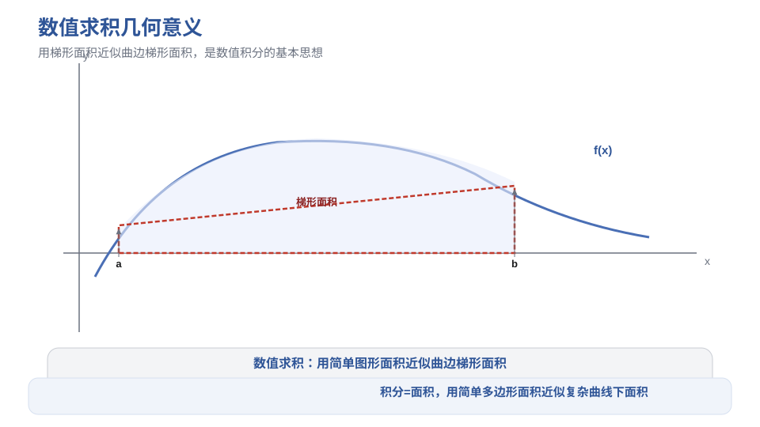
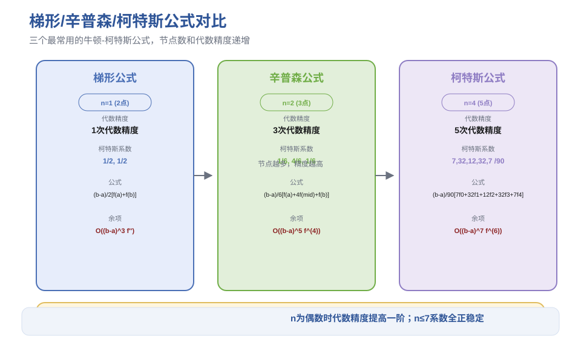
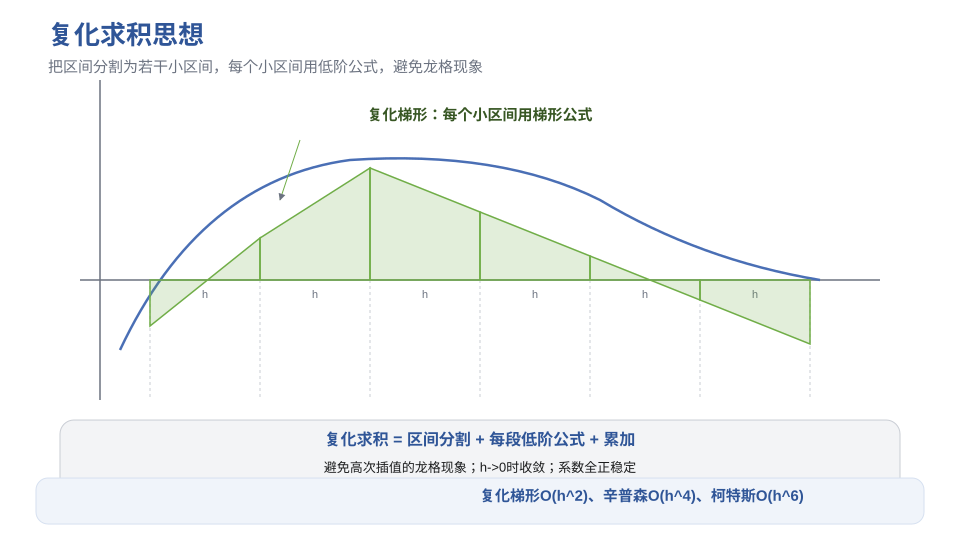
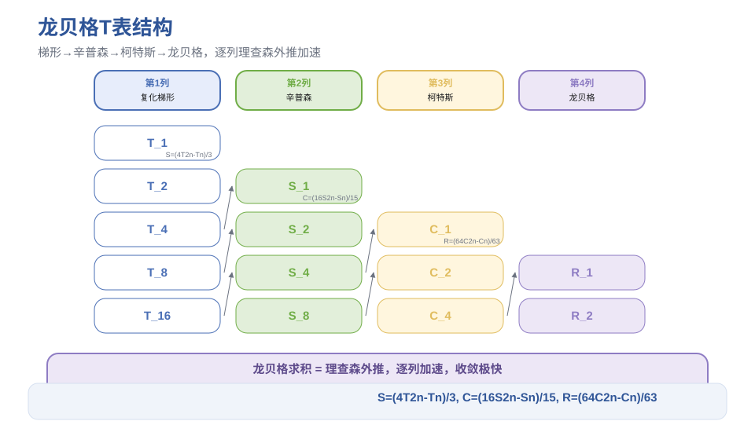
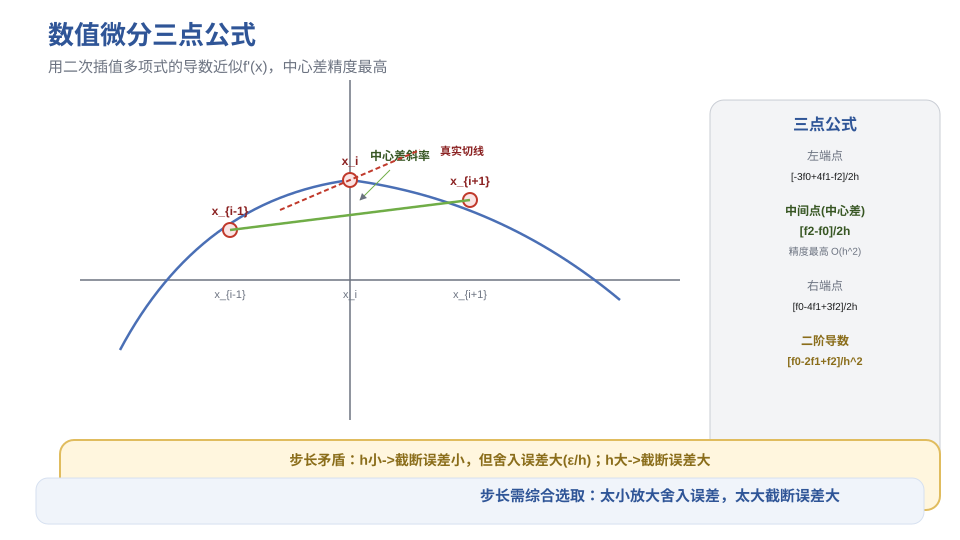

# 第6章 数值积分与数值微分 - 笔记

> 课程：数值计算方法（中国石油大学华东，国家级精品课，BV1NvYSzEEYd）
> 对应视频：p035-p041（6.1 数值求积基本问题 ~ 6.7 数值微分）

## 目录

- [1. 数值求积基本问题](#1-数值求积基本问题)
- [2. 牛顿-柯特斯公式](#2-牛顿-柯特斯公式)
- [3. 复化求积公式](#3-复化求积公式)
- [4. 变步长与龙贝格求积](#4-变步长与龙贝格求积)
- [5. 高斯求积公式](#5-高斯求积公式)
- [6. 数值微分](#6-数值微分)
- [7. 本节重点](#7-本节重点)

---

## 1. 数值求积基本问题

### 1.1 为什么需要数值积分

牛顿-莱布尼兹公式 $\int_a^b f(x)dx = F(b)-F(a)$ 需要原函数，但实际中常遇到：

1. **原函数非常复杂**——虽可求出但计算不便
2. **原函数是非初等函数**——如 $\int e^{-x^2}dx$、$\int \frac{\sin x}{x}dx$，无法用牛顿-莱布尼兹公式
3. **$f(x)$ 没有解析式**——只有表格形式的离散数据（实验观测值）

### 1.2 数值求积的基本思想

$$\int_a^b f(x) dx \approx \sum_{k=0}^n A_k f(x_k)$$

- $x_k$：**求积节点**
- $A_k$：**求积系数**（与被积函数无关，只依赖节点和区间）
- 余项 $R = \int_a^b f(x)dx - \sum A_k f(x_k)$

带权函数的一般形式：$\int_a^b \rho(x) f(x) dx \approx \sum A_k f(x_k)$。

### 1.3 代数精度

**定义**：若求积公式对所有次数 $\le m$ 的多项式精确成立（余项为零），但对 $m+1$ 次多项式不精确，则称该公式具有 **$m$ 次代数精度**。

**判断定理（充要条件）**：公式代数精度为 $m$ $\iff$ 对 $f(x)=1, x, x^2, \dots, x^m$ 精确成立，对 $x^{m+1}$ 不精确。

> 只需逐次验证幂函数，比验证"任意多项式"方便得多。

**基本性质**：至少具有零次代数精度的公式 $\implies \sum A_k = b-a$（系数之和=区间长度）。

### 1.4 收敛性与稳定性

- **收敛性**：$h \to 0$（节点间距最大值）时，近似值 $\to$ 精确值
- **稳定性**：原始数据（函数值）有误差时，对结果的影响程度
  - 系数全为正：误差 $\le \varepsilon \sum |A_k| = \varepsilon(b-a)$，**稳定**
  - 系数有正有负：$\sum |A_k| > b-a$，稳定性变差

> 实际应用中应尽量选用求积系数全为正的公式。

---


> **图1** 数值求积几何意义：用梯形/抛物线面积近似曲边梯形面积（自绘）。

## 2. 牛顿-柯特斯公式

### 2.1 插值型求积公式

用 $f$ 的插值多项式 $P_n(x)$ 近似代替 $f(x)$，对 $P_n$ 积分：

$$\int_a^b f(x) dx \approx \int_a^b P_n(x) dx = \sum_{k=0}^n \left(\int_a^b l_k(x) dx\right) f(x_k)$$

其中 $A_k = \int_a^b l_k(x) dx$（拉格朗日基函数的积分）。

**性质**：$n+1$ 个节点的插值型求积公式至少具有 $n$ 次代数精度。

### 2.2 牛顿-柯特斯公式（等距节点）

节点等距分布：$x_k = a + kh$，$h = (b-a)/n$。

$$\int_a^b f(x) dx \approx (b-a) \sum_{k=0}^n C_k^{(n)} f(x_k)$$

其中 $C_k^{(n)}$ 称为**柯特斯系数**，满足 $\sum C_k^{(n)} = 1$。

### 2.3 三个最常用的公式

| 公式 | 节点数 | 柯特斯系数 | 代数精度 | 余项 |
|------|--------|-----------|---------|------|
| **梯形公式**（n=1） | 2 | $\frac{1}{2}, \frac{1}{2}$ | 1次 | $-\frac{(b-a)^3}{12}f''(\xi)$ |
| **辛普森公式**（n=2） | 3 | $\frac{1}{6}, \frac{4}{6}, \frac{1}{6}$ | 3次 | $-\frac{(b-a)^5}{2880}f^{(4)}(\xi)$ |
| **柯特斯公式**（n=4） | 5 | $\frac{7}{90},\frac{32}{90},\frac{12}{90},\frac{32}{90},\frac{7}{90}$ | 5次 | $-\frac{(b-a)^7}{...}f^{(6)}(\xi)$ |

**梯形公式**：

$$\int_a^b f(x) dx \approx \frac{b-a}{2}[f(a) + f(b)]$$

**辛普森公式**（抛物线公式）：

$$\int_a^b f(x) dx \approx \frac{b-a}{6}\left[f(a) + 4f\left(\frac{a+b}{2}\right) + f(b)\right]$$

**柯特斯公式**：

$$\int_a^b f(x) dx \approx \frac{b-a}{90}[7f(a)+32f(a+h)+12f(a+2h)+32f(a+3h)+7f(b)]$$

### 2.4 代数精度规律

- $n$ 为**奇数**时：至少具有 $n$ 次代数精度
- $n$ 为**偶数**时：至少具有 $n+1$ 次代数精度（提高了一阶）

> 这就是为什么辛普森公式（n=2，偶数）有3次代数精度而不是2次。

### 2.5 稳定性与使用限制

- $n \le 7$：柯特斯系数全为正，**稳定**
- $n \ge 8$：系数出现负数，**不稳定**

> 实际应用中只选用 $n \le 7$ 的牛顿-柯特斯公式，最常用的是梯形、辛普森、柯特斯。

> 高次牛顿-柯特斯公式还可能因龙格现象导致积分结果不可靠（插值多项式在端点振荡）。

---


> **图2** 梯形、辛普森、柯特斯公式对比（自绘）。

## 3. 复化求积公式

### 3.1 基本思想

不能用提高牛顿-柯特斯公式阶数的方法提高精度（龙格现象+不稳定）。

**实用方法**：把积分区间等分为 $n$ 个小区间，在每个小区间上用低阶牛顿-柯特斯公式，然后累加。

> 与第4章分段低次插值的思想一致。

### 3.2 复化梯形公式

$$T_n = \frac{h}{2}\left[f(a) + f(b) + 2\sum_{k=1}^{n-1} f(x_k)\right], \quad h = \frac{b-a}{n}$$

> 系数规律：两端点系数1，内部节点系数2（因为每个内部点属于两个小区间，被计算两次）。

**余项**：

$$R = -\frac{(b-a)h^2}{12} f''(\xi) = O(h^2)$$

### 3.3 复化辛普森公式

每个小区间再取中点，用辛普森公式：

$$S_n = \frac{h}{6}\left[f(a)+f(b)+4\sum_{k=0}^{n-1} f(x_{k+1/2})+2\sum_{k=1}^{n-1} f(x_k)\right]$$

> 系数规律：端点1，小区间中点4，内部分点2。

**余项**：

$$R = -\frac{(b-a)h^4}{2880} f^{(4)}(\xi) = O(h^4)$$

### 3.4 复化柯特斯公式

类似推导，余项 $O(h^6)$。

### 3.5 收敛性与稳定性

- **收敛性**：$f$ 连续时，$h \to 0$ 近似值 $\to$ 精确值（复化公式均收敛）
- **稳定性**：求积系数全为正，稳定

### 3.6 精度与计算量对比

对同一积分、同一精度要求，三种公式所需节点数差异巨大：

| 公式 | 误差阶 | 典型节点数（精度 $10^{-7}$） |
|------|--------|-------------------------------|
| 复化梯形 | $O(h^2)$ | ~2130 |
| 复化辛普森 | $O(h^4)$ | ~25 |
| 复化柯特斯 | $O(h^6)$ | ~9 |

> 高阶公式在相同精度下计算量小得多，但需要更高阶导数有界。

---


> **图3** 复化求积思想：区间分割为小区间，每段低阶公式（自绘）。

## 4. 变步长与龙贝格求积

### 4.1 事后误差估计

用余项估计 $n$ 需要高阶导数，实际中困难。改用**两次计算结果**估计误差：

| 公式 | 误差估计 | 系数来源 |
|------|---------|---------|
| 复化梯形 | $I - T_{2n} \approx \frac{1}{3}(T_{2n} - T_n)$ | $2^2-1=3$ |
| 复化辛普森 | $I - S_{2n} \approx \frac{1}{15}(S_{2n} - S_n)$ | $2^4-1=15$ |
| 复化柯特斯 | $I - C_{2n} \approx \frac{1}{63}(C_{2n} - C_n)$ | $2^6-1=63$ |

> 原理：误差近似与 $h^p$ 成反比，步长减半后误差缩小为 $1/2^p$。

### 4.2 变步长梯形算法

1. 计算 $T_n$
2. 步长减半，计算 $T_{2n}$（利用旧结果，只算新增节点）
3. 判断 $\frac{1}{3}|T_{2n} - T_n| < \varepsilon$，满足则停止，否则继续

**逐次分半递推公式**（避免重复计算）：

$$T_{2n} = \frac{1}{2}T_n + \frac{h}{2}\sum_{k=0}^{n-1} f(x_{k+1/2})$$

> 新增节点只是各小区间的中点，上一步的函数值全部复用。

### 4.3 龙贝格求积（理查森外推）

用误差估计值补偿当前结果，得到更高精度的公式：

**梯形加速**（→辛普森）：

$$S_n = \frac{4T_{2n} - T_n}{4-1} = \frac{4T_{2n} - T_n}{3}$$

**辛普森加速**（→柯特斯）：

$$C_n = \frac{16S_{2n} - S_n}{16-1} = \frac{16S_{2n} - S_n}{15}$$

**柯特斯加速**（→龙贝格）：

$$R_n = \frac{64C_{2n} - C_n}{64-1} = \frac{64C_{2n} - C_n}{63}$$

> 前两个加速结果正好是复化辛普森和复化柯特斯公式；第三个得到的是**新公式——龙贝格公式**，它不属于牛顿-柯特斯系列（九点牛顿-柯特斯系数有正有负，龙贝格系数全为正，更稳定）。

### 4.4 龙贝格算法（T表）

构造逐列加速的三角形表格：

```
T_1
T_2  →  S_1
T_4  →  S_2  →  C_1
T_8  →  S_4  →  C_2  →  R_1
T_16 →  S_8  →  C_4  →  R_2
```

- 第1列：复化梯形公式（步长逐次减半）
- 第2列：梯形加速→辛普森
- 第3列：辛普森加速→柯特斯
- 第4列：柯特斯加速→龙贝格

一般计算到 $R_2$（第5行）再做误差估计 $\frac{1}{255}|R_2-R_1| < \varepsilon$。

> 龙贝格方法收敛极快，通常只需很少的函数求值就能达到高精度。

---


> **图4** 龙贝格T表结构：逐列加速（自绘）。

## 5. 高斯求积公式

### 5.1 基本思想

牛顿-柯特斯公式固定节点等距，限制了代数精度。如果**同时优化节点位置和求积系数**，可以获得更高的代数精度。

$n+1$ 个节点的求积公式有 $2n+2$ 个参数（$n+1$ 个节点 + $n+1$ 个系数），最高代数精度可达 **$2n+1$ 次**。

### 5.2 高斯点

**定义**：使求积公式达到 $2n+1$ 次代数精度的节点称为**高斯点**，相应公式称为**高斯求积公式**。

**充要条件**：节点 $x_0, \dots, x_n$ 是高斯点 $\iff$ 多项式 $\omega(x) = \prod_{k=0}^n (x-x_k)$ 与所有次数 $\le n$ 的多项式关于权函数 $\rho(x)$ 正交。

> 结论：**高斯点就是正交多项式的零点**！这为寻找高斯点提供了系统方法。

### 5.3 求积系数

$$A_k = \int_a^b \rho(x) l_k(x) dx$$

其中 $l_k(x)$ 是拉格朗日基函数。高斯公式的求积系数**全为正**，因此稳定。

### 5.4 常用高斯求积公式

| 名称 | 区间 | 权函数 $\rho(x)$ | 高斯点来源 |
|------|------|-----------------|-----------|
| **高斯-勒让德** | $[-1,1]$ | $1$ | 勒让德多项式 $P_{n+1}(x)$ 的零点 |
| **高斯-切比雪夫** | $[-1,1]$ | $1/\sqrt{1-x^2}$ | 切比雪夫多项式 $T_{n+1}(x)$ 的零点 |
| **高斯-拉盖尔** | $[0,+\infty)$ | $e^{-x}$ | 拉盖尔多项式零点 |
| **高斯-埃尔米特** | $(-\infty,+\infty)$ | $e^{-x^2}$ | 埃尔米特多项式零点 |

### 5.5 高斯-勒让德公式

区间 $[-1,1]$，权函数 $=1$：

$$\int_{-1}^1 f(x) dx \approx \sum_{k=0}^n A_k f(x_k)$$

**常用节点和系数**：

| 点数 | 节点 $x_k$ | 系数 $A_k$ |
|------|-----------|-----------|
| 1 | 0 | 2 |
| 2 | $\pm 1/\sqrt{3}$ | 1 |
| 3 | $0, \pm\sqrt{3/5}$ | $8/9, 5/9$ |

**一般区间 $[a,b]$**：做变量替换 $x = \frac{b-a}{2}t + \frac{a+b}{2}$，将 $[a,b]$ 映射到 $[-1,1]$：

$$\int_a^b f(x) dx = \frac{b-a}{2}\int_{-1}^1 f\left(\frac{b-a}{2}t + \frac{a+b}{2}\right) dt$$

### 5.6 高斯-切比雪夫公式

区间 $[-1,1]$，权函数 $1/\sqrt{1-x^2}$：

$$\int_{-1}^1 \frac{f(x)}{\sqrt{1-x^2}} dx \approx \frac{\pi}{n+1}\sum_{k=0}^n f\left(\cos\frac{2k+1}{2n+2}\pi\right)$$

> 特点：所有求积系数相同（$=\pi/(n+1)$），节点是切比雪夫多项式零点，公式简洁易记。

### 5.7 高斯公式的性质

- **代数精度**：$n+1$ 个节点 $\to 2n+1$ 次（最高）
- **稳定性**：系数全为正，稳定
- **收敛性**：$n \to \infty$ 时收敛

---

## 6. 数值微分

### 6.1 问题与思路

函数复杂或无解析式时，用数值方法求导数。

**插值型求导**：用 $f$ 的插值多项式 $P_n(x)$ 的导数近似 $f'(x)$。

> **重要警告**：函数接近不代表导数接近！
> 例：$f(x)=1+x$，$g(x)=1+x+10^{-100}\sin(10^{200}x)$，$|f-g|\le 10^{-100}$（极小），但 $f'=1$，$g'=1+10^{100}\cos(10^{200}x)$（导数差极大！）

### 6.2 两点公式（等距）

$$f'(x_0) \approx \frac{f(x_1)-f(x_0)}{h} \quad \text{（前差）}$$

$$f'(x_n) \approx \frac{f(x_n)-f(x_{n-1})}{h} \quad \text{（后差）}$$

余项 $O(h)$，精度较低。

### 6.3 三点公式（等距，最常用）

以 $x_{i-1}, x_i, x_{i+1}$ 为节点做二次插值，求导：

**左端点**（用当前点+右两点）：

$$f'(x_0) \approx \frac{-3f(x_0)+4f(x_1)-f(x_2)}{2h}$$

**中间点**（中心差，精度最高）：

$$f'(x_i) \approx \frac{f(x_{i+1})-f(x_{i-1})}{2h}$$

**右端点**（用左两点+当前点）：

$$f'(x_n) \approx \frac{f(x_{n-2})-4f(x_{n-1})+3f(x_n)}{2h}$$

> 中间点公式余项 $O(h^2)$，端点公式余项 $O(h^2)$ 但系数不同。计算内部节点导数时优先用中心差公式（就近选节点）。

### 6.4 二阶导数三点公式

$$f''(x_i) \approx \frac{f(x_{i-1})-2f(x_i)+f(x_{i+1})}{h^2}$$

余项 $O(h^2)$。

### 6.5 步长选择的矛盾

- **截断误差**：$h$ 越小，截断误差越小（$O(h)$ 或 $O(h^2)$）
- **舍入误差**：$h$ 越小，舍入误差影响越大（误差 $\sim \varepsilon/h$，因为除以很小的 $h$ 会放大误差）

> $h$ 不能太大（截断误差大），也不能太小（舍入误差大），需要综合选取适当的 $h$。

### 6.6 样条求导

利用三次样条插值函数 $S(x)$ 的导数和二阶导数近似 $f'(x)$ 和 $f''(x)$。样条函数光滑性好（二阶导数连续），求导效果通常比低次插值好。

---


> **图5** 数值微分三点公式（自绘）。

## 7. 本节重点

> **本节重点**：
> - **数值求积**：$\int f dx \approx \sum A_k f(x_k)$；代数精度=对1,x,...,x^m精确对x^(m+1)不精确；系数全为正则稳定
> - **牛顿-柯特斯**：等距节点插值型公式；梯形(2点,1次精度)、辛普森(3点,3次精度)、柯特斯(5点,5次精度)；n≤7稳定，n≥8不稳定
> - **余项**：梯形 $-(b-a)^3/12 f''$；辛普森 $-(b-a)^5/2880 f^{(4)}$；柯特斯 $O((b-a)^7 f^{(6)})$
> - **复化求积**：小区间低阶公式，避免龙格现象；复化梯形 $O(h^2)$、复化辛普森 $O(h^4)$、复化柯特斯 $O(h^6)$；系数全正稳定
> - **变步长**：事后误差估计 $I-T_{2n}\approx(T_{2n}-T_n)/3$；逐次分半递推避免重复计算
> - **龙贝格求积**：理查森外推；$S=(4T_{2n}-T_n)/3$，$C=(16S_{2n}-S_n)/15$，$R=(64C_{2n}-C_n)/63$；T表逐列加速，收敛极快
> - **高斯求积**：同时优化节点和系数，n+1节点达2n+1次代数精度（最高）；高斯点=正交多项式零点；系数全正稳定
> - **高斯-勒让德**：[-1,1]权=1，节点是P_{n+1}零点；一般区间需变量替换x=(b-a)t/2+(a+b)/2
> - **数值微分**：插值型求导；三点公式最常用（中心差精度最高）；二阶导 $[f(x-h)-2f(x)+f(x+h)]/h^2$
> - **步长矛盾**：h小→截断误差小但舍入误差大（ε/h）；h大→截断误差大；需综合选取
> - **常见坑**：
>   - 牛顿-柯特斯公式n≥8系数有负，不稳定，不要用
>   - 高次插值求积可能龙格现象，用复化低阶公式更可靠
>   - 龙贝格公式不是牛顿-柯特斯公式（系数全正，九点牛顿-柯特斯系数有负）
>   - 高斯公式节点不是等距的！是正交多项式零点
>   - 数值微分h不是越小越好，太小会放大舍入误差
>   - 函数接近不代表导数接近，数值微分必须做误差分析

---

> **竞赛模板 → ICPC/数值计算**：自适应辛普森积分、龙贝格积分、高斯-勒让德求积是编程竞赛中数值积分的常用算法。数值微分在优化（梯度计算）、物理模拟中也有应用。
