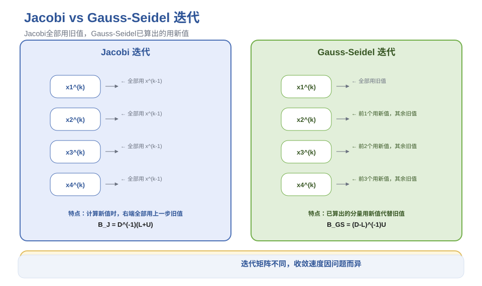
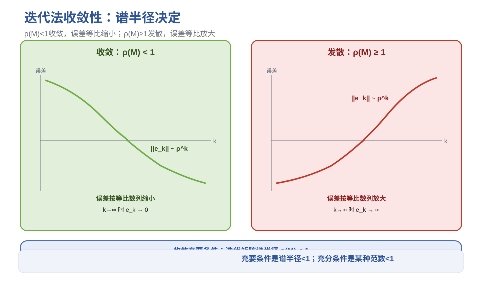
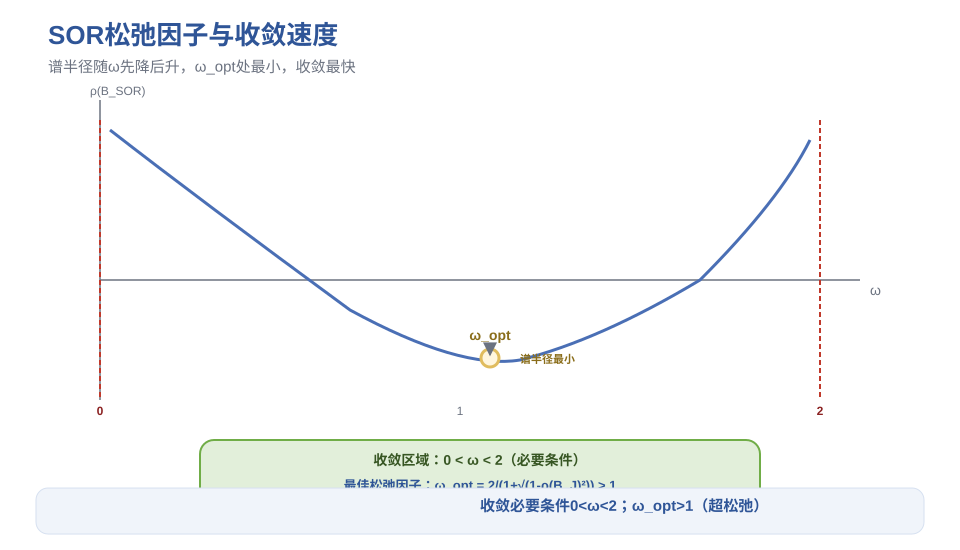
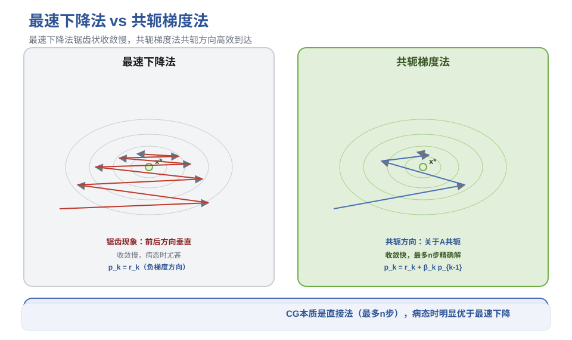
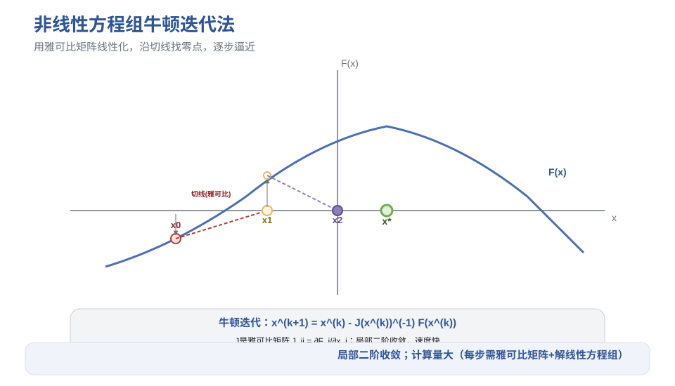

# 第7章 线性方程组迭代解法 - 笔记

> 课程：数值计算方法（中国石油大学华东，国家级精品课，BV1NvYSzEEYd）
> 对应视频：p042-p048（7.1 Jacobi迭代法 ~ 7.7 非线性方程组迭代法）

## 目录

- [1. 迭代法基本概念](#1-迭代法基本概念)
- [2. Jacobi 迭代法](#2-jacobi-迭代法)
- [3. Gauss-Seidel 迭代法](#3-gauss-seidel-迭代法)
- [4. 收敛性分析](#4-收敛性分析)
- [5. 超松弛迭代法（SOR）](#5-超松弛迭代法sor)
- [6. 最速下降法与共轭梯度法](#6-最速下降法与共轭梯度法)
- [7. 非线性方程组迭代法](#7-非线性方程组迭代法)
- [8. 本节重点](#8-本节重点)

---

## 1. 迭代法基本概念

### 1.1 迭代法 vs 直接法

| 方法 | 特点 | 适用场景 |
|------|------|---------|
| **直接法**（第3章） | 有限步运算得精确解（无舍入误差时） | 中小规模、稠密矩阵 |
| **迭代法** | 生成向量序列，极限为解，实际得近似解 | **大型稀疏方程组**（主要方法） |

> 非线性方程组不存在直接法，只能用迭代法。

### 1.2 迭代法的三个子问题

1. **构造迭代格式**：如何从 $x^{(k)}$ 生成 $x^{(k+1)}$，初始向量如何选取
2. **收敛性**：迭代序列是否收敛
3. **收敛速度与误差估计**：收敛多快，如何判断何时停止迭代

### 1.3 矩阵分解

将系数矩阵 $A$ 分解为：

$$A = D - L - U$$

- $D$：$A$ 的对角矩阵
- $L$：$A$ 的严格下三角部分的**负矩阵**
- $U$：$A$ 的严格上三角部分的**负矩阵**

> 假设 $A$ 非奇异且对角元全非零。

---

## 2. Jacobi 迭代法

### 2.1 迭代格式

对第 $i$ 个方程，保留 $a_{ii}x_i$ 在左端，其余移到右端：

$$x_i^{(k)} = \frac{1}{a_{ii}}\left(b_i - \sum_{j \neq i} a_{ij} x_j^{(k-1)}\right)$$

> 特点：计算 $x^{(k)}$ 时，右端全部用**上一步**的旧值 $x^{(k-1)}$。

### 2.2 矩阵形式

$$x^{(k)} = B_J x^{(k-1)} + g_J$$

其中：
- **迭代矩阵** $B_J = D^{-1}(L+U)$
- **常数项** $g_J = D^{-1}b$

$B_J$ 的特点：对角线全零，其他元素带负号，第 $i$ 行全除以 $a_{ii}$。

### 2.3 迭代终止条件

真实误差 $||x^{(k)}-x^*||$ 无法计算（$x^*$ 未知），但实际中 $||x^{(k)}-x^{(k-1)}||$ 与真实误差的比值近似为常数，因此用：

$$||x^{(k)} - x^{(k-1)}|| < \varepsilon$$

作为迭代终止条件。常用无穷范数（计算简单）。

### 2.4 大型稀疏方程组优化

带状方程组（下半带宽 $p$，上半带宽 $q$）只在非零区域运算，迭代一次乘除次数从 $O(n^2)$ 降为 $O(n(p+q+1))$，大幅节省计算量和存储。

---

## 3. Gauss-Seidel 迭代法

### 3.1 基本思想

计算 $x_i^{(k)}$ 时，$x_1^{(k)}, \dots, x_{i-1}^{(k)}$ 已经算出，用这些**新值**代替旧值——一般新值更接近精确解，收敛可能更快。

$$x_i^{(k)} = \frac{1}{a_{ii}}\left(b_i - \sum_{j<i} a_{ij} x_j^{(k)} - \sum_{j>i} a_{ij} x_j^{(k-1)}\right)$$

### 3.2 矩阵形式

$$x^{(k)} = B_{GS} x^{(k-1)} + g_{GS}$$

其中：
- **迭代矩阵** $B_{GS} = (D-L)^{-1} U$
- **常数项** $g_{GS} = (D-L)^{-1} b$

> 求 $B_{GS}$ 不需要真的求逆矩阵，解矩阵方程 $(D-L)G = U$，用初等行变换即可。

### 3.3 Jacobi vs Gauss-Seidel

| 对比项 | Jacobi | Gauss-Seidel |
|--------|--------|-------------|
| 计算 $x_i^{(k)}$ 用的值 | 全部旧值 | 已算出的用新值，未算出的用旧值 |
| 迭代矩阵 | $D^{-1}(L+U)$ | $(D-L)^{-1}U$ |
| 收敛速度 | 不一定更慢 | 不一定更快（换个例子可能相反） |

> 对同一个问题，GS 不一定比 Jacobi 收敛快，具体取决于系数矩阵。

---

> **图1** Jacobi vs Gauss-Seidel：新值旧值使用对比（自绘）。

## 4. 收敛性分析

### 4.1 统一迭代格式

$$x^{(k+1)} = M x^{(k)} + g$$

- Jacobi：$M = D^{-1}(L+U)$
- Gauss-Seidel：$M = (D-L)^{-1}U$

### 4.2 收敛的充要条件

误差向量 $y^{(k)} = x^{(k)} - x^*$，则 $y^{(k+1)} = M y^{(k)}$，$y^{(k)} = M^k y^{(0)}$。

**定理**：迭代法收敛 $\iff$ 迭代矩阵的**谱半径** $\rho(M) < 1$。

> 谱半径是特征值绝对值的最大值。这是充要条件，判断力最强，但计算谱半径计算量大。

### 4.3 收敛的充分条件

若存在某种算子范数使 $||M|| < 1$，则迭代收敛。

> 充分条件，用起来方便，但判断力弱一些。范数 $\ge 1$ 时不能判断发散（只能说无法用这个方法判断）。

### 4.4 误差估计

若 $||M|| = q < 1$：

1. $||x^{(k)} - x^*|| \le q^k ||x^{(0)} - x^*||$（误差等比缩小）
2. **实用估计**：$||x^{(k)} - x^*|| \le \frac{q}{1-q} ||x^{(k)} - x^{(k-1)}||$

> 第二条是用相邻两次迭代的差估计真实误差，是迭代终止条件的理论依据。

### 4.5 特殊矩阵的收敛性

| 矩阵类型 | Jacobi | Gauss-Seidel |
|---------|--------|--------------|
| **严格对角占优**（$\mida_{ii}\mid > \sum_{j\neq i}\mida_{ij}\mid$） | 收敛 | 收敛 |
| **对称正定** | 收敛 $\iff$ $A$ 和 $2D-A$ 都正定 | **收敛** |

> 严格对角占优是最简单的判断方法，不需要写迭代矩阵。

### 4.6 收敛判断方法优先级（由易到难）

1. 系数矩阵是否严格对角占优？→ 是则收敛
2. 系数矩阵是否对称正定？→ GS 收敛；Jacobi 需额外判断 $2D-A$
3. 迭代矩阵的某种范数是否 $<1$？→ 是则收敛
4. 迭代矩阵的谱半径是否 $<1$？→ 充要条件

### 4.7 收敛速度

**渐近收敛速度**：$R = -\ln \rho(M)$

- 谱半径越接近 0，收敛越快
- 谱半径越接近 1，收敛越慢
- 比较不同迭代方法的快慢用渐近收敛速度

---

> **图2** 迭代法收敛性：谱半径与误差衰减（自绘）。

## 5. 超松弛迭代法（SOR）

### 5.1 基本思想

对 Gauss-Seidel 的改进，引入**松弛因子** $\omega$，在新值和旧值之间取加权组合：

$$x_i^{(k)} = x_i^{(k-1)} + \frac{\omega}{a_{ii}}\left(b_i - \sum_{j<i} a_{ij}x_j^{(k)} - \sum_{j\ge i} a_{ij}x_j^{(k-1)}\right)$$

- $\omega = 1$：退化为 Gauss-Seidel
- $\omega < 1$：低松弛
- $\omega > 1$：超松弛（实际总取 $\omega > 1$，这就是"超松弛"名称的由来）

### 5.2 迭代矩阵

$$B_{SOR} = (D - \omega L)^{-1}[(1-\omega)D + \omega U]$$

### 5.3 收敛条件

- **必要条件**：$0 < \omega < 2$（$\omega \le 0$ 或 $\omega \ge 2$ 必发散）
- **充分条件**：$A$ 对称正定且 $0 < \omega < 2$ → SOR 收敛
- **充要条件**（对称正定+对角元正）：$A$ 正定且 $0 < \omega < 2$

### 5.4 最佳松弛因子

使谱半径最小（收敛最快）的松弛因子 $\omega_{opt}$。

对具有相容次序的矩阵（二循环矩阵）：

$$\omega_{opt} = \frac{2}{1 + \sqrt{1 - \rho(B_J)^2}}$$

其中 $\rho(B_J)$ 是 Jacobi 迭代矩阵的谱半径。

> $\omega_{opt} > 1$（这就是为什么叫超松弛）。选取最佳松弛因子可大幅加速收敛（可达十几倍）。

> 实际困难：计算 $\omega_{opt}$ 需要先求 Jacobi 迭代矩阵的谱半径，计算量大。实际中通常试算几次找近似最佳值。

---

> **图3** SOR松弛因子与收敛速度：最佳松弛因子（自绘）。

## 6. 最速下降法与共轭梯度法

### 6.1 等价转化（对称正定方程组）

求解 $Ax = b$ 等价于求二次函数的极小值：

$$\varphi(x) = \frac{1}{2}x^T A x - b^T x$$

$\varphi$ 的极小点满足 $\nabla \varphi = Ax - b = 0$，即 $Ax = b$。

> 几何意义：$\varphi(x)$ 的等值线是椭圆（二维），中心是极小点。迭代法就是从某点出发逐步走到中心。

### 6.2 最速下降法

**搜索方向**：负梯度方向 $p_k = r_k = b - Ax_k$（残差方向，局部下降最快）

**步长**：

$$\alpha_k = \frac{(r_k, r_k)}{(r_k, A r_k)}$$

**迭代**：$x_{k+1} = x_k + \alpha_k r_k$

**特点**：
- 前后两次搜索方向垂直（$r_k \perp r_{k+1}$），呈**锯齿现象**
- 整体收敛慢
- 误差估计：$||x_k - x^*||_A \le \left(\frac{\lambda_n - \lambda_1}{\lambda_n + \lambda_1}\right)^k ||x_0 - x^*||_A$
- 特征值相差大（病态矩阵）时收敛很慢

### 6.3 共轭梯度法（CG）

**最速下降法的改进**，是求解大型对称正定方程组的**主要方法**。

**搜索方向**：
- 第一步：$p_0 = r_0$（同最速下降法）
- 从第二步起：$p_k = r_k + \beta_k p_{k-1}$，其中 $\beta_k = \frac{||r_k||^2}{||r_{k-1}||^2}$

**步长**：$\alpha_k = \frac{||r_k||^2}{(p_k, A p_k)}$

**迭代**：$x_{k+1} = x_k + \alpha_k p_k$，$r_{k+1} = r_k - \alpha_k A p_k$

### 6.4 共轭梯度法的性质

1. **残差正交**：$r_i^T r_j = 0$（$i \neq j$）
2. **搜索方向关于 $A$ 共轭**：$p_i^T A p_j = 0$（$i \neq j$）
3. **本质是直接法**：无舍入误差时最多 $n$ 步得到精确解
4. **实际列为迭代法**：舍入误差存在，且很多问题不需要 $n$ 步就有高精度
5. **收敛比最速下降法快**：误差与条件数的开方有关，病态时优势明显

> 算法优化：避免重复计算 $Ap_k$ 等，用中间变量存储，计算量比原始公式少约4倍。

---

> **图4** 最速下降法锯齿现象 vs 共轭梯度法（自绘）。

## 7. 非线性方程组迭代法

### 7.1 牛顿迭代法

非线性方程组 $F(x) = 0$，$F$ 是 $n$ 元向量值函数。

用泰勒展开线性化（忽略高阶项）：

$$F(x) \approx F(x_k) + J(x_k)(x - x_k)$$

令其为零，解线性方程组得下一步：

$$x_{k+1} = x_k - J(x_k)^{-1} F(x_k)$$

其中 $J(x)$ 是**雅可比矩阵**，$J_{ij} = \frac{\partial F_i}{\partial x_j}$。

> $n=1$ 时退化为第2章的牛顿迭代法（$x_{k+1} = x_k - f(x_k)/f'(x_k)$）。

### 7.2 牛顿法的特点

- **局部收敛**，需要初始值接近解
- **二阶收敛速度**（收敛很快）
- **计算量大**：每步需要计算雅可比矩阵（$n^2$ 个偏导）+ 解线性方程组
- 初值选择重要：可能影响收敛速度，甚至导致发散

### 7.3 拟牛顿法

牛顿法的改进，用矩阵序列近似雅可比矩阵（或其逆），避免每步重新计算。

**拟牛顿条件**：

$$A_{k+1}(x_{k+1} - x_k) = F(x_{k+1}) - F(x_k)$$

**布洛伊登（Broyden）秩1方法**：用秩1校正更新近似逆矩阵 $B_k \approx J^{-1}$，迭代公式为 $x_{k+1} = x_k - B_k F(x_k)$，然后用低秩校正更新 $B_{k+1}$。

> 拟牛顿法计算量小，但收敛速度降为超线性（介于线性和二阶之间）。

---

> **图5** 非线性方程组牛顿法：雅可比矩阵线性化（自绘）。

## 8. 本节重点

> **本节重点**：
> - **迭代法**：构造格式生成序列，极限为解；是大型稀疏方程组的主要方法；非线性方程组只能用迭代法
> - **矩阵分解**：A = D - L - U（D对角，L/U是严格下/上三角的负矩阵）
> - **Jacobi**：x_i^(k) = (b_i - Σ_{j≠i} a_ij x_j^(k-1))/a_ii；迭代矩阵 B_J = D^(-1)(L+U)；全部用旧值
> - **Gauss-Seidel**：已算出的用新值；迭代矩阵 B_GS = (D-L)^(-1)U；不一定比Jacobi快
> - **收敛充要条件**：迭代矩阵谱半径 ρ(M) < 1；充分条件：某种范数 ||M|| < 1
> - **误差估计**：||x^(k)-x*|| ≤ q/(1-q) ||x^(k)-x^(k-1)||（q=||M||<1），是迭代终止条件的依据
> - **严格对角占优**：|a_ii| > Σ_{j≠i}|a_ij| → Jacobi和GS都收敛（最简单的判断方法）
> - **对称正定**：GS收敛；Jacobi收敛 ⟺ A和2D-A都正定
> - **SOR**：松弛因子ω，ω=1退化为GS；收敛必要条件0<ω<2；对称正定+0<ω<2则收敛
> - **最佳松弛因子**：ω_opt = 2/(1+√(1-ρ(B_J)²)) > 1，可大幅加速；实际用试算近似
> - **最速下降法**：对称正定方程组→求二次函数极小；搜索方向=负梯度（残差）；锯齿现象，收敛慢
> - **共轭梯度法**：搜索方向=当前残差+上一步方向线性组合；关于A共轭；本质是直接法（最多n步）；病态时明显优于最速下降
> - **非线性方程组牛顿法**：x^(k+1) = x^(k) - J^(-1)F(x^(k))，J是雅可比矩阵；局部二阶收敛；计算量大
> - **拟牛顿法**：用矩阵序列近似雅可比逆，避免重复计算；布洛伊登秩1方法；超线性收敛
> - **常见坑**：
>   - 迭代矩阵范数≥1不能判断发散（只是充分条件不满足），需用谱半径
>   - GS不一定比Jacobi收敛快，具体问题具体分析
>   - SOR的ω必须在(0,2)之间，超出必发散
>   - 共轭梯度法要求A对称正定，不满足不能直接用
>   - 非线性方程组牛顿法对初值敏感，可能不收敛，需结合问题背景选初值
>   - 迭代终止用相邻两次差<ε，不是真实误差（真实误差无法计算）

---

> **竞赛模板 → ICPC/数值计算**：Jacobi/GS/SOR迭代、共轭梯度法是求解大型线性方程组的常用算法。非线性方程组牛顿法在优化、物理模拟中广泛应用。
