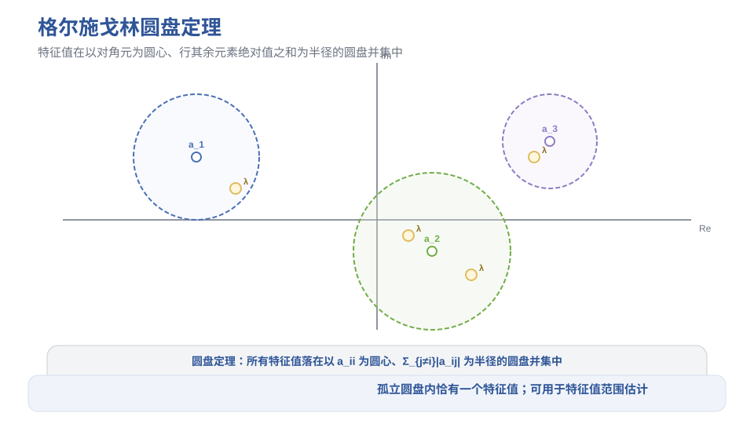
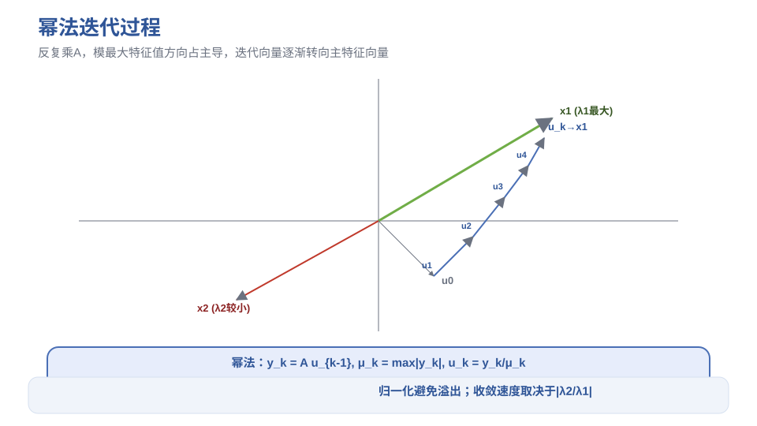
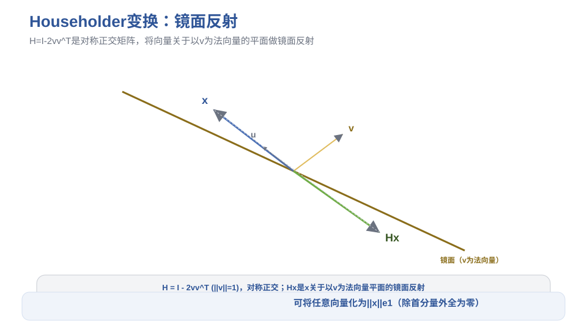
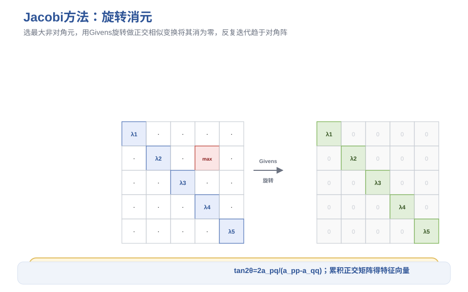
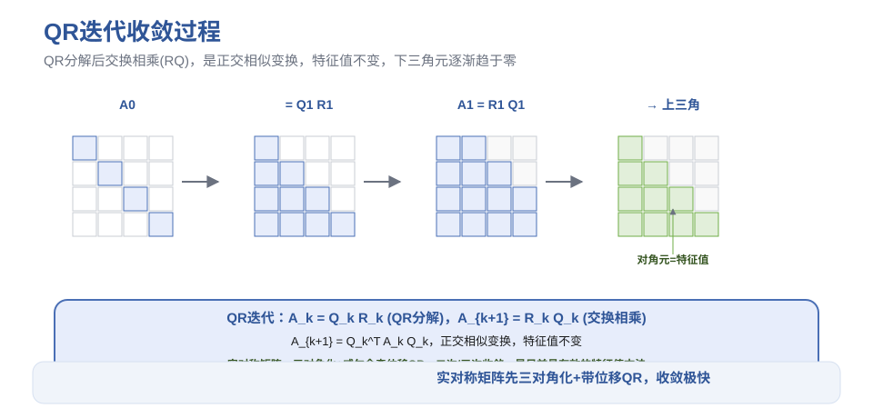

# 第8章 矩阵特征值计算 - 笔记

> 课程：数值计算方法（中国石油大学华东，国家级精品课，BV1NvYSzEEYd）
> 对应视频：p049-p057（8.1 特征值的性质 ~ 8.9 实对称矩阵的实用QR方法）

## 目录

- [1. 特征值基本概念与性质](#1-特征值基本概念与性质)
- [2. 幂法与反幂法](#2-幂法与反幂法)
- [3. Givens旋转与Householder变换](#3-givens旋转与householder变换)
- [4. Jacobi方法](#4-jacobi方法)
- [5. QR方法](#5-qr方法)
- [6. 本节重点](#6-本节重点)

---

## 1. 特征值基本概念与性质

### 1.1 特征值与特征向量

$$Ax = \lambda x, \quad x \neq 0$$

- $\lambda$：特征值，$x$：对应的特征向量
- 特征方程：$\det(\lambda I - A) = 0$
- 特征多项式：$p_A(\lambda) = \det(\lambda I - A)$

### 1.2 代数重数与几何重数

| 概念 | 定义 |
|------|------|
| **代数重数** $n_i$ | 特征值 $\lambda_i$ 在特征多项式中的重数 |
| **几何重数** $m_i$ | $\lambda_i$ 对应的线性无关特征向量个数 = $n - \text{rank}(\lambda_i I - A)$ |

**基本关系**：$m_i \le n_i$（几何重数不超过代数重数）。

- **半单特征值**：$m_i = n_i$
- **非亏损矩阵**：所有特征值都是半单的 $\iff$ 有 $n$ 个线性无关的特征向量 $\iff$ 可对角化

### 1.3 重要定理

| 定理 | 内容 |
|------|------|
| **相似不变性** | 相似矩阵有相同的特征值（特征向量差一个可逆变换） |
| **约当分解** | 任何矩阵相似于块对角矩阵（约当块，对角线上是特征值，次对角线上是1） |
| **舒尔分解** | 任何矩阵酉相似于上三角矩阵（$U^H AU = T$，$T$ 上三角，对角元即特征值） |
| **谱分解** | 实对称矩阵正交相似于对角矩阵（$Q^T AQ = \Lambda$） |
| **圆盘定理** | 所有特征值落在以 $a_{ii}$ 为圆心、$\sum_{j\neq i}\mida_{ij}\mid$ 为半径的圆盘并集中 |
| **威尔定理** | 实对称矩阵：$\mid\lambda_i(A) - \lambda_i(B)\mid \le \VertA-B\Vert_2$（特征值良态） |

> 圆盘定理可用于粗略估计特征值范围，不需要实际计算。

---

> **图1** 圆盘定理：特征值范围估计（自绘）。

## 2. 幂法与反幂法

### 2.1 幂法（乘幂法）

**用途**：求模最大的特征值 $\lambda_1$ 及对应特征向量。

**基本思想**：任取初始向量 $u_0$，反复乘 $A$：$A^k u_0$。当 $|\lambda_1| > |\lambda_2|$ 时，$\lambda_1^k x_1$ 项占主导，其余项趋于零。

**迭代格式**（归一化避免溢出）：

$$y_k = A u_{k-1}, \quad \mu_k = \max_i |(y_k)_i|, \quad u_k = y_k / \mu_k$$

- $\mu_k \to \lambda_1$（模最大特征值）
- $u_k \to x_1$（对应特征向量，无穷范数为1）

**收敛条件**：
1. $|\lambda_1| > |\lambda_2|$（模最大与第二大严格区分）
2. $\lambda_1$ 是半单的
3. 初始向量在 $\lambda_1$ 的特征空间上投影非零

**收敛速度**：取决于 $|\lambda_2/\lambda_1|$，比值越小收敛越快。

**原点平移加速**：对 $A - \mu I$ 用幂法，特征值变为 $\lambda_i - \mu$。适当选取 $\mu$ 可使 $|(\lambda_2-\mu)/(\lambda_1-\mu)|$ 更小，加速收敛。求得后加回 $\mu$。

### 2.2 反幂法

**用途**：求模最小的特征值及对应特征向量。

**思想**：$A^{-1}$ 的特征值是 $1/\lambda_i$，模最大的对应 $A$ 的模最小特征值。

**迭代格式**：

$$\text{解 } A y_k = u_{k-1}, \quad \mu_k = \max_i |(y_k)_i|, \quad u_k = y_k / \mu_k$$

> 每次迭代解一个线性方程组（系数矩阵固定为 $A$），可先做 LU 分解，每次只需解两个三角方程组，工作量从 $O(n^3)$ 降为 $O(n^2)$。

### 2.3 带位移的反幂法（求特征向量）

**用途**：已知某特征值的近似值 $\tilde{\lambda}$ 时，求对应特征向量。

对 $A - \mu I$（取 $\mu = \tilde{\lambda}$）用反幂法，由于 $\lambda - \mu$ 很小，收敛极快——通常只需1-2次迭代即可得到高精度特征向量，因此称为"一次迭代法"。

> 这是已知特征值近似值后求特征向量的标准方法。

---

> **图2** 幂法迭代过程：模最大特征值主导（自绘）。

## 3. Givens旋转与Householder变换

### 3.1 Givens旋转（平面旋转）

**矩阵形式**：只修改单位矩阵的4个元素——

$$G_{pq}(\theta) = I + (\cos\theta-1)(e_p e_p^T + e_q e_q^T) + \sin\theta(e_p e_q^T - e_q e_p^T)$$

- 正交矩阵：$G^T G = I$
- 只改变向量的第 $p, q$ 个分量
- 选取 $\cos\theta = x_p/\sqrt{x_p^2+x_q^2}$，$\sin\theta = x_q/\sqrt{x_p^2+x_q^2}$，可将第 $q$ 个分量化为零

**用途**：将矩阵逐步化为上三角形式（QR分解的基础），每次消去一个元素。

### 3.2 Householder变换（镜面反射）

**矩阵形式**：

$$H = I - 2vv^T, \quad \|v\|_2 = 1$$

**性质**：
1. **对称正交**：$H^T = H$，$H^T H = I$
2. **反射性**：$Hx$ 是 $x$ 关于以 $v$ 为法向量的平面的镜面反射
3. **关键性质**：若 $\|x\| = \|y\|$，则存在 $H$ 使 $Hx = y$（取 $v = (x-y)/\|x-y\|$）

**实用形式**：$H = I - \beta uu^T$，$\beta = 2/(u^T u)$（$u$ 不需要单位化）。

**主要用途**：将向量除第一个分量外全部化为零：

$$Hx = \|x\|_2 \, e_1$$

取 $u = x - \|x\| e_1$（或 $u = x + \|x\| e_1$ 避免相近数相减）。

> 数值稳定性注意：当 $x_1$ 接近 $\|x\|$ 时，$x - \|x\|e_1$ 出现相近数相减，损失有效数字。此时取 $u = x + \|x\|e_1$，或用等价公式避免减法。

**在特征值计算中的应用**：
- 将矩阵化为上海森伯格矩阵（QR方法的预处理）
- 实对称矩阵化为三对角矩阵
- 收缩法求模第二大特征值（已知 $\lambda_1, x_1$ 后，用 Householder 变换将矩阵降阶）

---

> **图3** Householder镜面反射几何意义（自绘）。

## 4. Jacobi方法

### 4.1 基本思想

求实对称矩阵的全部特征值和特征向量。利用实对称矩阵可正交对角化（谱分解定理），通过一系列 Givens 旋转做正交相似变换，逐步消去非对角元。

**非对角元范数**：

$$E(A) = \sqrt{\|A\|_F^2 - \sum_{i=1}^n a_{ii}^2}$$

$E(A) \to 0$ 时，$A \to$ 对角阵，对角元即特征值。

### 4.2 旋转角度的选取

做正交相似变换 $B = G_{pq}^T A G_{pq}$，选取 $\theta$ 使 $b_{pq} = 0$：

$$\tan 2\theta = \frac{2a_{pq}}{a_{pp} - a_{qq}}$$

取 $|\theta| \le \pi/4$，则 $c = \cos\theta$，$s = \sin\theta$ 可由 $\tan\theta$ 求出。

### 4.3 两种策略

| 方法 | 策略 | 特点 |
|------|------|------|
| **经典Jacobi** | 每次选绝对值最大的非对角元消去 | 收敛快，但选最大元需 $O(n^2)$ 比较 |
| **循环Jacobi** | 按自然顺序(1,2),(1,3),...,(n-1,n)扫描一遍 | 不需选最大元，一次扫描称为一次"扫描"，渐进平方收敛 |

> 实际常用循环Jacobi方法。

### 4.4 特征向量

累积所有旋转矩阵 $Q = G_1 G_2 \cdots G_k$，则 $Q^T A Q \approx \Lambda$，$Q$ 的列就是对应特征向量。

---

> **图4** Jacobi方法：Givens旋转消去非对角元（自绘）。

## 5. QR方法

### 5.1 基本QR迭代

**目前计算矩阵全部特征值最有效的方法之一**，被誉为"20世纪最漂亮的方法之一"。

**迭代格式**：

$$A_k = Q_k R_k \quad \text{（QR分解）}$$
$$A_{k+1} = R_k Q_k \quad \text{（交换相乘）}$$

**关键性质**：$A_{k+1} = Q_k^T A_k Q_k$，是正交相似变换，特征值不变。

**与幂法的关系**：QR迭代的第一列相当于以 $e_1$ 为初始向量的幂法，因此具有类似的收敛性。

**收敛性**：若 $A$ 的特征值模互异且 $X^{-1}$ 有 LU 分解，则 $A_k$ 的严格下三角元素 $\to 0$，对角元 $\to$ 特征值。

### 5.2 实Schur标准形

实矩阵可能有共轭复特征值对，不能收敛到上三角矩阵。

**实Schur标准形**：块上三角矩阵，对角块为：
- $1 \times 1$ 块 → 实特征值
- $2 \times 2$ 块 → 一对共轭复特征值

### 5.3 上海森伯格化（预处理）

**上海森伯格矩阵**：比上三角多一条次对角线（$a_{ij}=0$ 当 $i > j+1$）。

**两步法**：
1. 用 Householder 变换将 $A$ 化为上海森伯格矩阵 $H$（$P^T AP = H$）
2. 对 $H$ 做 QR 迭代

> 为什么先化上海森伯格？①QR分解工作量大幅减少（只需消去次对角线上的 $n-1$ 个元素，用 Givens 旋转）②上海森伯格形式在 QR 迭代下保持不变③整体效率远高于直接对满矩阵做QR迭代。

### 5.4 实对称矩阵的实用QR方法

**三对角化**：实对称矩阵的上海森伯格化 = 三对角化（对称 + 上海森伯格 = 三对角）。

**带位移的QR迭代**：

$$H_k - \mu_k I = Q_k R_k, \quad H_{k+1} = R_k Q_k + \mu_k I$$

位移 $\mu_k$ 加速收敛（类似幂法的原点平移）。

**位移选择**：
- **简单位移**：$\mu_k = (H_k)_{nn}$（取最后一个对角元）
- **威尔金森位移**：取右下角 $2 \times 2$ 子矩阵的两个特征值中最接近 $(H_k)_{nn}$ 的那个

> 威尔金森位移至少二次收敛，实际常达三次收敛，是实对称矩阵QR方法的标准选择。

**隐式QR迭代**：利用上海森伯格矩阵QR分解的唯一性，不直接做QR分解，而是通过"追逐非零元"（bulge chasing）实现，避免显式构造位移后的矩阵，更稳定高效。

---

> **图5** QR迭代：QR分解+交换相乘，收敛到上三角（自绘）。

## 6. 本节重点

> **本节重点**：
> - **特征值**：Ax=λx；特征多项式det(λI-A)=0；几何重数≤代数重数；非亏损矩阵可对角化
> - **重要定理**：相似矩阵特征值相同；舒尔分解（酉相似上三角）；实对称矩阵可正交对角化；圆盘定理（特征值在圆盘并集中）；威尔定理（实对称特征值良态）
> - **幂法**：求模最大特征值；y=Au, μ=max分量, u=y/μ；收敛条件|λ1|>|λ2|；收敛速度~|λ2/λ1|；原点平移可加速
> - **反幂法**：解Ay=u（对A^(-1)用幂法）；求模最小特征值；先做LU分解节省工作量
> - **带位移反幂法**：已知特征值近似值求特征向量；收敛极快（1-2次迭代），是求特征向量的标准方法
> - **Givens旋转**：正交矩阵，只改p,q两个分量；可将指定分量化为零；用于QR分解
> - **Householder变换**：H=I-2vv^T，对称正交，镜面反射；可将向量除首分量外全化为零；注意避免相近数相减
> - **Jacobi方法**：实对称矩阵求全部特征值；Givens旋转消去非对角元；tan2θ=2a_pq/(a_pp-a_qq)；循环Jacobi渐进平方收敛；累积正交矩阵得特征向量
> - **QR方法**：目前最有效的特征值方法；A=QR→A'=RQ（正交相似）；特征值不变；与幂法相关
> - **实Schur标准形**：块上三角，1×1块=实特征值，2×2块=共轭复特征值对
> - **上海森伯格化**：QR方法的预处理，用Householder变换化为上海森伯格矩阵，大幅减少QR分解工作量
> - **实对称QR方法**：三对角化+带位移QR迭代；威尔金森位移（右下角2×2块最接近末对角元的特征值），二次/三次收敛；隐式QR（bulge chasing）更稳定
> - **常见坑**：
>   - 幂法要求|λ1|>|λ2|，若模最大有多个（如±λ）则不收敛于单一向量
>   - Householder变换中x1接近||x||时会出现相近数相减，需用替代公式
>   - Jacobi方法只适用于实对称矩阵
>   - QR方法对一般实矩阵收敛到实Schur标准形（块上三角），不是上三角（因为有复特征值）
>   - 带位移反幂法的位移量要接近目标特征值，否则收敛不快
>   - 上海森伯格化是QR方法的必要预处理，直接对满矩阵做QR迭代效率很低

---

> **竞赛模板 → ICPC/数值计算**：幂法/反幂法求极端特征值、QR方法求全部特征值是数值计算的核心算法。特征值在图论（谱方法）、机器学习（PCA/SVD）、物理模拟（振动分析）中广泛应用。
