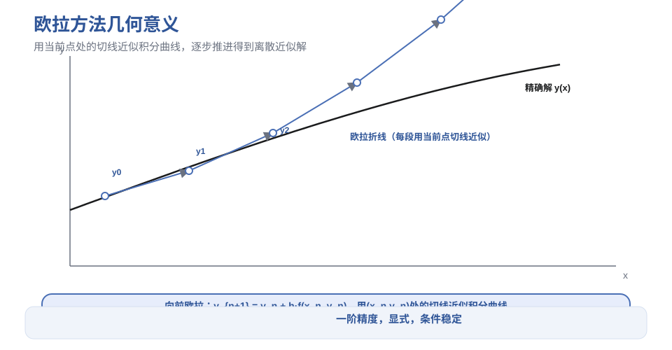
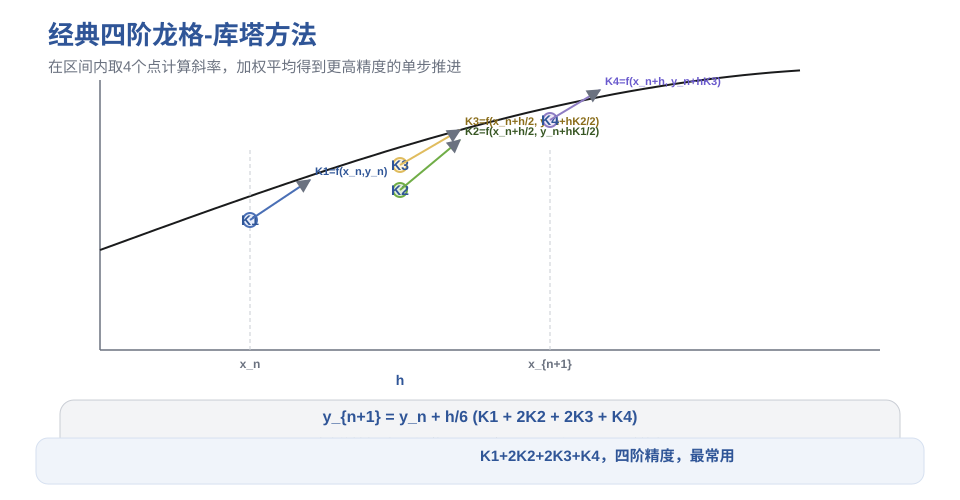
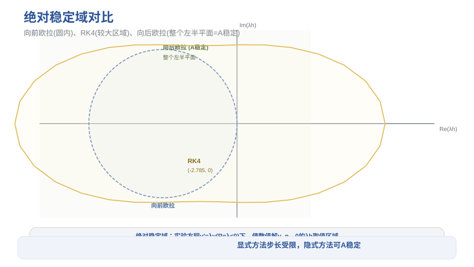
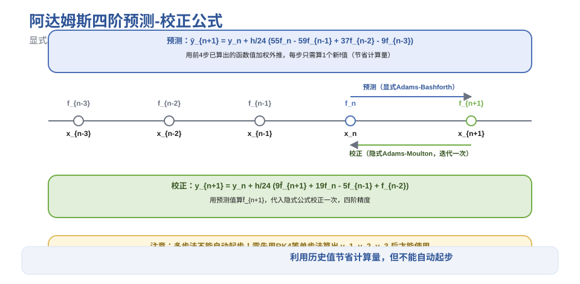
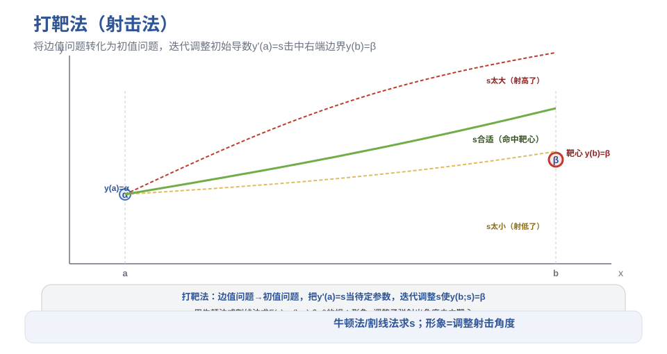

# 第9章 常微分方程数值解法 - 笔记

> 课程：数值计算方法（中国石油大学华东，国家级精品课，BV1NvYSzEEYd）
> 对应视频：p058-p065（9.1 初值问题 ~ 9.8 边值问题）

## 目录

- [1. 初值问题与数值解概念](#1-初值问题与数值解概念)
- [2. 欧拉方法](#2-欧拉方法)
- [3. 龙格-库塔方法](#3-龙格-库塔方法)
- [4. 稳定性与隐式RK](#4-稳定性与隐式rk)
- [5. 线性多步法](#5-线性多步法)
- [6. 微分方程组与高阶方程](#6-微分方程组与高阶方程)
- [7. 刚性方程组](#7-刚性方程组)
- [8. 边值问题](#8-边值问题)
- [9. 本节重点](#9-本节重点)

---

## 1. 初值问题与数值解概念

### 1.1 基本概念

| 概念 | 说明 |
|------|------|
| **常微分方程(ODE)** | 含未知函数及其导数，自变量只有一个 |
| **偏微分方程(PDE)** | 自变量有多个 |
| **通解** | 含n个独立任意常数（n=方程阶数） |
| **特解** | 任意常数确定后的特定解 |
| **初始条件** | 在初始点x0处给定y, y', ..., y^(n-1) |
| **边界条件** | 在区间端点处给定条件 |

### 1.2 一阶初值问题

$$y' = f(x, y), \quad y(x_0) = y_0$$

**存在唯一性定理**：若 $f(x,y)$ 在带形区域内连续，且关于 $y$ 满足 **Lipschitz 条件**：

$$|f(x,y_1) - f(x,y_2)| \le L|y_1 - y_2|$$

则初值问题的解存在、唯一且连续可微。

> Lipschitz条件比"有界偏导数"弱，比"连续"强。

### 1.3 为什么需要数值解

大量微分方程无解析解：
- Riccati方程（右端是y的多项式）
- 单摆方程（含sinθ，小角度近似后才可解）
- 法国数学家已证明：非线性Riccati方程一般无初等解

**数值解**：不求解析表达式，只求离散节点 $x_0 < x_1 < \cdots < x_n$ 上的近似值 $y_0, y_1, \ldots, y_n$（一张数表）。

---

## 2. 欧拉方法

### 2.1 向前欧拉（显式）

泰勒展开取前两项：

$$y_{n+1} = y_n + h f(x_n, y_n)$$

几何意义：用 $(x_n, y_n)$ 处的切线近似积分曲线。

### 2.2 向后欧拉（隐式）

$$y_{n+1} = y_n + h f(x_{n+1}, y_{n+1})$$

两端都含 $y_{n+1}$，需迭代求解。

### 2.3 误差与阶数

| 概念 | 定义 |
|------|------|
| **局部截断误差** | 假设前一步准确，单步产生的误差 |
| **整体截断误差** | 从初始值累积到当前步的总误差 |
| **p阶方法** | 局部截断误差为 $O(h^{p+1})$ |

- 向前欧拉：局部误差 $O(h^2)$，整体误差 $O(h)$ → **一阶方法**
- 向后欧拉：同样一阶

### 2.4 改进方法

| 方法 | 公式 | 精度 | 类型 |
|------|------|------|------|
| **梯形公式** | $y_{n+1}=y_n+\frac{h}{2}[f(x_n,y_n)+f(x_{n+1},y_{n+1})]$ | 二阶 | 隐式 |
| **改进欧拉（预测-校正）** | 预测：$\bar y_{n+1}=y_n+hf(x_n,y_n)$；校正：$y_{n+1}=y_n+\frac{h}{2}[f(x_n,y_n)+f(x_{n+1},\bar y_{n+1})]$ | 二阶 | 显式形式 |

> 改进欧拉结合了显式（计算简单）和隐式（稳定性好）的优点。

---


> **图1** 欧拉方法几何意义：切线近似积分曲线（自绘）。


## 3. 龙格-库塔方法

### 3.1 基本思想

用多个点的斜率（函数值）做加权平均，提高单步精度：

$$y_{n+1} = y_n + h \sum_{i=1}^m c_i K_i$$

其中 $K_i$ 是不同点处的斜率，$c_i$ 是加权系数。

### 3.2 二阶RK（一般形式）

$$K_1 = f(x_n, y_n)$$
$$K_2 = f(x_n + ph, y_n + pqhK_1)$$
$$y_{n+1} = y_n + h(\lambda_1 K_1 + \lambda_2 K_2)$$

通过泰勒展开比较系数，得到3个方程、4个未知数 → **无穷多组解**。

| 特例 | 参数 |
|------|------|
| **改进欧拉** | $p=q=1, \lambda_1=\lambda_2=1/2$ |
| **休恩公式** | $\lambda_1=1/4, \lambda_2=3/4, p=q=2/3$ |

### 3.3 显式RK与巴赫表

m级显式RK用 **巴赫表（Butcher tableau）** 表示系数：

```
0   |
a2  | b21
a3  | b31 b32
... | ...
am  | bm1 bm2 ... bm,m-1
----+-------------------
    | c1  c2  ... cm
```

### 3.4 计算量与精度的关系

| 级数m | 最高精度阶 | 说明 |
|-------|-----------|------|
| 2 | 2 | |
| 3 | 3 | |
| 4 | 4 | **最常用** |
| 5 | 4 | 不划算 |
| 6 | 5 | |
| 7 | 6 | |
| n≥8 | n-2 | |

> 4级4阶是"性价比"最高的选择。

### 3.5 经典四阶RK（RK4）

$$K_1 = f(x_n, y_n)$$
$$K_2 = f\left(x_n + \frac{h}{2},\ y_n + \frac{h}{2}K_1\right)$$
$$K_3 = f\left(x_n + \frac{h}{2},\ y_n + \frac{h}{2}K_2\right)$$
$$K_4 = f(x_n + h,\ y_n + hK_3)$$
$$y_{n+1} = y_n + \frac{h}{6}(K_1 + 2K_2 + 2K_3 + K_4)$$

- 局部截断误差 $O(h^5)$，**四阶精度**
- 每步算4个函数值
- 是最常用的ODE数值解法

---


> **图2** 龙格-库塔方法：多点斜率加权平均（自绘）。

## 4. 稳定性与隐式RK

### 4.1 绝对稳定性

用**实验方程** $y' = \lambda y$（$\text{Re}(\lambda) < 0$，精确解衰减到0）测试：

若数值解 $y_n \to 0$（$n \to \infty$），则该方法对步长 $h$ **绝对稳定**。

**绝对稳定域**：$\mu = \lambda h$ 满足的区域。

### 4.2 各方法的绝对稳定域

| 方法 | 稳定条件 | 稳定域形状 |
|------|---------|-----------|
| **向前欧拉** | $\Vert1+\lambda h\Vert < 1$ | 以(-1,0)为圆心、半径1的圆内 |
| **向后欧拉** | $\Vert1-\lambda h\Vert > 1$ | 以(1,0)为圆心、半径1的圆外（**A稳定**） |
| **四阶RK** | $\Vert1+z+z^2/2+z^3/6+z^4/24\Vert < 1$ | 实轴上 $z \in (-2.785, 0)$ |

> **A稳定**：绝对稳定域包含整个左半平面，步长不受限制。向后欧拉和梯形法是A稳定的。

### 4.3 隐式龙格-库塔法

显式方法步长受稳定性限制 → 用隐式方法：

- **隐式中点法**：1级，2阶精度
- **2级隐式RK**：2级，4阶精度
- m级隐式RK可达 **2m阶** 精度（显式最多m阶）

**优点**：稳定性极好（A稳定），精度高
**缺点**：每步需解非线性方程组（用牛顿法迭代）

---

> **图3** 绝对稳定域对比：向前欧拉 vs 向后欧拉 vs RK4（自绘）。


## 5. 线性多步法

### 5.1 基本思想

计算 $y_{n+1}$ 时，不仅用 $y_n$，还用前若干步的值 $y_{n-1}, y_{n-2}, \ldots$。

通过**数值积分**推导：对 $y' = f(x,y)$ 两端在 $[x_n, x_{n+1}]$ 积分，用拉格朗日插值多项式代替 $f$。

### 5.2 阿达姆斯公式

| 类型 | 插值节点 | 特点 |
|------|---------|------|
| **显式阿达姆斯（Adams-Bashforth）** | $x_n, x_{n-1}, \ldots, x_{n-Q}$ | 不含 $y_{n+1}$，显式 |
| **隐式阿达姆斯（Adams-Moulton）** | $x_{n+1}, x_n, \ldots, x_{n-Q+1}$ | 含 $y_{n+1}$，隐式，精度更高 |

### 5.3 阿达姆斯预测-校正公式（四阶）

1. **预测**（显式四阶Adams-Bashforth）：
$$\bar y_{n+1} = y_n + \frac{h}{24}(55f_n - 59f_{n-1} + 37f_{n-2} - 9f_{n-3})$$

2. **校正**（隐式四阶Adams-Moulton，迭代一次）：
$$y_{n+1} = y_n + \frac{h}{24}(9\bar f_{n+1} + 19f_n - 5f_{n-1} + f_{n-2})$$

### 5.4 多步法的优缺点

| 优点 | 缺点 |
|------|------|
| 节省计算量（前面的f值已算出，每步只算1-2个新值） | **不能自动起步**（需用单步法如RK4算出前几步） |
| 精度高（四阶常用） | 改变步长麻烦 |
| 稳定性较好 | |

---


> **图4** 阿达姆斯预测-校正：多步法利用历史值（自绘）。

## 6. 微分方程组与高阶方程

### 6.1 一阶微分方程组

$$\begin{cases} y_1' = f_1(x, y_1, \ldots, y_m) \\ \quad \vdots \\ y_m' = f_m(x, y_1, \ldots, y_m) \end{cases}$$

写成**向量形式**：$\mathbf{y}' = \mathbf{F}(x, \mathbf{y})$，$\mathbf{y}(a) = \boldsymbol{\eta}$。

> 所有单步法（欧拉、RK4等）形式完全不变，只需把标量 $y, f$ 换成向量 $\mathbf{y}, \mathbf{F}$。

### 6.2 高阶微分方程

n阶方程 $y^{(n)} = f(x, y, y', \ldots, y^{(n-1)})$ 化为一阶方程组：

令 $y_1 = y,\ y_2 = y',\ \ldots,\ y_n = y^{(n-1)}$，则：

$$\begin{cases} y_1' = y_2 \\ y_2' = y_3 \\ \quad \vdots \\ y_n' = f(x, y_1, y_2, \ldots, y_n) \end{cases}$$

> 高阶方程 → 一阶方程组 → 所有方法直接适用。

---

## 7. 刚性方程组

### 7.1 什么是刚性

解中同时存在**快衰减分量**和**慢衰减分量**：

- 快分量：$\lambda$ 绝对值大（如 -100），衰减极快
- 慢分量：$\lambda$ 绝对值小（如 -0.01），衰减极慢

**矛盾**：
- 稳定性要求步长 $h$ 很小（受快分量限制，如 $h < 0.02$）
- 但要展示完整解需要区间很大（受慢分量限制，如 $x > 500$）
- 结果：步数极多（25000步），误差累积大，计算慢

### 7.2 刚性比

$$\text{刚性比} = \frac{\max|\text{Re}(\lambda_i)|}{\min|\text{Re}(\lambda_i)|}$$

比值越大，刚性越强。全部特征值实部为负且刚性比大 → **刚性方程组**。

### 7.3 求解策略

**A稳定方法**（绝对稳定域含整个左半平面，步长不受限）：
- 隐式欧拉（一阶，A稳定）
- 梯形法（二阶，A稳定）

**达尔奎斯特定理**：
- 显式线性多步法**不可能**A稳定
- 隐式线性多步法最多**二阶**（梯形法最优）

> 求解刚性问题的常用方法：**隐式龙格-库塔法**（单步法，可高阶，A稳定），或放松稳定性要求（A(α)稳定、刚性稳定等）。

---

## 8. 边值问题

### 8.1 边值问题的复杂性

二阶两点边值问题：$y'' = f(x, y, y')$，$y(a)=\alpha$，$y(b)=\beta$。

> 边值问题比初值问题复杂得多——可能**无解**，也可能**无穷多解**。
> 例：$y''+\pi^2 y=0$，$y(0)=0, y(1)=1$ 无解；$y(0)=0, y(1)=0$ 有无穷多解。

### 8.2 有限差分法

将区间 $[a,b]$ 分成 $N$ 等份，$h=(b-a)/N$：
- 二阶导数用**三点公式**：$y''(x_i) \approx \frac{y_{i+1}-2y_i+y_{i-1}}{h^2}$
- 一阶导数用**中心差商**：$y'(x_i) \approx \frac{y_{i+1}-y_{i-1}}{2h}$

代入微分方程，得到关于 $y_1, \ldots, y_{N-1}$ 的代数方程组（线性→高斯消元；非线性→牛顿法）。

**边界条件处理**：
- 第一类（函数值）：直接代入 $y_0=\alpha, y_N=\beta$
- 第二/三类（含导数）：用端点三点公式离散

### 8.3 打靶法（射击法）

将边值问题转化为初值问题：

1. 把右端边界条件 $y(b)=\beta$ 换成初始导数 $y'(a)=s$（待定参数）
2. 解初值问题得到解 $y(x; s)$
3. 要求 $y(b; s) = \beta$，即 $F(s) = y(b;s) - \beta = 0$
4. 用**牛顿法**或**割线法**迭代求 $s$

> 形象比喻：$y(a)$ 是子弹射出位置，$y'(a)=s$ 是射出角度，迭代调整角度击中靶心 $y(b)=\beta$。

---


> **图5** 打靶法：调整初始导数击中右端边界（自绘）。

## 9. 本节重点

> **本节重点**：
> - **初值问题**：y'=f(x,y), y(x0)=y0；f连续+Lipschitz条件→解存在唯一；大量方程无解析解→求数值解（离散节点上的近似值）
> - **向前欧拉**：y_{n+1}=y_n+hf(x_n,y_n)，显式，一阶精度，几何意义=切线近似
> - **向后欧拉**：y_{n+1}=y_n+hf(x_{n+1},y_{n+1})，隐式，一阶，A稳定
> - **梯形公式**：y_{n+1}=y_n+h/2[f_n+f_{n+1}]，隐式，二阶，A稳定
> - **改进欧拉**：显式预测+隐式校正（迭代一次），二阶，显式形式
> - **阶数定义**：局部截断误差O(h^{p+1})→p阶方法；局部误差比整体误差高一阶
> - **龙格-库塔**：用多个点斜率加权平均提高精度；m级显式RK用巴赫表表示
> - **经典RK4**：K1+2K2+2K3+K4，每步4个函数值，局部O(h^5)，四阶精度，最常用
> - **计算量与精度**：4级4阶性价比最高；5级仍4阶（不划算）；n≥8级→n-2阶
> - **绝对稳定性**：实验方程y'=λy(Reλ<0)，数值解y_n→0则稳定；绝对稳定域=λh满足的区域
> - **稳定域**：向前欧拉=以(-1,0)为圆心半径1的圆内；向后欧拉=圆外（A稳定）；RK4实轴上(-2.785,0)
> - **隐式RK**：m级可达2m阶，A稳定，需解非线性方程组；隐式中点法1级2阶
> - **线性多步法**：用前若干步值；阿达姆斯公式通过数值积分+拉格朗日插值推导
> - **显式阿达姆斯**（Adams-Bashforth）：不含y_{n+1}；**隐式阿达姆斯**（Adams-Moulton）：含y_{n+1}，精度更高
> - **预测-校正**：显式预测+隐式校正一次，四阶，节省计算量（每步只算1-2个新f值）
> - **多步法缺点**：不能自动起步（需RK4等单步法算前几步），改变步长麻烦
> - **微分方程组**：写成向量形式y'=F(x,y)，所有方法形式不变（标量变向量）
> - **高阶方程**：令y1=y,y2=y',...,化为一阶方程组，所有方法直接适用
> - **刚性问题**：解中同时有快衰减和慢衰减分量；矛盾=步长必须小但区间必须大
> - **刚性比**=max|Reλ|/min|Reλ|，比值越大刚性越强
> - **达尔奎斯特定理**：显式线性多步法不可能A稳定；隐式线性多步法最多二阶（梯形法最优）
> - **刚性求解**：隐式RK（单步可高阶A稳定）或放松稳定性要求
> - **边值问题**：比初值问题复杂（可能无解/无穷多解）
> - **有限差分法**：导数用差商代替→代数方程组；三点公式算二阶导，中心差商算一阶导
> - **打靶法**：边值→初值，把y'(a)=s当待定参数，牛顿/割线法迭代使y(b;s)=β；形象=调整射击角度击中靶心
> - **常见坑**：
>   - 局部截断误差和整体截断误差差一阶，不要混淆
>   - 向前欧拉是显式但条件稳定（步长受限）；向后欧拉是隐式但A稳定（步长不受限）
>   - RK4的四个K不是简单平均，权重是1:2:2:1
>   - 多步法不能自己起步，必须先用单步法算前几步
>   - 刚性问题用显式方法会导致步长极小、计算极慢，必须用隐式方法
>   - 打靶法中F'(s)可以用差商近似（割线法），不需要精确求导
>   - 边值问题的解不一定存在唯一，求解前需判断

---

> **竞赛模板 → ICPC/数值计算**：RK4是竞赛中求解ODE的标准方法；刚性问题用隐式方法；边值问题用打靶法或有限差分法。在物理模拟、机器人运动规划、电路仿真中广泛应用。
