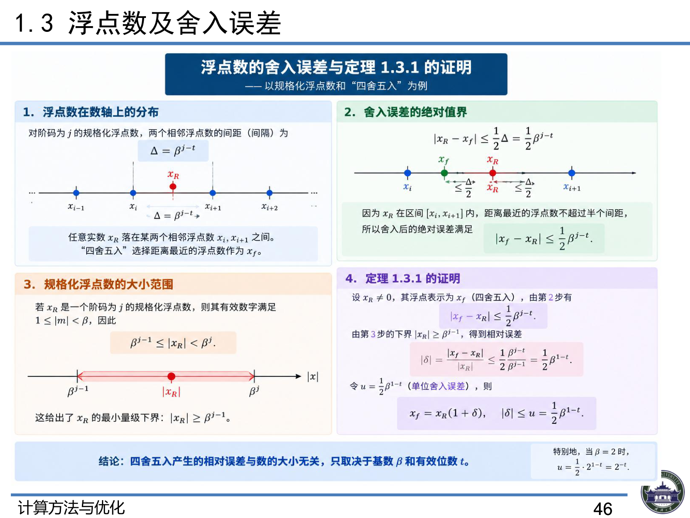

# 1.3 浮点数及舍入误差

> 上课：9.9 上午 ｜ 对应课件章节：第一章 1.3 浮点数及舍入误差（CM+Opt_ch1.pdf P43–46）
> 对应课本：李庆扬《数值分析》§1.2 数值计算的误差（浮点数的舍入误差部分）
> [返回总览](00-总览与索引.md)

## 1. 计算机浮点数系统（课件 P43）

浮点数系统 $F(\beta, t, m, M)$ 表示一个浮点数为：

$$x = W \times \beta^j$$

- $W$：**尾数**，$W = \pm 0.d_1 d_2 \dots d_t$，即 $W = \pm\sum_{r=1}^{t} d_r \beta^{-r}$
- $\beta$：**基**，为一正整数，表示进制（$x = \pm(\sum_{r=1}^{t} d_r \beta^{-r})\beta^j$）
- $j$：**基的阶码**
- $t$：**尾数数位**
- $-m, M$：阶数的下界与上界，$-m \le j \le M$

**规格化浮点数**：$1 \le d_1 \le \beta - 1$，$0 \le d_i \le \beta - 1 \ (i = 2, 3, \dots, t)$

> 浮点数系统为**散点的有限集**，只能表示有限个实数。

**$F(2, t, m, M)$ 所能表示的实数范围：**

$$x_R \in [-0.111\dots1 \times 2^M,\ -2^{-m-1}] \cup [2^{-m-1},\ 0.111\dots1 \times 2^M]$$

> 课堂口头：最小/最大规格化数就是这样"拼"出来的——尾数取极值（最小 $0.1000\ldots$、最大 $0.1111\ldots$），指数 $j$ 取边界（下界 $-m$、上界 $M$）。最小正规格化数 = $2^{-1} \times 2^{-m} = 2^{-m-1}$。老师强调：边界数覆盖了浮点数集的**上下两端**，拼出它们就理解了整个集合的构成。

**尾数 $W$ 的绝对值**：$|W| = N_i \times 2^{-t}$，其中 $N_i \in [2^{t-1}, 2^t)$，$N_i \in \mathbb{N}$。

**浮点数集实数个数**：$2(M + m + 1)(2^t - 2^{t-1}) + 1$

**简单推导（供理解）**

**① 实数范围**：规格化尾数 $W$ 的最小值为 $0.100\ldots0_2 = 2^{-1}$（首位 $d_1=1$ 强制为 1），最大值为 $0.111\ldots1_2 = 1 - 2^{-t}$（$t$ 位全 1，等比求和 $\sum_{r=1}^{t}2^{-r} = 1 - 2^{-t}$）；阶码 $j \in [-m, M]$。于是

- 最小正数：$2^{-1} \times 2^{-m} = 2^{-m-1}$
- 最大数：$(1 - 2^{-t}) \times 2^M = 0.111\ldots1 \times 2^M$

正负对称，故实数范围为 $[-(1-2^{-t})2^M,\ -2^{-m-1}] \cup [2^{-m-1},\ (1-2^{-t})2^M]$。

**② 尾数绝对值**：把 $W$ 的二进制展开整体乘 $2^t$：

$$|W| \times 2^t = d_1 2^{t-1} + d_2 2^{t-2} + \cdots + d_t 2^{0} =: N_i \in \mathbb{N}$$

$N_i$ 是 $t$ 位二进制整数（首位即 $d_1$ 是最高位）。规格化要求 $d_1 = 1$，故 $N_i \ge 2^{t-1}$；$t$ 位整数最大为 $2^t - 1 < 2^t$，故 $N_i \in [2^{t-1}, 2^t)$，从而 $|W| = N_i \times 2^{-t}$。等价地，规格化尾数 $W$ 的取值区间为 $[2^{-1},\ 1 - 2^{-t}]$（对应整数 $N_i \in [2^{t-1},\ 2^t - 1]$）——课堂口头说的"二进制展开、提取 $2^{-t}$ 得整数形式"就是这个推导。

**③ 浮点数个数**（分步相乘）：

- 尾数取值个数：$N_i$ 在 $[2^{t-1}, 2^t)$ 内取整数，共 $2^t - 2^{t-1}$（即 $2^{t-1}$）个，正负尾数各这么多；
- 阶码取值个数：$j = -m, \ldots, M$ 共 $M + m + 1$ 个；
- 符号两类：×2。

合计 $2(M+m+1)(2^t - 2^{t-1})$ 个；**再加 1 表示 0**——$0$ 无法写成 $W \times 2^j$（规格化尾数恒 $\ge 2^{-1}$），必须单独计入，故总数 $= 2(M+m+1)(2^t - 2^{t-1}) + 1$。

## 2. 计算机浮点数表示（课件 P44）

数值形式：$-1^S \cdot W \cdot 2^j$

- $S$：符号位，取 0 或 1
- $j$：2 的幂次，即阶码
- $W$：有效位数，即尾数

| 格式 | 总位数 | 符号位 | 阶码 | 尾数 |
|------|--------|--------|------|------|
| 单精度 | 32 位 | 1 位 | 8 位 | 23 位 |
| 双精度 | 64 位 | 1 位 | 11 位 | 52 位 |

> 课堂口头（量化背景）：大模型场景常用 16 位甚至 8 位存数——存储省、但误差大。为什么对精度要求高？因为"输入误差小 → 在误差传播规律下输出误差也小"（误差会被算法放大/累积，见 [1.5-线性方程组的性态与算法稳定性](1.5-线性方程组的性态与算法稳定性.md)）。

## 3. 舍入误差（课件 P45–46）

实数 $x_R$ 只能通过浮点数系统 $F(\beta,t,m,M)$ 中最近似的数 $x_i$ 表示（"四舍五入"确定）：

$$|x_f - x_R| \le \frac{1}{2}\beta^{j-t}$$

**定理 1.3.1**

$$x_f = x_R(1 + \delta), \quad |\delta| \le \frac{1}{2}\beta^{1-t}$$

**证明（供理解）**

**引理（相邻浮点数间距）**：阶码同为 $j$ 的相邻两个浮点数，尾数相差末位 1 个单位 $\beta^{-t}$，故数值间距为

$$\Delta = \beta^{j-t}$$

**绝对误差界**：设 $\beta^{j-1} \le |x_R| < \beta^j$（即 $x_R$ 的阶码为 $j$）。$x_R$ 两侧最近的浮点数相距 $\beta^{j-t}$，"四舍五入"（就近舍入）取较近者，误差至多为半间距：

$$|x_f - x_R| \le \frac{1}{2}\beta^{j-t}$$

**相对误差界（定理 1.3.1）**：利用 $|x_R| \ge \beta^{j-1}$ 给分母一个下界，两边除以 $|x_R|$：

$$|\delta| = \frac{|x_f - x_R|}{|x_R|} \le \frac{\frac{1}{2}\beta^{j-t}}{\beta^{j-1}} = \frac{1}{2}\beta^{1-t}$$

指数 $j$ 在约分中抵消——**相对误差上界只依赖进制 $\beta$ 与尾数位数 $t$，与数的大小无关**（这正是课堂口头"除以 $|x_R|$ 后 $j$ 抵消"的严格写法）。再由 $x_f = x_R + (x_f - x_R) = x_R(1 + \delta)$ 即得定理 1.3.1。

> 课堂口头：四舍五入使误差最多为间距一半（即上面的绝对误差界）；直观上就是"相邻浮点数相距 $\beta^{j-t}$（末位加 1 的差别），取中点舍入"。MATLAB 中最小相对误差量级约 $10^{-16}$，对应双精度 $\varepsilon \approx 2^{-52} \approx 2.2\times10^{-16}$。

> 课件补充（P46）：令 $u = \frac{1}{2}\beta^{1-t}$（**单位舍入误差**，unit roundoff），则 $x_f = x_R(1+\delta)$，$|\delta| \le u$；当 $\beta=2$ 时 $u = \frac{1}{2}\cdot 2^{1-t} = 2^{-t}$。结论：四舍五入产生的相对误差**与数的大小无关**，只取决于基数 $\beta$ 和有效位数 $t$。

## 4. 板书例题：浮点格式 $FC(2,3,1,2)$

参数：$\beta = 2, t = 3, m = 1, M = 2$，即 $2^j$ 取 $2^{-1}, 2^0, 2^1, 2^2$。

| 尾数 W（二进制→十进制） | $2^{-1}=0.5$ | $2^0=1$ | $2^1=2$ | $2^2=4$ |
|---|---|---|---|---|
| $(0.100)_2 = 0.5$ | 0.25 | 0.5 | 1 | 2 |
| $(0.101)_2 = 0.625$ | 0.3125 | 0.625 | 1.25 | 2.5 |
| $(0.110)_2 = 0.75$ | 0.375 | 0.75 | 1.5 | 3 |
| $(0.111)_2 = 0.875$ | 0.4375 | 0.875 | 1.75 | 3.5 |

各阶码对应的相邻间隔：$\Delta = 0.0625,\ 0.125,\ 0.25,\ 0.5$（随阶码增大而增大，浮点数分布不均匀，靠近 0 越密）。

> 课堂口头：这一部分原本有一页例题（板书未写）在课件中误删了；课堂上直接口头讲了 $F(2,3,1,2)$ 的数值表（即上表）。
