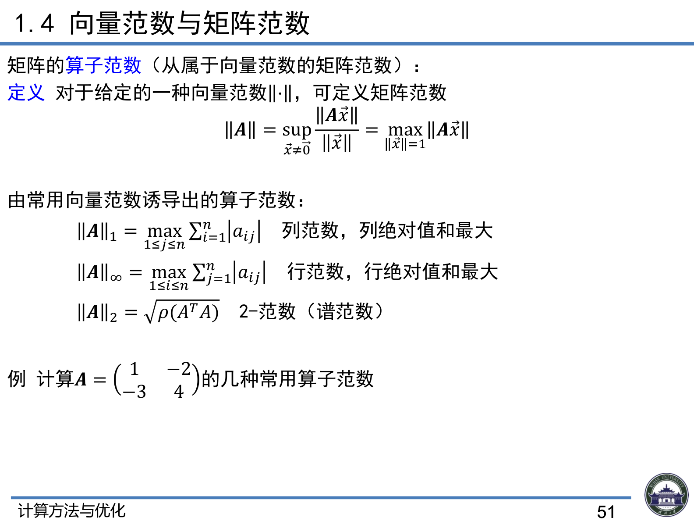
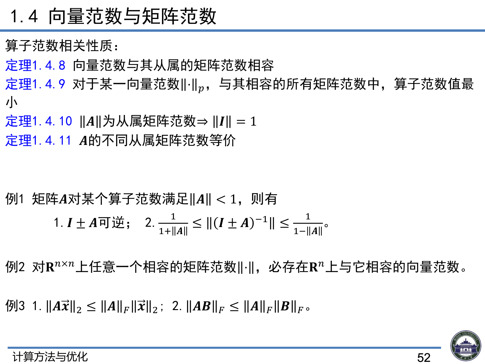

# 1.4 向量范数与矩阵范数

> 上课：9.9 上午 ｜ 对应课件章节：第一章 1.4 向量范数与矩阵范数（CM+Opt_ch1.pdf P47–52）
> 对应课本：李庆扬《数值分析》§5.4 向量和矩阵的范数（教材做主线，本文按课本补充）
> [返回总览](00-总览与索引.md)

## 1. 向量范数与向量序列极限

### 1.1 向量范数定义（课件 P47）

> 课堂口头（动机）：范数的本质是一个函数——输入 $n$ 维实向量、输出一个实数；"范数"（norm）是 normal 的简写，蕴含"规范/尺子"之意，用一把尺子衡量向量离原点的远近。为什么要定义它？向量有 $n$ 个分量，无法像实数那样直接比大小（一个分量大、另一个小怎么办）；而**没有大小比较就无法定义收敛**（收敛靠"距离越来越近"）。范数把 $n$ 个分量"糅合成一个数"，使比较与收敛判断成为可能（老师用"判断杯子大中小看体积而非长宽高"作类比）。

定义 $\mathbb{R}^n$ 的向量范数 $\|\cdot\|$：$\forall \vec{x}, \vec{y} \in \mathbb{R}^n$ 满足

1. 非负性：$\|\vec{x}\| \ge 0$，且 $\|\vec{x}\| = 0 \Leftrightarrow \vec{x} = 0$
2. 齐次性：$\forall \lambda \in \mathbb{R}$，$\|\lambda\vec{x}\| = |\lambda|\|\vec{x}\|$
3. 三角不等式：$\|\vec{x} + \vec{y}\| \le \|\vec{x}\| + \|\vec{y}\|$

> 课堂口头（三公理直觉）：非负性——距离不可能为负；齐次性——$\|\lambda x\| = |\lambda|\|x\|$ 相当于把实轴旋转/伸缩，共线点保持线性远近关系；三角不等式——距离运算必须满足"两边之和 ≥ 第三边"式的关系。

### 1.2 常用的向量范数

$$\|\vec{x}\|_1 = \sum_{i=1}^{n}|x_i| \quad \text{1-范数}$$

$$\|\vec{x}\|_2 = \sqrt{\sum_{i=1}^{n}|x_i|^2} \quad \text{2-范数}$$

$$\|\vec{x}\|_\infty = \max_{1 \le i \le n}|x_i| \quad \infty\text{-范数}$$

一般来说可定义 **p-范数（Hölder 范数）**：$\|\vec{x}\|_p = \sqrt[p]{\sum_{i=1}^{n}|x_i|^p}$

**例**：计算 $\vec{x} = (1, -2, 3)^T$ 的几种常用范数

$$\|\vec{x}\|_1 = |1| + |-2| + |3| = 6$$

$$\|\vec{x}\|_2 = \sqrt{1^2 + (-2)^2 + 3^2} = \sqrt{14}$$

$$\|\vec{x}\|_\infty = \max\{1, 2, 3\} = 3$$

> 课堂口头（几何直觉）：$\|\cdot\|_1$ 即曼哈顿距离；$\|\cdot\|_2$ 即欧氏距离（$n=3$ 时就是三维空间距离，最直观）；$\|\cdot\|_\infty$ 取最大分量绝对值。$p$ 范数取 $p=1,2$ 退化为前两者；$p \to \infty$ 用极限定义——提取最大分量 $x_j$ 后其余分量相对趋于 0，形式上得到最大分量（老师说明这是形式论证，严格证明可补）。

### 1.3 向量范数的重要性质（课件 P48）

1. $\|-\vec{x}\| = \|\vec{x}\|$
2. $\big|\|\vec{x}\| - \|\vec{y}\|\big| \le \|\vec{x} - \vec{y}\|$（差的反三角不等式）
3. $\|\vec{x}\|$ 是 $\mathbb{R}^n$ 上向量的连续函数

**定理 1.4.1（范数等价性）**：$\mathbb{R}^n$ 上的一切范数都等价，即存在常数 $c_1, c_2 > 0$ 使得

$$c_1\|\vec{x}\|' \le \|\vec{x}\| \le c_2\|\vec{x}\|'$$

> 课堂口头（等价性的用处）：$C_1\|x\| \le \|x\|' \le C_2\|x\|$ 保证"一个范数下离原点远/近，其他范数下也远/近"，只是数值差常数倍。实际意义：**证明性质时可挑好算的范数（如 $\|\cdot\|_1$）证，再借助等价性平移**；对矩阵范数尤其重要（谱范数难算）。

### 1.4 向量序列收敛

**定义（向量序列收敛）**：令 $\vec{x}_k = (x_{k1}, x_{k2}, \dots, x_{kn})^T \in \mathbb{R}^n$，$k = 1, 2, \dots$，设 $\vec{x}^* = (x_1^*, x_2^*, \dots, x_n^*)^T \in \mathbb{R}^n$。如果 $\lim\limits_{k \to \infty} x_{ki} = x_i^*$ 对所有的 $i = 1, 2, \dots, n$ 成立，则称 $\lim\limits_{k \to \infty} \vec{x}_k = \vec{x}^*$，即这个向量序列收敛。

**定理 1.4.2**：对于任意向量范数，

$$\lim_{k \to \infty} \vec{x}_k = \vec{x}^* \iff \lim_{k \to \infty}\|\vec{x}_k - \vec{x}^*\| = 0$$

**定理 1.4.3**：$\lim\limits_{k \to \infty}(\vec{x}_k \pm \vec{y}_k) = \vec{x}^* \pm \vec{y}^*$

> 意义：范数把"向量序列收敛"转化为"实数列 $\|\vec{x}_k - \vec{x}^*\| \to 0$"来考察，且由于范数等价，收敛性与所选范数无关。

> 课堂口头（定理 1.4.2）：逐分量看，$n$ 个分量数列**各自都收敛** ⇔ 范数意义下 $\|\vec{x}^{(k)} - \vec{x}^*\| \to 0$。范数给出了一条"省事"的判定路径：不必逐个分量验证。

## 2. 矩阵范数与矩阵序列极限

### 2.1 矩阵范数定义（课件 P49）

> 课堂口头（动机）：矩阵"比大小"没有直观对应——向量有平面/三维空间的几何直觉，矩阵（即使 $2\times2$）没有，所以定义比向量情形更重要，也更依赖公理化定义。

定义 $\mathbb{R}^{n \times n}$ 的矩阵范数 $\|\cdot\|$：$\forall A, B \in \mathbb{R}^{n \times n}$ 满足

1. 非负性：$\|A\| \ge 0$，且 $\|A\| = 0 \Leftrightarrow A = 0$
2. 齐次性：$\forall \lambda \in \mathbb{R}$，$\|\lambda A\| = |\lambda|\|A\|$
3. 三角不等式：$\|A + B\| \le \|A\| + \|B\|$

若还满足 **(4) 相容性**：$\|A \cdot B\| \le \|A\| \cdot \|B\|$，则称为**相容的矩阵范数**（或模）。

> 课堂口头：矩阵范数定义比向量多一条（相容性）$\|AB\| \le \|A\|\|B\|$。老师对比行列式：行列式也是"矩阵→数"的函数，但**不满足非负性与线性**（可为负、不线性），故不是范数。

**F-范数（Frobenius）**：$\|A\|_F = \sqrt{\sum_{i=1}^{n}\sum_{j=1}^{n}|a_{ij}|^2}$，可看作 2-范数的推广。

> 课堂口头：F-范数是向量 2-范数的直接推广，好算（$n^2$ 次加法）。

**相容性**：
1. 矩阵范数之间的相容性（上述第 4 条）
2. 矩阵范数与向量范数的相容性：$\|A\vec{x}\| \le \|A\| \cdot \|\vec{x}\|$

> 课堂口头（两种"相容性"要分清）：① 矩阵乘法相容性（定义第 4 条）；② **矩阵范数与向量范数的相容性** $\|Ax\| \le \|A\|\|x\|$——在迭代法、误差传播分析中最常用，因为 $Ax$ 是数值算法里的基本操作。

### 2.2 矩阵范数相关性质（课件 P50）

- **定理 1.4.4**：矩阵范数 $\|A\|$ 是矩阵 $A$ 的连续函数
- **定理 1.4.5**：对于一个相容的矩阵范数，存在一种与之相容的向量范数
  > 课堂口头（动机）：给定任意相容矩阵范数，**必存在**一个与之相容的向量范数；再叠加向量范数等价性（定理 1.4.1），可推知"只要 $\|Ax\|$ 在一种向量范数下很小，其他范数下也不会大"——论证链条完整。
- **定理 1.4.6**：矩阵 $A$ 的谱半径（按模最大特征值）为 $\rho(A)$，则对任一种矩阵范数有

$$\rho(A) \le \|A\|$$

> 课堂口头（谱半径的实用意义）：$\rho(A)$ 是复平面上能覆盖全部特征值的最小圆半径。谱半径难算（要先求全部特征值），而矩阵范数好算——矩阵范数给出谱半径的**上界**；算多个范数可不断收紧上界。

- **定理 1.4.7**：对于任意给定正数 $\varepsilon > 0$，总存在一种矩阵范数满足 $\|A\| \le \rho(A) + \varepsilon$

## 3. 算子范数

### 3.1 定义（课件 P51）

矩阵的**算子范数**（从属于向量范数的矩阵范数）：对于给定的一种向量范数 $\|\cdot\|$，可定义矩阵范数

$$\|A\| = \sup_{x \neq 0} \frac{\|A\vec{x}\|}{\|\vec{x}\|} = \max_{\|\vec{x}\| = 1} \|A\vec{x}\|$$

### 3.2 由常用向量范数诱导出的算子范数

$$\|A\|_1 = \max_{1 \le j \le n} \sum_{i=1}^{n}|a_{ij}| \quad \text{列范数，列绝对值和最大}$$

$$\|A\|_\infty = \max_{1 \le i \le n} \sum_{j=1}^{n}|a_{ij}| \quad \text{行范数，行绝对值和最大}$$

$$\|A\|_2 = \sqrt{\rho(A^TA)} \quad \text{2-范数（谱范数）}$$

> 课堂口头（诱导关系）：向量 1-范数 → **列范数**（每列绝对值和的最大者）；向量 $\infty$-范数 → **行范数**（每行绝对值和的最大者）；向量 2-范数 → **谱范数** $\|A\|_2 = \sqrt{\rho(A^TA)}$（$A^TA$ 对称正定）。

**课件例题**：计算 $A=\begin{pmatrix}1&-2\\-3&4\end{pmatrix}$ 的几种常用算子范数（课件 P51）：

- $\|A\|_1 = \max\{|1|+|-3|,\ |-2|+|4|\} = \max\{4, 6\} = 6$（列范数）
- $\|A\|_\infty = \max\{|1|+|-2|,\ |-3|+|4|\} = \max\{3, 7\} = 7$（行范数）
- $\|A\|_2 = \sqrt{\rho(A^TA)}$：$A^TA = \begin{pmatrix}10&-14\\-14&20\end{pmatrix}$，特征值为 $\lambda = 15 \pm \sqrt{221}$，$\|A\|_2 = \sqrt{15+\sqrt{221}} \approx 5.46$——谱范数要算 $A^TA$ 的特征值，手算容易错。

### 3.3 算子范数相关性质（课件 P52）

- **定理 1.4.8**：向量范数与其从属的矩阵范数相容
- **定理 1.4.9**：对于某一向量范数 $\|\cdot\|_p$，与其相容的所有矩阵范数中，**算子范数值最小**
  > 课堂口头（直觉）：在所有与给定向量范数相容的矩阵范数中，算子范数是**最小**的——给矩阵范数一族提供了下界。
- **定理 1.4.10**：$\|A\|$ 为从属矩阵范数 $\Rightarrow \|I\| = 1$
- **定理 1.4.11**：$A$ 的不同从属矩阵范数等价

### 3.4 课件例题（即你的练习题 1/2/3 来源，课件 P52）

**例 1**：矩阵 $A$ 对某个算子范数满足 $\|A\| < 1$，则有

$$1.\ I \pm A \text{ 可逆};\qquad 2.\ \frac{1}{1+\|A\|} \le \|(I \pm A)^{-1}\| \le \frac{1}{1-\|A\|}$$

**例 2**：对 $\mathbb{R}^{n \times n}$ 上任意一个相容的矩阵范数 $\|\cdot\|$，必存在 $\mathbb{R}^n$ 上与它相容的向量范数。

**例 3**：$1.\ \|A\vec{x}\|_2 \le \|A\|_F \|\vec{x}\|_2$；$2.\ \|AB\|_F \le \|A\|_F \|B\|_F$。

> 这三道题已作为练习题移到 [0908-0909-练习题](../数值分析/0908-0909-练习题.md)（含分步提示），练习 4 见 [1.5 小结例题](1.5-线性方程组的性态与算法稳定性.md#小结例题)。

### 3.5 课本补充：两条重要定理（李庆扬《数值分析》§5.4，定理 19、20）

**定理（课本定理 19）**：若 $A \in \mathbb{R}^{n\times n}$ 为**对称矩阵**，则

$$\|A\|_2 = \rho(A)$$

> 意义：对称矩阵的谱范数 = 谱半径，不需要算 $A^TA$ 的特征值，直接取特征值模的最大者。证明思路：$A$ 对称 ⇒ 可正交对角化 $A = Q^T\Lambda Q$，于是 $\|A\|_2 = \sqrt{\rho(A^TA)} = \sqrt{\rho(A^2)} = \max|\lambda_i| = \rho(A)$。这条在迭代法收敛性分析里反复出现。

**定理（课本定理 20）**：如果 $\|B\| < 1$（某一种算子范数），则 $I \pm B$ 非奇异，且

$$\frac{1}{1 + \|B\|} \le \|(I \pm B)^{-1}\| \le \frac{1}{1 - \|B\|}$$

> 这正是练习题 1（例 1）的课本完整表述：$\|B\|<1$ 意味着 $B$ 离零矩阵"不远"，$I+B$ 离单位阵不远，保证可逆，且逆的范数有界。该性质是后续迭代法（第 6 章）与矩阵级数收敛（Neumann 级数 $\sum(-A)^k$）的基础。
