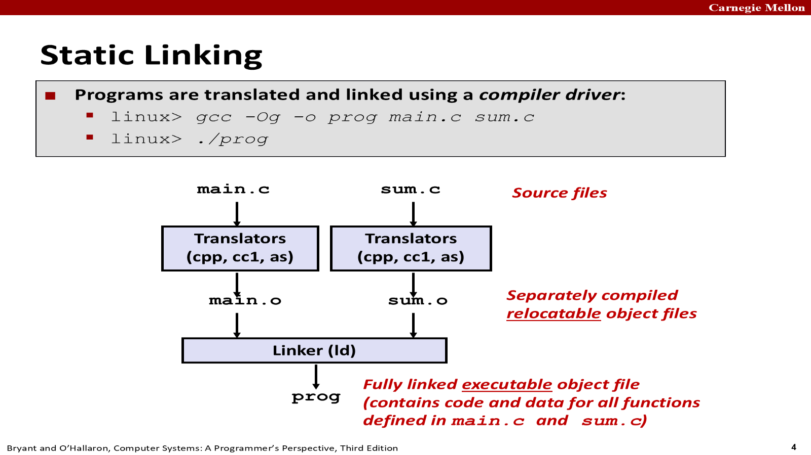
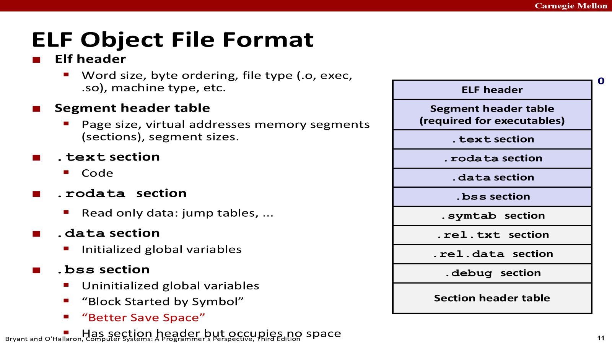
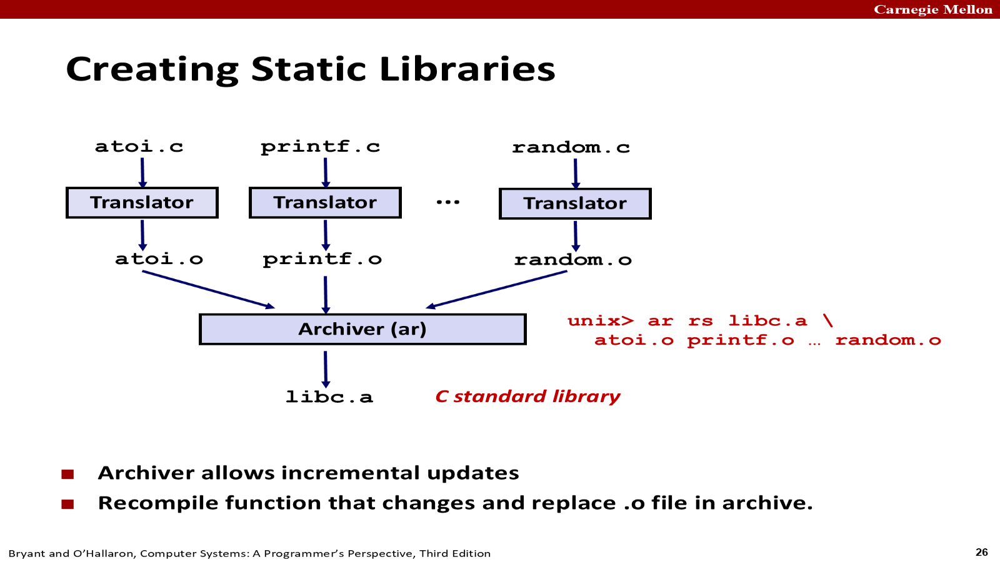
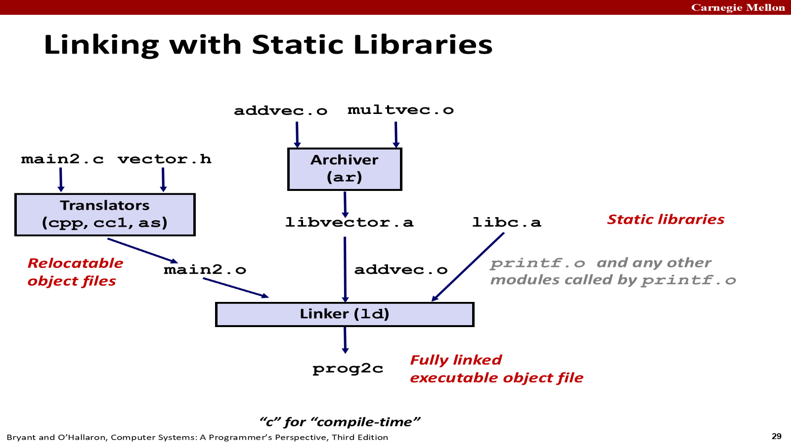
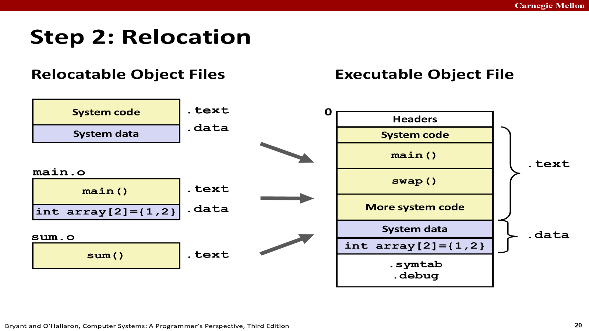
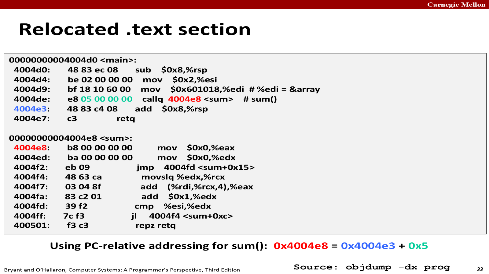
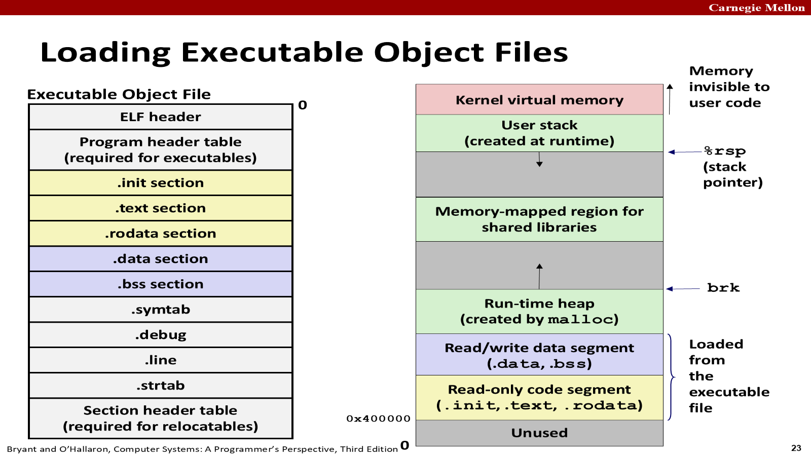
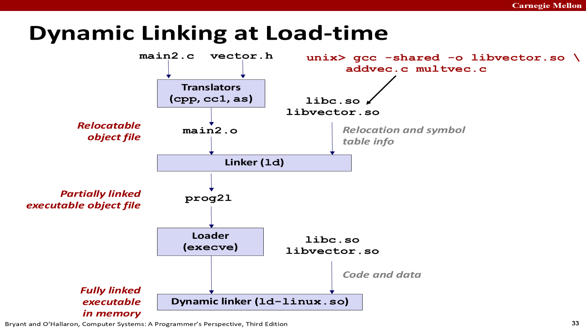

# 第七章 链接（Linking）

> 依据：CMU 15-213 第 13 讲课件 `13-linking.pptx`（Bryant & O'Hallaron）+ 《深入理解计算机系统》原书第 3 版第七章（中文版）+ 课堂讲解。
> 环境假设：Linux x86-64 系统，ELF-64 格式。

---

## 0. 链接是什么？为什么学它？

**链接（linking）**：把各种代码和数据片段收集并组合成**一个单一文件**的过程，该文件可被加载（复制）进内存并执行。

链接发生的**三个时机**：

| 时机 | 说明 |
|---|---|
| 编译时（compile time） | 源代码被翻译成机器码时（静态链接） |
| 加载时（load time） | 程序被加载器（loader）加载进内存并执行时 |
| 运行时（run time） | 由应用程序自己执行（dlopen 等） |

**为什么要学链接**（课件 + 书中 5 点）：

1. **构造大型程序**：避免"缺少模块 / 缺少库 / 库版本不兼容"类链接错误。
2. **避免危险的编程错误**：链接器解析符号引用时的默认决定会悄悄影响程序正确性（多重定义全局变量不报错！）。
3. **理解作用域规则**：全局/局部变量区别、`static` 到底意味着什么。
4. **理解其他系统概念**：加载、虚拟内存、分段、内存映射都依赖可执行目标文件。
5. **利用共享库**：软件升级包、Web 服务器动态内容等都靠动态链接。

---

## 1. 编译器驱动程序与编译流程（7.1）

```
linux> gcc -Og -o prog main.c sum.c
linux> ./prog
```

`gcc` 是**编译器驱动程序**，它依次调用：

- `cpp`：C 预处理器，main.c → main.i（ASCII 中间文件）。
- `cc1`：C 编译器，main.i → main.s（汇编语言）。
- `as`：汇编器，main.s → main.o（可重定位目标文件，机器码）。
- `ld`：链接器，把 main.o、sum.o 及必要的系统目标文件组合成可执行文件 prog。
- 用 `gcc -v` 可查看每一步的实际命令。



> **课堂补充**：平时口头说"编译"常把四步全包含；严格说"编译"只是 cc1 那一步。链接耗时很大，所以**只改一个文件时，只需重新编译该文件 + 重新链接**，其他文件不必重编——链接器是必须做的，而"是否要重编"由文件时间戳判断（修改时间变了的文件才重编）。

**为什么需要链接（两大理由）**：

- **模块化（Modularity）**：程序拆成多个小源文件；常用函数可打包成库（数学库、标准 C 库）。一个文件一个类/一个模块，高内聚低耦合。
- **效率（Efficiency）**：
  - 时间：分离编译，改一个文件只重编该文件再重新链接；
  - 空间：公共函数聚合到单个文件（库），而可执行文件和运行内存映像**只包含实际用到的函数的代码**。

---

## 2. 链接器做什么？（7.2）

两个主要任务：

**任务一：符号解析（symbol resolution）**
- 程序定义和引用符号（全局变量和函数），符号定义存放在目标文件的**符号表（symbol table）**中。
- 符号表是一个结构体数组，每个条目含名字、大小、位置。
- 链接器把**每个符号引用**与**恰好一个符号定义**关联起来。
- 例：`swap();` 引用符号 swap；`int *xp = &x;` 定义符号 xp、引用符号 x。

**任务二：重定位（relocation）**
- 把分离的代码节、数据节合并成单一节；
- 把符号从 .o 文件中的相对位置重定位到可执行文件中的**最终绝对内存地址**；
- 更新所有对符号的引用，使其指向新位置。
- 链接器依赖汇编器生成的**重定位记录（relocation entry）**来执行修改。

> 核心思想（课堂）：链接的本质就是把模块间互相调用的"地址"补上——编译时不知道最终地址（占位 0），链接时确定地址后填进去。

---

## 3. 目标文件的三种形式（7.3）

| 类型 | 后缀/名称 | 说明 |
|---|---|---|
| **可重定位目标文件** | `.o` | 编译器和汇编器生成，可与其它可重定位文件合并成可执行文件。每个 .o 恰好由一个 .c 生成 |
| **可执行目标文件** | `a.out`（默认名） | 链接器生成，可被直接复制进内存并执行 |
| **共享目标文件** | `.so` | 特殊的可重定位文件，可在加载时或运行时被动态加载进内存并链接；Windows 叫 DLL |

> 课堂提醒：可执行文件**不是**只有 `.exe` 结尾的（Windows 靠后缀关联程序，Linux 靠文件内容/权限判断）。`a.out` 名字来源于早期 Unix 的"assembler output"。

**ELF（Executable and Linkable Format）**：目标文件的标准二进制格式，统一用于 .o、可执行、.so 三类文件，统称 ELF 二进制文件。Windows 用 PE，Mac 用 Mach-O，但概念相同。

---

## 4. ELF 可重定位目标文件格式（7.4）

```
ELF 头（ELF header）
段头部表（segment header table，可执行文件必需）
.text   已编译程序的机器代码
.rodata 只读数据（printf 字符串、开关语句跳转表）
.data   已初始化的全局和静态 C 变量
.bss    未初始化的全局/静态变量，以及初始化为 0 的（不占磁盘空间！）
.symtab 符号表（函数和全局变量信息）
.rel.text .text 节中需要修改的位置列表（重定位信息）
.rel.data 被引用/定义的全局变量的重定位信息
.debug  调试符号表（仅 -g 时生成）
.line   源程序行号与机器指令的映射（仅 -g 时生成）
.strtab 字符串表（符号名、节名，以 null 结尾的字符串序列）
节头部表（section header table）
```

要点：

- **ELF 头**：16 字节序列开头，描述字大小、字节顺序（小端/大端）；还包含文件类型（.o/exec/.so）、机器类型、节头部表偏移与条目大小数量。
- **.data vs .bss**：
  - `.bss` 是"Block Started by Symbol"（块存储开始）的缩写，也记作 **"Better Save Space"（更好地节省空间）**。
  - `.bss` 在目标文件中**不占据实际空间**，只是占位符；运行时在内存中分配并初始化为 0。
  - **局部 C 变量（非静态）在运行时存于栈中，不出现在 .data 也不出现在 .bss**。
- **.symtab**：每个可重定位文件都有符号表（不需要 -g；-g 只是额外生成 .debug/.line）。但 .symtab **不包含局部变量条目**。
- **.rel.text / .rel.data**：任何调用外部函数或引用全局变量的指令都需要重定位；可执行文件中重定位信息通常被省略。
- 多个 .o 链接成可执行文件时：相同类型的节合并（所有 .text 合成一个 .text，所有 .data 合成一个 .data）。



---

## 5. 符号与符号表（7.5）

### 5.1 三种链接器符号

| 符号类型 | 定义 | 对应 C 代码 |
|---|---|---|
| **全局符号（Global）** | 由模块 m 定义、可被其他模块引用 | 非 static 的 C 函数和全局变量 |
| **外部符号（External）** | 被模块 m 引用、但在其他模块定义 | 在其他模块定义的非 static 函数/全局变量（extern 引用） |
| **本地符号（Local）** | 只被模块 m 定义和引用 | 带 static 属性的 C 函数和全局变量 |

> ⚠️ **本地链接器符号 ≠ 本地程序变量**：
> - 本地**非静态**变量（函数内普通局部变量）在运行时管理在**栈**中，`.symtab` 里**没有**条目，链接器不关心。
> - 本地**静态**变量（`static int x = 0;`）不在栈中，编译器在 `.data` 或 `.bss` 中分配空间，并在符号表中创建**唯一名字**的本地链接器符号：例如函数 f 和 g 中各有 `static int x`，编译器生成 `x.1`、`x.2`。

```c
int f() { static int x = 0; return x; }
int g() { static int x = 1; return x; }
// 编译器在 .data 为每个 x 分配空间，符号名唯一化为 x.1、x.2
```

> **课堂补充**：`static` 修饰的全局变量/函数只在**本文件**内可见，链接器不需要处理它们（它们不会与外部冲突）；用 static 保护模块私有名字是好习惯（类似 Java/C++ 的 private）。

### 5.2 ELF 符号表条目结构（Elf64_Symbol）

```c
typedef struct {
    int  name;     /* 字符串表偏移（指向以 null 结尾的符号名）*/
    char type:4,   /* 函数还是数据（4 位）*/
         binding:4;/* 本地还是全局（4 位）*/
    char reserved; /* 未使用 */
    short section; /* 节头部索引 */
    long value;    /* 节偏移（可重定位文件）或绝对地址（可执行文件）*/
    long size;     /* 目标大小（字节）*/
} Elf64_Symbol;
```

- `value`：可重定位文件中是"距定义目标起始位置的偏移"；可执行文件中是绝对运行时地址。
- `section` 字段的**三个伪节（pseudosection）**（节头部表中没有条目）：
  - `ABS`：不该被重定位的符号；
  - `UNDEF`：本模块引用但在别处定义的符号（未定义）；
  - `COMMON`：还未分配位置的未初始化数据目标（value 给对齐要求，size 给最小大小）。
- 伪节**只在可重定位目标文件中出现**，可执行文件中没有。

### 5.3 COMMON 与 .bss 的区别（重要！）

现代 GCC 的分配规则：

| 情况 | 分配 |
|---|---|
| **未初始化的全局变量**（弱符号） | **COMMON** |
| 未初始化的**静态**变量、初始化为 0 的全局/静态变量 | **.bss** |

原因：编译器翻译某个模块时，不知道其他模块是否也定义了同名全局变量（弱符号可能被多个模块定义、由链接器选一个），所以把未初始化全局变量放进 COMMON，把决定权留给链接器；而初始化为 0 或 static 的是强/唯一符号，可放心放 .bss（详见 6.1）。

### 5.4 readelf 查看符号表（main.o 示例）

```
linux> readelf -s main.o

Symbol table '.symtab' contains 11 entries:
  Num:  Value          Size Type    Bind   Vis      Ndx Name
    8:  0000000000000000    24 FUNC   GLOBAL DEFAULT   1 main
    9:  0000000000000000     8 OBJECT GLOBAL DEFAULT   3 array
   10:  0000000000000000     0 NOTYPE GLOBAL DEFAULT UND sum
```

- `main`：24 字节函数，位于 .text 节（Ndx=1），偏移 0。
- `array`：8 字节对象，位于 .data 节（Ndx=3），偏移 0。
- `sum`：**UND**（未定义），本模块引用、定义在 sum.o。
- 前 8 个条目是链接器内部使用的局部符号（含 FILE 节、SECTION 节等），无实际意义。
- readelf 用整数索引标识节：Ndx=1 → .text，Ndx=3 → .data。

### 5.5 练习题 7.1（swap.o 符号表分析，重要例题）

```c
/* m.c */                    /* swap.c */
void swap();                 extern int buf[];
int buf[2] = {1, 2};         int *bufp0 = &buf[0];
int main() { swap();         int *bufp1;
             return 0; }     void swap() {
                                 int temp;
                                 bufp1 = &buf[1];
                                 temp = *bufp0;
                                 *bufp0 = *bufp1;
                                 *bufp1 = temp;
                             }
```

| 符号 | .symtab 条目? | 符号类型 | 定义模块 | 节 |
|---|---|---|---|---|
| `buf` | 是 | **extern**（外部） | m.o | .data |
| `bufp0` | 是 | 全局 | swap.o | .data（已初始化） |
| `bufp1` | 是 | 全局 | swap.o | **COMMON**（未初始化全局 → COMMON） |
| `swap` | 是 | 全局 | swap.o | .text |
| `temp` | **否** | — | — | —（局部变量在栈中，无符号表条目） |

---

## 6. 符号解析（7.6）

**基本方法**：把每个引用与输入可重定位目标文件符号表中的一个确定定义关联起来。

- 局部符号解析很简单：每个模块每个局部符号只有一个定义。
- 全局符号解析棘手：多个目标文件可能定义同名全局符号。
- 找不到定义的引用 → **链接错误**：

```
linux> gcc -Wall -Og -o linkerror linkerror.c
/tmp/cc5z5uti.o: In function `main':
/tmp/cc5z5uti.c:(.text+0x7): undefined reference to `foo'
```

### 6.1 链接器如何解析多重定义的全局符号：强/弱规则

编译器把每个全局符号标记为**强（strong）**或**弱（weak）**（编码在符号表 binding 中）：

- **强符号**：函数、已初始化的全局变量。
- **弱符号**：未初始化的全局变量。

**三条规则**：

| 规则 | 内容 | 结果 |
|---|---|---|
| 规则 1 | 多个同名的**强符号**不允许 | 链接错误（multiple definition） |
| 规则 2 | 一个强符号 + 多个弱符号同名 | 选**强符号**，弱引用解析到强符号 |
| 规则 3 | 多个弱符号同名 | **任意选一个**（可用 `gcc -fno-common` 改为报错） |

**危险案例**：

```c
/* foo3.c */                 /* bar3.c */
int x = 15213;               int x;          /* 弱 */
int main() {                 void f() {
    f();                         x = 15212;
    printf("x = %d\n", x);   }
    return 0;
}
// 运行时 x = 15212 —— main 的作者完全不知道 bar3.c 改了 x！
```

```c
/* foo5.c */                 /* bar5.c */
int y = 15212;               double x;       /* 弱，8 字节 */
int x = 15213;               void f() { x = -0.0; }
int main() { f(); printf("x = 0x%x y = 0x%x\n", x, y); }
// 在一台 x86-64 机器上：x 地址 0x601020，y 地址 0x601024
// bar5 的 double x（8 字节）会覆盖 x 和 y！输出 x = 0x0 y = 80000000
```

- 链接器只给一条**警告**（alignment 4 of symbol 'x' is smaller than 8），程序运行很久后才表现出来，非常难查。
- 对策：`-fno-common`（多重定义全局符号时报错）、`-Werror`（所有警告变错误）。

> **课堂补充**：规则 3 的问题在于随机选择一个弱符号，类型还可能不同（int 4 字节 vs double 8 字节），往里面写数据会越界覆盖相邻变量。多人协作时给全局变量/函数加**自己的名字前缀**（如 `sum_`）是业界惯例。

**练习题 7.2 答案**（REF(x.i)→DEF(x.k) 表示模块 i 的引用解析到模块 k 的定义）：

- A. 模块1 `int main()`（强），模块2 `int main;`（弱，未初始化全局变量）→ 规则 2 选强：
  - (a) REF(main.1) → DEF(main.1)；(b) REF(main.2) → DEF(main.1)
- B. 模块1 `void main()`（强函数），模块2 `int main = 1;`（强，已初始化）→ 规则 1：**错误**
- C. 模块1 `int x;`（弱），模块2 `double x = 1.0;`（强）→ 规则 2 选强：
  - (a) REF(x.1) → DEF(x.2)；(b) REF(x.2) → DEF(x.2)

### 6.2 全局变量使用建议（课件第 19 页）

1. 尽量避免使用全局变量；
2. 非用不可时，**尽量用 static**（模块私有）；
3. **定义全局变量时一定要初始化**（否则是弱符号，易被覆盖）；
4. **引用外部全局变量时用 extern 声明**。

### 6.3 与静态库链接（7.6.2）

**为什么需要库**：ISO C99 定义了大量标准函数（I/O、字符串、整数数学在 libc.a；浮点数学 sin/cos/sqrt 在 libm.a）。

- 方法一：编译器直接生成标准函数代码（Pascal 的做法）→ 对 C 不现实（函数太多，每次改动要换编译器）。
- 方法二：所有标准函数放一个 libc.o，大家链接它 → 每个可执行文件都含全部函数副本，磁盘和内存浪费极大，维护困难。
- 方法三：每个函数一个 .o 文件，程序员显式链接 → 高效但程序员负担重。
- **静态库（.a）** 是最终解：把相关可重定位目标文件连接成一个带索引的**存档（archive）**文件。

```
linux> gcc -c addvec.c multvec.c
linux> ar rcs libvector.a addvec.o multvec.o
```



- **ar**：创建静态库，插入/删除/列出/提取成员；支持增量更新（重编改动的函数，替换存档中的 .o）。
- **常用库**：
  - `libc.a`（C 标准库）：4.6 MB，1496 个目标文件（I/O、内存分配、信号、字符串、时间、随机数、整数数学）。
  - `libm.a`（数学库）：2 MB，444 个目标文件（浮点数学 sin/cos/tan/log/exp/sqrt）。
- 头文件（.h）与库（.a/.so）**同时发布**：.h 是"说明书"（函数声明），.a 是"实现"（机器码）。用 `#include "vector.h"` 引用本地头文件；`#include <stdio.h>` 从系统默认目录找。
- 链接时**只复制被引用的目标模块**（如 main2.o 用 addvec 就复制 addvec.o，不复制 multvec.o）。



### 6.4 链接器如何使用静态库解析引用（7.6.3）——命令行顺序陷阱！

链接器从左到右扫描命令行上的可重定位目标文件和存档文件，维护三个集合：

- **E**：将被合并进可执行文件的目标文件集合；
- **U**：未解析符号集合（引用但未定义）；
- **D**：已定义符号集合。

算法：
1. 文件是 .o：加入 E，更新 U/D；
2. 文件是 .a：尝试用存档中成员定义解析 U 中的符号，能解析的成员加入 E 并更新 U/D，反复直到 U/D 不再变化，其余成员丢弃；
3. 扫描结束若 U 非空 → 错误并终止。

**推论：库必须放在引用它的目标文件之后！**

```
linux> gcc -static -o prog2c main2.o ./libvector.a     # 正确
linux> gcc -static ./libvector.a main2.c               # 错误！
# 处理 libvector.a 时 U 为空 → 不复制任何成员 → 后面 main2.o 引用 addvec 无法解析
# undefined reference to 'addvec'
```

- 一般准则：**把库放在命令行结尾**。
- 库之间有依赖（a→b 表示 a 依赖 b 定义的符号）：**被依赖的库放在后面**：
  - `gcc foo.c libx.a libz.a liby.a`（x、z 依赖 y）
  - 循环依赖时**重复列出库**：`gcc foo.c libx.a liby.a libx.a`；或合并成一个存档。

**练习题 7.3 答案**（最小命令行）：
- A. `p.o libx.a`
- B. `p.o libx.a liby.a`
- C. `p.o libx.a liby.a libx.a`

---

## 7. 重定位（7.7）

重定位第一步：把不同 .o 中的 .text、.data 等节合并到可执行文件的对应节中，再给每个符号分配运行时地址。



### 7.1 重定位条目（relocation entry）

汇编器遇到位置未知的引用（外部函数、全局变量）时生成重定位条目，告诉链接器如何修改：

```c
typedef struct {
    long offset;   /* 需要被修改的引用的节偏移 */
    long type:32,  /* 重定位类型 */
         symbol:32;/* 符号表索引 */
    long addend;   /* 有符号常数，对引用值做偏移调整 */
} Elf64_Rela;
```

- 代码的重定位条目放 `.rel.text`；已初始化数据的放 `.rel.data`。
- 只关心两种基本类型：
  - **R_X86_64_PC32**：32 位 PC 相对地址引用（有效地址 = 指令中编码值 + PC 当前运行时值，PC 通常是**下一条指令**地址，如 call 的目标）。
  - **R_X86_64_32**（PPT 中写作 R_X86_64_32）：32 位**绝对地址**引用（直接使用编码值作为有效地址）。
- 这两种类型支持 x86-64 **小型代码模型**（代码+数据总量 < 2GB）；GCC 默认。

### 7.2 重定位算法

```
foreach section s {
    foreach relocation entry r {
        refptr = s + r.offset;                     /* 待重定位引用的地址 */
        if (r.type == R_X86_64_PC32) {             /* PC 相对引用 */
            refaddr = ADDR(s) + r.offset;          /* 引用的运行时地址 */
            *refptr = (unsigned)(ADDR(r.symbol) + r.addend - refaddr);
        }
        if (r.type == R_X86_64_32) {               /* 绝对引用 */
            *refptr = (unsigned)(ADDR(r.symbol) + r.addend);
        }
    }
}
```

### 7.3 例子：重定位 PC 相对引用（main.o 中调用 sum）

```asm
# objdump -dx main.o  （重定位条目紧跟在引用指令后）
0000000000000000 <main>:
   0:  48 83 ec 08     sub    $0x8,%rsp
   4:  be 02 00 00 00  mov    $0x2,%esi
   9:  bf 00 00 00 00  mov    $0x0,%edi          # %edi = &array
                        a: R_X86_64_32 array     # 重定位条目
   e:  e8 00 00 00 00  callq  13 <main+0x13>     # sum()
                        f: R_X86_64_PC32 sum-0x4 # 重定位条目
  13:  48 83 c4 08     add    $0x8,%rsp
  17:  c3              retq
```

对 `call sum` 的重定位条目：`r.offset = 0xf, r.symbol = sum, r.type = R_X86_64_PC32, r.addend = -4`

假设链接器确定：`ADDR(.text) = 0x4004d0`，`ADDR(sum) = 0x4004e8`：

```
refaddr = ADDR(s) + r.offset = 0x4004d0 + 0xf = 0x4004df
*refptr = ADDR(sum) + (-4) - refaddr = 0x4004e8 - 4 - 0x4004df = 0x5
```

结果：`4004de: e8 05 00 00 00  callq 4004e8 <sum>`

运行时：call 指令在 0x4004de，执行时 PC = 0x4004e3（下一条指令），PC + 0x5 = 0x4004e8 → 跳转到 sum。✔

> 为什么 addend = -4？因为 x86-64 中 call 指令的 PC 相对位移以**下一条指令**为基准，而 refptr 指向的是**当前指令内偏移量字段的地址**（0x4004df），PC（0x4004e3）比 refaddr 大 4，所以要减 4 抵消。

### 7.4 例子：重定位绝对引用（array）

对 `mov $0x0,%edi`（array 的引用）的重定位条目：`r.offset = 0xa, r.symbol = array, r.type = R_X86_64_32, r.addend = 0`

```
*refptr = ADDR(array) + 0 = 0x601018
```

结果：`4004d9: bf 18 10 60 00  mov $0x601018,%rdi  # %rdi = &array`

### 7.5 重定位后的可执行文件（图 7-12）

```
00000000004004d0 <main>:
  4004d0: 48 83 ec 08     sub    $0x8,%rsp
  4004d4: be 02 00 00 00  mov    $0x2,%esi
  4004d9: bf 18 10 60 00  mov    $0x601018,%rdi   # %rdi = &array
  4004de: e8 05 00 00 00  callq  4004e8 <sum>
  4004e3: 48 83 c4 08     add    $0x8,%rsp
  4004e7: c3              retq
00000000004004e8 <sum>:   ...（循环求和）

.data: 0000000000601018 <array>: 01 00 00 02 00 00 00  # {1, 2}
```

加载时把这些字节**直接复制到内存**，无需再修改。



**练习题 7.4 答案**：A. 对 sum 的重定位引用地址 = 0x4004de；B. 引用值 = 0x5。
**练习题 7.5 答案**：m.o 中对 swap 的调用 `r.offset=0xa, PC32, addend=-4`；.text 重定位到 0x4004d0、swap 到 0x4004e8 → `refaddr = 0x4004da`，`*refptr = 0x4004e8 - 4 - 0x4004da = 0xa`，即 callq 的位移值为 0x0000000a。

---

## 8. 可执行目标文件（7.8）

- 格式与可重定位文件类似，但：
  - 已完全重定位（**不再需要 .rel 节**）；
  - ELF 头包含**入口点**（entry point，程序运行时第一条指令的地址）；
  - 新增 `.init` 节（定义 `_init` 小函数，初始化代码调用）；
  - `.text/.rodata/.data` 已重定位到最终运行时地址。
- 可执行文件的连续片（chunk）被映射到连续内存段，映射关系由**程序头部表（program header table）**描述：

```
LOAD off 0x0        vaddr 0x400000  ...  filesz 0x690  memsz 0x690  flags r-x   # 只读代码段
LOAD off 0x690      vaddr 0x600df8  ...  filesz 0x228  memsz 0x230  flags rw-   # 读写数据段
```

- 代码段（r-x）：ELF 头 + 程序头部表 + .init + .text + .rodata，起始 0x400000。
- 数据段（rw-）：.data（0x228 字节从文件加载）+ .bss（8 字节，运行时初始化为 0）。
- **段对齐**：`vaddr mod align = off mod align`（align 通常 2^21 = 0x200000），为了加载时高效传送到内存（与虚拟内存组织有关，第 9 章细讲）。

---

## 9. 加载可执行目标文件（7.9）

- shell 调用**加载器（loader）**（通过 `execve` 系统调用，8.4.6 详述），把代码和数据从磁盘复制到内存，跳转到入口点执行，这个过程叫**加载（loading）**。
- 入口点 `_start` 函数（系统目标文件 ctrl.o 中定义）→ 调用 `__libc_start_main`（在 libc.so 中）→ 初始化执行环境 → 调用 main → 处理返回值 → 控制返回内核。

**Linux x86-64 运行时内存映像**（自高地址到低地址）：

```
内核内存（从 2^48 开始，对用户代码不可见）
用户栈（从最大合法用户地址 2^48 - 1 开始，向下增长，运行时创建）
共享库的内存映射区域
运行时堆（由 malloc 创建，向上增长，brk 指针）
读/写段（.data, .bss）
只读代码段（.init, .text, .rodata）   ← 从 0x400000 开始
```

- 堆向上增长、栈向下增长（都运行时创建）；代码段和数据段之间有对齐间隙。
- 栈、共享库、堆的运行时地址使用**地址空间布局随机化（ASLR）**，每次运行都变，但相对位置不变。


- 实际加载过程（概述）：shell 生成子进程 → 子进程 execve 启动加载器 → 加载器删除旧虚拟内存段、创建新的代码/数据/堆/栈段 → 把虚拟页映射到可执行文件的块（**除头部外无磁盘→内存复制**）→ 跳转 _start。真正的数据复制发生在 CPU 首次引用被映射的虚拟页时（页面调度），第 8/9 章细讲。

---

## 10. 动态链接共享库（7.10）

**静态库的缺点**：

1. 库更新后，所有应用必须**显式重新链接**；
2. 每个可执行文件都包含用到的函数副本，**磁盘和内存重复浪费**（每个运行进程的文本段都有一份 printf 等）。

**共享库（shared library）**：一个目标模块，运行/加载时可加载到**任意内存地址**并和内存中的程序链接——这个过程叫**动态链接**，由**动态链接器（dynamic linker）**执行。
- Linux 后缀 `.so`（共享目标），Windows 叫 DLL。
- 两种"共享"：文件系统中只有一个 .so 文件，所有引用它的可执行文件共享其代码和数据（不复制）；内存中 .text 的一个副本可被多个进程共享。

```
linux> gcc -shared -fpic -o libvector.so addvec.c multvec.c   # 建共享库
linux> gcc -o prog21 main2.c ./libvector.so                   # 链接
```

- `-fpic`：生成位置无关代码（见 11 节）；`-shared`：创建共享目标文件。



- 链接时**不复制** libvector.so 的代码/数据进可执行文件，只复制**重定位和符号表信息**。
- 加载时：加载器加载部分链接的可执行文件 prog21 → 注意到 `.interp` 节（含动态链接器路径名，如 ld-linux.so）→ 加载并运行动态链接器 → 动态链接器重定位 libc.so、libvector.so 到内存段，并重定位 prog21 中对它们的引用 → 控制交给应用程序。
- 动态链接器本身也是一个共享目标。

---

## 11. 从应用程序中加载和链接共享库（7.11）

程序**运行时**自己要求动态链接器加载共享库，无需在编译时链接。Linux 接口（`<dlfcn.h>`）：

| 函数 | 作用 |
|---|---|
| `void *dlopen(const char *filename, int flag)` | 加载并链接共享库；成功返回句柄，失败返回 NULL。flag：`RTLD_NOW`（立即解析外部引用）/ `RTLD_LAZY`（推迟到执行库中代码时），可与 `RTLD_GLOBAL` 取或 |
| `void *dlsym(void *handle, char *symbol)` | 返回符号地址，不存在返回 NULL |
| `int dlclose(void *handle)` | 卸载共享库（没有其他库再用它时）；成功 0，失败 -1 |
| `const char *dlerror(void)` | 返回最近一次 dlopen/dlsym/dlclose 调用的错误消息，无错误返回 NULL |

**示例**（dll.c 运行时加载 libvector.so 调用 addvec）：

```c
handle = dlopen("./libvector.so", RTLD_LAZY);
if (!handle) { fprintf(stderr, "%s\n", dlerror()); exit(1); }
addvec = dlsym(handle, "addvec");
if ((error = dlerror()) != NULL) { fprintf(stderr, "%s\n", error); exit(1); }
addvec(x, y, z, 2);            /* 像普通函数一样调用 */
if (dlclose(handle) < 0) { ... }
```

编译：`linux> gcc -rdynamic -o prog2r dll.c -ldl`

**现实应用**：分发软件更新（Windows 用新 .dll 替换旧版本）；高性能 Web 服务器（把动态内容函数打包进共享库，请求到来时直接 dlopen 调用，函数缓存在服务器地址空间，后续请求仅一次函数调用开销，且无需停机即可更新函数）。旁注：JNI（Java 本地接口）正是用 dlopen 机制加载本地 C/C++ 共享库。

---

## 12. 位置无关代码 PIC（7.12）

**问题**：多个进程要共享同一个共享库的代码副本。若给每个库分配固定地址片：空间浪费、地址空间碎片化、库更新后要重新找片、各系统不一致。

**PIC（Position-Independent Code）**：共享模块的代码段编译成**可以加载到任何位置而无需链接器修改**的形式。无限多个进程可共享同一份代码段副本（每个进程仍各有自己的读/写数据块）。编译：`-fpic`（共享库**必须**用该选项）。

- 对**同一目标模块内**符号的引用：用 PC 相对寻址即可（构造目标文件时由静态链接器重定位），无需特殊处理。
- 对**外部过程/全局变量**的引用需要特殊技巧：

### 12.1 PIC 数据引用：全局偏移量表（GOT）

关键事实：**无论模块加载到何处，代码段与数据段的距离不变**，所以代码段中指令与数据段中变量的距离是运行时常量。

- 编译器在数据段开头建**全局偏移量表（GOT）**：每个被引用的全局目标一个 8 字节条目，并为每个条目生成重定位记录。
- 加载时，**动态链接器重定位 GOT 每个条目**，使其包含目标的正确绝对地址。
- 引用全局变量时通过 GOT 间接访问：

```asm
# libvec.so 中 addec 例程：
movq 0x2008b9(%rip), %rax   # %rax = *GOT[3] = &addcnt
addq $1, (%rax)             # addcnt++
```

（GOT[3] 与 addcnt 指令之间的固定距离 0x2008b9 是运行时常量。）

### 12.2 PIC 函数调用：PLT + GOT 延迟绑定（lazy binding）

**延迟绑定**动机：libc.so 有成百上千个函数，但典型程序只用很少几个。把函数地址解析推迟到**第一次实际调用**，避免加载时做大量不必要的重定位。第一次调用开销大，之后每次只花一条指令 + 一次间接内存引用。

两个数据结构：

- **过程链接表（PLT）**：代码段中的数组，每个条目 16 字节。PLT[0] 特殊，跳转到动态链接器；PLT[1] 调用系统启动函数 `__libc_start_main`；从 PLT[2] 起每个条目调用一个用户代码调用的库函数（如 PLT[2]→addvec、PLT[3]→printf）。
- **全局偏移量表（GOT）**：数据段中的 8 字节地址数组。GOT[0]/GOT[1] 存动态链接器解析地址所需信息；GOT[2] 是动态链接器 ld-linux.so 的入口点；其余每个条目对应一个被调函数（如 GOT[4]↔PLT[2]↔addvec）。**初始时每个 GOT 条目指向对应 PLT 条目的第二条指令**。

**第一次调用 addvec**（图 7-19a）：

1. 程序 `callq 0x4005c0` 进入 PLT[2]；
2. 第一条 PLT 指令 `jmpq *GOT[4]`——GOT[4] 初始指向 PLT[2] 第二条指令，于是控制回到 PLT[2] 下一指令；
3. `pushq $0x1`（addvec 的 ID）压栈后，`jmpq 4005a0` 跳 PLT[0]；
4. PLT[0] `pushq *GOT[1]`（把动态链接器参数压栈），`jmpq *GOT[2]` 进入动态链接器；动态链接器用栈上两个条目确定 addvec 运行时位置，**重写 GOT[4]**，再把控制交给 addvec。

**后续调用 addvec**（图 7-19b）：同样 `callq 0x4005c0` 进 PLT[2]，但这次 `jmpq *GOT[4]` **直接跳到 addvec**，零额外开销。

---

## 13. 库打桩（Library Interpositioning）（7.13）

**概念**：截获对共享库函数的调用，改而执行自己的代码。应用：追踪调用次数/参数、验证输入输出、替换实现、安全（沙箱/加密）、调试（Facebook 用它对 POSIX write 打桩定位 1 年 Bug）、监控与性能剖析（malloc 追踪、内存泄漏检测、地址轨迹生成）。

**基本思想**：给目标函数写一个**原型完全相同**的包装函数（wrapper），用特殊机制"骗"系统调用包装函数；包装函数执行自己的逻辑后调用目标函数，再返回结果。

三种打桩时机，以追踪 malloc/free 为例（int.c：`int *p = malloc(32); free(p);`）：

### 13.1 编译时打桩（C 预处理器）

```c
/* malloc.h（本地头文件）*/
#define malloc(size) mymalloc(size)
#define free(ptr) myfree(ptr)
void *mymalloc(size_t size);
void myfree(void *ptr);
```

```c
/* mymalloc.c */
void *mymalloc(size_t size) {
    void *ptr = malloc(size);          /* 用标准 malloc.h 编译 */
    printf("malloc(%d)=%p\n", (int)size, ptr);
    return ptr;
}
```

```
linux> gcc -DCOMPILETIME -c mymalloc.c
linux> gcc -I. -o intc int.c mymalloc.o   # -I. 让预处理器先找本地 malloc.h
```

- `-I.`：在搜索系统目录**之前**先在当前目录找 malloc.h → 宏展开把 malloc 调用替换为 mymalloc。
- 要求：能访问**源代码**。

### 13.2 链接时打桩（--wrap）

```c
/* mymalloc.c */
void *__real_malloc(size_t size);
void __real_free(void *ptr);
void *__wrap_malloc(size_t size) {
    void *ptr = __real_malloc(size);   /* 调用 libc malloc */
    printf("malloc(%d) = %p\n", (int)size, ptr);
    return ptr;
}
```

```
linux> gcc -DLINKTIME -c mymalloc.c
linux> gcc -c int.c
linux> gcc -Wl,--wrap,malloc -Wl,--wrap,free -o intl int.o mymalloc.o
```

- `-Wl,option` 把 option 传给链接器（逗号替换为空格）。
- `--wrap,malloc`：对 malloc 的引用解析为 `__wrap_malloc`；对 `__real_malloc` 的引用解析为 `malloc`。
- 要求：能访问**可重定位目标文件**。

### 13.3 运行时打桩（LD_PRELOAD）

```c
/* mymalloc.c */
#define _GNU_SOURCE
#include <dlfcn.h>
void *malloc(size_t size) {
    void *(*mallocp)(size_t size);
    char *error;
    mallocp = dlsym(RTLD_NEXT, "malloc");   /* 取 libc malloc 地址 */
    if ((error = dlerror()) != NULL) { fputs(error, stderr); exit(1); }
    char *ptr = mallocp(size);
    printf("malloc(%d) = %p\n", (int)size, ptr);
    return ptr;
}
```

```
linux> gcc -DRUNTIME -shared -fpic -o mymalloc.so mymalloc.c -ldl
linux> gcc -o intr int.c
linux> LD_PRELOAD="./mymalloc.so" ./intr
```

- `LD_PRELOAD` 环境变量（空格或分号分隔的库路径列表）：动态链接器**先搜索这些库**再搜索其他库 → 可以对**任何**可执行文件（包括 /usr/bin/uptime！）的任何库函数打桩。
- `dlsym(RTLD_NEXT, "malloc")`：返回**下一个**（真正的 libc）malloc 的地址。
- 要求：只需访问**可执行目标文件**（最强大）。

| 打桩时机 | 需要什么 | 机制 |
|---|---|---|
| 编译时 | 源代码 | `-DCOMPILETIME` + 本地 malloc.h 宏 + `-I.` |
| 链接时 | 可重定位目标文件 | `-Wl,--wrap,f`；`__wrap_f` / `__real_f` |
| 加载/运行时 | 可执行目标文件 | `LD_PRELOAD` + 共享库 + `dlsym(RTLD_NEXT, ...)` |

---

## 14. 处理目标文件的工具（7.14，binutils）

| 工具 | 功能 |
|---|---|
| `ar` | 创建静态库，插入/删除/列出/提取成员 |
| `strings` | 列出一个目标文件中所有可打印字符串 |
| `strip` | 删除符号表信息 |
| `nm` | 列出目标文件符号表中定义的符号 |
| `size` | 列出目标文件中段的名字和大小 |
| `readelf` | 显示目标文件完整结构（含 ELF 头所有信息，含 size 和 nm 功能） |
| `objdump` | "所有二进制工具之母"，显示所有信息，最重要：**反汇编 .text 节**（`objdump -d` / `-dx`） |
| `ldd` | 列出一个可执行文件运行时需要的共享库 |

常用：`objdump -r -d main.o`（反汇编 + 重定位条目）、`readelf -s main.o`（符号表）、`gcc -v`（查看四步命令）、`ldd prog`（共享库依赖）。

---

## 15. 小结与考点清单（7.15）

1. 链接可发生在**编译时**（静态链接器）、**加载时/运行时**（动态链接器）。
2. 目标文件三种形式：可重定位（.o）、可执行、共享（.so）。
3. 链接器两大任务：**符号解析**（每个全局符号绑定到唯一定义）+ **重定位**（确定最终内存地址并修改引用）。
4. 静态链接器把多个可重定位文件合并成一个可执行文件；多重定义符号的悄悄解析规则可能引入微妙错误。
5. 多个目标文件可打包成静态库；链接器**从左到右**扫描命令行解析引用 → 命令行顺序是迷惑性链接错误的来源。
6. 加载器把可执行文件映射进内存运行；部分链接的可执行文件在加载时由**动态链接器**完成链接（共享库）。
7. PIC 共享库可加载到任何位置、被多个进程共享；运行时可通过动态链接器（dlopen 接口）加载/链接/访问共享库。
8. 库打桩（interpositioning）：编译时 / 链接时 / 运行时三种机制。

### 高频考点/易错点

- 强符号 vs 弱符号（函数、已初始化全局=强；未初始化全局=弱）与三条规则，尤其规则 2/3 的"静默覆盖"问题。
- `COMMON` vs `.bss` 的分配规则（未初始化全局→COMMON，未初始化 static/初始化为 0→.bss）。
- 局部变量（非 static）不进符号表；static 局部变量进符号表且名字唯一化。
- 静态库命令行顺序（库放最后；依赖的库放后面；循环依赖重复列出）。
- PC 相对重定位计算：`*refptr = ADDR(sym) + addend - (ADDR(s) + offset)`，注意 addend=-4 和 refaddr 含义。
- 静态链接 vs 动态链接的优缺点：静态=简单高效但空间浪费、更新需重链接；动态=省内存省磁盘、可更新，第一次调用稍慢（延迟绑定）。
- 打桩三种方式及各自需要的访问级别。

### 家庭作业 7.6 答案参考（带 static 的 swap.c 版本）

```c
extern int buf[];
int *bufp0 = &buf[0];
static int *bufp1;      /* 未初始化 static → .bss */
static void incr()      /* static 函数 → 本地符号，.text */
static int count = 0;   /* 初始化为 0 的 static → .bss */
void swap() { int temp; incr(); ... }
```

| 符号 | 条目? | 类型 | 模块 | 节 |
|---|---|---|---|---|
| buf | 是 | extern | m.o | .data |
| bufp0 | 是 | 全局 | swap.o | .data |
| bufp1 | 是 | **本地** | swap.o | **.bss** |
| swap | 是 | 全局 | swap.o | .text |
| temp | 否 | — | — | — |
| incr | 是 | **本地** | swap.o | **.text** |
| count | 是 | **本地** | swap.o | **.bss** |

---

## 附：本笔记涉及的命令速查

```bash
# 编译链接
gcc -Og -o prog main.c sum.c          # 四步一次完成
gcc -v -o prog main.c sum.c           # 查看每一步命令
gcc -c main.c                         # 只编译成 main.o
gcc -fno-common ...                   # 多重定义全局符号时报错
gcc -static -o prog2c main2.o -L. -lvector   # 静态链接库（-L. 当前目录找，-lvector = libvector.a）

# 库
ar rcs libvector.a addvec.o multvec.o # 创建静态库
ar -t libc.a | sort                   # 列出库成员
gcc -shared -fpic -o libvector.so addvec.c multvec.c  # 创建共享库

# 查看
objdump -dx main.o                    # 反汇编 + 重定位条目
objdump -dx prog                      # 反汇编可执行文件
readelf -s main.o                     # 符号表
readelf -l prog                       # 程序头部表
nm prog                               # 列出符号
ldd prog                              # 共享库依赖

# 运行时动态链接 / 打桩
gcc -rdynamic -o prog2r dll.c -ldl
LD_PRELOAD="./mymalloc.so" ./intr
```
