# 机器学习笔记知识关联图

## 中心主题：正则化技术

正则化技术是连接所有机器学习笔记的核心枢纽。以下是8份笔记与正则化的关联关系：

---

## 关联图

```mermaid
graph TB
    subgraph 理论基础
        A["损失函数笔记 - 正则化是损失加惩罚项"]
        B["模型评价笔记 - 偏差方差分解是理论基础"]
        C["损失函数作业 - MAP与正则化的联系"]
    end

    subgraph 实践应用
        D["线性回归笔记 - 岭回归和Lasso"]
    end

    subgraph 隐式正则化
        E["模型训练笔记 - SGD的随机性"]
        F["梯度与初始化笔记 - He初始化"]
        G["浅层神经网络笔记 - 架构正则化"]
        H["深度神经网络笔记 - 防止过拟合"]
    end

    CENTER["正则化技术"]

    CENTER --> A
    CENTER --> B
    CENTER --> C
    CENTER --> D
    CENTER --> E
    CENTER --> F
    CENTER --> G
    CENTER --> H

    style CENTER fill:#ff9800,stroke:#e65100,stroke-width:3px,color:#fff
    style A fill:#2196f3,stroke:#1565c0,color:#fff
    style B fill:#2196f3,stroke:#1565c0,color:#fff
    style C fill:#2196f3,stroke:#1565c0,color:#fff
    style D fill:#f44336,stroke:#c62828,color:#fff
    style E fill:#9c27b0,stroke:#6a1b9a,color:#fff
    style F fill:#9c27b0,stroke:#6a1b9a,color:#fff
    style G fill:#9c27b0,stroke:#6a1b9a,color:#fff
    style H fill:#9c27b0,stroke:#6a1b9a,color:#fff
```

---

## 图例说明

| 颜色 | 类别 | 笔记 | 关联说明 |
|:---:|:---|:---|:---|
| 🔵 蓝色 | 理论基础 | 损失函数、模型评价、损失函数作业 | 正则化的数学原理和理论框架 |
| 🔴 红色 | 实践应用 | 线性回归 | 正则化的经典应用场景 |
| 🟣 紫色 | 隐式正则化 | 模型训练、梯度与初始化、神经网络 | 优化过程和架构带来的正则化效应 |

---

## 核心关联详解

### 1. 理论基础类笔记

**损失函数笔记 ↔ 正则化**
- 正则化本质是在损失函数上添加惩罚项：`L_reg(φ) = L(φ) + λΩ(φ)`
- MAP视角：`λΩ(φ) = -log p(φ)`，正则化项等价于参数的负对数先验

**模型评价笔记 ↔ 正则化**
- 偏差-方差分解：`E[(y - f̂)²] = Bias² + Variance + σ²`
- 正则化通过增加偏差来降低方差，实现泛化能力提升

### 2. 实践应用类笔记

**线性回归笔记 ↔ 正则化**
- 岭回归 Ridge：`ŵ = (XᵀX + λI)⁻¹Xᵀy`，解决奇异矩阵问题
- Lasso：产生稀疏解，可用于特征选择

### 3. 隐式正则化类笔记

**模型训练笔记 ↔ 正则化**
- SGD的随机性相当于隐式正则化
- 不同优化器（Adam、RMSprop等）对泛化的影响不同

**梯度与初始化笔记 ↔ 正则化**
- He初始化、Xavier初始化控制激活值分布，防止梯度消失/爆炸
- 好的初始化相当于提供了有益的先验

**神经网络笔记 ↔ 正则化**
- 网络深度、宽度、激活函数选择都会影响泛化能力
- Dropout、BatchNorm等都是隐式正则化手段

---

## 学习建议

1. **先理解理论基础**：从损失函数笔记和模型评价笔记入手，建立偏差-方差权衡的概念
2. **再看实践应用**：通过线性回归的岭回归/Lasso，理解正则化如何改善过拟合
3. **最后理解隐式正则化**：认识到优化过程、网络架构本身都在影响泛化能力
