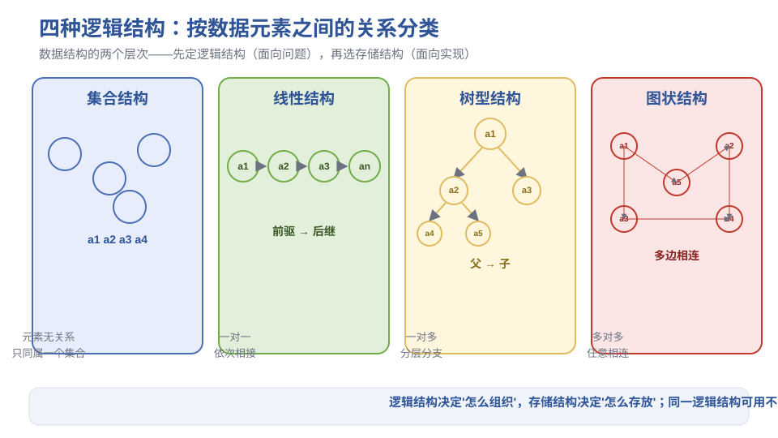
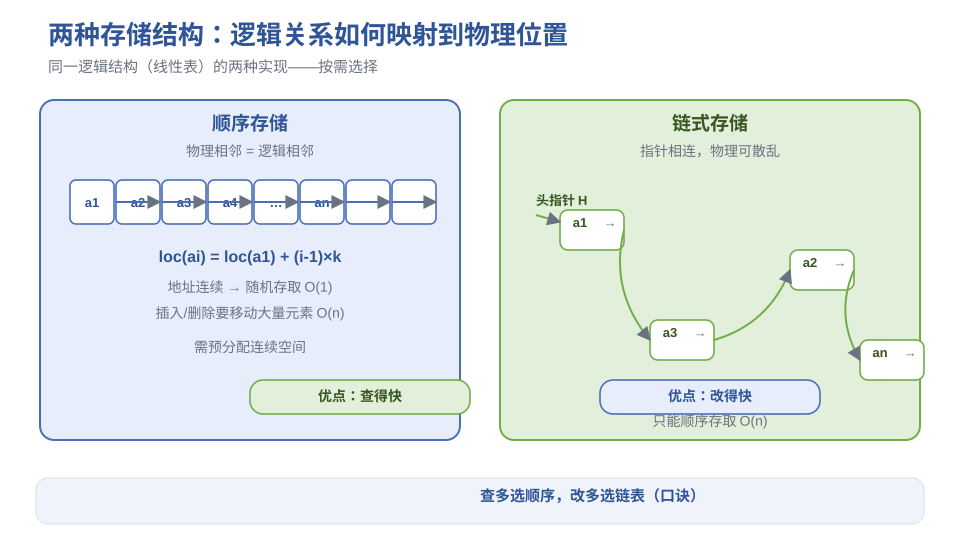
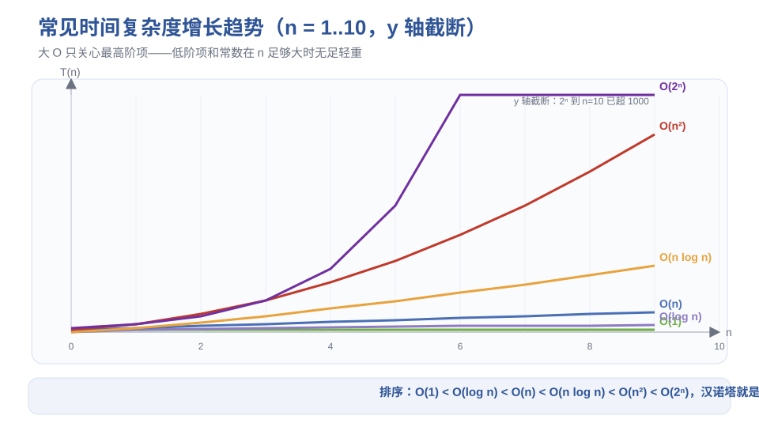
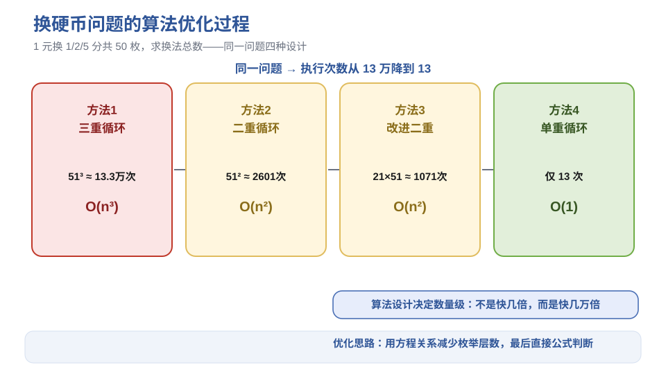

# 《数据结构与算法》第1章 引论 - 笔记

> 来源：西邮 MOOC《数据结构与算法》p01–p06（基本概念、逻辑/存储结构、算法与复杂度）
> 配套图示见 `figures/` 目录

## 目录
- [1. 学什么：数据结构的研究范畴](#1-学什么数据结构的研究范畴)
- [2. 基本术语：数据、数据元素、数据对象](#2-基本术语数据数据元素数据对象)
- [3. 逻辑结构与存储结构](#3-逻辑结构与存储结构)
- [4. 数据类型与抽象数据类型 ADT](#4-数据类型与抽象数据类型-adt)
- [5. 算法：特征、要求与评价](#5-算法特征要求与评价)
- [6. 时间复杂度](#6-时间复杂度)
- [7. 空间复杂度](#7-空间复杂度)
- [8. 例题：换硬币问题的优化过程](#8-例题换硬币问题的优化过程)
- [9. 本节重点](#9-本节重点)

---

## 1. 学什么：数据结构的研究范畴

**一句话**：数据结构研究"数据怎么组织、怎么存储、怎么操作"，是程序设计的核心功底。

> 瑞士计算机科学家 **Wirth** 的名言：**算法 + 数据结构 = 程序**。

| 生活/工程场景 | 对应的数据结构 | 关键特征 |
| --- | --- | --- |
| 超市商品摆放 | 线性表 | 一个挨一个、有序排列 |
| 人机对弈（五子棋/国际象棋） | 树 | 一层层分支、从根向下展开 |
| 交通灯/路口管理 | 图 | 顶点 + 边，关系复杂多向 |

**直观理解**：数据结构就是"如何把散乱的数据摆出条理"。摆法不同，后面解决问题的效率天差地别。

---

## 2. 基本术语：数据、数据元素、数据对象

| 术语 | 含义 | 例子 |
| --- | --- | --- |
| 数据 | 能输入计算机并被处理的符号集合 | 数值、文字、图像、声音 |
| 数据元素 | 数据的基本单位（一个"个体"） | 学生表中的一行记录 |
| 数据项 | 构成数据元素的不可分割的最小单位 | 学号、姓名、成绩 |
| 数据对象 | 性质相同的数据元素的集合 | 全体学生的记录集合 |

**数据结构**（本书定义）：相互之间存在一种或多种**特定关系**的数据元素集合。

**直观理解**：数据元素是"人"，数据结构是"人际关系网"——单看每个人没有意义，理清人和人之间的联系方式才有价值。

---

## 3. 逻辑结构与存储结构

### 3.1 逻辑结构（面向问题，与机器无关）

按数据元素之间的**关系**分四类：

| 逻辑结构 | 关系特点 | 典型场景 |
| --- | --- | --- |
| 集合结构 | 元素之间"同属一个集合"，无其他关系 | 班级花名册（无顺序要求） |
| 线性结构 | 一对一，一个接一个 | 排队、成绩单 |
| 树型结构 | 一对多，有层次分支 | 目录树、家族谱系 |
| 图状结构 | 多对多，任意两个可能相连 | 交通网、社交网络 |

> **图1** 四种逻辑结构示意（自绘）。
> 

**二元组表示**（严谨写法）：数据结构 = (D, R)

- $D$：数据元素的有限集合
- $R$：$D$ 上关系的有限集合

### 3.2 存储结构（面向实现，与机器相关）

| 存储方式 | 做法 | 优点 | 缺点 |
| --- | --- | --- | --- |
| 顺序存储 | 用连续内存单元存放，物理相邻 = 逻辑相邻 | 随机存取、寻址快 | 插入删除需移动大量元素、需预分配空间 |
| 链式存储 | 用指针把散乱结点串起来 | 插入删除只需改链、空间灵活 | 只能顺序存取、多存指针开销 |

顺序表地址公式（设每个元素占 $k$ 个存储单元）：

$$loc(a_i) = loc(a_1) + (i-1) \times k$$

> **图2** 顺序存储 vs 链式存储对比（自绘）。
> 

**直观理解**：顺序存储像电影院连排座位（人必须挨着坐），链式存储像手拉手的队列（人可以散开站，靠手相连）。

---

## 4. 数据类型与抽象数据类型 ADT

| 概念 | 说明 |
| --- | --- |
| 数据类型 | 值的集合 + 定义在该集合上的一组操作（C 语言的 int、float…） |
| 原子类型 | 不可再分解（int、char） |
| 结构类型 | 由若干成分组合而成（struct、数组） |
| ADT（抽象数据类型） | 用**抽象的数据对象、关系、操作**描述一种数据结构，与具体实现分离 |

ADT 的三要素：**数据对象 + 数据关系 + 基本操作**。

以线性表为例的 ADT 描述（只声明"有什么操作"，不规定"怎么实现"）：

```text
ADT List {
    数据对象：D = { ai | ai ∈ ElemSet, i = 1..n, n ≥ 0 }
    数据关系：R = { <ai-1, ai> | ai-1, ai ∈ D, i = 2..n }
    基本操作：
        InitList(&L)     // 初始化空表
        ListLength(L)    // 求表长
        GetElem(L, i)    // 取第 i 个元素
        ListInsert(&L, i, e)  // 第 i 个位置插入 e
        ListDelete(&L, i)     // 删除第 i 个元素
}
```

**直观理解**：ADT 就是"产品说明书"——只告诉你能干什么（接口），不告诉你内部怎么造的（实现）。以后换实现方式（顺序表换链表），使用方代码不用改。

---

## 5. 算法：特征、要求与评价

### 5.1 算法的五个特征

| 特征 | 含义 |
| --- | --- |
| 有穷性 | 必须在有限步内结束 |
| 确定性 | 每步含义明确、无歧义 |
| 可行性 | 每步都能用基本操作实现 |
| 输入 | 有 0 个或多个输入 |
| 输出 | 有 1 个或多个输出 |

### 5.2 算法设计的要求

1. **正确性**：4 个层次——无语法错误 → 对合法输入产生正确结果 → 对非法输入有合理处理 → 对边界输入也有正确结果
2. **可读性**：便于人阅读交流
3. **健壮性**：输入非法时能做出反应，而不是崩溃
4. **高效与低存储**：时间少、空间省

### 5.3 语句频度与原操作

- **语句频度**：一条语句被重复执行的次数
- **原操作**：算法中基本操作（如加减乘除、比较、赋值），整个算法的执行时间 ≈ 所有原操作执行次数之和

**例**：三阶矩阵相乘 $C = A \times B$（三重循环），执行次数：

$$T(n) = 2n^3 + 3n^2 + 2n + 1$$

- 最内层乘法、加法各 $n^3$ 次 → $2n^3$
- 第二层循环判断 $n^2$ 次、第三层循环判断 $n^3$ 次 → $3n^2 + \dots$
- 当 $n$ 很大时，**只看最高阶项** $n^3$，低阶项和常数可以忽略

---

## 6. 时间复杂度

### 6.1 大 O 记号

$$T(n) = O(f(n)) \iff \exists c > 0, n_0 > 0,\ \forall n \ge n_0:\ T(n) \le c \cdot f(n)$$

**白话**：当 $n$ 足够大时，$T(n)$ 的增长速度不超过 $f(n)$ 的常数倍——$f(n)$ 是 $T(n)$ 的"增长率上界"。

### 6.2 常见复杂度排序（从好到差）

$$O(1) < O(\log n) < O(n) < O(n \log n) < O(n^2) < O(n^3) < O(2^n) < O(n!)$$

> **图3** 常见复杂度增长曲线对比（自绘，注意 $O(2^n)$ 急剧上升）。
> 

| 复杂度 | 典型算法 | 直观感受 |
| --- | --- | --- |
| $O(1)$ | 直接取数组元素、公式求解 | 与规模无关，瞬间完成 |
| $O(\log n)$ | 折半查找 | n 翻一倍只多 1 步 |
| $O(n)$ | 顺序查找、遍历 | 线性增长 |
| $O(n \log n)$ | 归并排序、快速排序 | 主流高效排序 |
| $O(n^2)$ | 冒泡、选择、直接插入排序 | n=10⁵ 时就跑不动了 |
| $O(2^n)$ | 汉诺塔、穷举子集 | n 稍大就天文数字 |

### 6.3 最坏/平均/最好情况

**例**：顺序查找在长度为 $n$ 的表中找元素 x

| 情况 | 比较次数 | 复杂度 |
| --- | --- | --- |
| 最好 | 第 1 个就找到：1 次 | $O(1)$ |
| 最坏 | 最后一个才找到：n 次 | $O(n)$ |
| 平均 | $\dfrac{n+1}{2}$ 次 | $O(n)$ |

**约定**：如不特别说明，时间复杂度一般指**最坏情况**。

### 6.4 汉诺塔：$O(2^n)$ 的典型

3 张盘需要 $2^3 - 1 = 7$ 次移动，$n$ 张盘需要：

$$T(n) = 2^n - 1 = O(2^n)$$

**直观理解**：每加一张盘，工作量翻倍再加一。10 张盘 1023 次，40 张盘就超过 1 万亿次——这就是指数爆炸。

---

## 7. 空间复杂度

$$S(n) = O(f(n))$$

算法运行所需的辅助空间随 $n$ 的增长量级。

| 例子 | 辅助空间 | 说明 |
| --- | --- | --- |
| 就地排序（冒泡、选择） | $O(1)$ | 只用常数个临时变量 |
| 归并排序 | $O(n)$ | 需要与数据等长的辅助数组 |
| 递归汉诺塔 | $O(n)$ | 递归栈深度为 n |

**易错点**：空间复杂度只算**额外辅助空间**，不算输入数据本身占的空间。

---

## 8. 例题：换硬币问题的优化过程

**题目**：1 元人民币兑换成 1 分、2 分、5 分的硬币共 **50 枚**，每种至少 1 枚，有多少种换法？

设 5 分硬币 $x$ 枚、2 分硬币 $y$ 枚、1 分硬币 $z$ 枚，则：

$$x + y + z = 50, \quad 5x + 2y + z = 100$$

用不同层数的循环枚举，执行次数完全不同：

| 方法 | 枚举思路 | 执行次数 | 复杂度 |
| --- | --- | --- | --- |
| 方法1 | 三重循环：$x,y,z$ 全枚举（各 0–50） | $51^3 \approx 13.3$ 万次 | $O(n^3)$ |
| 方法2 | 由方程消去 $z$，只枚举 $x,y$ | $51^2 \approx 2601$ 次 | $O(n^2)$ |
| 方法3 | 由 $z \ge 1$ 限制 $x$ 范围（$x \le 19$）、$y$ 上限 50-2x | $21 \times 51 \approx 1071$ 次 | $O(n^2)$（常数更小） |
| 方法4 | 由两方程相减推出 $x$ 的约束条件直接判断 | 仅约 13 次 | $O(1)$ |

> **图4** 换硬币问题 4 种算法的优化路线（自绘）。
> 

**启示**：同一个问题，**算法设计**决定执行效率的"数量级"差距——不是快几倍，而是快几万倍。这也是本课程的核心价值。

---

## 9. 本节重点

> **本节重点**：
> - 要点 1：数据结构 = 数据元素 + 元素间关系；逻辑结构（集合/线性/树/图）与存储结构（顺序/链式）是两个层次，先逻辑后存储。
> - 要点 2：ADT 三要素（数据对象 + 关系 + 操作），接口与实现分离。
> - 要点 3：大 O 只关心**最高阶项**；常见复杂度排序 $O(1) < O(\log n) < O(n) < O(n\log n) < O(n^2) < O(2^n)$。
> - 要点 4：算法要求——正确性（4 层次）、可读性、健壮性、高效低存储。
> - **常见坑**：① 空间复杂度只算辅助空间；② 顺序查找平均 $\dfrac{n+1}{2}$ 次也是 $O(n)$，别写成 $O(\frac{n}{2})$；③ 汉诺塔移动次数是 $2^n-1$ 不是 $2^n$。
> - **竞赛模板 → ICPC/01-算法基础**：复杂度分析、二分/三分、枚举优化（换硬币方法 4 的"数学化简"思路在竞赛中非常常用）。
