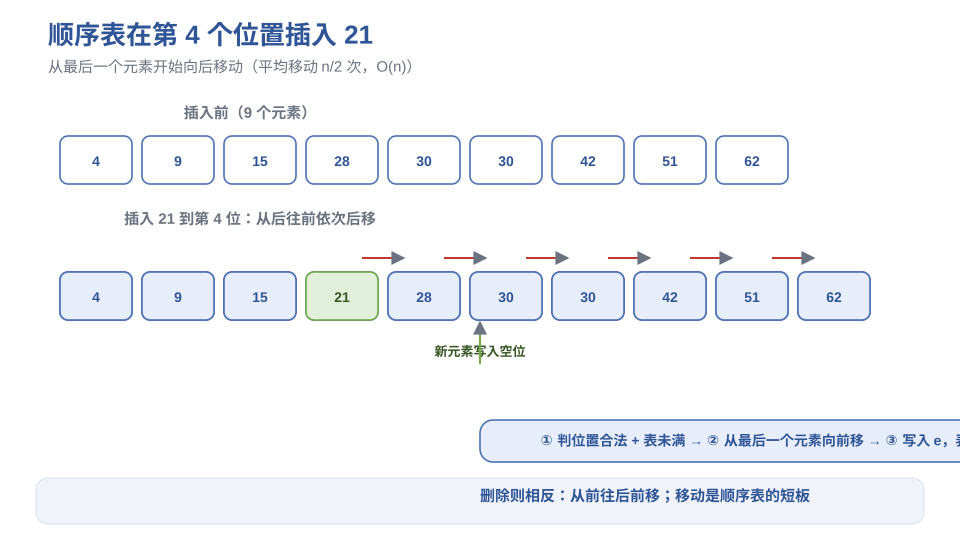
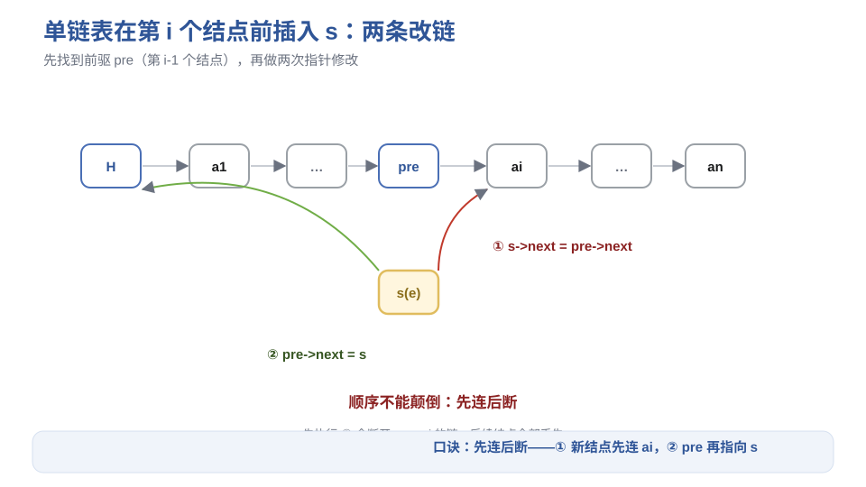
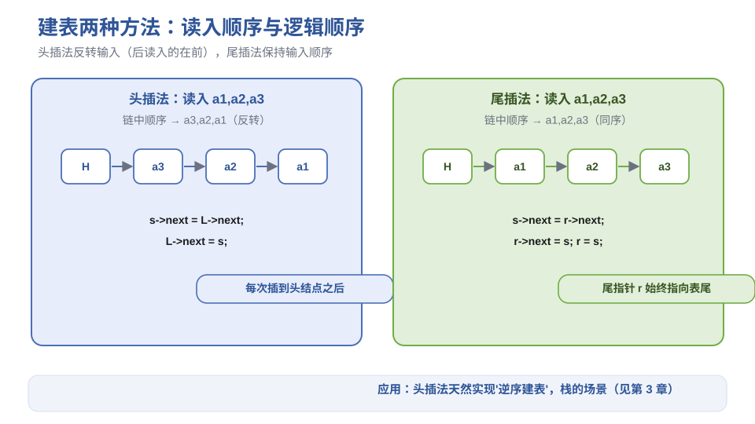
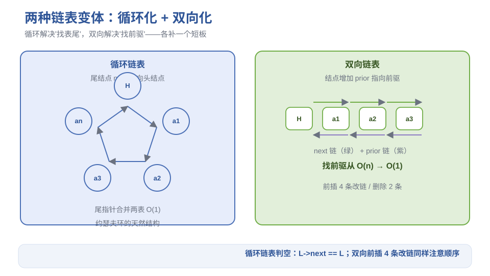
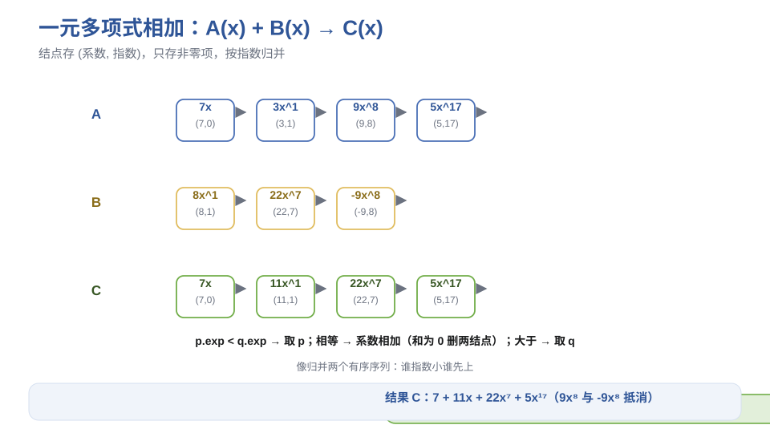

# 《数据结构与算法》第2章 线性表 - 笔记

> 来源：西邮 MOOC《数据结构与算法》p09–p14（顺序表、单链表、循环链表、双向链表、一元多项式）
> 配套图示见 `figures/` 目录

## 目录
- [1. 线性表定义与特点](#1-线性表定义与特点)
- [2. 顺序表（顺序存储）](#2-顺序表顺序存储)
- [3. 单链表](#3-单链表)
- [4. 建立单链表：头插法与尾插法](#4-建立单链表头插法与尾插法)
- [5. 循环链表](#5-循环链表)
- [6. 双向链表](#6-双向链表)
- [7. 顺序表 vs 链表：怎么选](#7-顺序表-vs-链表怎么选)
- [8. 一元多项式的链式存储](#8-一元多项式的链式存储)
- [9. 本节重点](#9-本节重点)

---

## 1. 线性表定义与特点

**定义**：由 $n(n \ge 0)$ 个数据元素组成的**有限序列**，记为：

$$(a_1, a_2, a_3, \dots, a_{i-1}, a_i, a_{i+1}, \dots, a_n)$$

**特点**（三性）：

| 特性 | 含义 |
| --- | --- |
| 同一性 | 所有元素性质相同（同一数据类型） |
| 有穷性 | 元素个数有限 |
| 有序性 | 元素之间有先后次序（第 1 个、第 2 个…） |

**位序**：$a_i$ 是第 $i$ 个元素，$i$ 称为**位序**（从 1 开始）；$a_{i-1}$ 是 $a_i$ 的**直接前驱**，$a_{i+1}$ 是**直接后继**。表头无前驱，表尾无后继。

**两种存储结构**：顺序存储（顺序表）和链式存储（链表），本章都学。

---

## 2. 顺序表（顺序存储）

### 2.1 存储与随机存取

用一维数组存放，逻辑相邻 → 物理相邻。地址公式（每元素占 $k$ 个单元）：

$$loc(a_i) = loc(a_1) + (i-1) \times k$$

**随机存取**：知道位置就能直接算出地址，$O(1)$ 取任意元素——这是顺序表最大的优点。

### 2.2 基本操作

**按序号查找**：$O(1)$，直接算地址。

**按内容查找**：从第一个元素开始逐个比较，平均比较 $\dfrac{n+1}{2}$ 次，$O(n)$。

**插入**（在第 $i$ 个位置插入 e）：

1. 判断位置合法（$1 \le i \le n+1$）且表未满
2. 从最后一个元素开始**从后往前**依次后移一位（第 $n$ 个移到第 $n+1$ 个，…，第 $i$ 个移到第 $i+1$ 个）
3. 空出第 $i$ 个位置，写入 e，表长 +1

> **图1** 顺序表插入：从后往前移动元素（自绘）。
> 

**删除**（删除第 $i$ 个元素）：

1. 判断位置合法（$1 \le i \le n$）且表非空
2. 把第 $i+1$ 到第 $n$ 个元素**从前往后**依次前移一位
3. 表长 -1

**移动次数与平均复杂度**：

| 操作 | 最多移动 | 平均移动 | 复杂度 |
| --- | --- | --- | --- |
| 插入 | $n$ 次 | $\dfrac{n}{2}$ 次 | $O(n)$ |
| 删除 | $n-1$ 次 | $\dfrac{n-1}{2}$ 次 | $O(n)$ |

**直观理解**：顺序表插入/删除就像排队时插队——后面所有人都得挪一步。挪的人多了就慢，这是顺序表的"短板"。

### 2.3 顺序表合并（LA + LB → LC）

两表已按非递减有序，合并仍有序：用 i、j、k 三个指针分别扫 LA、LB、LC，**谁小取谁**，取完对应指针后移，剩余部分直接接上。时间复杂度 $O(LA.length + LB.length)$。

**易错点**：合并时要防止"一个表已取完还去取"的下标越界。

### 2.4 顺序表优缺点

| 优点 | 缺点 |
| --- | --- |
| 随机存取 $O(1)$ | 插入/删除需移动大量元素 $O(n)$ |
| 存储密度高（无指针开销） | 需预分配连续空间，可能浪费或不够 |

---

## 3. 单链表

### 3.1 结构定义

每个结点两个域：

```c
typedef struct Node {
    ElemType data;      // 数据域
    struct Node *next;  // 指针域
} LNode, *LinkList;
```

**头结点**：在第一个元素结点前附加一个结点（data 可不用），作用：

1. 空表和非空表处理统一（都有头结点）
2. 第一个位置的插入删除不必特殊处理

**头指针 L** 指向头结点（或首元结点）；**空表条件**：`L->next == NULL`。

### 3.2 查找

| 操作 | 做法 | 复杂度 |
| --- | --- | --- |
| 按序号找第 i 个 | 从头开始走 i 步 | $O(n)$ |
| 按值查找 | 从头逐个比较 | $O(n)$ |

链表只能**顺序存取**——没有"随机存取"。

### 3.3 插入（在第 i 个结点前插入 s）

先找到第 $i-1$ 个结点 pre，然后两条改链，**顺序不能颠倒**：

```c
s->next = pre->next;   // ① 新结点先连上后继 ai
pre->next = s;         // ② 前驱再指向新结点
```

> **图2** 单链表插入的两条改链（自绘）。
> 

**易错点（高频考点）**：若先执行 ②，pre 与 ai 之间的链断开，ai 的地址丢失，后续结点全部"丢链"。口诀：**先连后断**。

### 3.4 删除（删除第 i 个结点）

```c
p = pre->next;      // p 指向被删结点
pre->next = p->next;// 前驱直接越过 p
free(p);            // 释放空间
```

**注意**：C 语言要 `free(p)` 手动释放，否则内存泄漏（Java/C++ 由 GC/智能指针管理）。

---

## 4. 建立单链表：头插法与尾插法

| 方法 | 做法 | 读入顺序 vs 链中顺序 |
| --- | --- | --- |
| 头插法 | 每次把新结点插到头结点之后 | **相反**（逆序建表） |
| 尾插法 | 用尾指针 r 指向最后一个结点，新结点接在 r 后 | **一致**（正序建表） |

```c
// 头插法核心（读入 a1,a2,a3 → 链中 a3,a2,a1）
s->next = L->next;
L->next = s;

// 尾插法核心（读入 a1,a2,a3 → 链中 a1,a2,a3）
s->next = r->next;   // s->next = NULL
r->next = s;
r = s;               // 尾指针后移，始终指向表尾
```

> **图3** 头插法与尾插法对比（自绘）。
> 

**易错点**：尾插法两条语句 `r->next = s;` 和 `r = s;` 缺一不可——前者把新结点挂上链，后者让尾指针跟上。头插法则要注意头插的结果**恰好反转输入顺序**（栈的特性，见 03 章）。

---

## 5. 循环链表

**定义**：尾结点的 `next` 不置空，而是**指向头结点**，整个链表成环。

- 判空：`L->next == L`（只有头结点自己指向自己）
- 从任一结点出发都能遍历全表

**尾指针优于头指针**：用**尾指针 rear** 表示循环链表，找表头是 `rear->next->next`（$O(1)$），找表尾是 rear 本身（$O(1)$）；用头指针找表尾要 $O(n)$。

**两个循环链表合并**（把 b 表接到 a 表尾）：

```c
p = a->next;            // 保存 a 的头结点
a->next = b->next->next;// a 尾接 b 首元
free(b->next);          // 释放 b 的头结点
b->next = p;            // b 尾指向 a 头，成环
```

**经典应用——约瑟夫环**：n 个人围成一圈报数，报到 m 的人出列，从下一个人重新报数，直到全部出列。用循环链表模拟，出列就是删结点。输出序列即出列顺序。

---

## 6. 双向链表

**定义**：结点增加一个 `prior` 指针指向前驱：

```c
typedef struct DNode {
    ElemType data;
    struct DNode *prior, *next;
} DNode, *DLinkList;
```

**双向循环链表**：头结点的 `prior` 指向尾结点，尾结点的 `next` 指向头结点。

**找前驱从 $O(n)$ 降到 $O(1)$**——这是双向链表的意义。

**前插（在 p 之后插入 s）——4 条改链，注意顺序**：

```c
s->prior = p;
s->next = p->next;
p->next->prior = s;
p->next = s;
```

**删除（删除 p 的后继结点 q）——2 条改链**：

```c
p->next = q->next;
q->next->prior = p;
free(q);
```

> **图4** 循环链表与双向链表结构（自绘）。
> 

---

## 7. 顺序表 vs 链表：怎么选

| 比较维度 | 顺序表 | 链表 |
| --- | --- | --- |
| 存取方式 | 随机存取 $O(1)$ | 顺序存取 $O(n)$ |
| 插入/删除 | 移动元素 $O(n)$ | 只改指针 $O(1)$（找到位置后） |
| 空间 | 需预分配连续空间，密度高 | 动态分配，密度低（指针开销） |
| 适用场景 | 查找多、长度稳定 | 插入删除多、长度不确定 |

**口诀**：**查多选顺序，改多选链表**。

---

## 8. 一元多项式的链式存储

**问题**：多项式 $P_n(x) = p_1 x^{e_1} + p_2 x^{e_2} + \dots$ 有很多系数为 0（稀疏），用固定数组存系数浪费空间。

**链式方案**：每个结点存 (coef 系数, exp 指数, next)，只存非零项。

**多项式相加**（A + B → C）：p、q 分别指向 A、B 当前项，比较指数：

| 情形 | 处理 |
| --- | --- |
| p->exp < q->exp | 取 p 的项链入 C，p 后移 |
| p->exp > q->exp | 取 q 的项链入 C，q 后移 |
| p->exp == q->exp | 系数相加：和为 0 则两结点都删；否则合并链入 C，p、q 都后移 |

> **图5** 一元多项式相加过程（自绘）。
> 

**直观理解**：链表"按指数排序、只存非零项"，相加时像归并两个有序序列——谁指数小谁先上，指数相同就合并系数。

---

## 9. 本节重点

> **本节重点**：
> - 要点 1：线性表三性（同一/有穷/有序），位序从 1 开始。
> - 要点 2：顺序表随机存取 $O(1)$、插入删除 $O(n)$（平均移动 n/2、(n-1)/2）；地址公式 $loc(a_i)=loc(a_1)+(i-1)k$。
> - 要点 3：单链表插入口诀**"先连后断"**（s->next = pre->next 在前）；删除要 free；带头结点统一空表/非空表处理。
> - 要点 4：头插法**逆序**建表，尾插法正序；循环链表用尾指针合并 $O(1)$；双向链表找前驱 $O(1)$，前插 4 条改链。
> - 要点 5：选型口诀——查多选顺序，改多选链表；稀疏多项式用链式存 (coef, exp)。
> - **常见坑**：① 头插法顺序容易搞反（先连后断也适用）；② 尾插法忘更新尾指针 r；③ 双向链表前插时 `p->next->prior = s` 与 `p->next = s` 顺序颠倒会导致断链；④ 约瑟夫环报到 m 出列时指针移动 m-1 步即可到达被删结点。
> - **竞赛模板 → ICPC/06-数据结构**：静态链表、双向链表手写模板；循环链表的约瑟夫问题（洛谷 P1996）；顺序表合并思想推广到归并。
