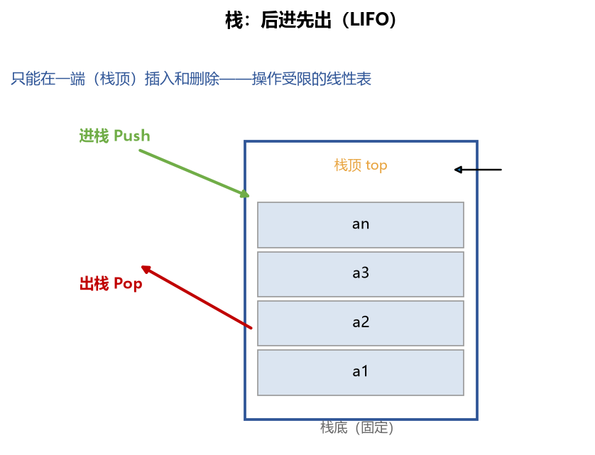
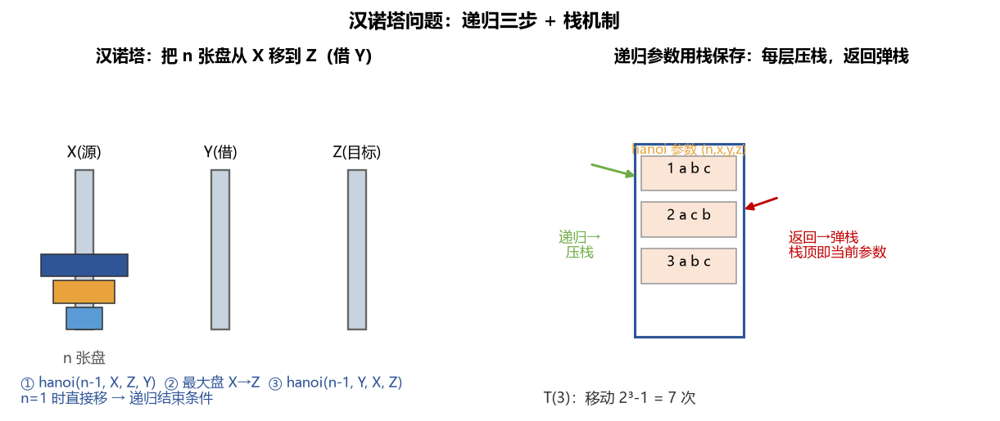
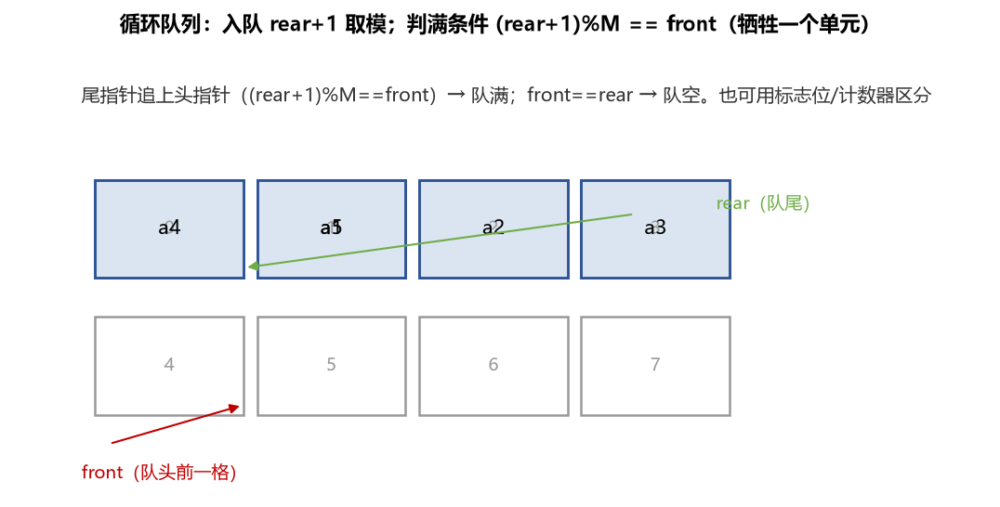
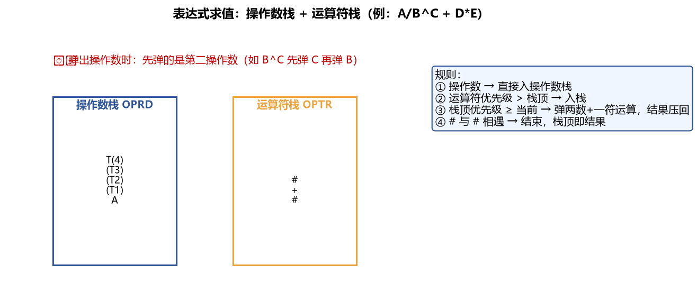
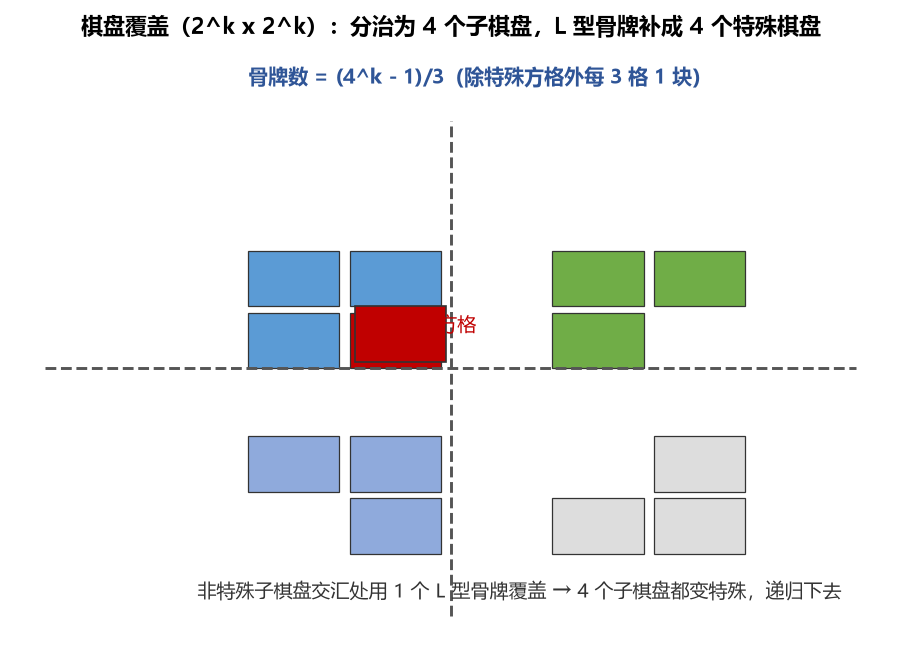

# 《数据结构与算法》第3章 栈和队列 - 笔记

> 来源：西邮 MOOC《数据结构与算法》p17–p24（栈、递归与汉诺塔、队列、循环队列、链队列、表达式求值、递归与分治）
> 配套图示见 `figures/` 目录

## 目录
- [1. 栈：后进先出的线性表](#1-栈后进先出的线性表)
- [2. 顺序栈与双端栈](#2-顺序栈与双端栈)
- [3. 栈的应用：函数调用、括号匹配、迷宫](#3-栈的应用函数调用括号匹配迷宫)
- [4. 递归与汉诺塔](#4-递归与汉诺塔)
- [5. 队列：先进先出的线性表](#5-队列先进先出的线性表)
- [6. 循环队列](#6-循环队列)
- [7. 链队列](#7-链队列)
- [8. 表达式求值（栈的经典应用）](#8-表达式求值栈的经典应用)
- [9. 递归与分治算法](#9-递归与分治算法)
- [10. 本节重点](#10-本节重点)

---

## 1. 栈：后进先出的线性表

**定义**：只允许在**表的一端**进行插入和删除的线性表——**操作受限的线性表**。

| 术语 | 含义 |
| --- | --- |
| 栈顶 top | 允许插入/删除的一端（开口端） |
| 栈底 | 另一端（固定端） |
| 进栈 Push | 在栈顶插入 |
| 出栈 Pop | 在栈顶删除 |
| 空栈 | 栈中无元素 |

**特点**：**后进先出 LIFO（Last In First Out）**。

> **图1** 栈的结构与进出栈（自绘）。
> 

**直观理解**：像一摞盘子——只能从最上面拿、往最上面放；最先放的最下面，最后才能拿出来。

**生活类比**：浏览器的"后退"、编辑器的"撤销"（Ctrl+Z）、函数调用的返回，都是栈。

---

## 2. 顺序栈与双端栈

### 2.1 顺序栈

用一维数组实现，`top` 指针指示栈顶位置（约定：`top = -1` 表示空栈）：

```c
#define MAXSIZE 100
typedef struct {
    ElemType data[MAXSIZE];
    int top;      // 栈顶指针，空栈时为 -1
} SqStack;
```

| 操作 | 做法 | 判空/判满 |
| --- | --- | --- |
| InitStack | top = -1 | — |
| StackEmpty | top == -1 | 空栈 |
| Push | top++，data[top] = x | 先判满：top == MAXSIZE-1 |
| Pop | x = data[top]，top-- | 先判空 |
| GetTop | 返回 data[top]，top 不变 | 只读不弹 |

**易错点**：`top` 是指向**栈顶元素**还是**栈顶的下一个位置**，不同教材约定不同（-1 或 0 起步），做题先看清约定。

### 2.2 双端栈（两栈共享空间）

两个栈共用一个数组，栈底分别位于两端，栈顶向中间生长：

- 栈 0：`top[0] = -1` 为空；栈 1：`top[1] = MAXSIZE` 为空
- **栈满条件**：`top[0] + 1 == top[1]`（两个栈顶相遇）

**优点**：两栈此消彼长时，空间利用率高——一个栈满了另一个可能还空着，能互相借用。

**多栈共享**：m 个栈共享一个数组可先均匀划分，再允许"浮动"调整，但实现复杂，用得少。

---

## 3. 栈的应用：函数调用、括号匹配、迷宫

### 3.1 函数嵌套调用（断点保存）

程序 R 调用 S，S 调用 T。S 执行完要回到 R 的**断点**继续——后调用的先返回，天然用栈保存断点地址：

| 调用顺序 | 栈内（从底到顶） |
| --- | --- |
| R 调用 S | R 的断点 |
| S 调用 T | R 的断点 → S 的断点 |
| T 返回 | 弹出 S 的断点，回到 S |
| S 返回 | 弹出 R 的断点，回到 R |

### 3.2 括号匹配

扫描表达式：遇左括号 `(` `[` `{` **入栈**；遇右括号，**弹出栈顶**比对——匹配则继续，不匹配则报错。扫描完栈应为空（否则有左括号未闭合）。

**直观理解**：括号"最后出现的左括号最先被右括号匹配"——最内层先闭合，天然 LIFO。

### 3.3 迷宫问题（回溯思想）

从入口出发，按方向（如右下左上）试探；可行就前进并把当前位置入栈；四个方向都不可行就**退栈回溯**到上一步换方向。到出口即成功。这正是"能进则进、不能进则退"的回溯法，与第四章马踏棋盘同源。

---

## 4. 递归与汉诺塔

### 4.1 递归定义

函数**直接或间接调用自身**。两个必备特征：

1. **递推归纳**：问题能转化为规模更小的同类问题
2. **递归终止**：有明确的结束条件（规模足够小时直接求解）

例：阶乘

$$n! = \begin{cases} 1 & n = 0 \\ n \times (n-1)! & n > 0 \end{cases}$$

### 4.2 汉诺塔问题

n 张盘从 X 柱移到 Z 柱，可借 Y 柱，每次只能移一张且大盘不能压小盘。

**三步分解**（只关心"最大盘"，其余 n-1 张整体搬）：

| 步骤 | 操作 | 规模 |
| --- | --- | --- |
| ① | 把 n-1 张盘 X→Y（借 Z） | n-1 |
| ② | 把最大盘直接 X→Z | 1 |
| ③ | 把 n-1 张盘 Y→Z（借 X） | n-1 |

```c
void hanoi(int n, char x, char y, char z) {
    if (n == 1) printf("%c→%c ", x, z);   // 终止条件
    else {
        hanoi(n-1, x, z, y);  // ① n-1 张 X→Y，借 Z
        printf("%c→%c ", x, z);// ② 最大盘 X→Z
        hanoi(n-1, y, x, z);  // ③ n-1 张 Y→Z，借 X
    }
}
```

移动次数：$T(n) = 2T(n-1) + 1 = 2^n - 1 = O(2^n)$

> **图2** 汉诺塔三步分解 + 递归参数用栈保存（自绘）。
> 

### 4.3 递归的实现机制：栈

每进入一层递归，把该层的**实在参数**压栈；返回时弹栈，栈顶恰好就是当前层要用的参数。

```text
第1层: hanoi(3, a, b, c)   ← 栈底
第2层: hanoi(2, a, c, b)
第3层: hanoi(1, a, b, c)   ← 栈顶，n=1 直接打印后弹栈
```

**推广**：编译原理中每层递归还要保存返回地址、局部变量——即**活动记录**，同样压栈。

---

## 5. 队列：先进先出的线性表

**定义**：只允许在**一端插入**（队尾）、**另一端删除**（队头）的线性表。

| 术语 | 含义 |
| --- | --- |
| 队尾 rear | 允许插入的一端 |
| 队头 front | 允许删除的一端 |
| 入队 InQueue | 在队尾插入 |
| 出队 OutQueue | 在队头删除 |

**特点**：**先进先出 FIFO（First In First Out）**，先来先服务。

**生活类比**：食堂排队——先来的先打饭走人，后来的排最后。

**经典例子——舞伴问题**：男士、女士各排一队，每次从两队队头各出一人配舞伴；人多的一队剩余者等下一曲。典型 FIFO，用两个队列解决。

**队列的基本运算**：

| 运算 | 功能 |
| --- | --- |
| InitQueue(q) | 初始化空队 |
| InQueue(q, x) | 入队，成功返回 TRUE |
| OutQueue(q, x) | 出队并返回元素值 |
| FrontQueue(q, x) | 只读队头元素，**队不变** |
| EmptyQueue(q) | 判队空 |

**易错点**：`FrontQueue` 和 `OutQueue` 的区别——前者只看不删，后者读出并删除。

---

## 6. 循环队列

### 6.1 为什么需要循环

顺序队列用一维数组时，元素出队后前面的空间空着，但 rear 已到数组末尾——**假队满**（前面明明有空位却入不了队）。

**解决**：把数组首尾相接成**循环队列**，rear/front 加 1 后取模：

$$rear = (rear + 1) \bmod MAXSIZE$$

**直观理解**：像钟表——13 点就是 1 点，12 进制取模。指针到边界自动"绕回"0。

### 6.2 判空与判满（核心难点）

空队：`front == rear`；满队时若不做区分，`front == rear` 也会出现——**必须区分**，常用三种方案：

| 方案 | 判空 | 判满 | 代价 |
| --- | --- | --- | --- |
| ① 牺牲一个单元 | front == rear | (rear+1) % M == front | 少用 1 个单元 |
| ② 设标志位 tag | front==rear 且 tag==0 | front==rear 且 tag==1 | 多 1 个变量 |
| ③ 设计数器 count | count == 0 | count == MAXSIZE | 多 1 个变量 |

> **图3** 循环队列结构与判满条件（自绘）。
> 

```c
// 入队（先判满）
if ((Q->rear + 1) % MAXSIZE == Q->front) return FALSE; // 队满
Q->rear = (Q->rear + 1) % MAXSIZE;   // 先移指针再写入
Q->data[Q->rear] = x;
return TRUE;

// 出队（先判空）
if (Q->front == Q->rear) return FALSE;  // 队空
Q->front = (Q->front + 1) % MAXSIZE;    // front 指向队头前一格
*x = Q->data[Q->front];
return TRUE;
```

**易错点**：指针移动**必须取模**；`rear+1 == front` 判满时是"先加再比"——牺牲的那一个单元是区分空满的关键。

---

## 7. 链队列

用带头结点的单链表实现，另用结构体把队头、队尾指针包在一起：

```c
typedef struct QNode {
    ElemType data;
    struct QNode *next;
} QNode;

typedef struct {
    QNode *front;   // 队头指针，指向头结点
    QNode *rear;    // 队尾指针，指向尾结点
} LinkQueue;
```

**初始化**：申请头结点，front = rear = 头结点，`front->next = NULL`。

**入队**（队尾插入）：

```c
s = (QNode*)malloc(sizeof(QNode));
s->data = x; s->next = NULL;
Q->rear->next = s;   // 挂到队尾
Q->rear = s;         // 尾指针跟上（两步顺序不能颠倒）
```

**出队**（队头删除）：

```c
p = Q->front->next;         // p 指向首元结点
*x = p->data;
Q->front->next = p->next;
if (Q->rear == p) Q->rear = Q->front;  // 特殊：删的是唯一结点
free(p);
```

**易错点（高频考点）**：当队列**只剩一个结点**时出队，删完后尾指针会"悬空"——必须让 `rear` 指回头结点，否则后续入队找不到队尾。

**优点**：不需要预分配空间、没有假队满问题，适合长度不确定的场景。

---

## 8. 表达式求值（栈的经典应用）

### 8.1 问题与规则

中缀表达式如 `A/B^C + D*E`，求值要处理：

1. **优先级**：乘方 > 乘除 > 加减 > 左右括号
2. **结合方向**：同级运算符左结合（a+b+c 先算 a+b）
3. **比较规则**：当前运算符与**运算符栈栈顶**比较——新来的优先级**高于**栈顶就入栈，**低于或等于**就弹出栈顶先运算

一般给表达式前后加 `#` 作边界符，`#` 的优先级最低；`(` 与 `)`、`#` 与 `#` 相遇时优先级"相等"（匹配）。

### 8.2 两栈算法

| 碰到 | 处理 |
| --- | --- |
| 操作数 | 直接压入**操作数栈** |
| 运算符 | 与运算符栈顶比较优先级：高→入栈；相等→弹栈（括号匹配/#结束）；低→弹两个操作数 + 一个运算符运算，结果压回操作数栈 |

> **图4** 表达式求值双栈结构与规则（自绘）。
> 

**例**：`A/B^C + D*E`

| 步骤 | 读到 | 动作 |
| --- | --- | --- |
| 1 | A | 入操作数栈 |
| 2 | / | 比栈顶 # 高，入运算符栈 |
| 3 | B | 入操作数栈 |
| 4 | ^ | 比栈顶 / 高，入运算符栈 |
| 5 | C | 入操作数栈 |
| 6 | + | 比栈顶 ^ 低 → 弹 C、B 和 ^，算 $B^C$ 得 T1，压回；再比栈顶 / 低 → 弹 T1、A 和 /，算 A/T1 得 T2，压回；+ 比栈顶 # 高，入栈 |
| 7 | D | 入操作数栈 |
| 8 | * | 比栈顶 + 高，入运算符栈 |
| 9 | E | 入操作数栈 |
| 10 | # | 依次弹出 *（D*E=T3）、+（T2+T3=T4），# 与 # 匹配结束 |

**最终结果在操作数栈顶**。

**易错点**：弹操作数时**先弹的是第二操作数**（$B^C$ 先弹 C 再弹 B），顺序反了结果就错了。

**后续**：后缀表达式（逆波兰）求值更简单——只需操作数栈，扫描一遍即可，编译原理课会详讲。

---

## 9. 递归与分治算法

### 9.1 分治思想

**分而治之**：把规模为 n 的复杂问题，分解为若干个规模更小的**同类子问题**，子问题再分解，直到小到能直接求解；子问题的解逐层**合并**得到原问题的解。

**典型例子**：汉诺塔（分解为两个 n-1 问题）、快速排序、归并排序、折半查找、棋盘覆盖。

**递归与分治是"孪生兄弟"**：子问题与原问题性质相同 → 自然用递归实现。

### 9.2 棋盘覆盖问题

$2^k \times 2^k$ 的棋盘中有一个**特殊方格**，用 4 种 L 型骨牌（每块覆盖 3 格）覆盖其余所有方格，不重叠。

**关键结论**：骨牌总数 = $\dfrac{4^k - 1}{3}$（除特殊方格外每 3 格一块）。

**分治做法**：把棋盘四等分 → 只有 1 个子棋盘含特殊方格 → 在**三个不含特殊方格的子棋盘交汇处**放 1 块 L 型骨牌，把交汇的 3 格变成"新特殊方格" → 4 个子棋盘都成了特殊棋盘，递归下去。

> **图5** 棋盘覆盖的分治过程（自绘）。
> 

### 9.3 分治法的适用条件（4 条）

| 条件 | 含义 |
| --- | --- |
| ① 可分解 | 能分解为规模较小的**相同性质**子问题 |
| ② 可终结 | 规模足够小时可直接求解 |
| ③ 可合并 | 子问题的解能方便地合并出原问题的解（**最关键**） |
| ④ 不重叠 | 子问题之间相互独立、无重叠 |

**注意**：若子问题大量**重叠**，分治法递归会做大量重复计算，效率低——此时改用**动态规划**（记忆化）更优。

---

## 10. 本节重点

> **本节重点**：
> - 要点 1：栈 LIFO、队列 FIFO——都是操作受限的线性表；栈只在栈顶操作，队列队尾插入队头删除。
> - 要点 2：循环队列判空 `front==rear`、判满 `(rear+1)%M==front`（牺牲一单元）；指针移动**必须取模**。
> - 要点 3：链队列出队**只剩一个结点时**要修正尾指针（rear 指回头结点）。
> - 要点 4：递归实现靠**参数栈**（活动记录）；汉诺塔移动 $2^n-1$ 次，$O(2^n)$。
> - 要点 5：表达式求值双栈算法——操作数栈 + 运算符栈，运算符"高入栈、低运算、等弹出"；弹出操作数先弹第二操作数。
> - 要点 6：分治法四条件（可分解/可终结/可合并/不重叠），子问题重叠→动态规划。
> - **常见坑**：① 双端栈判满 `top[0]+1==top[1]` 而不是都到 MAXSIZE；② FrontQueue 只读不删；③ 棋盘覆盖骨牌数 $\dfrac{4^k-1}{3}$；④ 递归没写终止条件 → 栈溢出。
> - **竞赛模板 → ICPC/06-数据结构**：手写栈/队列/单调栈/单调队列；**表达式求值**可先转后缀再算；**递归改栈**（手动模拟递归防爆栈）。
