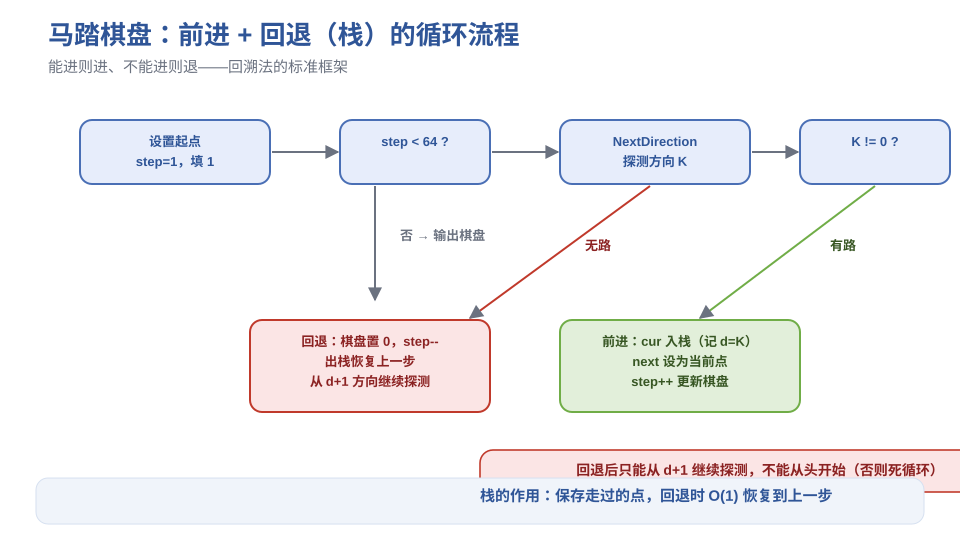

# 《数据结构与算法》综合实验：马踏棋盘 - 笔记

> 来源：西邮 MOOC《数据结构与算法》p28–p29（综合实验剖析）
> 配套图示见 `figures/` 目录

## 目录
- [1. 问题描述](#1-问题描述)
- [2. 数据结构设计](#2-数据结构设计)
- [3. 基本算法：前进与回退](#3-基本算法前进与回退)
- [4. 防死循环：记录已探测方向 d](#4-防死循环记录已探测方向-d)
- [5. 效率瓶颈：孤岛现象](#5-效率瓶颈孤岛现象)
- [6. 贪心优化：出路数（Warnsdorff 规则）](#6-贪心优化出路数warnsdorff-规则)
- [7. 实验结果对比](#7-实验结果对比)
- [8. 本节重点](#8-本节重点)

---

## 1. 问题描述

将马随机放在国际象棋棋盘（8×8）的某个方格中，马按"走日字"规则移动，**每个方格只进入一次**，走遍全部 64 个方格，输出从 1 到 64 的行走路线。

**要求**：编写**非递归**程序 → 必须用栈来模拟回溯。

**直观理解**：让马不重复地"逛遍"整个棋盘，走不通就退回去换条路再走——这是**回溯法**的典型应用。

---

## 2. 数据结构设计

### 2.1 棋盘表示

```c
int Board[8][8];   // 0 表示未走过；i 表示第 i 步走到这里（i = 1..64）
int step;          // 当前已走步数
```

### 2.2 位置点类型

```c
typedef struct {
    int x, y;   // 行号、列号，取值 0..7
    int d;      // 已探测过的方向（见第 4 节）
} spot;
```

### 2.3 方向数组

马的 8 个可走位置（走日字），相对当前位置 (x, y) 的偏移：

| 方向号 | 1 | 2 | 3 | 4 | 5 | 6 | 7 | 8 |
| --- | --- | --- | --- | --- | --- | --- | --- | --- |
| 行偏移 | -2 | -1 | +1 | +2 | +2 | +1 | -1 | -2 |
| 列偏移 | +1 | +2 | +2 | +1 | -1 | -2 | -2 | -1 |

```c
int direction[2][9] = {
    {0, -2, -1, +1, +2, +2, +1, -1, -2},  // 行偏移（下标 0 列不用）
    {0, +1, +2, +2, +1, -1, -2, -2, -1}   // 列偏移
};
```

**位置可行性**（Feasible 函数）：新位置 (nx, ny) 满足

1. 在棋盘内：$0 \le nx < 8$ 且 $0 \le ny < 8$
2. 未访问过：`Board[nx][ny] == 0`

**NextDirection 函数**：从当前方向起依次探测 1–8 号方向，返回第一个可行方向号；全不可行返回 0。

---

## 3. 基本算法：前进与回退

**主流程**：

```text
设置起点 (x0, y0)，step = 1，Board[x0][y0] = 1
while (step < 64):
    K = NextDirection(cur)          // 找可前进方向
    if (K != 0):                     // 有路
        next = cur 沿方向 K 移动后的点
        cur 入栈（记录已探方向 K）
        cur = next; step++; 更新 Board
    else:                            // 无路 → 回退
        Board[cur] = 0; step--
        cur = 出栈的点
输出 Board（1..64 即行走路线）
```

> **图1** 马踏棋盘"前进 + 回退"流程图（自绘）。
> 

**三个关键结论**：

| 结论 | 内容 |
| --- | --- |
| 结论1 | 找不到可行下一位置（NextDirection 返回 0）时**必须回退** |
| 结论2 | 走过的点**全部入栈**，回退时出栈即恢复上一步 |
| 结论3 | 回退做两件事：抹掉当前步痕迹（Board 置 0、step--）+ 出栈恢复上一步 |

---

## 4. 防死循环：记录已探测方向 d

**问题**：从 54 步回退到 53 步后，如果又从 53 步的 5 号方向前进，必然再次碰壁再回退——**死循环**。

**解决**：spot 增加成员 `d`，记录"已经探测到方向 d"，下次从 `d+1` 开始探测：

- 初始点：`d = 0`（还没探测任何方向）
- 沿方向 K 前进到新点时：`cur.d = K`（入栈前记录），`next.d = 0`（新点重新探测）
- 回退到某点后：NextDirection 从 `cur.d + 1` 开始探测，**不回头**

**直观理解**：就像做题试答案——从第 1 个方案试到第 3 个失败退回后，继续试第 4 个，而不是又从第 1 个开始。

---

## 5. 效率瓶颈：孤岛现象

朴素的"依次探测 8 个方向"算法效率很低：

| 起始点 | 运行表现 |
| --- | --- |
| (0,1) | 约 1 分半钟才出结果 |
| (2,4)、(0,6) | 运行 5 分钟仍无结果 |

**原因**：某些格子（尤其角、边附近）出路很少，一旦它的所有出路都被占用，就变成**孤岛**——永远无法到达，但程序要回溯大量步数后才发现。

**例**：起始 (0,6) 时，角格 (7,7) 只能从 (6,5)、(5,6) 到达；这两个位置被占后，(7,7) 即成孤岛，此后所有尝试都是徒劳。

---

## 6. 贪心优化：出路数（Warnsdorff 规则）

### 6.1 核心思想

定义**出路数** = 某点周围"未访问且可行"的邻点个数。**优先走向出路数最少的点**——因为它以后越来越难到达，先解决"最危险的格子"，避免孤岛。

> **图2** 贪心选择：优先走向出路数最少的候选点（自绘）。
> 

**直观理解**：修路时先修"断头路"——那些只有一两条出路的位置越晚越到不了，所以要尽早占领。

### 6.2 权值数组 Weight

```c
int Weight[8][8];   // 权值 = 出路数（1..8）；9 表示已被占用
```

**三个维护函数**：

| 函数 | 功能 |
| --- | --- |
| 初始化函数 | 对每个点探测 8 个方向，统计出路数填入 Weight |
| SetWeight(x,y) | 走到 (x,y) 时：Weight 置 9，周围可行点权值全部 -1 |
| UnSetWeight(x,y) | 回退 (x,y) 时：Weight 清零，重新探测 8 方向，周围可行点权值 +1，自身也 +1 |

### 6.3 贪心的 NextDirection

在 8 个方向中找：**未探索 + 可行 + 权值最小** 的方向，用"打擂台"实现：

1. 擂主 = 0（失败值），擂主成绩 = 9（极大值）
2. 循环 8 个方向：若该方向未探索且可行，且权值 < 擂主成绩 → 更新擂主
3. 返回最终擂主（0 表示无路）

**防死循环**：`d` 从单个值改为数组 `d[9]`，`d[i]` 标记第 i 个方向是否已访问（0 未访问 / 1 已访问）——避免回退后又选到上次那个权值最小的方向。

---

## 7. 实验结果对比

| 方案 | 表现 |
| --- | --- |
| 朴素回溯（依次探测 8 方向） | (2,4)、(0,6) 起点 5 分钟无结果，回退次数天文数字 |
| 贪心选择（Warnsdorff） | 所有 64 个起点**秒出结果** |
| 回退次数统计 | 除 (6,5) 起点回退 46 次外，其余起点**零回退** |

**启示**：同一个问题，加一个"先走最危险点"的贪心策略，效率从"跑不完"变成"秒出"——这就是**算法设计**的价值。

**延伸思考**：统计回退次数、分析解空间树规模、尝试其他启发式（如对称剪枝），都是可以继续优化的方向。

---

## 8. 本节重点

> **本节重点**：
> - 要点 1：马踏棋盘 = 回溯法，核心数据结构是**栈**——前进入栈、无路出栈。
> - 要点 2：回退做两件事——抹痕迹（Board 置 0、step--）+ 出栈恢复上一步。
> - 要点 3：**记录已探测方向 d**，回退后从 d+1 继续，防死循环。
> - 要点 4：Warnsdorff 贪心——优先走向出路数最少的点，用 Weight 数组动态维护出路数。
> - 要点 5：实验结果：贪心后 64 起点全部秒出，回退次数趋近于 0。
> - **常见坑**：① 方向数组下标从 1 开始用，0 号列不用；② 回退后不记录方向会死循环；③ 贪心选方向时"已访问方向"要排除（d 数组）；④ 出栈恢复的是"上一步的位置"，不是当前步。
> - **竞赛模板 → ICPC/06-数据结构**：迷宫/棋盘类搜索统一模板（DFS 回溯 + 方向数组）；贪心 + 回溯结合的剪枝思路可迁移到旅行商、数独等搜索问题。
