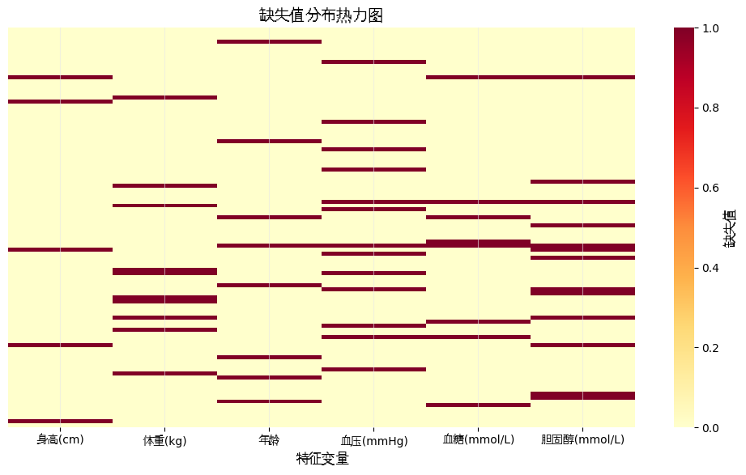
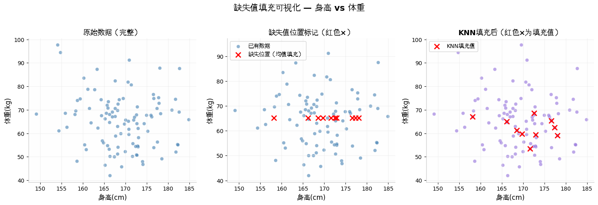
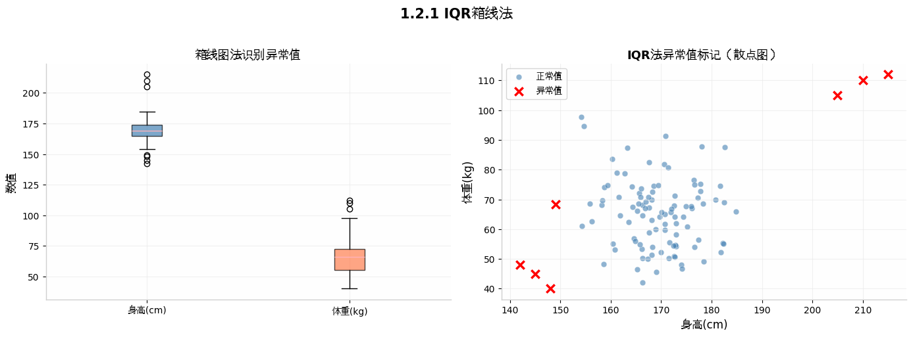
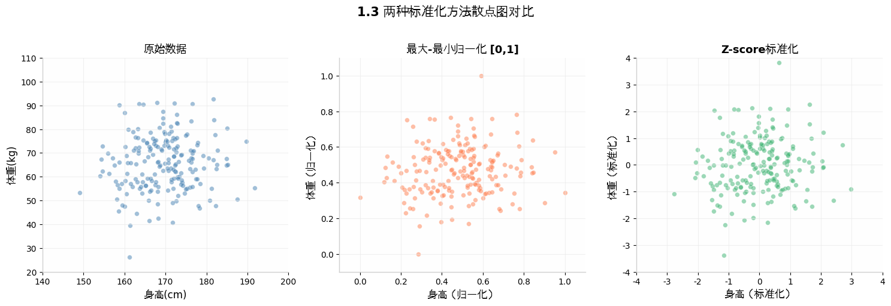
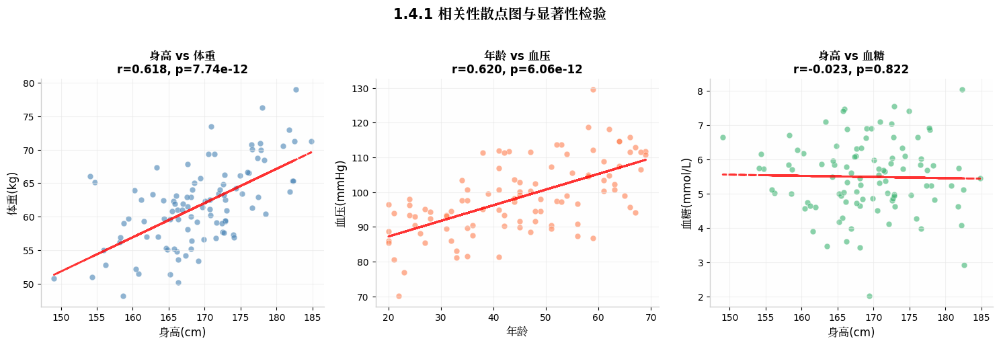
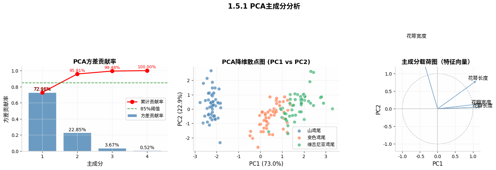

# 📘 模块 1：数据预处理算法（小白友好版）

> **这是干啥的？**
> 你拿到数据后，第一件事**不是建模**，而是"洗数据"——填缺失、去异常、标准化……
> 这一步做不好，后面全白费。C 题第一问必写这个。

---

## 1.1 缺失值填充

### 🎬 先讲个故事

> 你拿到一张体检表，发现"体重"列有几个空位。
> 空着不填？模型会报错。瞎填？结果会偏。

*缺失值热力图：黄色=有数据，越红缺失越多*

### 🧠 四种方法从简单到复杂

| 方法 | 适合情况 | 一句话 |
|------|---------|--------|
| **均值填充** 🟢 | 缺得少（<5%）、数据正常 | 拿剩下的数算个平均填进去 |
| **中位数填充** 🟢 | 缺得少但有异常值 | 排个序取中间那位，不怕极端值 |
| **KNN 填充** 🟡 | 缺 5%~20%、变量间有关系 | 找最像的几个人取均值 |
| **随机森林填充** 🔴 | 缺 > 20%、关系复杂 | 把空列当"考题"，其他列当"线索"来预测 |

### ⚠️ 小白翻车预警

- **均值填充会低估方差**！填完之后数据波动变小了，统计检验容易"不显著"
- KNN 一定要先**标准化**，不然身高（150~190）和收入（3000~30000）没法一起算距离

### 💻 代码

`python
from sklearn.impute import SimpleImputer
df_filled = SimpleImputer(strategy='mean').fit_transform(df)
df_filled = SimpleImputer(strategy='median').fit_transform(df)
`

`python
from sklearn.impute import KNNImputer
from sklearn.preprocessing import StandardScaler
scaler = StandardScaler()
df_scaled = scaler.fit_transform(df)
df_filled = KNNImputer(n_neighbors=5, weights='distance').fit_transform(df_scaled)
df_filled = scaler.inverse_transform(df_filled_scaled)
`

*左：均值填充（所有缺失体重填成同一值） 右：KNN填充（根据身高调整）*

### 🏆 速查

> 缺 < 5% 且正常 → 均值 | 缺 < 5% 有异常 → 中位数 | 缺 5%~20% → KNN | 缺 > 20% → 随机森林

---

## 1.2 异常值识别

*IQR箱线法：红点就是异常值*

| 方法 | 原理 | 适合 |
|------|------|------|
| **IQR** 🟢 | 超过 Q3+1.5xIQR 或低于 Q1-1.5xIQR 算异常 | 快速筛查 |
| **3-sigma** 🟡 | 超过均值±3个标准差算异常 | 正态分布数据 |
| **DBSCAN** 🔴 | 密度聚类，落单的就是异常 | 多维度复杂分布 |

---

## 1.3 数据标准化

| 方法 | 效果 | 适用算法 |
|------|------|---------|
| **Min-Max** | 压缩到[0,1] | 神经网络、图像处理 |
| **Z-score** | 均值为0、标准差为1 | SVM、PCA、KNN、回归 |

*左：原始数据 中：Min-Max 右：Z-score*

`python
from sklearn.preprocessing import StandardScaler, MinMaxScaler
scaler = StandardScaler(); df_scaled = scaler.fit_transform(df)
scaler = MinMaxScaler(); df_norm = scaler.fit_transform(df)
`

---

## 1.4 相关性分析

*相关性热力图：红色正相关、蓝色负相关*

| 方法 | 适合场景 |
|------|---------|
| **Pearson** 🟢 | 线性关系、无异常值 |
| **Spearman** 🟡 | 有异常值或非线性单调关系 |
| **灰色关联** 🔴 | 小样本（<30）、信息不完全 |

---

## 1.5 数据降维

*PCA降维：前两个主成分贡献95.81%*

| 方法 | 一句话 |
|------|--------|
| **PCA** 🟢 | 找方差最大方向投影（无监督） |
| **LDA** 🟡 | 让不同类分开、同类靠拢（有监督） |
| **因子分析** 🟡 | 找背后隐藏的"因素" |

> **预处理做得好，建模没烦恼 🍡**
