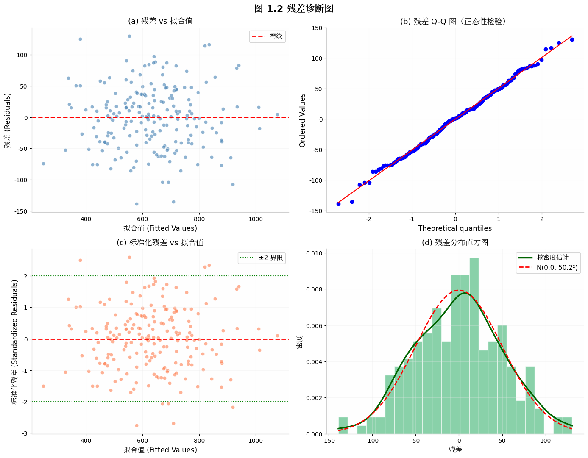
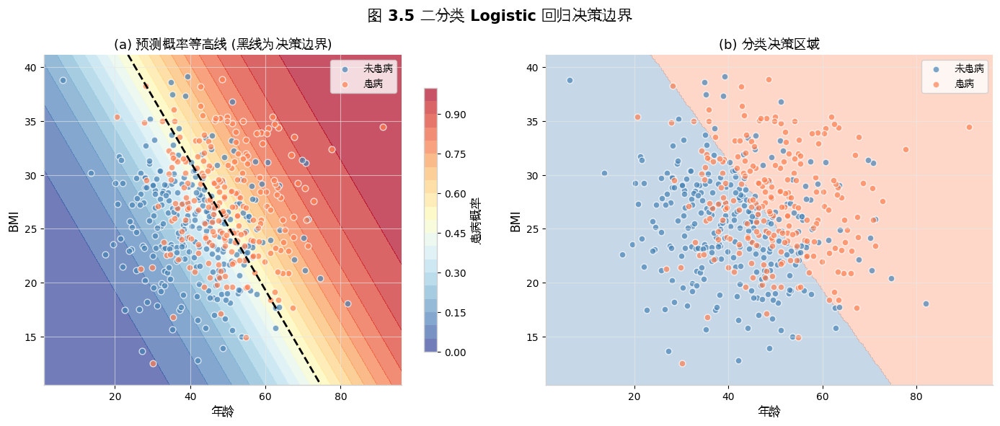

# 📘 模块 2：回归拟合类算法（小白友好版）

> 你有 X（特征）和 Y（结果），想知道"X 怎么影响 Y"。
> C 题第一问高频——找关系、做预测。

---

## Part 1：线性回归 ⭐⭐⭐⭐⭐

Y = β0 + β1·x1 + ... + βp·xp + ε（基准值 + 各特征贡献 + 随机误差）

**最小二乘法**：找一条直线，让所有点到线的距离平方和最小

`python
from sklearn.linear_model import LinearRegression
model = LinearRegression().fit(X, y)
`

⚠️ 假设直线关系，有 U 形曲线不行；p>0.05 的变量说明对 Y 没啥影响

---

## Part 2：多项式回归 🟡 直线不行就弯

`python
from sklearn.preprocessing import PolynomialFeatures
poly = PolynomialFeatures(degree=2)
model = LinearRegression().fit(poly.fit_transform(X), y)
`

---

## Part 3：Logistic 回归 🟡 分类用的回归

Y 是"通过/不通过"——Logistic 用 S 形曲线压到 0~1 变成概率。

`python
from sklearn.linear_model import LogisticRegression
model = LogisticRegression().fit(X, y)
prob = model.predict_proba(X)[:, 1]
`

*左：线性回归 中：多项式回归 右：Logistic 分类边界*

---

## Part 4：随机森林 🔴 精度优先

`python
from sklearn.ensemble import RandomForestRegressor
rf = RandomForestRegressor(n_estimators=200, random_state=42).fit(X, y)
print(rf.feature_importances_)
`

*特征重要性排序*

⚠️ 树模型不能外推预测——训练数据范围之外会变平

---

## 🏆 速查

| 方法 | 关系 | 解释性 | 推荐度 |
|------|------|-------|-------|
| 线性回归 🟢 | 直线 | ⭐⭐⭐⭐⭐ | ⭐⭐⭐⭐⭐ |
| 多项式回归 🟡 | 曲线 | ⭐⭐⭐⭐ | ⭐⭐⭐⭐ |
| Logistic 🟡 | S 形分类 | ⭐⭐⭐⭐⭐ | ⭐⭐⭐⭐ |
| 随机森林 🔴 | 非线性 | ⭐⭐ | ⭐⭐⭐⭐ |

> 先试线性→不行加平方→分类用 Logistic→精度要高上随机森林 🍡
