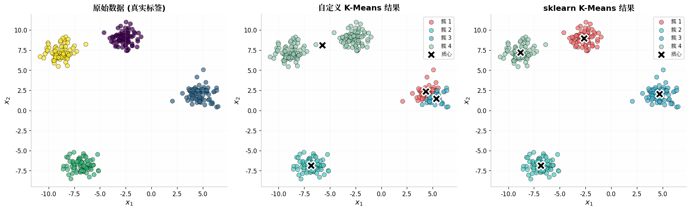
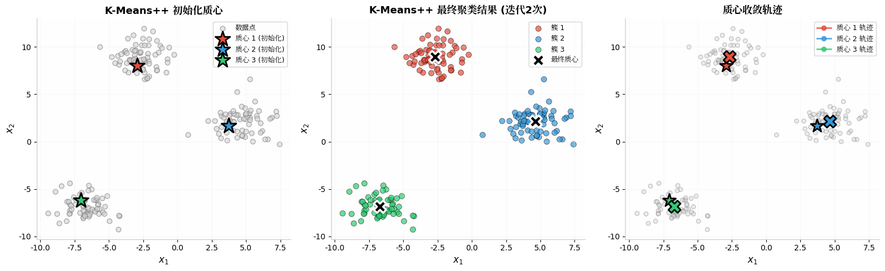
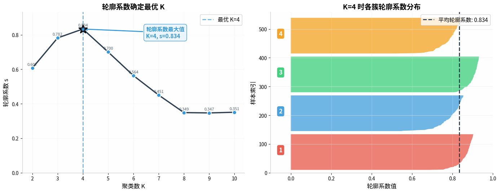
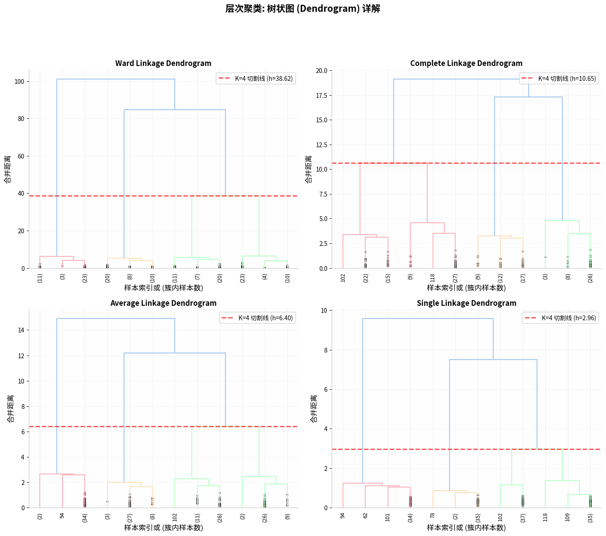
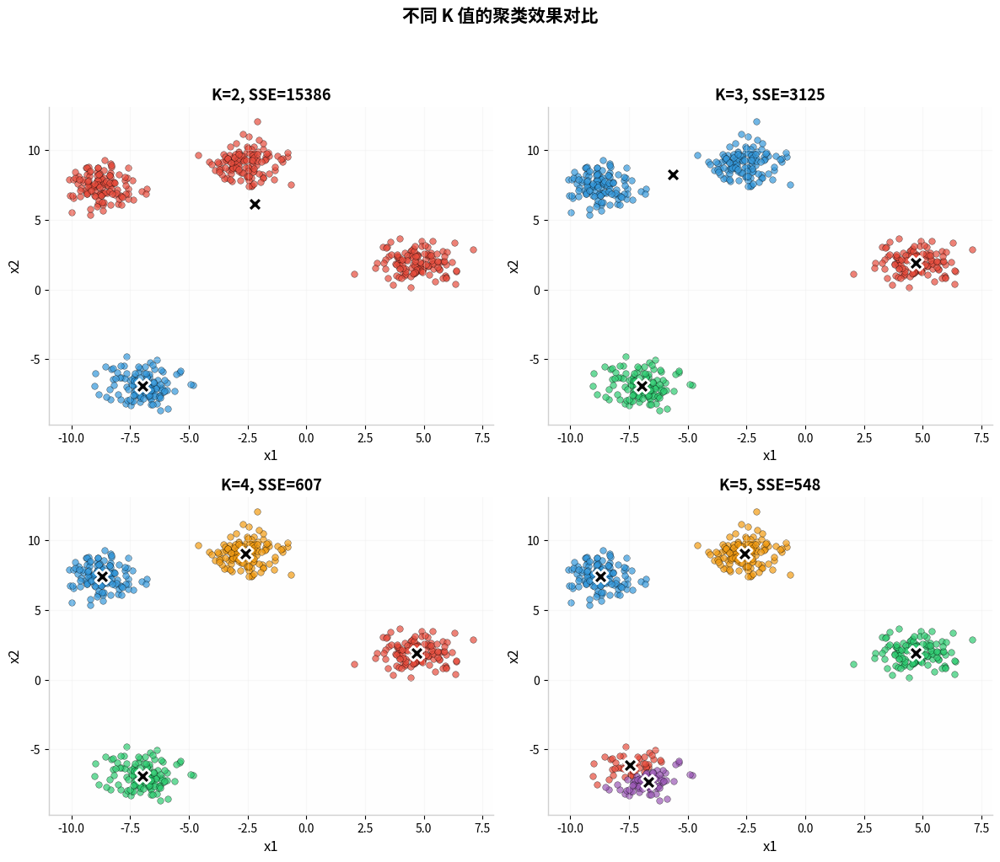

# 📘 模块 3：聚类算法（小白友好版）

> 给你一堆数据点，没有标签，让你自己"物以类聚"。
> C 题中常用于客户分群、区域划分、异常检测。

---

## Part 1：K-Means ⭐⭐⭐⭐⭐

1. 随机放 K 个中心 → 2. 每个点归最近中心 → 3. 重新算中心 → 4. 重复直到不动

`python
from sklearn.cluster import KMeans
kmeans = KMeans(n_clusters=3, random_state=42).fit(X)
labels = kmeans.labels_
centers = kmeans.cluster_centers_
`

*K-Means 聚类结果（K=3），不同颜色=不同簇*

⚠️ K 值要提前定（用肘部法则选）；只能找球形簇；一定要先标准化

---

## Part 2：怎么选 K？

**肘部法则**：K=1~10 做 K-Means，画 WCSS 曲线，拐弯处就是最好 K

**轮廓系数**：每个点一个值，+1 分对了、0 在边界、-1 分错了，平均越大越好

`python
from sklearn.metrics import silhouette_score
for k in range(2, 11):
    s = silhouette_score(X, KMeans(k, random_state=42).fit_predict(X))
`

*肘部法则：K=3 处出现拐点*

---

## Part 3：层次聚类 🟡 画棵树

从每个点自己一堆开始，不断合并最近的两堆，画出来是棵树

*层次聚类树状图*

---

## Part 4：GMM 🟡 软聚类

K-Means 说 100% 属于 A，GMM 说 70% A、30% B

*GMM：椭圆可任意旋转，每个点有概率*

---

## Part 5：DBSCAN 🔴 自动发现任意形状

看密度——稠密是簇，稀疏是噪声。参数：ε（半径）和 MinPts（最少点数）

`python
from sklearn.cluster import DBSCAN
from sklearn.preprocessing import StandardScaler
labels = DBSCAN(eps=0.5, min_samples=5).fit_predict(StandardScaler().fit_transform(X))
`

*DBSCAN 自动发现非球形簇，红圈=离群点*

---

## 🏆 速查

| 方法 | 需定K？ | 形状 | 异常检测 | 推荐度 |
|------|--------|------|---------|-------|
| K-Means 🟢 | 是 | 球形 | 否 | ⭐⭐⭐⭐⭐ |
| 层次聚类 🟡 | 否（画树后定） | 任意 | 否 | ⭐⭐⭐⭐ |
| GMM 🟡 | 是 | 椭球 | 否 | ⭐⭐⭐ |
| DBSCAN 🔴 | 否（自动） | 任意 | 是 | ⭐⭐⭐⭐ |

> 形状规矩 K-Means，想看树用层次聚类，要概率用 GMM，形状奇怪上 DBSCAN 🍡
