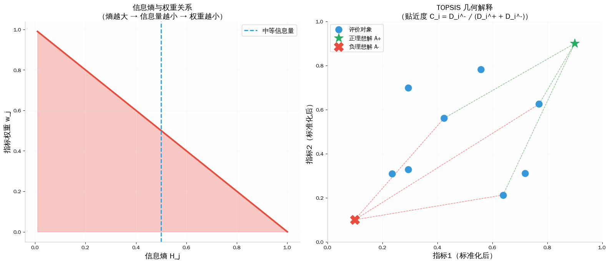
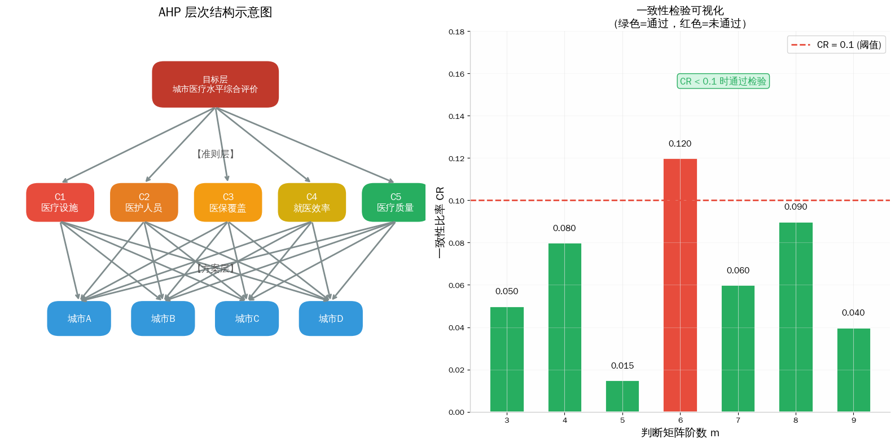
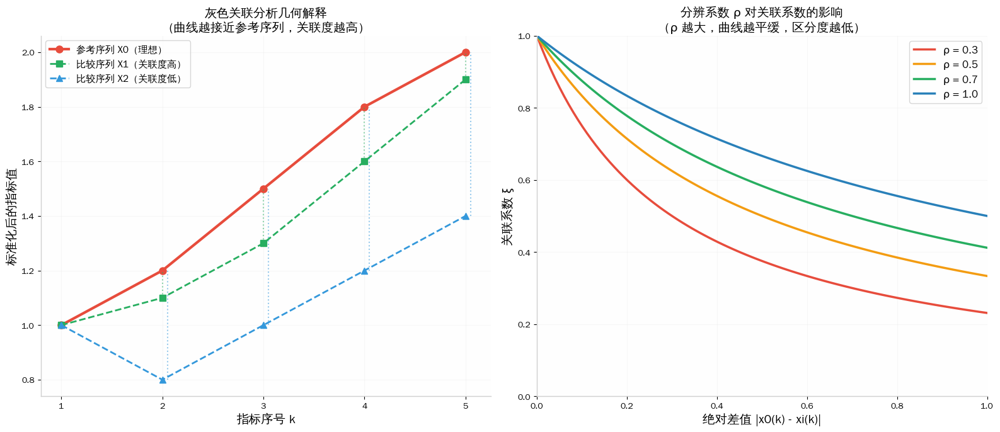

# 📘 模块 4：综合评价算法（小白友好版）

> 给你 N 个方案，每个有 M 个指标，排个名。
> C 题第二问高频，评委最认熵权-TOPSIS。

---

## Part 1：熵权-TOPSIS ⭐⭐⭐⭐⭐

**熵权法**：指标数据越分散（熵越小），区分度越高，权重越大

**TOPSIS**：虚构一个理想方案，看谁最接近它

*TOPSIS 原理：离正理想解最近、离负理想解最远的排前面*

`python
import numpy as np
def entropy_topsis(X):
    Z = X / np.sqrt((X**2).sum(axis=0))
    P = Z / Z.sum(axis=0)
    H = -np.sum(P * np.log(P + 1e-10), axis=0) / np.log(len(X))
    W = (1 - H) / (1 - H).sum()
    Zp, Zm = Z.max(0), Z.min(0)
    Dp = np.sqrt(((Z - Zp)**2 * W).sum(1))
    Dm = np.sqrt(((Z - Zm)**2 * W).sum(1))
    return Dm / (Dp + Dm), W
`

---

## Part 2：AHP ⭐⭐⭐⭐ 层次分析法

人脑打分（1~9 分）+ 数学检验（一致性 CR<0.1）
> 定性指标多、没数据时用。指标别超过 7 个。

*AHP 层次结构：目标→准则→方案*

---

## Part 3：灰色关联分析 ⭐⭐⭐⭐

看两个序列的几何形状有多像。样本很少（<30）时特别好用。

*灰色关联：各指标与参考序列的相似度*

---

## 🏆 速查

| 方法 | 权重来源 | 适合场景 | 推荐度 |
|------|---------|---------|-------|
| 熵权-TOPSIS | 数据自动算 | 有客观数据的排名 | ⭐⭐⭐⭐⭐ |
| AHP | 人打分 | 定性指标多 | ⭐⭐⭐⭐ |
| 灰色关联 | 数据自动算 | 小样本 | ⭐⭐⭐⭐ |

> 国赛推荐：熵权法→TOPSIS 排序 🍡
