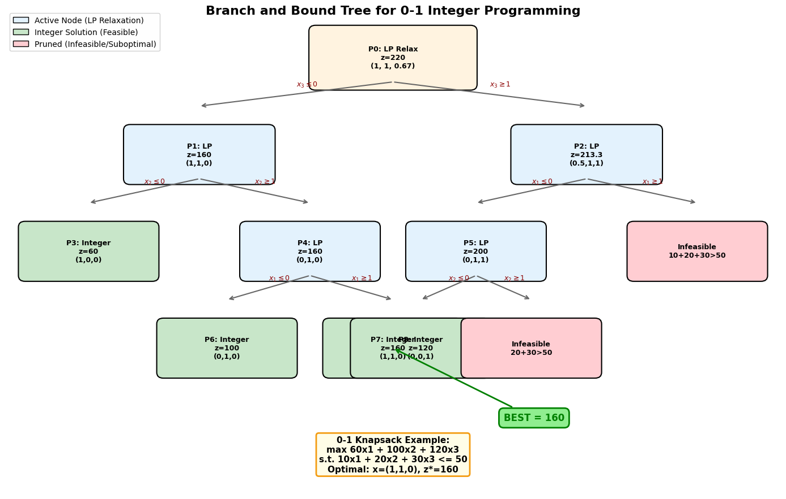

# 📘 模块 5：优化算法（小白友好版）

> 有目标（利润最大/成本最小），有约束（资源有限）。
> 优化就是：在约束内找最优方案。C 题第三问高频。

---

## Part 1：线性规划 LP 🟢

max z = 2x₁ + 3x₂, s.t. x₁ + 2x₂ ≤ 8, 3x₁ + x₂ ≤ 9

`python
from scipy.optimize import linprog
res = linprog([-2,-3], A_ub=[[1,2],[3,1]], b_ub=[8,9], bounds=[(0,None),(0,None)])
# res.x = 最优解, -res.fun = 最大利润
`

⚠️ scipy 默认最小化，最大化要给系数加负号

---

## Part 2：整数/0-1 规划 🟡

`python
from pulp import *
prob = LpProblem("plan", LpMaximize)
x = LpVariable("x", lowBound=0, cat='Integer')  # cat='Binary' 就是0-1
`

---

## Part 3：非线性规划 🟡

目标函数有平方、对数、乘积——可能只有局部最优解

`python
from scipy.optimize import minimize
res = minimize(lambda x: (x[0]-2)**2 + (x[1]-3)**2, x0=[0,0])
`

*线性规划图解法：最优解在可行域顶点上*

---

## Part 4：多目标 / 智能优化 🔴

| 方法 | 一句话 |
|------|--------|
| 多目标 | 利润最大+污染最小，加权平衡 |
| 遗传算法 | 模仿进化，啥都能优化 |

`python
from scipy.optimize import differential_evolution
res = differential_evolution(lambda x: (x[0]-2)**2 + (x[1]-3)**2, bounds=[(-10,10),(-10,10)])
`

> 线性用 LP，整数用整数规划，曲线用 NLP，啥都不行上遗传算法 🍡
