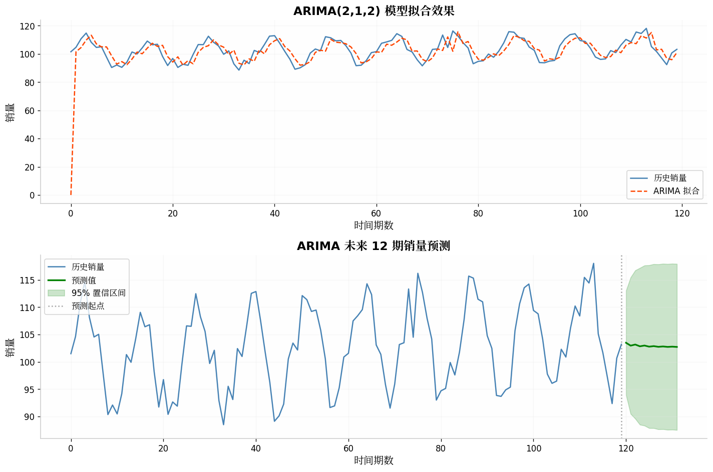
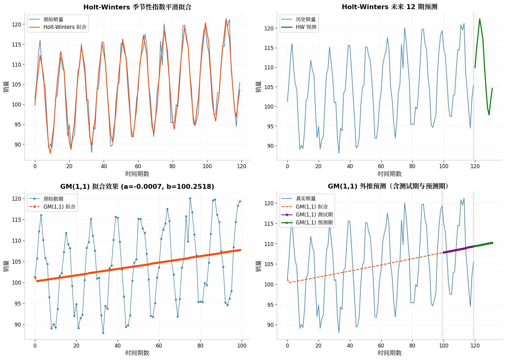
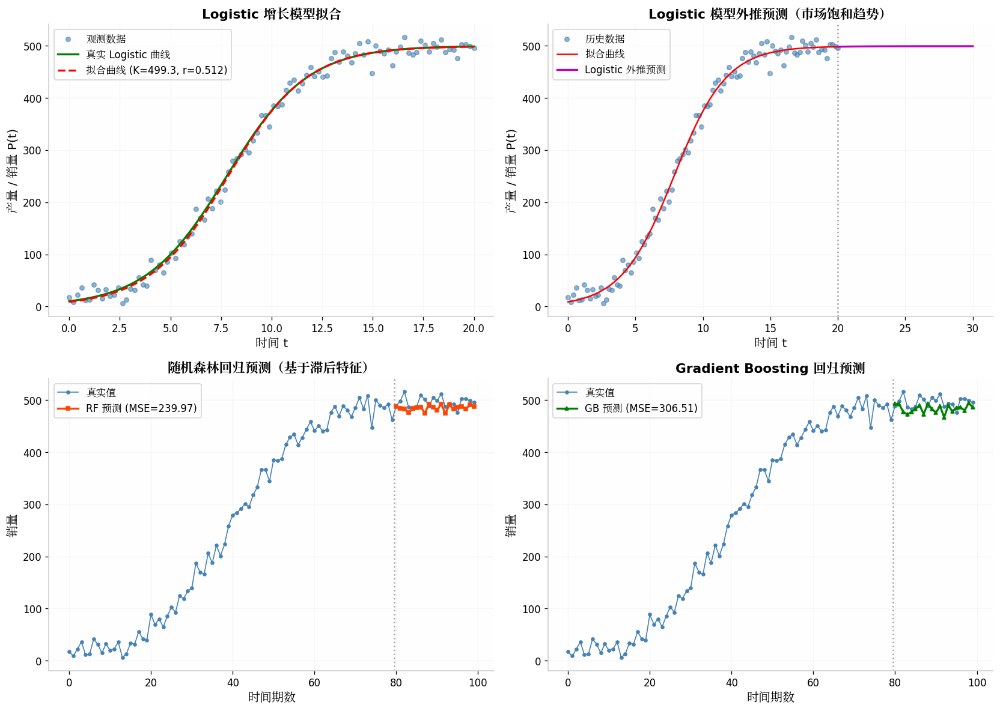
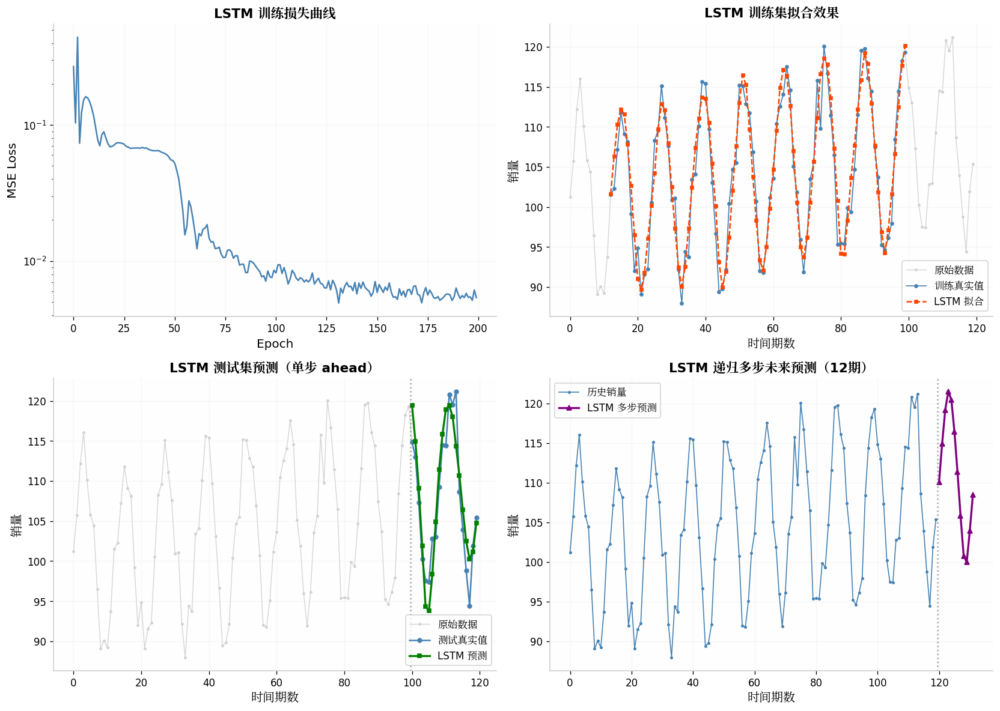
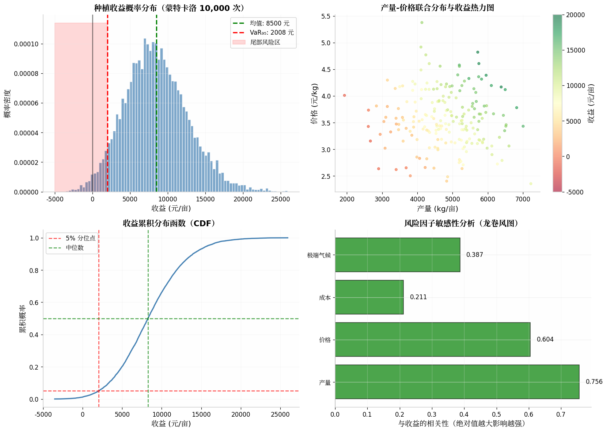

# 📘 模块 6：预测算法（小白友好版）

> 给你历史数据，让你猜未来——销量、价格、产量、风险……

---

## Part 1：ARIMA 📈

AR = 看过去的值加权 | I = 差分让数据平稳 | MA = 用上次猜错的量修正

`python
from statsmodels.tsa.arima.model import ARIMA
model = ARIMA(sales, order=(2,1,2)).fit()
forecast = model.get_forecast(steps=12)
`

*ARIMA：蓝色=历史，绿色=预测，浅绿=95%置信区间*

---

## Part 2：Holt-Winters + GM(1,1)

Holt-Winters：处理趋势+季节性的升级版指数平滑
GM(1,1)：数据只有 4~5 个点时也能用

*上：Holt-Winters 捕捉季节 下：GM(1,1) 反映趋势*

---

## Part 3：Logistic + 随机森林

**Logistic**：S 型增长，先加速再减速到天花板

`python
from scipy.optimize import curve_fit
popt, _ = curve_fit(lambda t,K,r,P0: K/(1+((K-P0)/P0)*np.exp(-r*t)), t, y)
print(f"天花板 K={popt[0]:.1f}")
`

*Logistic 拟合+随机森林/XGBoost 预测*

---

## Part 4：LSTM

三个门：遗忘（扔掉没用的）→ 输入（记住重要的）→ 输出（放出需要的）

⚠️ 数据<200 条不如 ARIMA，必须归一化

*LSTM：成功捕捉趋势与季节*

---

## Part 5：蒙特卡洛

抽一万次随机→看分布→算最坏情况（VaR）和亏损概率

`python
profit = np.random.normal(5000,800,10000) * np.random.lognormal(0, 0.15, 10000) - np.random.uniform(7000,10000,10000)
var95 = np.percentile(profit, 5)
`

*蒙特卡洛：收益分布、VaR、敏感性分析*

---

## 🏆 速查

| 模型 | 数据量 | 适合 |
|------|-------|------|
| ARIMA | 50~200 | 线性时序 |
| Holt-Winters | 至少2周期 | 有周期 |
| GM(1,1) | >=4 | 数据极少 |
| 随机森林 | >=200 | 精度优先 |
| LSTM | >=500 | 长序列 |
| 蒙特卡洛 | 不限 | 风险评估 |
