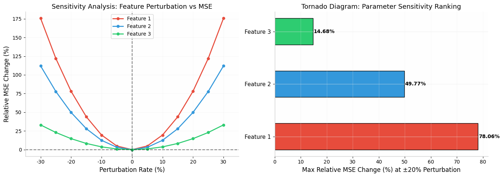
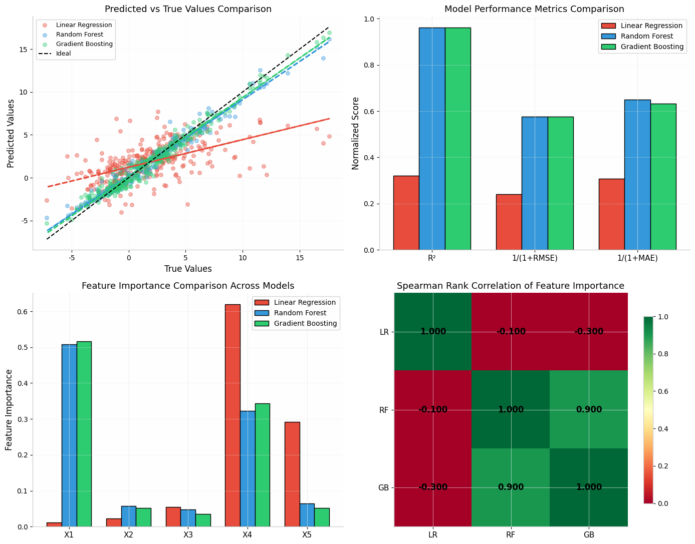
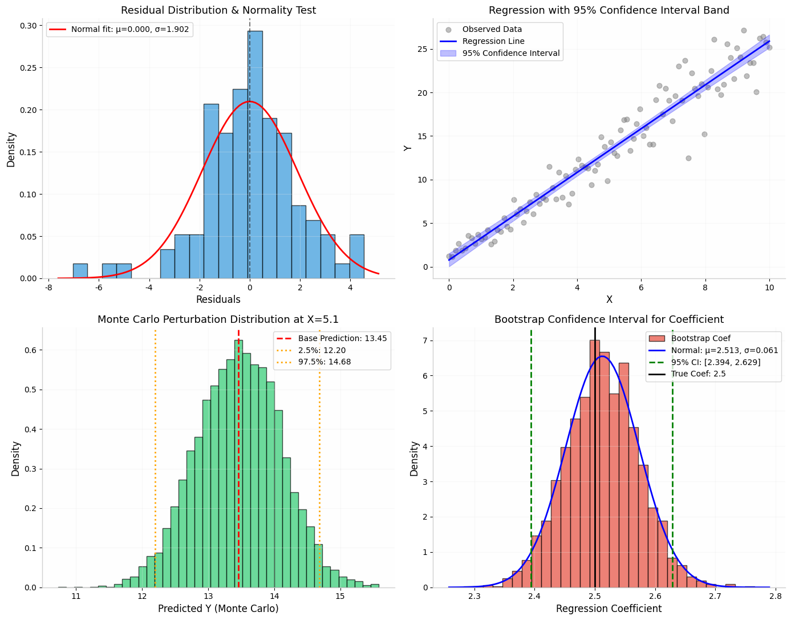

# 📘 模块 7：检验与稳健性分析（小白友好版）

> 模型建完了，得证明：结果不是蒙的，换模型结论也差不多，数据有点误差也不翻车。
> 评委最爱看这部分。

---

## Part 1：敏感性分析

拧拧每个参数的旋钮，看输出变化大不大。哪个参数最"娇气"？数据采集时要盯紧它。

`python
for idx in range(3):
    for pert in [-0.2, -0.1, 0, 0.1, 0.2]:
        X_pert = X.copy(); X_pert[:,idx] *= (1+pert)
        mse = mean_squared_error(y, model.predict(X_pert))
`

*Feature 1 扰动 ±20% 致 MSE 变化 78%，最敏感*

---

## Part 2：模型稳健性检验

换不同模型跑一遍，看结论是否一致。如果都说同样的话→结论很稳

`python
from sklearn.ensemble import RandomForestRegressor, GradientBoostingRegressor
from scipy.stats import spearmanr
rho, p = spearmanr(RandomForestRegressor(100).fit(X,y).feature_importances_,
                   GradientBoostingRegressor(100).fit(X,y).feature_importances_)
`

*random forest vs gradient boosting R²≈0.96, Spearman ρ=0.90 → 结论稳健*

---

## Part 3：误差分析 + Bootstrap

置信区间告诉你：有 95% 的把握在哪个范围内

`python
boot = [LinearRegression().fit(X[np.random.choice(n,n,replace=True)], y[np.random.choice(n,n,replace=True)]).coef_[0] for _ in range(2000)]
ci = np.percentile(boot, [2.5, 97.5])
`

*置信区间+蒙特卡洛扰动，模型对 5% 测量误差鲁棒*

---

## 🏆 评分框架

| 检验层次 | 方法 | 加分权重 |
|---------|------|---------|
| 敏感性分析 | OAT 单因素扰动 | ⭐⭐⭐ |
| 模型稳健性 | 换模型+Spearman | ⭐⭐⭐⭐ |
| 置信区间 | Bootstrap | ⭐⭐⭐ |
| 蒙特卡洛 | 参数扰动模拟 | ⭐⭐⭐⭐⭐ |

> 做完模型≠完事，证明结论不是蒙的才是高分关键 🍡
