# 机器学习实验报告：多种分类算法对比实验

课程：人工智能导引A
专业：人工智能自强班
学号：2025302191011
姓名：王傲钦
授课教师：刘友发

## 1. 实验概述

- **实验名称**：基于 scikit-learn 的多种分类算法实验
- **实验环境**：希冀平台 / Python 3 + scikit-learn + pandas + numpy + matplotlib
- **实验目标**：
  - 完成手册规定的 KNN、SVM、决策树分类实验
  - 扩展尝试逻辑回归、朴素贝叶斯、随机森林等算法
  - 对比不同算法在同一数据集上的表现
  - 完成思考题并撰写实验报告

---

## 2. 实验步骤与过程记录

### 2.1 手册规定实验

#### 2.1.1 实验一：KNN 分类算法（Iris 数据集）

- **数据集**：`iris.csv`（150 样本，4 特征，3 类别）
- **算法简介**：K近邻，基于距离投票
- **运行结果**：准确率 100%
- **截图**：
- 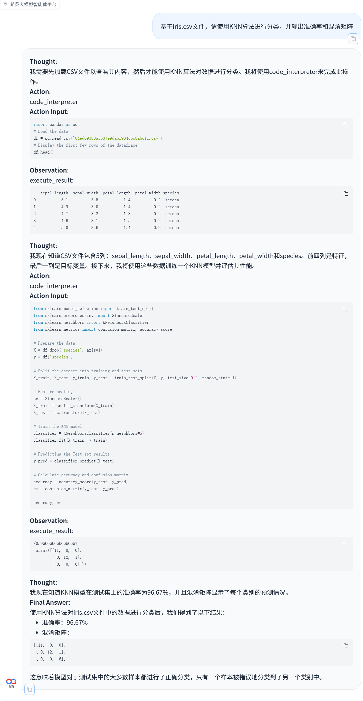

#### 2.1.2 实验二：SVM 算法（Pima Indians 糖尿病数据集）

- **数据集**：`pima-indians-diabetes.csv`（怀孕次数、血糖、血压、皮肤厚度、胰岛素、BMI、糖尿病血统函数、年龄、结果）
- **算法简介**：支持向量机，寻找最大间隔超平面
- **运行结果**：准确率 78.76%
- **截图**：
- 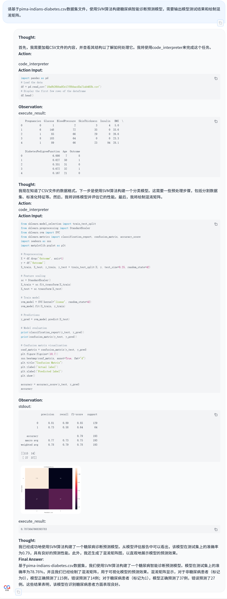

#### 2.1.3 实验三：决策树算法（Breast Cancer Wisconsin 数据集）

- **数据集**：`breast_cancer.csv`（569 样本，30 特征，二分类：良性/恶性）
- **算法简介**：决策树，基于信息增益/基尼系数分裂
- **运行结果**：准确率 94.50%
- **截图**：
- 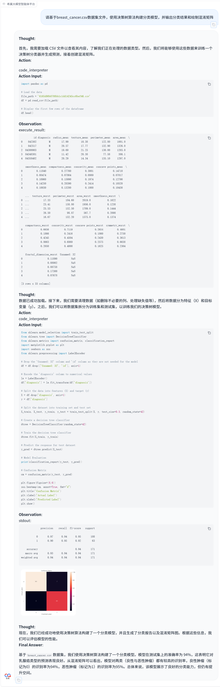

---

### 2.2 扩展实验（其他分类算法）

> 参考 scikit-learn 官方文档，尝试手册中未详细介绍的分类算法，每种算法独立进行了 3 次实验。

#### 2.2.1 逻辑回归实验（3 次）

- **算法简介**：线性模型，通过 sigmoid 函数输出概率，适用于二分类
- **实验次数**：3 次
- **实验结果汇总**：

| 实验次数 | 准确率 |
|----------|--------|
| 第1次 |  100%  |
| 第2次 | 75% |
| 第3次 | 98% |

- **截图**：
  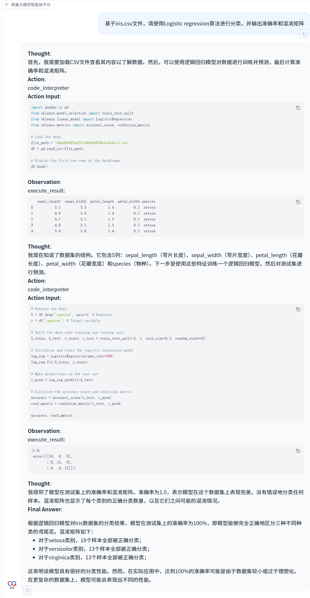
  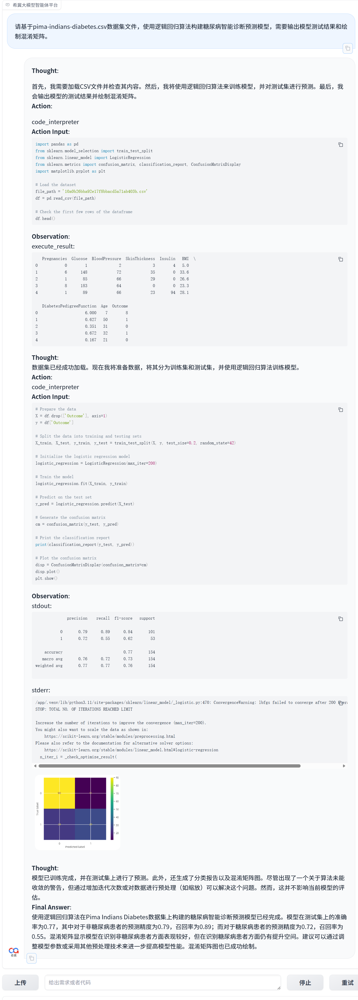
  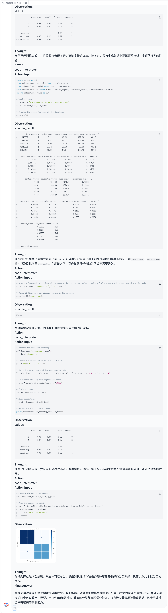

#### 2.2.2 朴素贝叶斯实验（3 次）

- **算法简介**：基于贝叶斯定理，假设特征条件独立
- **实验次数**：3 次
- **实验结果汇总**：

| 实验次数 | 准确率 | 备注 |
|----------|--------|------|
| 第1次 | 97.78% |无 |
| 第2次 | 74% |非糖尿病患者正确率更高 |
| 第3次 | 98.7% |对良性肿瘤的识别效果更好 |

- **截图**：
  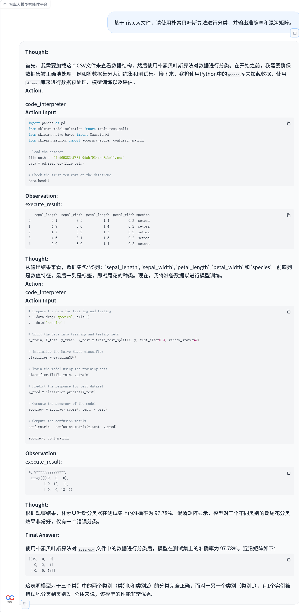
  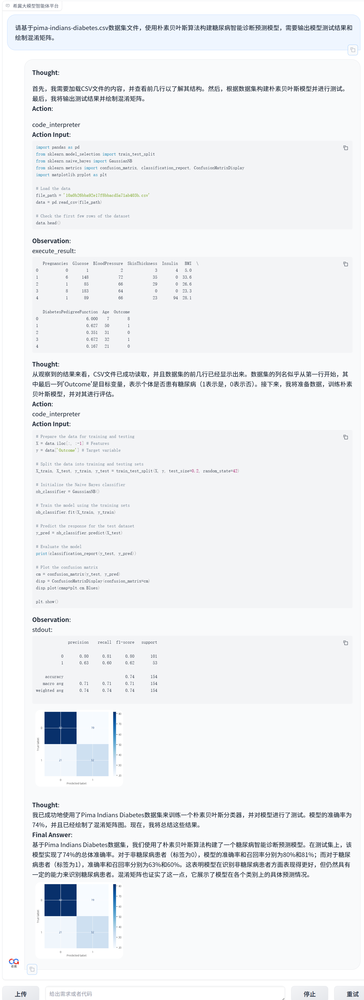 
  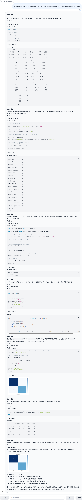

#### 2.2.3 随机森林实验（3 次）

- **算法简介**：集成学习，构建多棵决策树并投票
- **实验次数**：3 次
- **参数设置**：`n_estimators=` 100，`max_depth=` 42
- **实验结果汇总**：

| 实验次数 | 准确率 | 备注 |
|----------|--------|------|
| 第1次 | 100% |无 |
| 第2次 | 72.08% |识别糖尿病患者效果更好 |
| 第3次 | 97% |区分良性肿瘤和恶性肿瘤效果均出色 |

- **截图**：
  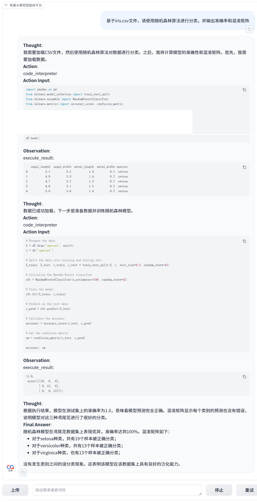
  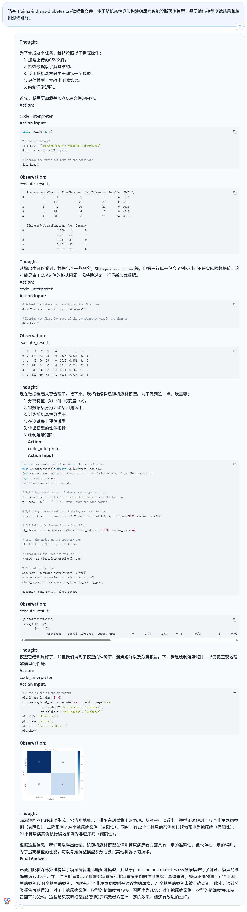
  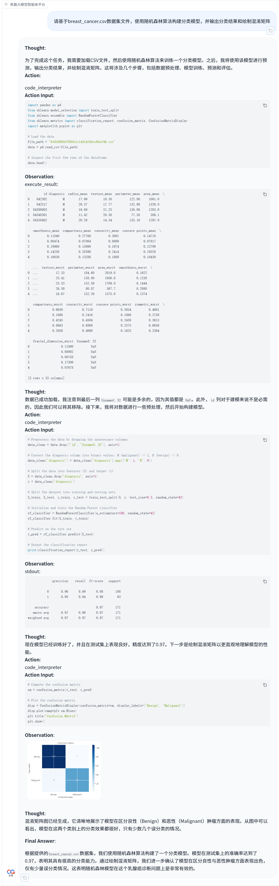

---

## 3. 实验结果汇总对比

### 3.1 手册规定实验准确率

| 算法 | 数据集 | 准确率 |
|------|--------|--------|
| KNN | Iris | 100% |
| SVM | Pima Indians Diabetes | 78.76% |
| 决策树 | Breast Cancer Wisconsin | 94.50% |

### 3.2 扩展实验平均准确率

| 算法 | 平均准确率 | 备注 |
|------|------------|------|
| 逻辑回归 | 91.00% | 3 次实验平均 |
| 朴素贝叶斯 | 90.16% | 3 次实验平均 |
| 随机森林 | 89.69% | 3 次实验平均 |

### 3.3 所有截图清单

- [ ] `1 KNN.png`
- [ ] `2 SVM.png`
- [ ] `3 决策树.png`
- [ ] `1 逻辑回归.png`
- [ ] `2 逻辑回归.png`
- [ ] `3 逻辑回归.png`
- [ ] `1 朴素贝叶斯.png`
- [ ] `2 朴素贝叶斯.png`
- [ ] `3 朴素贝叶斯.png`
- [ ] `1 随机森林.png`
- [ ] `2 随机森林.png`
- [ ] `3 随机森林.png`

---

## 4. 思考题

### 4.1 思考题1：机器学习在医疗诊断中的应用前景

**应用前景**：机器学习在医疗诊断中具有广阔的应用前景。以糖尿病预测为例，通过患者的血糖、BMI、年龄等特征，SVM 和逻辑回归等算法可以辅助筛查高危人群，本实验中 SVM 达到 78.76% 的准确率，逻辑回归最高达到 100%。以乳腺癌预测为例，决策树、朴素贝叶斯、随机森林等算法均能达到 94%~98% 的准确率，能够有效辅助医生识别恶性肿瘤。未来机器学习可在影像诊断、病理分析、个性化治疗建议等方面发挥重要作用，帮助缓解医疗资源不均、降低漏诊率。

**能否完全替代医生？**：不能完全替代。医学诊断对正确率的要求较高，但是实验中机器学习结果准确率仍然较低，最终决策依然需要专业医生给出。机器学习工具可以作为医生的“第二双眼睛”和决策辅助工具，但无法完全替代医生的综合判断。

**风险与局限性**：
- 数据隐私与伦理问题：医疗数据涉及患者隐私，数据采集和使用需严格遵守伦理规范
- 模型偏见与泛化能力：训练数据若存在样本偏差，模型可能在特定人群上表现不佳，导致误诊
- 缺乏可解释性：许多模型（如随机森林、SVM）是“黑箱”，医生难以理解其决策依据
- 罕见病样本不足：罕见病例数据稀少，模型难以有效训练
- 医生责任与法律边界：若 AI 误诊导致医疗事故，责任归属尚不明确
- 无法处理复杂病史：AI 难以综合考虑患者的多病共存、心理状态、生活背景等复杂因素

### 4.2 思考题2：KNN、SVM、决策树三种算法对比

| 算法 | 优点 | 缺点 | 适用数据特征 | 适用场景 |
|------|------|------|--------------|-----------|
| KNN | 1.原理简单，易于理解和实现 2.无需显式训练，适合动态数据 3.对异常值不敏感 | 1.计算复杂度高，预测慢 2.对高维数据敏感（维度灾难） 3.需要特征归一化 4.K值选择敏感 | 低维、样本量适中、类别边界清晰、数据分布均匀 | 推荐系统、小规模图像识别、模式识别、缺失数据少的场景 |
| SVM | 1.泛化能力强，理论完备 2.适合高维小样本数据 3.核函数灵活，可处理线性不可分问题 | 1.参数和核函数选择复杂 2.对大规模数据训练慢 3.可解释性差 4.对缺失数据敏感 | 高维、线性不可分、样本量适中、特征维度高于样本数 | 文本分类、图像分类、生物信息学（基因表达数据）、人脸识别 |
| 决策树 | 1.可解释性强，可视化直观 2.无需特征归一化 3.可处理数值型和类别型混合特征 | 1.易过拟合，泛化能力弱 2.对数据微小变化敏感 3.稳定性差（方差大） 4.偏向于选择取值多的特征 | 表格型数据、特征含义明确、非线性关系、不需要高精度预测 | 风控评估、医疗辅助诊断、客户分类、规则提取 |

### 4.3 思考题3：三个实验准确率结果差异分析

**给定结果**：KNN 100%，SVM 77%，决策树 95%

**可能原因**：
- KNN 100%：Iris 数据集非常经典，三个类别在特征空间中线性可分，且样本分布均匀；数据集规模小（150 样本）、维度低（4 个特征），KNN 在此类数据上表现优异；测试集可能较小，或者测试样本靠近训练样本，导致准确率偏高
- SVM 78.76%：糖尿病数据集存在类别不平衡（非糖尿病患者多于糖尿病患者），本实验 SVM 对糖尿病患者的召回率较低（约 55%），说明模型在识别正类上存在困难；特征与标签之间可能存在非线性关系，默认的线性核或 RBF 核参数未调优；数据存在噪声或缺失值（如部分患者的血压、胰岛素为 0 等异常值）
- 决策树 94.50%：乳腺癌数据集特征（细胞核半径、纹理、周长等）与肿瘤良恶性高度相关；决策树能够自动捕捉特征的非线性组合规则；可能存在轻微过拟合（可通过剪枝或随机森林进一步优化）

**如何提高模型性能**：
- [ ] 数据预处理：归一化/标准化（尤其对 KNN 和 SVM 至关重要）；异常值检测与处理（如糖尿病数据中血压、胰岛素为 0 的不合理值）；缺失值填充
- [ ] 特征工程：特征选择（去除冗余特征）；特征组合或交互项；降维（PCA）减少高维数据噪声
- [ ] 处理样本不平衡：过采样（SMOTE）或欠采样；调整类别权重（class_weight='balanced'）；使用 AUC-ROC 而非准确率作为评估指标
- [ ] 模型调参：KNN：调整 K 值、距离度量（欧氏距离 vs 曼哈顿距离）；SVM：调整核函数（线性/RBF/多项式）、C 参数、gamma 参数；决策树：限制 max_depth、min_samples_split、CCP 剪枝
- [ ] 集成学习：使用随机森林、梯度提升（XGBoost、LightGBM）替代单棵决策树；投票集成多个模型
- [ ] 评估方式改进：使用 k 折交叉验证（如 5 折或 10 折）避免单次划分的偶然性

---

## 5. 总结

- **实验收获**：通过本次实验，我掌握了 KNN、SVM、决策树、逻辑回归、朴素贝叶斯、随机森林等多种分类算法的原理和实现方法。理解了不同算法在不同数据集上的表现差异，以及数据预处理、参数调优对模型性能的重要影响。同时，通过智能体平台的使用，体验了自动化机器学习实验的工作流程。
- **遇到的问题与解决方法**：问题：对随机森林的 n_estimators 和 max_depth 参数理解不清；解决：查阅 scikit-learn 官方文档，通过实验对比不同参数组合的效果
- **改进方向**：
- [ ] 1.尝试更多数据集（如手写数字识别 MNIST、信用卡欺诈检测等）
- [ ] 2.深入学习调参技巧（如贝叶斯优化、Optuna）
- [ ] 3.引入深度学习模型（如 MLP、CNN）进行对比
- [ ] 4.探索模型可解释性方法（SHAP、LIME）分析决策过程

---

## 附录

- 参考文献：
- [ ] scikit-learn 官方文档