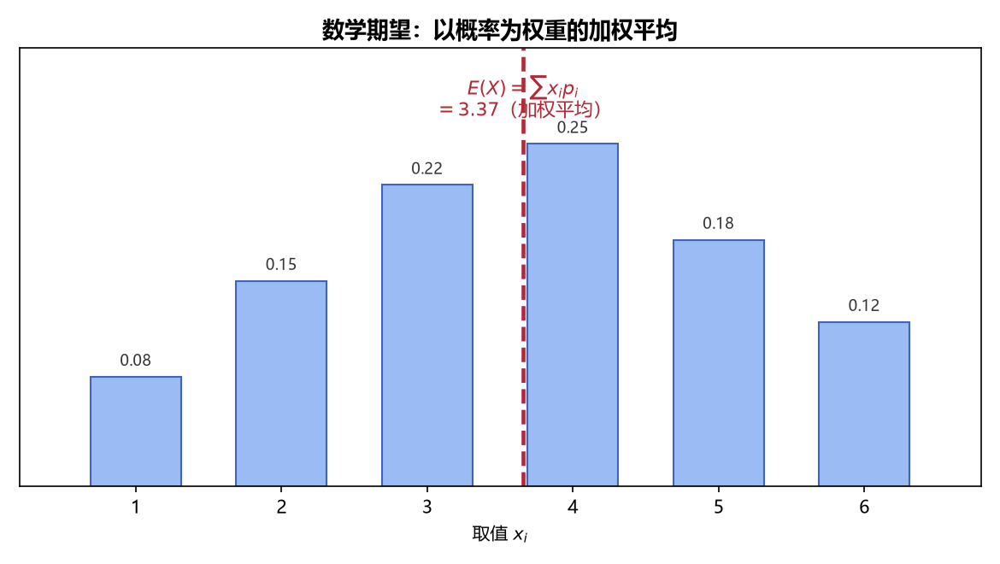

# 《概率论与数理统计》4.1 数学期望的定义 - 笔记

> 整理自 B 站《概率论与数理统计》教学视频 2.0 版本（up：宋浩老师官方）p33。
> 前置：p15 正态分布、p11 泊松分布、p14 指数分布、p13 连续型随机变量。

## 目录

- [一、 为什么需要"数字特征"](#一-为什么需要数字特征)
- [二、 离散型随机变量的数学期望](#二-离散型随机变量的数学期望)
- [三、 连续型随机变量的数学期望](#三-连续型随机变量的数学期望)
- [四、 常见分布的期望（先记结论）](#四-常见分布的期望先记结论)
- [本节重点](#本节重点)

---

## 一、 为什么需要"数字特征"

前 3 章用分布律 / 密度函数 **完整地** 描述随机变量，但"完整"往往意味着复杂（一张大表、一个分段函数）。实际问题常只需要几个**关键数字**来概括随机变量的特征：

- **数学期望**：取值集中在哪（"平均水平"）；
- **方差**：取值波动有多大（下一节）；
- 协方差、相关系数、矩：变量之间的关系（4.3、4.4）。

这一章叫"随机变量的**数字特征**"，就是把分布"压缩"成几个数。

## 二、 离散型随机变量的数学期望

**定义**：设 $X$ 是离散型随机变量，$P\{X=x_k\}=p_k\ (k=1,2,\dots)$，若级数 $\sum_{k=1}^{\infty} x_k p_k$ **绝对收敛**，则称

$$E(X)=\sum_{k=1}^{\infty} x_k p_k$$

为 $X$ 的数学期望（均值），记作 $EX$。

**白话解读**：期望就是"取值 × 概率"全加起来——把所有取值按概率加权平均。**权是概率**，哪个取值概率大，对期望贡献就大。

> 关于"绝对收敛"：只有当 $x_k$ 有正有负时才需要担心（级数 $\sum x_k p_k$ 可能因正负相消而不收敛）。**做题时不用管它**，有限个取值直接相加即可。

**例一（两个工人比水平）**：甲、乙每天生产的次品数分别记为 $X_1, X_2$：

| $X_1$ | 0 | 1 | 2 | 3 | | $X_2$ | 0 | 1 | 2 | 3 |
|---|---|---|---|---|---|---|---|---|---|---|
| $p$ | 0.3 | 0.3 | 0.2 | 0.2 | | $p$ | 0.2 | 0.5 | 0 | 0.3 |

$$E(X_1)=0\times0.3+1\times0.3+2\times0.2+3\times0.2=1.3$$

$$E(X_2)=0\times0.2+1\times0.5+2\times0+3\times0.3=1.4$$

**结论**：$E(X_1)<E(X_2)$，甲平均每天次品更少，**甲的水平更高**。

**例二（泊松分布）**：$X\sim P(\lambda)$，则 $E(X)=\lambda$。

直观理解：泊松分布的参数 $\lambda$ 本身就是"平均发生次数"，期望与参数重合。

> **图1** 数学期望直观：以概率为权重的加权平均——取值乘概率再求和（自绘）。

## 三、 连续型随机变量的数学期望

**定义**：设 $X$ 是连续型随机变量，密度函数为 $f(x)$，若积分 $\int_{-\infty}^{+\infty} x f(x)\,dx$ **绝对收敛**，则称

$$E(X)=\int_{-\infty}^{+\infty} x\, f(x)\,dx$$

为 $X$ 的数学期望。

**白话解读**：和离散型**框架完全一样**——"取值 × 概率/密度，然后求和/积分"。离散型是 $\sum$，连续型把 $\sum$ 换成 $\int$，把概率 $p_k$ 换成密度 $f(x)\,dx$（$f(x)dx$ 就是 $X$ 落在 $x$ 附近微小区间的概率）。

**例四**：$X$ 的密度 $f(x)=\begin{cases}2x, & 0<x<1\\0, & \text{其他}\end{cases}$，求 $EX$。

$$EX=\int_{-\infty}^{+\infty} x f(x)\,dx=\int_0^1 x\cdot 2x\,dx=\int_0^1 2x^2\,dx=\frac23$$

**例五（指数分布）**：$X\sim Exp(\lambda)$，则 $E(X)=\dfrac1\lambda$。

> 实用例子：若灯泡寿命 $X\sim Exp(\frac1{10000})$（即 $\lambda=\frac1{10000}$），则 $EX=10000$——平均寿命 1 万小时。指数分布常用于电子元件、灯泡等寿命建模。

**例六（正态分布）**：$X\sim N(\mu,\sigma^2)$，则 $E(X)=\mu$。

直观理解：正态密度是**左右对称的钟形**，对称轴就是 $\mu$。取值围绕 $\mu$ 对称分布，平均位置自然是 $\mu$——所以 $\mu$ 的几何含义就是"对称轴 / 中心位置"。

**例七（分段密度）**：$f(x)=\begin{cases}\frac12, & -1<x<0\\\frac14, & 0\le x<2\\0, & \text{其他}\end{cases}$，求 $EX$。

密度在不同区间取不同值，要**分段积分**：

$$EX=\int_{-1}^{0} x\cdot\frac12\,dx+\int_0^2 x\cdot\frac14\,dx=\Big[\frac{x^2}{4}\Big]_{-1}^{0}+\Big[\frac{x^2}{8}\Big]_0^2=-\frac14+\frac12=\frac14$$

> **易错点**：分段密度求期望时，**每一段都要乘上该段的密度再积分**，别漏段，也别把 $x$ 丢掉（是 $xf(x)$ 不是 $f(x)$）。

## 四、 常见分布的期望（先记结论）

| 分布 | 记号 | $EX$ |
|---|---|---|
| 0-1 分布 | $B(1,p)$ | $p$ |
| 二项分布 | $B(n,p)$ | $np$ |
| 泊松分布 | $P(\lambda)$ | $\lambda$ |
| 均匀分布 | $U(a,b)$ | $\dfrac{a+b}{2}$ |
| 指数分布 | $Exp(\lambda)$ | $\dfrac1\lambda$ |
| 正态分布 | $N(\mu,\sigma^2)$ | $\mu$ |

> 这张表在讲完方差后会完整扩充（**p40**），考试常直接调用，务必记住。

---

## 本节重点

> - **期望 = 取值 × 概率（密度）的加权和/积分**，离散用 $\sum x_kp_k$，连续用 $\int xf(x)dx$。
> - **常见分布期望**：泊松 $E=\lambda$、指数 $E=1/\lambda$、正态 $E=\mu$、二项 $E=np$。
> - **几何含义**：正态的 $\mu$ 就是对称轴；期望代表取值平均位置。
> - **常见坑**：① 分段密度要分段积分且保留因子 $x$；② 级数/积分要求绝对收敛（做题一般不用管）；③ 期望大 ≠ 好，要看实际含义（例一：次品数期望小才是水平高）。

---

## 教材深化（《统计学完全教程》第3章）

> 整理自《统计学完全教程》(L. Wasserman) 第3章，为教材比原笔记更深的内容。

### 一、 期望的统一定义与"存在性"

**统一定义**：
$$\mathbb E(X)=\int x\,dF(x)=\begin{cases}\sum_x x\,f(x) & X\text{ 离散}\\ \int x\,f(x)\,dx & X\text{ 连续}\end{cases}$$
记号 $\int x\,dF(x)$ 是 Lebesgue–Stieltjes 积分，把离散求和与连续积分统一起来（真实含义在实分析课程中展开）。

**存在性**：称 $\mathbb E(X)$ 存在，当且仅当 $\int |x|\,dF(x)<\infty$；否则期望不存在。

**Cauchy 分布的教训**：$f(x)=\dfrac{1}{\pi(1+x^2)}$，则
$$\int|x|\,dF(x)=\frac{2}{\pi}\int_0^\infty\frac{x\,dx}{1+x^2}=\infty$$
所以 Cauchy **没有期望**。模拟验证：反复抽 Cauchy 取平均，平均值永远不收敛（厚尾 → 极端值太常见）。

### 七、 条件期望：先分清"数"与"随机变量"

**定义**：$\mathbb E(X|Y=y)=\begin{cases}\sum_x x\,f_{X|Y}(x|y)\\ \int x\,f_{X|Y}(x|y)\,dx\end{cases}$

> **关键警示（教材特别强调）**：$\mathbb E(X|Y=y)$ 是 **$y$ 的函数（一个数）**；但 $\mathbb E(X|Y)$ 是 **随机变量**——在观察到 $Y$ 之前你不知道它的取值，它的取值在 $Y=y$ 时为 $\mathbb E(X|Y=y)$。

**例**：$X\sim\text{Unif}(0,1)$，$Y|X=x\sim\text{Unif}(x,1)$，则 $\mathbb E(Y|X=x)=\frac{1+x}{2}$，所以 $\mathbb E(Y|X)=\frac{1+X}{2}$（这是关于 $X$ 的随机变量）。

### 八、 重期望法则（全期望公式）

**定理 3.24**：
$$\boxed{\mathbb E\big[\mathbb E(Y|X)\big]=\mathbb E(Y)}$$
更一般地 $\mathbb E\big[\mathbb E\big(r(X,Y)|X\big)\big]=\mathbb E\big(r(X,Y)\big)$。

**证明思路**：$\mathbb E[\mathbb E(Y|X)]=\int\mathbb E(Y|X=x)f_X(x)dx=\iint y\,f(y|x)dy\,f(x)dx=\iint y\,f(x,y)\,dxdy=\mathbb E(Y)$。

**例**：接上例，$\mathbb E(Y)=\mathbb E\!\left(\frac{1+X}{2}\right)=\frac{1+1/2}{2}=\frac34$（两步走，比直接求联合密度快）。

### 九、 方差分解公式（EVVE 法则）

**定理 3.27（方差分解/全方差公式）**：
$$\boxed{V(Y)=\mathbb E\big[V(Y|X)\big]+V\big[\mathbb E(Y|X)\big]}$$
"方差 = 条件方差的期望 + 条件期望的方差"。

**例 3.28（层次模型）**：$Q\sim\text{Unif}(0,1)$，$X|Q=q\sim\text{Binomial}(n,q)$。则
$$\mathbb E(X|Q)=nQ,\qquad V(X|Q)=nQ(1-Q)$$
于是
$$\mathbb E(X)=n\mathbb E(Q)=\frac n2,\qquad V(X)=\underbrace{n\mathbb E\big(Q(1-Q)\big)}_{=n/6}+\underbrace{n^2V(Q)}_{=n^2/12}$$

### 十、 层次模型：分阶段构造的分布

**定义**：分阶段构造的分布叫**层次模型（hierarchical model）**，写成
$$Q\sim\text{Uniform}(0,1),\qquad X|Q=q\sim\text{Binomial}(n,q)$$

> 这是贝叶斯推断（教材第11章）和后面多级模型的雏形：参数本身也是随机变量，先抽参数、再按参数抽数据。

### 本节重点

> - **期望存在** ⟺ $E|X|<\infty$；Cauchy 分布无期望（厚尾）。
> - **Lazy Statistician**：$E\big(r(X)\big)=\int r(x)\,dF(x)$，不用求 $Y$ 的分布；概率=指示函数的期望。
> - **协方差矩阵线性变换**：$E(a^TX)=a^T\mu$，$V(a^TX)=a^T\Sigma a$；多项分布 $\text{Cov}(X_i,X_j)=-np_ip_j$。
> - **条件期望是随机变量**：$E(Y|X)$ 在 $X=x$ 时取值 $E(Y|X=x)$。
> - **重期望**：$E[E(Y|X)]=E(Y)$；**方差分解**：$V(Y)=E[V(Y|X)]+V[E(Y|X)]$。
> - **层次模型**：参数先抽、数据再抽（贝叶斯雏形）。
> - **MGF**：$\psi^{(k)}(0)=E(X^k)$；独立和的 MGF=乘积；MGF 决定分布（证二项和、Poisson 和同族）。

