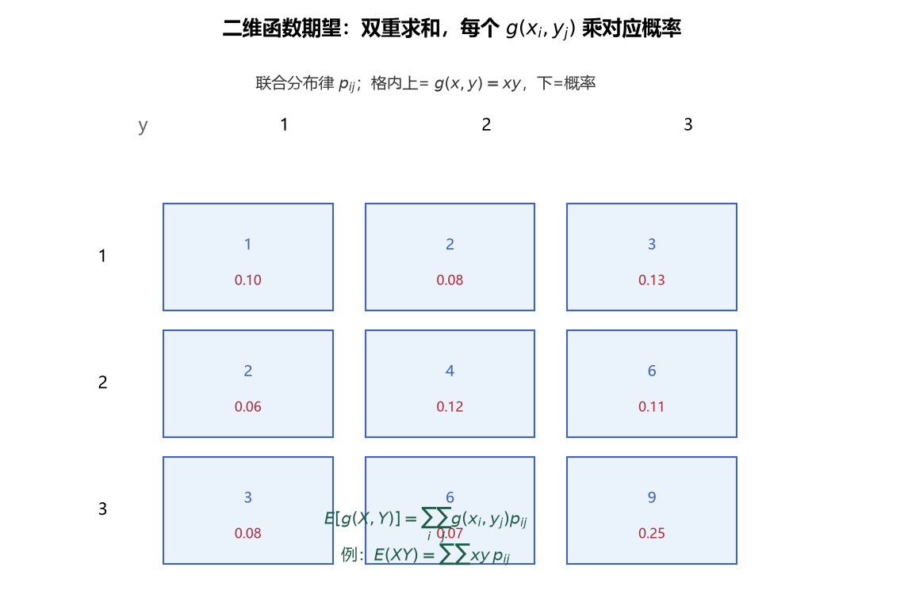
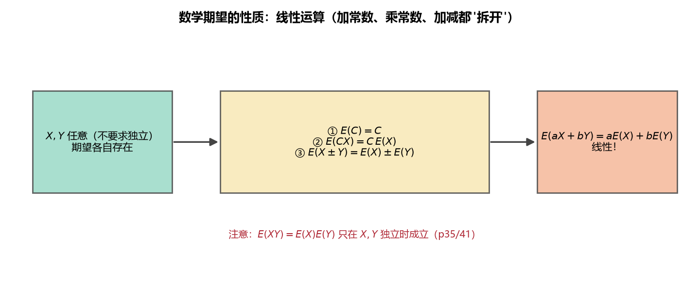

# 《概率论与数理统计》4.1 数学期望（p33-p36）

> 整理自 B 站《概率论与数理统计》教学视频 2.0 版本（up：宋浩老师官方）p33-p36。

> 整理自 B 站《概率论与数理统计》教学视频 2.0 版本（up：宋浩老师官方）p33-p36。

## 数学期望的定义（p33）

> 整理自 B 站《概率论与数理统计》教学视频 2.0 版本（up：宋浩老师官方）p33。
> 前置：p15 正态分布、p11 泊松分布、p14 指数分布、p13 连续型随机变量。

### 一、 为什么需要"数字特征"

前 3 章用分布律 / 密度函数 **完整地** 描述随机变量，但"完整"往往意味着复杂（一张大表、一个分段函数）。实际问题常只需要几个**关键数字**来概括随机变量的特征：

- **数学期望**：取值集中在哪（"平均水平"）；
- **方差**：取值波动有多大（下一节）；
- 协方差、相关系数、矩：变量之间的关系（4.3、4.4）。

这一章叫"随机变量的**数字特征**"，就是把分布"压缩"成几个数。

### 二、 离散型随机变量的数学期望

**定义**：设 $X$ 是离散型随机变量，$P\{X=x_k\}=p_k\ (k=1,2,\dots)$，若级数 $\sum_{k=1}^{\infty} x_k p_k$ **绝对收敛**，则称

$$E(X)=\sum_{k=1}^{\infty} x_k p_k$$

为 $X$ 的数学期望（均值），记作 $EX$。

**白话解读**：期望就是"取值 × 概率"全加起来——把所有取值按概率加权平均。**权是概率**，哪个取值概率大，对期望贡献就大。

> 关于"绝对收敛"：只有当 $x_k$ 有正有负时才需要担心（级数 $\sum x_k p_k$ 可能因正负相消而不收敛）。**做题时不用管它**，有限个取值直接相加即可。

**例一（两个工人比水平）**：甲、乙每天生产的次品数分别记为 $X_1, X_2$：

| $X_1$ | 0 | 1 | 2 | 3 | | $X_2$ | 0 | 1 | 2 | 3 |
|---|---|---|---|---|---|---|---|---|---|---|
| $p$ | 0.3 | 0.3 | 0.2 | 0.2 | | $p$ | 0.2 | 0.5 | 0 | 0.3 |

$$E(X_1)=0\times0.3+1\times0.3+2\times0.2+3\times0.2=1.3$$

$$E(X_2)=0\times0.2+1\times0.5+2\times0+3\times0.3=1.4$$

**结论**：$E(X_1)<E(X_2)$，甲平均每天次品更少，**甲的水平更高**。

**例二（泊松分布）**：$X\sim P(\lambda)$，则 $E(X)=\lambda$。

直观理解：泊松分布的参数 $\lambda$ 本身就是"平均发生次数"，期望与参数重合。

> **图1** 数学期望直观：以概率为权重的加权平均——取值乘概率再求和（自绘）。

### 三、 连续型随机变量的数学期望

**定义**：设 $X$ 是连续型随机变量，密度函数为 $f(x)$，若积分 $\int_{-\infty}^{+\infty} x f(x)\,dx$ **绝对收敛**，则称

$$E(X)=\int_{-\infty}^{+\infty} x\, f(x)\,dx$$

为 $X$ 的数学期望。

**白话解读**：和离散型**框架完全一样**——"取值 × 概率/密度，然后求和/积分"。离散型是 $\sum$，连续型把 $\sum$ 换成 $\int$，把概率 $p_k$ 换成密度 $f(x)\,dx$（$f(x)dx$ 就是 $X$ 落在 $x$ 附近微小区间的概率）。

**例四**：$X$ 的密度 $f(x)=\begin{cases}2x, & 0<x<1\\0, & \text{其他}\end{cases}$，求 $EX$。

$$EX=\int_{-\infty}^{+\infty} x f(x)\,dx=\int_0^1 x\cdot 2x\,dx=\int_0^1 2x^2\,dx=\frac23$$

**例五（指数分布）**：$X\sim Exp(\lambda)$，则 $E(X)=\dfrac1\lambda$。

> 实用例子：若灯泡寿命 $X\sim Exp(\frac1{10000})$（即 $\lambda=\frac1{10000}$），则 $EX=10000$——平均寿命 1 万小时。指数分布常用于电子元件、灯泡等寿命建模。

**例六（正态分布）**：$X\sim N(\mu,\sigma^2)$，则 $E(X)=\mu$。

直观理解：正态密度是**左右对称的钟形**，对称轴就是 $\mu$。取值围绕 $\mu$ 对称分布，平均位置自然是 $\mu$——所以 $\mu$ 的几何含义就是"对称轴 / 中心位置"。

**例七（分段密度）**：$f(x)=\begin{cases}\frac12, & -1<x<0\\\frac14, & 0\le x<2\\0, & \text{其他}\end{cases}$，求 $EX$。

密度在不同区间取不同值，要**分段积分**：

$$EX=\int_{-1}^{0} x\cdot\frac12\,dx+\int_0^2 x\cdot\frac14\,dx=\Big[\frac{x^2}{4}\Big]_{-1}^{0}+\Big[\frac{x^2}{8}\Big]_0^2=-\frac14+\frac12=\frac14$$

> **易错点**：分段密度求期望时，**每一段都要乘上该段的密度再积分**，别漏段，也别把 $x$ 丢掉（是 $xf(x)$ 不是 $f(x)$）。

### 四、 常见分布的期望（先记结论）

| 分布 | 记号 | $EX$ |
|---|---|---|
| 0-1 分布 | $B(1,p)$ | $p$ |
| 二项分布 | $B(n,p)$ | $np$ |
| 泊松分布 | $P(\lambda)$ | $\lambda$ |
| 均匀分布 | $U(a,b)$ | $\dfrac{a+b}{2}$ |
| 指数分布 | $Exp(\lambda)$ | $\dfrac1\lambda$ |
| 正态分布 | $N(\mu,\sigma^2)$ | $\mu$ |

> 这张表在讲完方差后会完整扩充（**p40**），考试常直接调用，务必记住。

---

### 本节重点

> - **期望 = 取值 × 概率（密度）的加权和/积分**，离散用 $\sum x_kp_k$，连续用 $\int xf(x)dx$。
> - **常见分布期望**：泊松 $E=\lambda$、指数 $E=1/\lambda$、正态 $E=\mu$、二项 $E=np$。
> - **几何含义**：正态的 $\mu$ 就是对称轴；期望代表取值平均位置。
> - **常见坑**：① 分段密度要分段积分且保留因子 $x$；② 级数/积分要求绝对收敛（做题一般不用管）；③ 期望大 ≠ 好，要看实际含义（例一：次品数期望小才是水平高）。

---

## 一维随机变量函数的期望（p34）

> 整理自 B 站《概率论与数理统计》教学视频 2.0 版本（up：宋浩老师官方）p34。
> 前置：p33 数学期望的定义；p16/p17 随机变量函数的分布。

### 一、 问题引入

$X$ 本身有期望 $EX$；但实际问题常需要求 **$X$ 的函数 $Y=g(X)$ 的期望**，例如"正方形边长是随机变量 $X$，求面积 $X^2$ 的平均大小"。

**两条路线**（对应 p16 的两种做法）：

1. 先求 $Y=g(X)$ 的分布，再按定义算 $E(Y)$——绕路；
2. **直接公式**：$E[g(X)]=\sum g(x_k)p_k$（离散）/ $\int g(x)f(x)dx$（连续）——不用先求 $Y$ 的分布。

### 二、 离散型：$E[g(X)]$ 公式

设 $X$ 的分布律为 $P\{X=x_k\}=p_k$，则

$$E[g(X)]=\sum_{k} g(x_k)\,p_k$$

**白话解读**：和 $EX=\sum x_k p_k$ 长得一样，**只是"取值"从 $x_k$ 换成了 $g(x_k)$，概率 $p_k$ 不变**。

**例八（Y=2X）**：$X$ 取 $-1,0,1$，概率 $0.2,0.3,0.5$，求 $E(Y)$，$Y=2X$。

- 方法一（先求分布）：$Y$ 取 $-2,0,2$，概率仍为 $0.2,0.3,0.5$，$EY=(-2)\times0.2+0\times0.3+2\times0.5=0.6$；
- 方法二（直接公式）：$E(2X)=(-1)\times2\times0.2+0\times2\times0.3+1\times2\times0.5=0.6$。

两种方法殊途同归。直接公式免去"先求 $Y$ 分布"的步骤。

> **图2** 一维函数期望：$g(x_i)$ 与原来的概率 $p_i$ 配对求和——不必先求 $g(X)$ 的分布律（自绘）。

### 三、 连续型：$E[g(X)]$ 公式

设 $X$ 的密度为 $f(x)$，则

$$E[g(X)]=\int_{-\infty}^{+\infty} g(x)\, f(x)\,dx$$

**白话解读**：同样把 $EX=\int x f(x)dx$ 里的"取值" $x$ 换成 $g(x)$，密度不变。

> **记忆法**：四个公式连起来记——$EX=\sum x_kp_k$、$E[g(X)]=\sum g(x_k)p_k$、$EX=\int xf(x)dx$、$E[g(X)]=\int g(x)f(x)dx$。**横竖都是"取值 × 概率/密度"**，差别只在取值用 $x$ 还是 $g(x)$。

### 四、 完整例题（公式熟练度训练）

**例九**：$X$ 取 $0,1,2$，概率 $0.1,0.6,0.3$。

**(1) $E(X^2)$**：取值平方后乘概率：

$$E(X^2)=0^2\times0.1+1^2\times0.6+2^2\times0.3=0+0.6+1.2=1.8$$

**(2) $E(X^3)$**：

$$E(X^3)=0^3\times0.1+1^3\times0.6+2^3\times0.3=0+0.6+2.4=3$$

**(3) $E(X)$**：

$$EX=0\times0.1+1\times0.6+2\times0.3=1.2$$

**(4) $E(X-EX)^2$**：注意这是**新的函数** $g(x)=(x-EX)^2=(x-1.2)^2$：

$$E(X-1.2)^2=(0-1.2)^2\times0.1+(1-1.2)^2\times0.6+(2-1.2)^2\times0.3$$

$$=1.44\times0.1+0.04\times0.6+0.64\times0.3=0.144+0.024+0.192=0.36$$

> **易错点**：$E(X-EX)^2$ 是"随机变量 $X$ 到它的均值 $EX$ 的距离平方的期望"，$EX$ 在这里是一个**已经算出的常数**，代入后 $X$ 的三个取值分别变成 $-1.2,\ -0.2,\ 0.8$。这个量就是下一节的**方差** $D(X)$——第 (4) 问其实提前演示了方差的算法。

---

### 本节重点

> - **核心公式**：$E[g(X)]=\sum g(x_k)p_k$（离散）、$E[g(X)]=\int g(x)f(x)dx$（连续）——取值换成 $g(x)$，概率/密度不动。
> - **不用绕路**：求 $Y=g(X)$ 的期望不必先求 $Y$ 的分布，直接套公式。
> - **$E(X-EX)^2$ 的含义**：$EX$ 是常数，算完 $EX$ 再对 $(X-EX)^2$ 求期望，得到的就是方差 $D(X)$（p37 正式定义）。
> - **常见坑**：别把 $E(X^2)$ 和 $(EX)^2$ 搞混——前者是 $X^2$ 的期望（例九第 1 问 $=1.8$），后者是期望的平方（$1.2^2=1.44$），**两者一般不相等**。

---

## 二维随机变量函数的期望（p35）

> 整理自 B 站《概率论与数理统计》教学视频 2.0 版本（up：宋浩老师官方）p35。
> 前置：p18-p22 二维随机变量联合分布、边缘分布、联合密度；p33 期望定义。

### 一、 二维离散型：$E[g(X,Y)]$

设 $(X,Y)$ 的联合分布律为 $P\{X=x_i,\ Y=y_j\}=p_{ij}$，则

$$E[g(X,Y)]=\sum_i\sum_j g(x_i,y_j)\,p_{ij}$$

**白话解读**：还是一句话——**"取值 × 概率"全加起来**。只是取值变成二元函数 $g(x_i,y_j)$，概率用联合分布 $p_{ij}$，对所有 $(i,j)$ 求和。

> 公式形式看着吓人，**做题直接枚举**：把 $(X,Y)$ 每种取值代入 $g$ 得到 $Z$ 的取值，乘上对应概率相加即可（离散型联合分布表已经给出了所有概率）。

**例（X+Y 与 XY 的期望）**：$(X,Y)$ 联合分布如下（$X$ 取 $0,1$；$Y$ 取 $1,2,3$）：

| $X\backslash Y$ | 1 | 2 | 3 |
|---|---|---|---|
| 0 | 0.1 | 0.2 | 0.1 |
| 1 | 0.2 | 0.3 | 0.1 |

**(1) $E(X+Y)$**：每种组合先求和再乘概率：

$$E(X+Y)=1\times0.1+2\times0.2+3\times0.1+2\times0.2+3\times0.3+4\times0.1=2.5$$

**验证技巧**：$X$ 取 $0,1$；$Y$ 取 $1,2,3$，$X+Y$ 可能取值 $1,2,3,2,3,4$（重复取值照常计算）。

**(2) $E(XY)$**：$X=0$ 时乘积恒为 0，只需算 $X=1$ 的行：

$$E(XY)=0+1\times1\times0.2+1\times2\times0.3+1\times3\times0.1=1.1$$

> **图3** 二维函数期望：对联合分布律的每个格子的 $g(x_i,y_j)$ 乘对应概率 $p_{ij}$，双重求和（自绘）。

### 二、 二维连续型：$E[g(X,Y)]$

设 $(X,Y)$ 的联合密度为 $f(x,y)$，则

$$E[g(X,Y)]=\int_{-\infty}^{+\infty}\int_{-\infty}^{+\infty} g(x,y)\, f(x,y)\,dx\,dy$$

**白话解读**：离散的 $\sum\sum$ 换成二重积分 $\iint$，概率 $p_{ij}$ 换成联合密度 $f(x,y)dxdy$。框架与一维完全相同。

**例 13**：$(X,Y)$ 的联合密度 $f(x,y)=\begin{cases}x+y, & 0\le x\le1,\ 0\le y\le1\\0, & \text{其他}\end{cases}$，求 $E(XY)$。

密度只在单位正方形 $[0,1]\times[0,1]$ 上非零，其余区域积分为 0：

$$E(XY)=\int_0^1\int_0^1 xy(x+y)\,dy\,dx$$

先对 $y$ 积分（$x$ 视为常数）：

$$=\int_0^1\left[x\cdot\frac{x y^2}{2}+x\cdot\frac{y^3}{3}\right]_{y=0}^{y=1}dx=\int_0^1\left(\frac{x^2}{2}+\frac{x}{3}\right)dx=\frac16+\frac16=\frac13$$

> **易错点**：① 二重积分要正确转化为累次积分（先内层后外层，注意上下限）；② 联合密度在区域外为 0，积分区域自动缩小到密度非零区域；③ 先积哪一层都可以，挑简单的（本题先 $y$ 后 $x$ 均可）。

---

### 本节重点

> - **二维期望公式**：离散 $E[g(X,Y)]=\sum_i\sum_j g(x_i,y_j)p_{ij}$；连续 $E[g(X,Y)]=\iint g(x,y)f(x,y)\,dxdy$。
> - **本质不变**："取值 × 概率/密度"的加权和，只是取值换成二元函数、概率换成联合分布。
> - **做题套路**：离散直接枚举联合分布表；连续转化为累次积分（先内层后外层）。
> - **常见坑**：离散枚举时别漏组合；$X=0$ 的行在 $XY$ 中恒为 0，可跳过省算。

---

## 数学期望的性质（p36）

> 整理自 B 站《概率论与数理统计》教学视频 2.0 版本（up：宋浩老师官方）p36。
> 前置：p33-p35 期望定义与函数期望；p21 边缘分布律。

### 一、 四条性质总览（记忆表）

设 $C,a,b$ 为常数，$X,Y$ 为随机变量：

| 性质 | 公式 | 需要独立条件？ |
|---|---|---|
| 1. 常数 | $E(C)=C$ | 否 |
| 2. 线性 | $E(aX+b)=aE(X)+b$ | 否 |
| 3. 加减 | $E(X\pm Y)=E(X)\pm E(Y)$ | **否**（无条件成立） |
| 4. 乘积 | $E(XY)=E(X)\cdot E(Y)$ | **是，必须 $X,Y$ 独立** |

> **最重要的一条记忆红线**：性质 1-3 对任何随机变量都成立（不管独立与否）；**只有性质 4 要求独立**——做题时最容易错的就是不看条件直接拆 $E(XY)$。

### 二、 性质 2 证明（离散 + 连续）

**离散型**：设 $P\{X=x_i\}=p_i$，则

$$E(aX+b)=\sum_i (a x_i+b)p_i=a\sum_i x_i p_i+b\sum_i p_i=aE(X)+b$$

（最后一步用到 $\sum_i p_i=1$。）

**连续型**：设密度为 $f(x)$，则

$$E(aX+b)=\int_{-\infty}^{+\infty}(ax+b)f(x)\,dx=a\int x f(x)\,dx+b\int f(x)\,dx=aE(X)+b$$

（$\int f(x)dx=1$。）

**直观理解**：期望是"平均位置"。$X+a$ 相当于所有人都踩上 $a$ 厘米的砖头，平均值自然上移 $a$；$aX$ 相当于把尺子放大 $a$ 倍，平均值放大 $a$ 倍。

### 三、 性质 3 与推论（线性组合）

$$E(X\pm Y)=E(X)\pm E(Y)$$

（离散型证明用到边缘分布：$\sum_j p_{ij}=p_{i\cdot}$，$\sum_i p_{ij}=p_{\cdot j}$，于是 $\sum_i x_i\sum_j p_{ij}=\sum_i x_i p_{i\cdot}=EX$。）

**推论（任意有限个）**：对常数 $a_1,\dots,a_n$，

$$E\left(\sum_{i=1}^{n} a_i X_i\right)=\sum_{i=1}^{n} a_i E(X_i)$$

特别地：

$$E\left(\frac{X_1+X_2+\cdots+X_n}{n}\right)=\frac{E(X_1)+E(X_2)+\cdots+E(X_n)}{n}$$

> 白话：**期望是线性的**——"和的期望 = 期望的和"，系数可以提到期望外面。这条性质让 $E(2X-3Y)=2EX-3EY$ 这样的题变成口算。

> **图4** 期望的性质：常数、系数、加减都"拆开"（线性）；$E(XY)=EX\cdot EY$ 仅在独立时成立（自绘）。

### 四、 性质 4 的关键：独立条件

若 $X,Y$ **相互独立**，则

$$E(XY)=E(X)\cdot E(Y)$$

**证明思路（连续型）**：独立时联合密度可分解 $f(x,y)=f_X(x)f_Y(y)$，于是

$$E(XY)=\iint xy\,f(x,y)\,dxdy=\iint xy\,f_X(x)f_Y(y)\,dxdy=\left(\int x f_X(x)dx\right)\left(\int y f_Y(y)dy\right)=E(X)E(Y)$$

（累次积分中内层积分与 $x$ 无关时，积分变为两个定积分相乘。）

> **反例警示**：$X,Y$ 不独立时，$E(XY)=EX\cdot EY$ **一般不成立**。验证独立最直接的办法是用联合分布表：对每个 $(x_i,y_j)$ 检查 $p_{ij}=p_{i\cdot}p_{\cdot j}$ 是否都成立，**只要有一处不成立就不独立**。

### 五、 综合例题

**例 16**：$(X,Y)$ 联合分布如下（$X$ 取 $0,1$；$Y$ 取 $1,2,3$）：

| $X\backslash Y$ | 1 | 2 | 3 | $p_{i\cdot}$ |
|---|---|---|---|---|
| 0 | 0.1 | 0.2 | 0.3 | 0.6 |
| 1 | 0.2 | 0.1 | 0.1 | 0.4 |
| $p_{\cdot j}$ | 0.3 | 0.3 | 0.4 | 1 |

边缘分布：$X$：$0.6,0.4$；$Y$：$0.3,0.3,0.4$。于是

$$EX=0\times0.6+1\times0.4=0.4,\qquad EY=1\times0.3+2\times0.3+3\times0.4=2.1$$

**(1) $E(X-Y)$**（用性质，口算）：

$$E(X-Y)=EX-EY=0.4-2.1=-1.7$$

> 对比"直接做"：要先把 $X-Y$ 的每种取值（$-3,-2,-1,0,1$ 等）和概率列出来再加权，非常繁琐——**性质的价值就在这里**。

**(2) $E(2X+3Y)$**：

$$E(2X+3Y)=2EX+3EY=0.8+6.3=7.1$$

**(3) $E(XY)$**——先判断能否用性质 4：

检验独立：$P\{X=0\}P\{Y=1\}=0.6\times0.3=0.18\neq0.1=P\{X=0,Y=1\}$，**不独立**，不能用 $EX\cdot EY$，只能直接算：

$$E(XY)=0\times0.1+0\times0.2+0\times0.3+1\times1\times0.2+1\times2\times0.1+1\times3\times0.1=0.7$$

> **易错点**：$0.4\times2.1=0.84\neq0.7$——不独立时直接用 $E(XY)=EXEY$ 会算错。看到"求 $E(XY)$"先问一句：**独立吗？**

---

### 本节重点

> - **性质 1-3 无条件成立**：$E(C)=C$、$E(aX+b)=aEX+b$、$E(X\pm Y)=EX\pm EY$（线性组合同理，系数外提）。
> - **性质 4 有条件**：$E(XY)=EX\cdot EY$ **必须 $X,Y$ 独立**才成立。
> - **独立判定**：离散型逐个检查 $p_{ij}=p_{i\cdot}p_{\cdot j}$，一处不等即不独立。
> - **常见坑**：① 不独立硬拆 $E(XY)$；② 忘掉 $EX$ 算出后代入 $E(X-EX)^2$ 时它是常数；③ 多个随机变量线性组合时系数逐个外提。

---

---

## 教材深化（《统计学完全教程》第3章）

> 整理自《统计学完全教程》(L. Wasserman) 第3章，为教材比原笔记更深的内容。

> 整理自《统计学完全教程》(L. Wasserman) 第3章，为教材比原笔记更深的内容。

> 整理自《统计学完全教程》(L. Wasserman) 第3章，为教材比原笔记更深的内容。

### 一、 期望的统一定义与"存在性"

**统一定义**：
$$\mathbb E(X)=\int x\,dF(x)=\begin{cases}\sum_x x\,f(x) & X\text{ 离散}\\ \int x\,f(x)\,dx & X\text{ 连续}\end{cases}$$
记号 $\int x\,dF(x)$ 是 Lebesgue–Stieltjes 积分，把离散求和与连续积分统一起来（真实含义在实分析课程中展开）。

**存在性**：称 $\mathbb E(X)$ 存在，当且仅当 $\int |x|\,dF(x)<\infty$；否则期望不存在。

**Cauchy 分布的教训**：$f(x)=\dfrac{1}{\pi(1+x^2)}$，则
$$\int|x|\,dF(x)=\frac{2}{\pi}\int_0^\infty\frac{x\,dx}{1+x^2}=\infty$$
所以 Cauchy **没有期望**。模拟验证：反复抽 Cauchy 取平均，平均值永远不收敛（厚尾 → 极端值太常见）。

### 七、 条件期望：先分清"数"与"随机变量"

**定义**：$\mathbb E(X|Y=y)=\begin{cases}\sum_x x\,f_{X|Y}(x|y)\\ \int x\,f_{X|Y}(x|y)\,dx\end{cases}$

> **关键警示（教材特别强调）**：$\mathbb E(X|Y=y)$ 是 **$y$ 的函数（一个数）**；但 $\mathbb E(X|Y)$ 是 **随机变量**——在观察到 $Y$ 之前你不知道它的取值，它的取值在 $Y=y$ 时为 $\mathbb E(X|Y=y)$。

**例**：$X\sim\text{Unif}(0,1)$，$Y|X=x\sim\text{Unif}(x,1)$，则 $\mathbb E(Y|X=x)=\frac{1+x}{2}$，所以 $\mathbb E(Y|X)=\frac{1+X}{2}$（这是关于 $X$ 的随机变量）。

### 八、 重期望法则（全期望公式）

**定理 3.24**：
$$\boxed{\mathbb E\big[\mathbb E(Y|X)\big]=\mathbb E(Y)}$$
更一般地 $\mathbb E\big[\mathbb E\big(r(X,Y)|X\big)\big]=\mathbb E\big(r(X,Y)\big)$。

**证明思路**：$\mathbb E[\mathbb E(Y|X)]=\int\mathbb E(Y|X=x)f_X(x)dx=\iint y\,f(y|x)dy\,f(x)dx=\iint y\,f(x,y)\,dxdy=\mathbb E(Y)$。

**例**：接上例，$\mathbb E(Y)=\mathbb E\!\left(\frac{1+X}{2}\right)=\frac{1+1/2}{2}=\frac34$（两步走，比直接求联合密度快）。

### 九、 方差分解公式（EVVE 法则）

**定理 3.27（方差分解/全方差公式）**：
$$\boxed{V(Y)=\mathbb E\big[V(Y|X)\big]+V\big[\mathbb E(Y|X)\big]}$$
"方差 = 条件方差的期望 + 条件期望的方差"。

**例 3.28（层次模型）**：$Q\sim\text{Unif}(0,1)$，$X|Q=q\sim\text{Binomial}(n,q)$。则
$$\mathbb E(X|Q)=nQ,\qquad V(X|Q)=nQ(1-Q)$$
于是
$$\mathbb E(X)=n\mathbb E(Q)=\frac n2,\qquad V(X)=\underbrace{n\mathbb E\big(Q(1-Q)\big)}_{=n/6}+\underbrace{n^2V(Q)}_{=n^2/12}$$

### 十、 层次模型：分阶段构造的分布

**定义**：分阶段构造的分布叫**层次模型（hierarchical model）**，写成
$$Q\sim\text{Uniform}(0,1),\qquad X|Q=q\sim\text{Binomial}(n,q)$$

> 这是贝叶斯推断（教材第11章）和后面多级模型的雏形：参数本身也是随机变量，先抽参数、再按参数抽数据。

### 本节重点

> - **期望存在** ⟺ $E|X|<\infty$；Cauchy 分布无期望（厚尾）。
> - **Lazy Statistician**：$E\big(r(X)\big)=\int r(x)\,dF(x)$，不用求 $Y$ 的分布；概率=指示函数的期望。
> - **协方差矩阵线性变换**：$E(a^TX)=a^T\mu$，$V(a^TX)=a^T\Sigma a$；多项分布 $\text{Cov}(X_i,X_j)=-np_ip_j$。
> - **条件期望是随机变量**：$E(Y|X)$ 在 $X=x$ 时取值 $E(Y|X=x)$。
> - **重期望**：$E[E(Y|X)]=E(Y)$；**方差分解**：$V(Y)=E[V(Y|X)]+V[E(Y|X)]$。
> - **层次模型**：参数先抽、数据再抽（贝叶斯雏形）。
> - **MGF**：$\psi^{(k)}(0)=E(X^k)$；独立和的 MGF=乘积；MGF 决定分布（证二项和、Poisson 和同族）。

---

> 整理自《统计学完全教程》(L. Wasserman) 第3章，为教材比原笔记更深的内容。

### 二、 Lazy Statistician 定理：算函数期望不用求分布

**定理 3.6（懒惰统计学家法则）**：设 $Y=r(X)$，则
$$\boxed{\mathbb E(Y)=\mathbb E\big(r(X)\big)=\int r(x)\,dF_X(x)}$$
即：算 $E\big(r(X)\big)$ **不必先求 $Y$ 的分布**，直接用 $X$ 的分布对 $r(x)$ 积分/求和。

**推论（概率是期望的特例）**：取 $r(x)=I_A(x)$（指示函数），
$$\mathbb E\big(I_A(X)\big)=\mathbb P(X\in A)$$

**例**：$X\sim\text{Unif}(0,1)$，$Y=e^X$，$E(Y)=\int_0^1 e^x dx=e-1$（不用先算 $f_Y$）。

**例（折棍子）**：单位长棍随机折断，$Y=\max\{X,1-X\}$：
$$\mathbb E(Y)=\int_0^{1/2}(1-x)\,dx+\int_{1/2}^{1}x\,dx=\frac34$$

---
