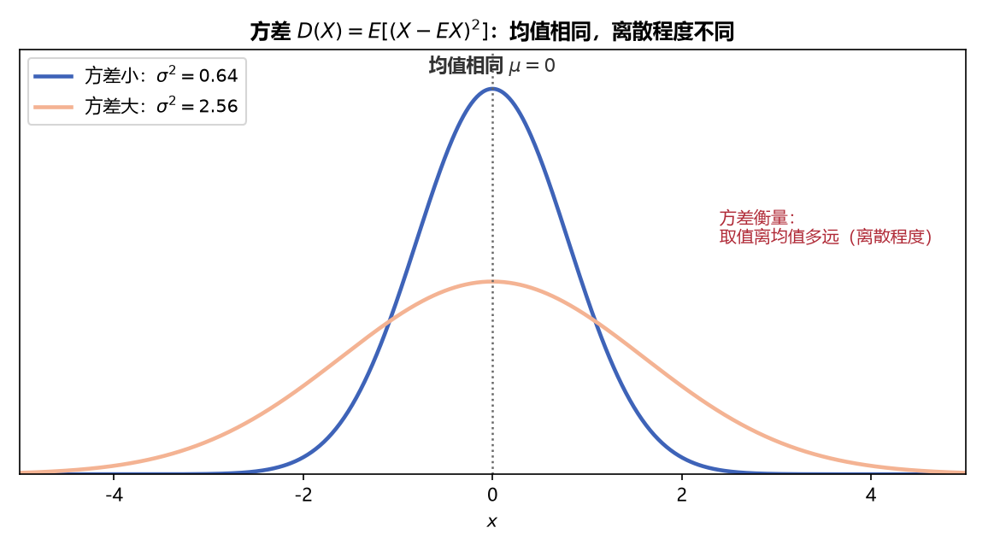
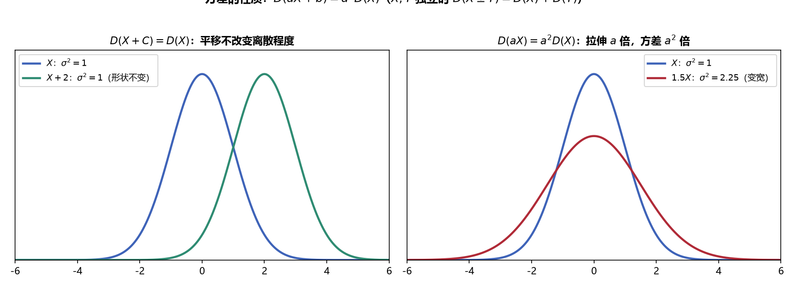
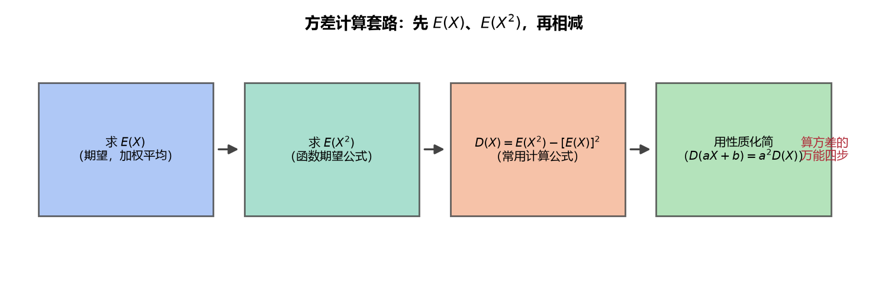
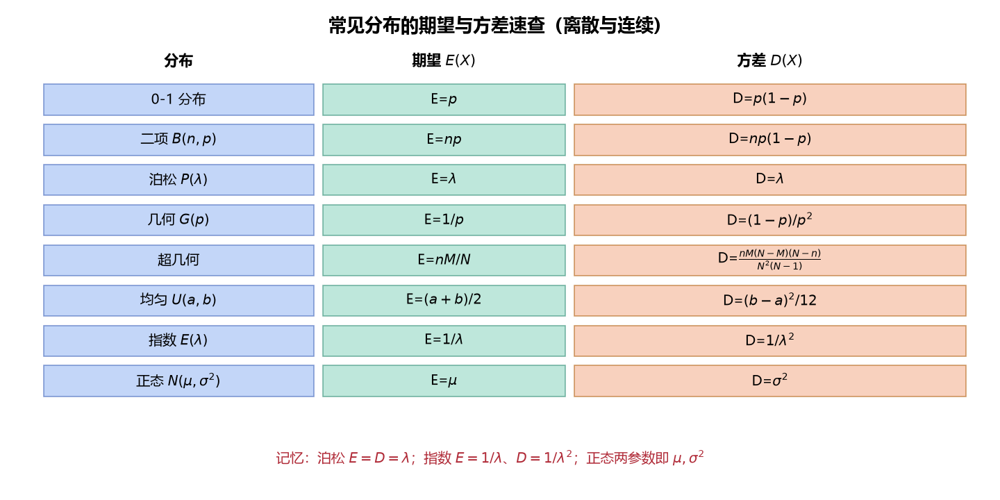

# 《概率论与数理统计》4.2 方差（p37-p40）

> 整理自 B 站《概率论与数理统计》教学视频 2.0 版本（up：宋浩老师官方）p37-p40。

> 整理自 B 站《概率论与数理统计》教学视频 2.0 版本（up：宋浩老师官方）p37-p40。

## 方差的定义（p37）

> 整理自 B 站《概率论与数理统计》教学视频 2.0 版本（up：宋浩老师官方）p37。
> 前置：p33 期望定义、p34 函数期望、p36 期望性质。

### 一、 为什么需要方差（引例）

两个学生平均分都是 60：

- 甲每次都考 60，非常稳定；
- 乙一次 30、一次 90、一次 30、一次 90……平均也是 60，但**起伏巨大**。

**期望只描述"平均位置"，描述不了"波动大小"**。判断"谁更靠谱"，需要衡量取值离均值有多远——这就是方差要干的事。

### 二、 方差的定义与含义

**定义**：设 $X$ 为随机变量，若 $E(X-EX)^2$ 存在，则称

$$D(X)=E\big(X-E(X)\big)^2$$

为 $X$ 的**方差**，其中 $X-EX$ 称为**离差**（取值到均值的距离，可正可负）。

**为什么用平方不用绝对值**：离差有正有负，直接取期望正负相消（$E(X-EX)=0$）；取平方既消除符号，又比绝对值好求导、好运算。

**性质与含义**：

1. $D(X)\ge 0$（平方的期望非负）；
2. $D(X)$ 越大 → 取值越分散、波动越大；$D(X)$ 越小 → 取值越集中在 $EX$ 附近；
3. **标准差** $\sigma(X)=\sqrt{D(X)}$：方差把量纲平方了（米→平方米），开根号还原量纲，更方便比较。

> **期望 vs 方差**：期望管"在哪"（位置），方差管"多散"（离散程度）——两个独立的维度。

> **图5** 方差直观：均值相同但离散程度不同——方差衡量取值离均值多远（自绘）。

### 三、 重要计算公式：$D(X)=E(X^2)-(EX)^2$

把 $D(X)=E(X-EX)^2$ 展开：

$$D(X)=E(X^2-2X\cdot EX+(EX)^2)=E(X^2)-2EX\cdot EX+(EX)^2=E(X^2)-(EX)^2$$

**结论（计算用主力公式）**：

$$\boxed{\,D(X)=E(X^2)-\big(E(X)\big)^2\,}$$

**白话解读**：求方差只需干两件事——① 求 $E(X)$；② 求 $E(X^2)$，然后"平方的期望 减 期望的平方"。

> **易错点（记号）**：$E(X^2)$ 是"$X$ 先平方再求期望"；$(EX)^2$ 是"$X$ 先求期望再平方"。位置别搞反——**中间是减号，谁减谁很关键**。

### 四、 标准化

对任意随机变量 $X$（不限于正态），定义标准化变量

$$X^*=\frac{X-E(X)}{\sqrt{D(X)}}=\frac{X-\mu}{\sigma}$$

则必有：

$$E(X^*)=0,\qquad D(X^*)=1$$

**白话解读**：把均值拉到 0、把波动缩放到 1——"去位置、去尺度"。任何分布标准化后都是"零均值单位方差"的形态，方便不同分布之间比较。

### 五、 例题（含常见分布）

**例一（0-1 分布）**：$X\sim B(1,p)$，即 $P\{X=1\}=p$，$P\{X=0\}=1-p$。

$$EX=0\times(1-p)+1\times p=p$$

$$E(X^2)=0^2\times(1-p)+1^2\times p=p$$

$$D(X)=E(X^2)-(EX)^2=p-p^2=p(1-p)=pq\quad(q=1-p)$$

**例二（泊松分布）**：$X\sim P(\lambda)$，则 $D(X)=\lambda$（推导繁琐，直接记结论）。

> 泊松分布有个有趣的性质：**期望 = 方差 = $\lambda$**。

**例三（一般密度，完整流程）**：$X$ 的密度 $f(x)=\begin{cases}3x^2, & 0\le x\le1\\0, & \text{其他}\end{cases}$，求 $D(X)$。

Step 1 求 $EX$：

$$EX=\int_0^1 x\cdot3x^2\,dx=\int_0^1 3x^3\,dx=\frac34$$

Step 2 求 $E(X^2)$：

$$E(X^2)=\int_0^1 x^2\cdot3x^2\,dx=\int_0^1 3x^4\,dx=\frac35$$

Step 3 代入公式：

$$D(X)=\frac35-\left(\frac34\right)^2=\frac35-\frac{9}{16}=\frac{48-45}{80}=\frac{3}{80}$$

**例四（正态分布）**：$X\sim N(\mu,\sigma^2)$，则

$$E(X)=\mu,\qquad D(X)=\sigma^2$$

> 至此正态的两个参数完全揭开：$\mu$ 是均值（对称轴位置），$\sigma^2$ 是方差（胖瘦/分散程度）。

---

### 本节重点

> - **定义**：$D(X)=E(X-EX)^2$（离差平方的期望），恒 $\ge 0$；标准差 $\sigma=\sqrt{D(X)}$ 还原量纲。
> - **计算公式**：$D(X)=E(X^2)-(EX)^2$——先算 $EX$ 和 $E(X^2)$ 再相减。
> - **含义**：方差大→波动大、分散；方差小→集中。期望管位置、方差管分散。
> - **标准化**：$X^*=(X-\mu)/\sigma$ 满足 $EX^*=0$、$DX^*=1$。
> - **常见分布**：0-1 分布 $D=p(1-p)$；泊松 $D=\lambda$（= 期望）；正态 $D=\sigma^2$；均匀/指数/二项在 **p40** 汇总表。
> - **常见坑**：$E(X^2)\neq(EX)^2$；求方差必须先求 $EX$ 和 $E(X^2)$ 两个量。

---

## 方差的性质（p38）

> 整理自 B 站《概率论与数理统计》教学视频 2.0 版本（up：宋浩老师官方）p38。
> 前置：p36 期望性质、p37 方差定义。

### 一、 方差性质总览

设 $C,a,b$ 为常数，$X,Y$ 为随机变量：

| 性质 | 公式 | 条件 |
|---|---|---|
| 1. 常数 | $D(C)=0$ | 无条件 |
| 2. 数乘 | $D(CX)=C^2D(X)$ | 无条件 |
| 2'. 平移 | $D(X+C)=D(X)$ | 无条件 |
| 2''. 线性 | $D(aX+b)=a^2D(X)$ | 无条件 |
| 3. 加减 | $D(X\pm Y)=D(X)+D(Y)$ | **必须 $X,Y$ 独立**（注意是加号！） |
| 4. 一般情形 | $D(X\pm Y)=D(X)+D(Y)\pm2\,\mathrm{Cov}(X,Y)$ | 任意变量 |
| 5. 退化 | $D(X)=0\iff P\{X=EX\}=1$ | 无条件 |

### 二、 性质的直观理解

- **$D(C)=0$**：常数恒等于自己，毫无波动。
- **$D(CX)=C^2D(X)$**：把所有人的身高都放大 $C$ 倍，人与人之间的差距也放大 $C$ 倍，而方差是"差距的平方"，所以系数**平方**后提出——**不是 $C$，是 $C^2$**。
- **$D(X+C)=D(X)$**：给所有人都垫上同样高的砖头，**大家同步上移，差距不变**——所以平移不改变方差。
- **$D(X\pm Y)=D(X)+D(Y)$（独立时）**：注意不管 $X+Y$ 还是 $X-Y$，**方差都是相加**——波动只会叠加，不会相减（这就是"风险不可对冲"的数学表达）。

> **证明要点**：$D(aX+b)=E(aX+b)^2-[E(aX+b)]^2=a^2E(X^2)-a^2(EX)^2=a^2D(X)$，即"期望里系数直接提，方差里系数提平方"。

> **图6** 方差性质直观：平移不改变离散程度；伸缩 $a$ 倍方差变 $a^2$ 倍（自绘）。

### 三、 重要推论

**推论 1（独立线性组合）**：若 $X_1,\dots,X_n$ 相互独立，则

$$D(a_1X_1+a_2X_2+\cdots+a_nX_n)=a_1^2D(X_1)+a_2^2D(X_2)+\cdots+a_n^2D(X_n)$$

（前面系数是**加还是减**都不影响——最终都是加号，系数一律平方。）

**推论 2（样本均值，iid 情形）**：若 $X_1,\dots,X_n$ 独立且同分布（均值为 $\mu$、方差为 $\sigma^2$），记 $\bar{X}=\dfrac{X_1+\cdots+X_n}{n}$，则

$$D(\bar{X})=D\left(\frac{X_1+\cdots+X_n}{n}\right)=\frac{1}{n^2}\cdot n\sigma^2=\frac{\sigma^2}{n}$$

**白话解读**：取 $n$ 个独立同分布数据求平均，均值 $\bar X$ 的期望还是 $\mu$，但**方差缩小为原来的 $1/n$**——样本量越大，样本均值越稳定地靠近总体均值。这是**大数定律（p45）和区间估计（p54）的核心基础**。

### 四、 协方差的引出

对**任意**（可能不独立）的 $X,Y$，展开 $D(X\pm Y)$ 会多出一项：

$$D(X\pm Y)=D(X)+D(Y)\pm2\big[E(XY)-E(X)E(Y)\big]$$

记

$$\mathrm{Cov}(X,Y)=E\big[(X-EX)(Y-EY)\big]=E(XY)-E(X)E(Y)$$

为 $X,Y$ 的**协方差**（4.3 正式展开）。当 $X,Y$ 独立时 $\mathrm{Cov}(X,Y)=0$，上式退化为性质 3。

> **顺带结论**：$X,Y$ 独立 $\Rightarrow$ $\mathrm{Cov}(X,Y)=0$；但反过来不成立（协方差为 0 只能说明"线性不相关"）。

### 五、 期望性质 vs 方差性质（对比表）

| 运算法则 | 期望 $E$ | 方差 $D$ |
|---|---|---|
| 常数 | $E(C)=C$ | $D(C)=0$ |
| 线性 | $E(aX+b)=aEX+b$ | $D(aX+b)=a^2D(X)$ |
| 加减 | $E(X\pm Y)=EX\pm EY$（**无条件**） | $D(X\pm Y)=DX+DY$（**需独立**） |
| 乘积 | $E(XY)=EX\cdot EY$（需独立） | **没有** $D(XY)$ 的简单公式 |
| 系数外提 | 直接提 | **提平方** |

> **核心差异一句话**：期望"线性"（系数直提、加减直拆），方差"非线性"（系数提平方、加减需独立且只能相加）。

---

### 本节重点

> - **方差性质**：$D(C)=0$、$D(aX+b)=a^2DX$、独立时 $D(X\pm Y)=DX+DY$（都是加号）。
> - **系数外提要平方**——这是和期望最大的不同（$E$ 直提、$D$ 提平方）。
> - **样本均值**：iid 时 $D(\bar X)=\sigma^2/n$，均值比单次观测稳定 $n$ 倍。
> - **协方差引路**：$D(X\pm Y)=DX+DY\pm2\mathrm{Cov}(X,Y)$，$\mathrm{Cov}(X,Y)=E(XY)-EX\cdot EY$（p41 详讲）。
> - **常见坑**：① $D(X-Y)=DX+DY$（还是加号，别写成减）；② 不独立时不能直接 $DX+DY$；③ $D(2X)\neq2D(X)$，是 $4D(X)$。

---

## 方差的例题（p39）

> 整理自 B 站《概率论与数理统计》教学视频 2.0 版本（up：宋浩老师官方）p39。
> 前置：p36 期望性质、p38 方差性质、p37 方差定义。

### 一、 例五：二项分布的期望与方差

**问题**：$X\sim B(n,p)$，求 $E(X)$ 与 $D(X)$。

**思路（拆成 n 个 0-1 分布）**：一次试验成功记为 1、失败记为 0。设 $X_i=\begin{cases}1, & \text{第 } i \text{ 次成功}\\0, & \text{第 } i \text{ 次失败}\end{cases}$，则 $X_1,\dots,X_n$ 独立同分布（0-1 分布），且

$$X=X_1+X_2+\cdots+X_n$$

由 p37 例一：$E(X_i)=p$，$D(X_i)=p(1-p)$。

**求期望**（期望的加法**无需独立**）：

$$E(X)=E(X_1)+\cdots+E(X_n)=np$$

**求方差**（方差的加法**需要独立**，这里满足）：

$$D(X)=D(X_1)+\cdots+D(X_n)=np(1-p)=npq$$

**结论（必记）**：

$$\boxed{\,X\sim B(n,p)\ \Rightarrow\ E(X)=np,\quad D(X)=npq\,}$$

> **重要对比**：$E(\sum X_i)=\sum E(X_i)$ 无条件成立；$D(\sum X_i)=\sum D(X_i)$ **必须独立**——做"和/差的期望"和"和/差的方差"时先问自己一句：独立吗？

> **图7** 方差计算万能四步：先 $E(X)$、$E(X^2)$，再相减；复杂问题用性质化简（自绘）。

### 二、 例六：线性变换的期望方差（考试典型）

**问题**：$X\sim N(1,4)$，$Y=2X+3$，求 $E(Y)$、$D(Y)$。

**期望**（线性：系数直提、常数直加）：

$$E(Y)=E(2X+3)=2E(X)+3=2\times1+3=5$$

**方差**（砖头没影响、系数提平方）：

$$D(Y)=D(2X+3)=2^2D(X)=4\times4=16$$

> **易错点**：$D(2X+3)$ 的 $3$ 直接消失（平移不改波动），系数 $2$ 变 $4$（平方）。如果写成 $D(2X)+D(3)$ 就错了——$D(3)=0$ 倒是没错，但 $D(2X)=4D(X)$ 的"4"最容易被漏掉。

### 三、 例七：综合题（独立二维离散型）

**问题**：$X$ 取 $1,2$，概率 $0.5,0.5$；$Y$ 取 $0,1,2$，概率 $0.3,0.3,0.4$；$X,Y$ 独立。求 $E(XY)$、$D(X-Y)$、$D(2X+3Y)$。

**Step 1：先算各自的期望与方差**

| 量 | 计算 | 结果 |
|---|---|---|
| $EX$ | $1\times0.5+2\times0.5$ | 1.5 |
| $E(X^2)$ | $1^2\times0.5+2^2\times0.5$ | 2.5 |
| $DX=E(X^2)-(EX)^2$ | $2.5-1.5^2$ | 0.25 |
| $EY$ | $0\times0.3+1\times0.3+2\times0.4$ | 1.3 |
| $E(Y^2)$ | $0^2\times0.3+1^2\times0.3+2^2\times0.4$ | 2.3 |
| $DY=E(Y^2)-(EY)^2$ | $2.3-1.3^2$ | 0.61 |

**Step 2：套性质**

**(1) $E(XY)$**（乘积期望分开**需要独立**，题目已给）：

$$E(XY)=E(X)E(Y)=1.5\times1.3=1.95$$

**(2) $D(X-Y)$**（方差加减分开**需要独立**；注意**加号**）：

$$D(X-Y)=D(X)+D(Y)=0.25+0.61=0.86$$

> **易错点**：$D(X-Y)$ 中间是**加号**，写成 $DX-DY$ 就错了——波动只会叠加不会相减。

**(3) $D(2X+3Y)$**（独立 → 分开；系数平方）：

$$D(2X+3Y)=2^2D(X)+3^2D(Y)=4\times0.25+9\times0.61=1+5.49=6.49$$

---

### 本节重点

> - **二项分布**：$E=np$、$D=npq$（拆成 $n$ 个独立 0-1 分布推导）。
> - **线性变换**：$E(aX+b)=aEX+b$；$D(aX+b)=a^2DX$（$b$ 消失、$a$ 平方）。
> - **独立才有方差加法**：$D(X\pm Y)=DX+DY$（中间恒为加号）；$E(X\pm Y)=EX\pm EY$ 无需独立。
> - **解题流程**：先分别求出 $EX,EY$（以及 $E(X^2),E(Y^2)$ 得到 $DX,DY$），再逐问套性质。
> - **常见坑**：① $D(X-Y)$ 写成减号；② $D(2X+3Y)$ 漏掉系数平方；③ 不独立硬拆方差。

---

## 常见分布的期望和方差（p40）

> 整理自 B 站《概率论与数理统计》教学视频 2.0 版本（up：宋浩老师官方）p40。
> 前置：p37-p39 方差定义/性质/例题；p11 常见离散分布；p14/p15 常见连续分布。

### 一、 总表（必背）

| 分布 | 分布律 / 密度 | $E(X)$ | $D(X)$ |
|---|---|---|---|
| 0-1 分布 $B(1,p)$ | $P\{X=k\}=p^k(1-p)^{1-k}$，$k=0,1$ | $p$ | $p(1-p)$ |
| 二项分布 $B(n,p)$ | $P\{X=k\}=C_n^k p^k(1-p)^{n-k}$ | $np$ | $np(1-p)$ |
| 泊松分布 $P(\lambda)$ | $P\{X=k\}=\dfrac{\lambda^k}{k!}e^{-\lambda}$ | $\lambda$ | $\lambda$ |
| 几何分布 $G(p)$ | $P\{X=k\}=(1-p)^{k-1}p$，$k=1,2,\dots$ | $\dfrac1p$ | $\dfrac{1-p}{p^2}$ |
| 均匀分布 $U(a,b)$ | $f(x)=\dfrac1{b-a}$，$a\le x\le b$ | $\dfrac{a+b}{2}$ | $\dfrac{(b-a)^2}{12}$ |
| 指数分布 $Exp(\lambda)$ | $f(x)=\lambda e^{-\lambda x}$，$x>0$ | $\dfrac1\lambda$ | $\dfrac1{\lambda^2}$ |
| 正态分布 $N(\mu,\sigma^2)$ | $f(x)=\dfrac1{\sqrt{2\pi}\sigma}e^{-\frac{(x-\mu)^2}{2\sigma^2}}$ | $\mu$ | $\sigma^2$ |

（超几何分布公式复杂且少考，一般不用记。）

> **图8** 常见分布期望方差速查：离散与连续各分布 $E$、$D$ 一览（自绘）。

### 二、 记忆技巧

1. **泊松分布最特别**：$E=D=\lambda$——期望方差相等，一眼认出。
2. **0-1 与二项**：0-1 是 $p$ 与 $pq$；二项是 $np$ 与 $npq$——"次数越多，均值方差同比例放大 $n$ 倍"。
3. **几何分布**：首次成功所需次数，平均要试 $1/p$ 次；方差 $(1-p)/p^2$。
4. **均匀分布**：期望是**区间中点** $(a+b)/2$；方差是**区间长度平方除以 12**。
5. **指数分布**：期望 $1/\lambda$、方差 $1/\lambda^2$——"都是 $\lambda$ 的倒数"（与泊松恰好相反）。
6. **正态分布**：两个参数本身就是期望与方差，$\mu$ 管位置、$\sigma^2$ 管胖瘦。

> **离散 vs 连续对照**：离散分布参数多为 $p$（成功概率），连续分布参数多为 $\lambda$（速率/尺度）。把 0-1/二项/泊松/几何当成一组、均匀/指数/正态当成一组分别记，不容易混。

### 三、 两个推导示范

**几何分布的期望（幂级数求和技巧）**：

$$E(X)=\sum_{k=1}^{\infty}k(1-p)^{k-1}p=p\sum_{k=1}^{\infty}k x^{k-1}\Big|_{x=1-p}$$

利用 $\sum_{k=1}^{\infty}x^k=\dfrac{x}{1-x}\ (|x|<1)$ 求导：$\sum kx^{k-1}=\left(\dfrac{x}{1-x}\right)'=\dfrac1{(1-x)^2}$，代入 $x=1-p$：

$$E(X)=p\cdot\frac1{p^2}=\frac1p$$

**均匀分布的期望**：

$$E(X)=\int_a^b x\cdot\frac1{b-a}\,dx=\frac{1}{b-a}\cdot\frac{b^2-a^2}{2}=\frac{a+b}{2}$$

直观上均匀分布在 $[a,b]$ 上对称，平均位置自然是中点。

---

### 本节重点

> - **必背总表**：七种常见分布的 $E$ 和 $D$（超几何除外），考试直接调用。
> - **特色记忆**：泊松 $E=D=\lambda$；二项 $E=np,\ D=npq$；均匀 $E=$ 中点、$D=(b-a)^2/12$；指数 $E=1/\lambda,\ D=1/\lambda^2$；正态参数即期望方差。
> - **常用技巧**：几何分布期望用幂级数 $\sum kx^{k-1}=1/(1-x)^2$ 求和。
> - **常见坑**：① 均匀方差忘除以 12；② 指数/几何的 $E$ 与 $D$ 混淆；③ 泊松被 $e$ 误导以为是连续型（它是离散型，$k$ 取非负整数）。

---

---

---

## 教材深化（《统计学完全教程》第3章）

> 整理自《统计学完全教程》(L. Wasserman) 第3章，为教材比原笔记更深的内容。

> 整理自《统计学完全教程》(L. Wasserman) 第3章，为教材比原笔记更深的内容。

> 整理自《统计学完全教程》(L. Wasserman) 第3章，为教材比原笔记更深的内容。

### 四、 常用分布的均值方差总表（教材汇总）

| 分布 | 均值 | 方差 |
|---|---|---|
| 点质量 $\delta_a$ | $a$ | 0 |
| Bernoulli$(p)$ | $p$ | $p(1-p)$ |
| Binomial$(n,p)$ | $np$ | $np(1-p)$ |
| Geometric$(p)$ | $1/p$ | $(1-p)/p^2$ |
| Poisson$(\lambda)$ | $\lambda$ | $\lambda$ |
| Uniform$(a,b)$ | $(a+b)/2$ | $(b-a)^2/12$ |
| Normal$(\mu,\sigma^2)$ | $\mu$ | $\sigma^2$ |
| Exp$(\beta)$ | $\beta$ | $\beta^2$ |
| Gamma$(\alpha,\beta)$ | $\alpha\beta$ | $\alpha\beta^2$ |
| Beta$(\alpha,\beta)$ | $\frac{\alpha}{\alpha+\beta}$ | $\frac{\alpha\beta}{(\alpha+\beta)^2(\alpha+\beta+1)}$ |
| $t_\nu$ | 0（$\nu>1$） | $\frac{\nu}{\nu-2}$（$\nu>2$） |
| $\chi^2_p$ | $p$ | $2p$ |
| Multinomial$(n,p)$ | $np$ | 见下节 |

> 提示技巧：算 Poisson 方差先算 $E\big(X(X-1)\big)$ 再代 $V(X)=E[X(X-1)]+\mu-\mu^2$。
