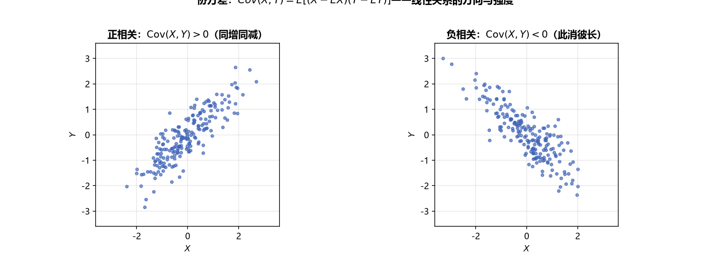

# 《概率论与数理统计》4.3 协方差 - 笔记

> 整理自 B 站《概率论与数理统计》教学视频 2.0 版本（up：宋浩老师官方）p41。
> 前置：p36 期望性质、p38 方差性质、p35 二维期望。

## 目录

- [一、 协方差的定义](#一-协方差的定义)
- [二、 协方差与方差的关系](#二-协方差与方差的关系)
- [三、 独立与协方差（重要逻辑）](#三-独立与协方差重要逻辑)
- [四、 协方差的性质](#四-协方差的性质)
- [五、 例题](#五-例题)
- [本节重点](#本节重点)

---

## 一、 协方差的定义

**定义**：设 $(X,Y)$ 为二维随机变量，称

$$\mathrm{Cov}(X,Y)=E\big[(X-EX)(Y-EY)\big]$$

为 $X$ 与 $Y$ 的**协方差**（"混合离差乘积的期望"）。

**计算用公式**（展开即得，比定义好算）：

$$\mathrm{Cov}(X,Y)=E(XY)-E(X)E(Y)$$

**白话解读**：方差度量"自己离均值多远"，协方差度量"两个变量**一起**离各自均值多远"。两个都偏大（或都偏小）→ 协方差为正；一偏大另一偏小 → 为负。

> **图9** 协方差直观：正相关（同增同减）协方差为正，负相关（此消彼长）为负（自绘）。

## 二、 协方差与方差的关系

**自己跟自己的协方差就是方差**：

$$\mathrm{Cov}(X,X)=E\big[(X-EX)^2\big]=D(X)$$

**方差与协方差（呼应 p38 性质 4）**：

$$D(X\pm Y)=D(X)+D(Y)\pm 2\,\mathrm{Cov}(X,Y)$$

> 所以当 $X,Y$ 独立时 $\mathrm{Cov}=0$，上式退化为 $D(X\pm Y)=DX+DY$——独立只是"协方差项消失"的特例。

## 三、 独立与协方差（重要逻辑）

$$X,Y\ \text{独立}\ \Rightarrow\ \mathrm{Cov}(X,Y)=0$$

$$\mathrm{Cov}(X,Y)\neq0\ \Rightarrow\ X,Y\ \text{不独立}$$

$$\mathrm{Cov}(X,Y)=0\ \not\Rightarrow\ X,Y\ \text{独立}\quad(\text{反方向不成立！})$$

**证明第一行**：展开 $\mathrm{Cov}(X,Y)=E(XY)-EX\cdot EY$，独立时 $E(XY)=EX\cdot EY$，相减为 0。

> **记忆红线**：**独立 ⇒ 协方差为 0；协方差为 0 ⇏ 独立**。协方差只捕捉"线性关系"，两个变量可能有复杂的非线性关系（如 $Y=X^2$）而协方差仍为 0。

## 四、 协方差的性质

设 $a,b$ 为常数：

| 性质 | 公式 |
|---|---|
| 1. 对称性 | $\mathrm{Cov}(X,Y)=\mathrm{Cov}(Y,X)$ |
| 2. 双线性 | $\mathrm{Cov}(aX,bY)=ab\,\mathrm{Cov}(X,Y)$ |
| 3. 可加性 | $\mathrm{Cov}(X_1+X_2,\,Y)=\mathrm{Cov}(X_1,Y)+\mathrm{Cov}(X_2,Y)$ |
| | $\mathrm{Cov}(X,\,Y_1+Y_2)=\mathrm{Cov}(X,Y_1)+\mathrm{Cov}(X,Y_2)$ |
| 4. 与常数 | $\mathrm{Cov}(X,b)=\mathrm{Cov}(a,Y)=0$ |

**白话解读**：协方差像"期望"一样是**线性运算**——系数直接提出（不平方！）、括号直接拆开；随机变量与常数无协方差。

> **对比提醒**：期望中系数直提；方差中系数提平方；协方差中系数**也直提**（$\mathrm{Cov}(aX,bY)=ab\mathrm{Cov}$，不平方）。

## 五、 例题

**例一（离散型，说明"协方差为 0 但不独立"）**：$(X,Y)$ 的联合分布：

| $X\backslash Y$ | -1 | 0 | 1 |
|---|---|---|---|
| -1 | 1/8 | 0 | 1/8 |
| 0 | 0 | 2/8 | 0 |
| 1 | 1/8 | 0 | 1/8 |

（行和列和均为 $3/8,2/8,3/8$，$X,Y$ 边缘分布相同且对称。）

$$EX=(-1)\cdot\frac38+0+1\cdot\frac38=0,\qquad EY=0$$

$$E(XY)=(-1)(-1)\cdot\frac18+(-1)(1)\cdot\frac18+(1)(-1)\cdot\frac18+(1)(1)\cdot\frac18=0$$

$$\mathrm{Cov}(X,Y)=E(XY)-EX\cdot EY=0$$

**但 $X,Y$ 不独立**：$P\{X=-1\}P\{Y=-1\}=\frac38\cdot\frac38=\frac9{64}\neq\frac18=P\{X=-1,Y=-1\}$。协方差为 0 推不出独立——经典反例。

**例三（连续型，圆域均匀分布）**：$(X,Y)$ 在圆域 $x^2+y^2\le R^2$ 上均匀分布，$f(x,y)=\dfrac1{\pi R^2}$。

- 边缘密度对称 → $EX=0$，$EY=0$（奇函数积分）；
- $E(XY)=\iint xy\cdot\frac1{\pi R^2}dxdy=0$（极坐标下 $\int_0^{2\pi}\cos\theta\sin\theta\,d\theta=0$，或由二重积分对称性）。

所以 $\mathrm{Cov}(X,Y)=0$；但 $f(x,y)\neq f_X(x)f_Y(y)$（左边是常数、右边含 $x,y$），**不独立**——又一次说明"协方差为 0 ⇏ 独立"。

> **易错点**：① 二重积分对称性/极坐标不熟时，老老实实转极坐标：$\iint$ 要乘 $r$，$x=r\cos\theta,\ y=r\sin\theta$；② 判断独立用联合分布/联合密度，**不能**用协方差是否为 0。

---

## 本节重点

> - **定义与公式**：$\mathrm{Cov}(X,Y)=E[(X-EX)(Y-EY)]=E(XY)-EX\cdot EY$；$\mathrm{Cov}(X,X)=D(X)$。
> - **逻辑红线**：独立 ⇒ $\mathrm{Cov}=0$；$\mathrm{Cov}\ne0$ ⇒ 不独立；$\mathrm{Cov}=0$ **推不出**独立。
> - **性质**：对称、双线性（系数直提）、可加、与常数为 0；$D(X\pm Y)=DX+DY\pm2\mathrm{Cov}$。
> - **常见坑**：① 用"协方差为 0"当独立证据；② 协方差系数提平方（应直提）；③ 二维连续型算 $E(XY)$ 忘了极坐标乘 $r$。

---

## 教材深化（《统计学完全教程》第3章）

> 整理自《统计学完全教程》(L. Wasserman) 第3章，为教材比原笔记更深的内容。

### 六、 多项分布的协方差：Cov=-n·pi·pj

$X\sim\text{Multinomial}(n,p)$，则 $\mathbb E(X)=np$，且
$$\text{Cov}(X_i,X_j)=-np_ip_j\quad(i\ne j)$$

**推导**：边缘 $X_i\sim\text{Binomial}(n,p_i)$，且 $X_i+X_j\sim\text{Binomial}(n,p_i+p_j)$。两边用方差加法公式：
$$V(X_i+X_j)=V(X_i)+V(X_j)+2\text{Cov}(X_i,X_j)$$
与 $n(p_i+p_j)(1-p_i-p_j)$ 比较即得。直觉：多抽到第 $i$ 色，第 $j$ 色就少了——所以协方差为负。

---

## 《概率论与数理统计》4.3 相关系数 - 笔记

> 整理自 B 站《概率论与数理统计》教学视频 2.0 版本（up：宋浩老师官方）p42。
> 前置：p41 协方差、p37/p38 方差定义与性质。

## 目录

- [一、 相关系数的定义](#一-相关系数的定义)
- [二、 两个常用公式](#二-两个常用公式)
- [三、 相关系数的性质](#三-相关系数的性质)
- [四、 独立与不相关（最重要逻辑）](#四-独立与不相关最重要逻辑)
- [五、 例题](#五-例题)
- [本节重点](#本节重点)

---

## 一、 相关系数的定义

$$\rho_{XY}=\frac{\mathrm{Cov}(X,Y)}{\sqrt{D(X)}\sqrt{D(Y)}}$$

即"协方差 除以 两个标准差之积"——把协方差**标准化**，消除量纲影响。

**标准化视角**：设 $X^*=\dfrac{X-EX}{\sqrt{DX}}$，$Y^*=\dfrac{Y-EY}{\sqrt{DY}}$，则

$$\mathrm{Cov}(X^*,Y^*)=\rho_{XY}$$

> 白话：相关系数就是"标准化后的两个变量"的协方差——它是**无量纲**的协方差，方便跨问题比较。

> **图10** 相关系数直观：$|\rho|$ 越接近 1 数据越贴近直线；$|\rho|$ 小则线性关系弱（自绘）。

## 二、 两个常用公式

**公式 1（方差 ⇄ 相关系数）**：

$$D(X\pm Y)=D(X)+D(Y)\pm 2\,\rho_{XY}\sqrt{D(X)}\sqrt{D(Y)}$$

**公式 2（线性组合）**：

$$D(aX\pm bY)=a^2D(X)+b^2D(Y)\pm 2ab\,\rho_{XY}\sqrt{D(X)}\sqrt{D(Y)}$$

**逆用**：已知 $\rho$ 求 $\mathrm{Cov}$：

$$\mathrm{Cov}(X,Y)=\rho_{XY}\sqrt{D(X)}\sqrt{D(Y)}$$

## 三、 相关系数的性质

1. **有界性**：$|\rho_{XY}|\le 1$；
2. **完全线性相关**：$|\rho_{XY}|=1\iff P\{Y=aX+b\}=1$（以概率 1 呈线性关系）：
   - $\rho=1$：$a>0$，完全**正**相关（同增同减）；
   - $\rho=-1$：$a<0$，完全**负**相关（一增一减）；
3. **$\rho=0$ 称"不相关"**：仅指**没有线性关系**（可能有非线性关系，如 $Y=X^2$、$Y=e^X$）。

**白话解读**：$\rho$ 衡量的是"线性关系的强弱"——越接近 $\pm1$ 越接近一条直线，$\rho=0$ 只是"不像直线"，不代表"没关系"。

## 四、 独立与不相关（最重要逻辑）

$$\text{独立}\ \Rightarrow\ \text{不相关}\qquad\text{不相关}\ \not\Rightarrow\ \text{独立}$$

- 独立：没有任何关系（无线也无非线性）；
- 不相关：只是**没有线性关系**，可能有非线性关系。

**唯一的例外——二维正态分布**：若 $(X,Y)$ 服从二维正态分布，则

$$\text{独立}\iff\rho=0\iff\text{不相关}$$

（二维正态中独立与不相关**等价**——这是考试最爱考的特殊情形。）

> **记忆**：对一般分布，"独立"强于"不相关"；只有二维正态两者等价。看到"判断是否独立/相关"，先问：是不是二维正态？

## 五、 例题

**例四（离散型，抽产品）**：100 件产品中一等品 80、二等品 10、三等品 10，任取一件。$X_i=\begin{cases}1, & \text{抽到 } i \text{ 等品}\\0, & \text{否则}\end{cases}$，求 $\rho_{X_1X_2}$。

关键：**一次只能抽到一种等级**，所以 $P\{X_1=1,X_2=1\}=0$。联合分布：

| $X_1\backslash X_2$ | 0 | 1 |
|---|---|---|
| 0 | 0.1（三等） | 0.1（二等） |
| 1 | 0.8（一等） | 0（不可能） |

边缘分布：$X_1$：$0.2,0.8$；$X_2$：$0.9,0.1$。

$$EX_1=0.8,\quad EX_2=0.1,\quad E(X_1X_2)=1\times1\times0+0=0$$

$$\mathrm{Cov}(X_1,X_2)=0-0.8\times0.1=-0.08$$

$$D(X_1)=E(X_1^2)-(EX_1)^2=0.8-0.64=0.16,\quad D(X_2)=0.1-0.01=0.09$$

$$\rho_{X_1X_2}=\frac{-0.08}{\sqrt{0.16}\sqrt{0.09}}=\frac{-0.08}{0.4\times0.3}=-\frac23$$

（抽到一等品与抽到二等品天然"此消彼长"，相关系数为负。）

**例五（连续型，三角形区域均匀分布）**：$(X,Y)$ 在区域 $D=\{(x,y):0\le x\le1,\ 0\le y\le1,\ y\ge x\}$ 上均匀，$f(x,y)=2$（面积 $1/2$ 的倒数）。

- 边缘密度：$f_X(x)=2(1-x)\ (0<x<1)$，$f_Y(y)=2y\ (0<y<1)$；
- $EX=\int_0^1 x\cdot2(1-x)dx=\dfrac13$，$EY=\int_0^1 y\cdot2y\,dy=\dfrac23$；
- $E(X^2)=\int_0^1 x^2\cdot2(1-x)dx=\dfrac16$，$E(Y^2)=\int_0^1 y^2\cdot2y\,dy=\dfrac12$；
- $D(X)=\dfrac16-\dfrac19=\dfrac1{18}$，$D(Y)=\dfrac12-\dfrac49=\dfrac1{18}$；
- $E(XY)=\int_0^1\int_x^1 xy\cdot2\,dy\,dx=\dfrac14$；
- $\mathrm{Cov}(X,Y)=\dfrac14-\dfrac13\cdot\dfrac23=\dfrac1{36}$；
- $\rho_{XY}=\dfrac{1/36}{\sqrt{1/18}\sqrt{1/18}}=\dfrac12$。

**例六（用 $\rho$ 反推方差）**：$X\sim N(1,4)$，$Y\sim Exp(\lambda)$ 且 $D(Y)=4$，$\rho_{XY}=0.4$，求 $D(3X-2Y)$。

$$\mathrm{Cov}(X,Y)=\rho\sqrt{DX}\sqrt{DY}=0.4\times2\times2=1.6$$

$$D(3X-2Y)=3^2D(X)+2^2D(Y)-2\cdot3\cdot2\cdot\mathrm{Cov}(X,Y)=36+16-19.2=32.8$$

**例七（只给矩与 $\rho$）**：$E(X)=0,\ E(Y)=0,\ E(X^2)=2,\ E(Y^2)=2,\ \rho=0.5$，求 $E(X+Y)^2$。

$$E(X+Y)^2=E(X^2)+2E(XY)+E(Y^2)$$

由 $\mathrm{Cov}(X,Y)=\rho\sqrt{DX}\sqrt{DY}$，其中 $DX=2-0=2$，$DY=2$，故 $\mathrm{Cov}=0.5\times2=2\times0.5=1$？——注意 $\sqrt2\times\sqrt2=2$，$\mathrm{Cov}=0.5\times2=1$，又 $\mathrm{Cov}=E(XY)-EX\cdot EY=E(XY)$，所以 $E(XY)=1$：

$$E(X+Y)^2=2+2\times1+2=6$$

> **易错点**：① $E(XY)$ 要用 $\rho$、$\sqrt{DX}\sqrt{DY}$、$EX\cdot EY$ 三者拼出来，缺一不可；② $D(3X-2Y)$ 中间是"减号时协方差项取负"（$D(aX-bY)=a^2DX+b^2DY-2ab\mathrm{Cov}$）；③ 二维正态中 $\rho=0$ 才可放心用独立结论。

---

## 本节重点

> - **定义**：$\rho=\dfrac{\mathrm{Cov}(X,Y)}{\sqrt{DX}\sqrt{DY}}$，无量纲；标准化变量的协方差就是 $\rho$。
> - **公式**：$D(X\pm Y)=DX+DY\pm2\rho\sqrt{DX}\sqrt{DY}$；$\mathrm{Cov}=\rho\sqrt{DX}\sqrt{DY}$。
> - **性质**：$|\rho|\le1$；$|\rho|=1$ 完全线性相关（$\rho=1$ 正、$-1$ 负）；$\rho=0$ 不相关=无线性关系。
> - **逻辑**：独立 ⇒ 不相关；不相关 ⇏ 独立；**二维正态例外：独立 ⇔ $\rho=0$**。
> - **常见坑**：① 把"不相关"当"独立"；② 忘了 $\mathrm{Cov}=\rho\sqrt{DX}\sqrt{DY}$ 的拼装；③ 二维正态之外用 $\rho=0$ 断言独立。
