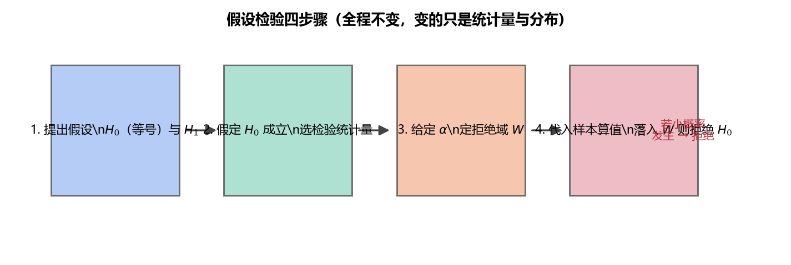

# 《概率论与数理统计》8.1 假设检验的基本概念 - 笔记

> 整理自 B 站《概率论与数理统计》教学视频 2.0 版本（up：宋浩老师官方）p57。
> 前置：p56 假设检验问题（七个例子）。

## 目录

- [一、 统计假设的分类](#一-统计假设的分类)
- [二、 假设检验的定义](#二-假设检验的定义)
- [三、 假设检验的两种问题](#三-假设检验的两种问题)
- [四、 检验过程](#四-检验过程)
- [本节重点](#本节重点)

---

## 一、 统计假设的分类

**统计假设**（简称假设）：关于总体分布的任何一种说法（一个式子，如 $\mu=10$）。

按"针对什么"分两类：

| 类型 | 针对对象 | 例子 |
|---|---|---|
| **参数假设** | 分布中的**参数** | $\mu=10$、$p>0.6$、$\mu_1=\mu_2$ |
| **非参数假设** | 分布的**类型** | "骰子服从均匀分布"、"总体是正态分布" |

> 本讲义（及大多数教材）**只讲参数假设检验**，即 $H_0,H_1$ 都是关于参数的论断。

按"提几个假设"又分：原假设/备择假设（另一角度，见下文）。

## 二、 假设检验的定义

**假设检验**：判断假设是否成立的方法（或过程）。

- 提出假设 → 用样本信息判断 → 接受或拒绝。

**两类检验问题**：

1. **显著性检验**：只提出一个假设 $H_0$，仅判断它是否成立（不研究对立面）；
2. **$H_0$ 对 $H_1$ 检验**：提出两个假设，**二者必居其一**——接受 $H_0$ 即拒绝 $H_1$，拒绝 $H_0$ 即接受 $H_1$。第 8 章主要讨论这类。

## 三、 假设检验的检验过程

一般教材把过程分**四步**，这里先建立骨架（后续各节填肉）：

**第一步：提出假设**——写出 $H_0$ 与 $H_1$（可只提一个，显著性检验）；
**第二步：构造检验统计量**——由样本构造、分布已知的统计量；
**第三步：确定拒绝域**——给定显著性水平 $\alpha$，定出"拒绝 $H_0$"的区域；
**第四步：下结论**——由样本观测值算出统计量值，落入拒绝域则拒绝 $H_0$（接受 $H_1$），否则接受 $H_0$。

> 白话：法官判案——"无罪推定"（$H_0$ 无罪），证据（样本）足够充分才判有罪（拒绝 $H_0$）；证据不足就维持无罪。

> **图2** 假设检验四步骤流程——全章所有检验（U/T/χ²/F）都套这套流程，变的只是统计量与分布（自绘）。

---

## 本节重点

> - **参数假设 vs 非参数假设**：前者针对参数（本讲义只讲这种），后者针对分布类型。
> - **假设检验 = 判断假设是否成立的过程**；四步：提假设 → 造统计量 → 定拒绝域 → 下结论。
> - **两类问题**：显著性检验（单个 $H_0$）与 $H_0/H_1$ 检验（二者必居其一）。
> - **核心观念**：$H_0$ 是"现状/无罪"，拒绝它需要充分证据（由样本说话）。
> - **常见坑**：把"接受 $H_0$"理解成"证明 $H_0$ 为真"——实际是"没有足够证据拒绝"，两者不等价。

---

## 教材深化（《统计学完全教程》第10章）

> 整理自《统计学完全教程》(L. Wasserman) 第10章，为教材比原笔记更深的内容。

### 一、 形式化：拒绝域、power、size

把参数空间分成 $\Theta_0$ 与 $\Theta_1$，检验 $H_0:\theta\in\Theta_0$ vs $H_1:\theta\in\Theta_1$。

- **拒绝域** $R\subset\mathcal X$：$X\in R$ 拒绝 $H_0$；通常 $R=\{X:\ T(X)>c\}$（$T$ 检验统计量、$c$ 临界值）。
- **两类错误**：$H_0$ 真却拒绝 = **I 型错误**；$H_1$ 真却保留 = **II 型错误**。
- **Power 函数**：$\beta(\theta)=\mathbb P_\theta(X\in R)$（每个 $\theta$ 下拒绝的概率）。
- **Size（显著性水平）**：$\alpha=\sup_{\theta\in\Theta_0}\beta(\theta)$——$H_0$ 内最大的 I 型错误概率；size ≤ α 的检验称 **level α** 检验。
- **简单假设**（$\theta=\theta_0$）vs **复合假设**（$\theta>\theta_0$ 等）；单侧/双侧检验。

**例**：$X_1,\dots,X_n\sim N(\mu,\sigma^2)$，$\sigma$ 已知，$H_0:\mu\le0$ vs $H_1:\mu>0$，拒绝域 $\bar X>c$。Power 函数 $\beta(\mu)=1-\Phi\!\left(\frac{\sqrt n(c-\mu)}{\sigma}\right)$ 随 $\mu$ 递增，size=$\beta(0)$，令其等于 $\alpha$ 解得 $c=\frac{\sigma\Phi^{-1}(1-\alpha)}{\sqrt n}$——即拒绝 $\sqrt n(\bar X-0)/\sigma>z_\alpha$。

### 三、 检验 ⟺ 置信区间；统计显著 ≠ 科学显著

**定理 10.10**：size α 的 Wald 检验拒绝 $H_0:\theta=\theta_0$ **当且仅当** $\theta_0\notin C=(\hat\theta-z_{\alpha/2}\widehat{\text{se}},\ \hat\theta+z_{\alpha/2}\widehat{\text{se}})$。

**重要警示**：
1. **统计显著 ≠ 科学/实际显著**——大样本下很小的效应也会"显著"；
2. **置信区间比检验信息量大**（既看是否含 $\theta_0$，也看区间离 $\theta_0$ 多远）；
3. 教材建议：**只在有明确假设要检验时才用检验**，很多时候估计+置信区间更合适。

### 四、 p 值的严格定义与 Uniform(0,1) 性质

**定义（定理 10.12）**：若检验形式为"$T(X^n)\ge c_\alpha$ 时拒绝"，则
$$p\text{-value}=\sup_{\theta\in\Theta_0}\mathbb P_\theta\big(T(X^n)\ge T(x^n)\big)$$
简单 $H_0:\theta=\theta_0$ 时即 $p=\mathbb P_{\theta_0}(T\ge t_{\rm obs})$。口语化：**p 值是 $H_0$ 下观测到"与当前一样或更极端"统计量的概率**。

**Wald 检验的 p 值**：$p=\mathbb P_{\theta_0}(|W|>|w|)\approx2\Phi(-|w|)$（$w$ 为观测值）。

**定理 10.14（重要性质）**：若检验统计量连续，则 $H_0$ 下 **p 值 ~ Uniform(0,1)**。因此：$H_0$ 真时 p 值像均匀随机数；$H_1$ 真时 p 值分布向 0 集中。也正因如此，拒绝 $p<\alpha$ 的 I 型错误率恰为 $\alpha$。

**两个警示**：
1. 大 p 值**不是** $H_0$ 成立的强证据——可能只是检验 power 低；
2. **p 值不是 $\mathbb P(H_0|\text{data})$**（那是贝叶斯量，第11章）。

### 本节重点

> - **power/size/level**：$\beta(\theta)=P_\theta(\text{拒绝})$；$\alpha=\sup_{\Theta_0}\beta$。
> - **Wald 检验**：$W=(\hat\theta-\theta_0)/\widehat{\text{se}}$，拒绝 $|W|>z_{\alpha/2}$——估计+标准误即可检验（两比例/配对/两均值/两中位数）。
> - **检验 ⟺ 置信区间**：拒绝 $H_0$ ⟺ $\theta_0\notin\hat\theta\pm z\widehat{\text{se}}$；统计显著 ≠ 科学显著。
> - **p 值**：$H_0$ 下观测到更极端值的概率；连续统计量下 $H_0$ 时 p~Uniform(0,1)；不是 $P(H_0|\text{data})$。
> - **Pearson χ²**：$\sum(X_j-E_j)^2/E_j\sim\chi^2_{k-1}$（多项拟合检验）。
> - **置换检验**：非参数、精确，小样本神器：p=打乱数据后统计量超过观测值的比例。
> - **LRT**：$\Lambda=2\log\frac{\ell(\hat\theta)}{\ell(\hat\theta_0)}\sim\chi^2_{r-q}$。
> - **多重检验**：Bonferroni（$p<\alpha/m$，保守）；**FDR/BH**（控制假阳性比例，$p_{(i)}\le i\alpha/m$）。
> - **NP 引理**：简单对简单时似然比检验最优；t 检验是大样本 Wald 的小样本正态版本。

