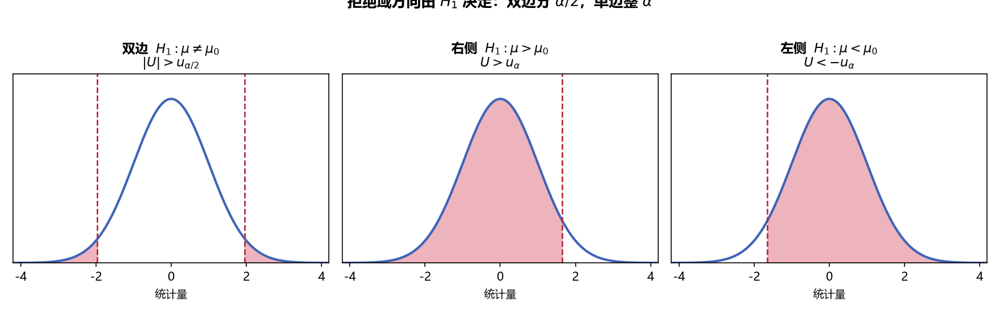
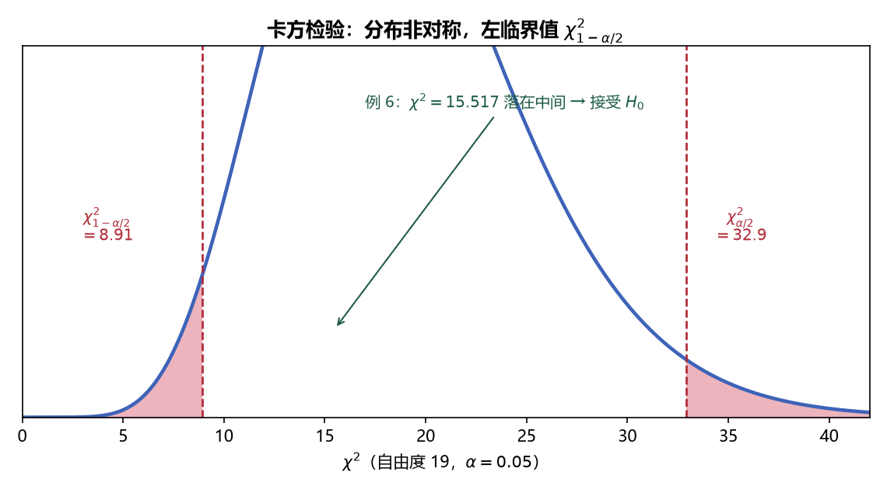

# 《概率论与数理统计》8.2 单个正态总体的检验（p60-p61）

> 整理自 B 站《概率论与数理统计》教学视频 2.0 版本（up：宋浩老师官方）p60-p61。

> 整理自 B 站《概率论与数理统计》教学视频 2.0 版本（up：宋浩老师官方）p60-p61。

## 一个正态总体的均值检验（U 检验 / T 检验）（p60）

> 整理自 B 站《概率论与数理统计》教学视频 2.0 版本（up：宋浩老师官方）p60。
> 前置：p58 四步骤、p50 抽样分布、p55 区间估计。本节是"真刀真枪"的第一课：方差已知用 U 检验，方差未知用 T 检验。

### 一、 假设的三种形式（等号给 H₀）

设 $X_1,\dots,X_n$ iid $\sim N(\mu,\sigma^2)$，$\mu_0$ 为已知标准值：

| 类型 | $H_0$ | $H_1$ | 对应检验 |
|---|---|---|---|
| 双边 | $\mu=\mu_0$ | $\mu\ne\mu_0$ | 拒绝域在两侧 |
| 右侧 | $\mu\le\mu_0$ | $\mu>\mu_0$ | 拒绝域在右侧 |
| 左侧 | $\mu\ge\mu_0$ | $\mu<\mu_0$ | 拒绝域在左侧 |

> **等号永远给 $H_0$**：单边假设中把 $\le/\ge$ 当 $=$ 处理（$\mu=\mu_0$）——因为第②步要"假定 $H_0$ 成立"代入 $\mu_0$；若 $H_0$ 里是严格不等号，无法取定值代入。

### 二、 方差已知：U 检验法

**检验统计量**（$\sigma^2$ 已知为 $\sigma_0^2$）：

$$U=\frac{\bar X-\mu_0}{\sigma_0/\sqrt n}\sim N(0,1)\quad(\text{假定 }H_0\text{ 成立})$$

**拒绝域**（$\alpha$ 给定）：

| 检验 | 拒绝域 |
|---|---|
| 双边 $H_1:\mu\ne\mu_0$ | $\lvert U\rvert>u_{\alpha/2}$ |
| 右侧 $H_1:\mu>\mu_0$ | $U>u_\alpha$ |
| 左侧 $H_1:\mu<\mu_0$ | $U<-u_\alpha$ |

**常用临界值**：$u_{0.05}=1.645$、$u_{0.025}=1.96$、$u_{0.005}=2.58$（和区间估计同一张表）。

> **易错点**：单边查 $u_\alpha$、双边查 $u_{\alpha/2}$——双侧把 $\alpha$ 分成两半，拒绝更"苛刻"。

> **图5** 三种拒绝域对比：双边（$\alpha/2$ 分两侧）、右侧、左侧——拒绝域方向永远由 $H_1$ 决定（自绘）。

### 三、 方差未知：T 检验法

**检验统计量**（$\sigma^2$ 未知，用 $S^2$ 代替）：

$$T=\frac{\bar X-\mu_0}{S/\sqrt n}\sim t(n-1)\quad(\text{假定 }H_0\text{ 成立})$$

**拒绝域**：

| 检验 | 拒绝域 |
|---|---|
| 双边 | $\lvert T\rvert>t_{\alpha/2}(n-1)$ |
| 右侧 | $T>t_\alpha(n-1)$ |
| 左侧 | $T<-t_\alpha(n-1)$ |

> **记忆**：U 检验与 T 检验唯一的差别是"$\sigma_0$ → $S$"；自由度 $n-1$。

### 四、 例题

**例 1（U 检验·双边）**：$X\sim N(\mu,5.2^2)$（$\sigma=5.2$ 已知），$n=100$，$\bar X=26.56$，$\alpha=0.05$，检验 $H_0:\mu=26$ vs $H_1:\mu\ne26$（机床是否正常）。

$$\lvert U\rvert=\left\lvert\frac{26.56-26}{5.2/10}\right\rvert\approx1.08<u_{0.025}=1.96$$

**接受 $H_0$**：认为 $\mu=26$，机床生产正常。（回答要"有问有答"：机床正常。）

> **易错点**：字幕/题目中"方差 5.2"须按数学反推核对——由 $U=1.08$ 可验证此处是**标准差** $\sigma=5.2$（$0.56/(5.2/10)\approx1.08$）；若误当方差 $\sigma^2=5.2$ 则 $U\approx2.46$、结论将相反。AI 字幕识别数字不可靠，做题以"算得 U 的值与结论自洽"为准。

**例 2（U 检验·右侧）**：同例 1 数据，改检验 $H_0:\mu=26$ vs $H_1:\mu>26$。

$$U=1.08<u_{0.05}=1.64$$

**接受 $H_0$**。**注意**：若 $\bar X$ 稍大使 $U=1.7$，则例 1 仍接受（$1.7<1.96$）而例 2 拒绝（$1.7>1.64$）——**单双边拒绝域不同，结论可能相反**。

**例 3（U 检验·左侧）**：灯泡寿命 $X\sim N(\mu,20^2)$，标准"平均寿命 $\ge1200$ 小时"，抽 5 只得 $1170,1210,1220,1180,1190$，$\alpha=0.05$，这批灯泡是否合格？

$$\bar X=1194,\qquad H_0:\mu\ge1200\ \text{vs}\ H_1:\mu<1200$$

$$U=\frac{1194-1200}{20/\sqrt5}\approx-0.67>-u_{0.05}=-1.64$$

**接受 $H_0$**：认为灯泡合格（$H_0$ 取等号 $\mu=1200$ 计算）。

**例 4（T 检验·双边）**：$n=50$，$\bar X=1900$，$S=490$，$\alpha=0.01$，检验 $H_0:\mu=2000$ vs $H_1:\mu\ne2000$。

$$\lvert T\rvert=\left\lvert\frac{1900-2000}{490/\sqrt{50}}\right\rvert\approx1.44<t_{0.005}(49)=2.68$$

**接受 $H_0$**：认为平均寿命 2000 小时。

**例 5（T 检验·右侧，提假设的坑）**：元件寿命 $X\sim N(\mu,\sigma^2)$，抽 16 只，$\bar X=241.5$，$S=98.726$，$\alpha=0.05$，问是否有理由认为平均寿命**大于** 225 小时？

检验者希望"$>225$"成立 → 放 $H_1$：

$$H_0:\ \mu\le225,\qquad H_1:\ \mu>225$$

$$T=\frac{241.5-225}{98.726/\sqrt{16}}\approx0.669<t_{0.05}(15)=1.753$$

**接受 $H_0$**：**没有理由**认为平均寿命大于 225 小时（问什么答什么）。

> **易错点（例 5 的坑）**：不能把 $H_0$ 写成 $\mu>225$（"$H_0$ 是不被怀疑的现状"）；等号必须留在 $H_0$——$H_0:\mu\le225$ 取 $\mu=225$ 计算。

---

### 本节重点

> - **选法**：检验 $\mu$ 时，$\sigma^2$ 已知 → **U 检验**（$N(0,1)$）；$\sigma^2$ 未知 → **T 检验**（$t(n-1)$）。
> - **统计量**：$U=\dfrac{\bar X-\mu_0}{\sigma_0/\sqrt n}$、$T=\dfrac{\bar X-\mu_0}{S/\sqrt n}$；都是"$\bar X$ 与 $\mu_0$ 差多远"。
> - **拒绝域**：双边 $\lvert\cdot\rvert>u_{\alpha/2}/t_{\alpha/2}$；右侧 $>u_\alpha/t_\alpha$；左侧 $<-u_\alpha/-t_\alpha$。
> - **假设**：等号给 $H_0$；"是否有理由认为…"→ 希望成立的放 $H_1$。
> - **四步必写**：提假设 → 选统计量（$H_0$ 下分布已知）→ 定拒绝域 → 算值下结论，并**回答原问题**（正常/合格/有理由）。

---

## 一个正态总体的方差检验（卡方检验法）（p61）

> 整理自 B 站《概率论与数理统计》教学视频 2.0 版本（up：宋浩老师官方）p61。
> 前置：p60 均值检验、p50 抽样分布结论。检验 $\sigma^2$ 一律用**卡方检验法**，只分"μ 已知/未知"两个自由度。

### 一、 假设的三种形式

设 $X_1,\dots,X_n$ iid $\sim N(\mu,\sigma^2)$，$\sigma_0^2$ 为标准值：

| 类型 | $H_0$ | $H_1$ |
|---|---|---|
| 双边 | $\sigma^2=\sigma_0^2$ | $\sigma^2\ne\sigma_0^2$ |
| 右侧 | $\sigma^2\le\sigma_0^2$ | $\sigma^2>\sigma_0^2$ |
| 左侧 | $\sigma^2\ge\sigma_0^2$ | $\sigma^2<\sigma_0^2$ |

**等号同样给 $H_0$**：假定 $H_0$ 成立时代入 $\sigma^2=\sigma_0^2$。

### 二、 检验统计量（μ 已知 vs μ 未知）

**情况 1：$\mu=\mu_0$ 已知**（理论情形，少见）

$$\chi^2=\frac{\sum_{i=1}^{n}(X_i-\mu_0)^2}{\sigma_0^2}\sim\chi^2(n)$$

**情况 2：$\mu$ 未知**（**考试常见**，用 $\bar X$ 替换 $\mu_0$）

$$\chi^2=\frac{(n-1)S^2}{\sigma_0^2}\sim\chi^2(n-1)$$

> **自由度规律**：把 $\mu_0$ 换成 $\bar X$ 少一个自由度——与 p50 抽样分布结论完全一致。**检验方差永远用卡方分布**。

### 三、 拒绝域（注意非对称）

$\chi^2$ 分布**不对称**，左右临界值独立查表：

| 检验 | 拒绝域 |
|---|---|
| 双边 | $\chi^2>\chi^2_{\alpha/2}(n-1)$ **或** $\chi^2<\chi^2_{1-\alpha/2}(n-1)$ |
| 右侧 | $\chi^2>\chi^2_\alpha(n-1)$ |
| 左侧 | $\chi^2<\chi^2_{1-\alpha}(n-1)$ |

> **易错点**：左侧临界值是 $\chi^2_{1-\alpha/2}$（**大**分位点在小概率一侧？不——是**小**分位点），查表时 $\chi^2_{0.975}$ 这种"大概率"分位要专门查 $\alpha=0.975$ 那一列；**不能写成 $-\chi^2_{\alpha/2}$**。

> **图6** 卡方检验的拒绝域（$\chi^2$ 非对称分布）：过大或过小都拒绝；例 6 的 $\chi^2=15.517$ 落在接受域（自绘）。

### 四、 例题

**例 6（μ 未知·双边，考试最爱）**：成年男子身高 $X\sim N(\mu,\sigma^2)$，$n=20$，$S=0.07$，$\alpha=0.05$，检验 $H_0:\sigma^2=0.006$ vs $H_1:\sigma^2\ne0.006$。

$$\chi^2=\frac{(n-1)S^2}{\sigma_0^2}=\frac{19\times0.07^2}{0.006}\approx15.517$$

临界值（自由度 19）：$\chi^2_{0.025}(19)=32.9$，$\chi^2_{0.975}(19)=8.91$：

$$8.91<15.517<32.9$$

**接受 $H_0$**：认为总体方差为 $0.006$（$m^2$）。

**例 7（μ 未知·右侧，"显著偏大"的提法坑）**：导线电阻 $X\sim N(\mu,\sigma^2)$，要求标准差 $\sigma=0.005$，抽 9 根得样本标准差 $s=0.008$，$\alpha=0.05$，能否认为这批导线标准差**显著偏大**？

检验者希望"偏大（$>$）"成立 → 放 $H_1$（严格不等号）；$H_0$ 取等号边界：

$$H_0:\ \sigma^2\le0.005^2,\qquad H_1:\ \sigma^2>0.005^2$$

$$\chi^2=\frac{(n-1)S^2}{\sigma_0^2}=\frac{8\times0.008^2}{0.005^2}=20.48>\chi^2_{0.05}(8)=15.5$$

**拒绝 $H_0$**：认为这批导线电阻标准差显著偏大。

> **易错点（例 7 的坑）**：题目问"**显著偏大**"（严格大于），$H_1$ 必须写 $\sigma^2>0.005^2$。若误写 $\ge$，接受 $H_1$ 时只能得"不小于"、与"偏大"结论矛盾——**单边假设方向写反，结论正好相反**。双边检验（"是否是 $0.005$"）则无此问题。

---

### 本节重点

> - **检验方差一律用卡方检验法**：$\mu$ 已知 $\chi^2=\dfrac{\sum(X_i-\mu_0)^2}{\sigma_0^2}\sim\chi^2(n)$；$\mu$ 未知 $\chi^2=\dfrac{(n-1)S^2}{\sigma_0^2}\sim\chi^2(n-1)$。
> - **拒绝域**：双边 $\chi^2>\chi^2_{\alpha/2}$ 或 $<\chi^2_{1-\alpha/2}$；右侧 $>\chi^2_\alpha$；左侧 $<\chi^2_{1-\alpha}$。
> - **等号给 $H_0$**；"显著偏大/偏小" ⇒ $H_1$ 用严格不等号。
> - **常见坑**：① 左侧临界值写成 $-\chi^2_{\alpha/2}$（$\chi^2$ 无负值）；② 自由度用 $n$ 还是 $n-1$（看 $\mu$ 已知与否）；③ 单边方向写反导致结论相反。

---

---

---

## 教材深化（《统计学完全教程》第10章）

> 整理自《统计学完全教程》(L. Wasserman) 第10章，为教材比原笔记更深的内容。

> 整理自《统计学完全教程》(L. Wasserman) 第10章，为教材比原笔记更深的内容。

> 整理自《统计学完全教程》(L. Wasserman) 第10章，为教材比原笔记更深的内容。

### 二、 Wald 检验：最通用的渐近检验

**定义（Wald 检验）**：$\hat\theta$ 是 $\theta$ 的估计、$\widehat{\text{se}}$ 是估计标准误，检验 $H_0:\theta=\theta_0$ vs $H_1:\theta\ne\theta_0$：
$$W=\frac{\hat\theta-\theta_0}{\widehat{\text{se}}},\qquad \text{拒绝 } H_0\iff |W|>z_{\alpha/2}$$
**定理 10.4**：渐近下 Wald 检验的 size 恰为 $\alpha$（因为 $H_0$ 下 $W\leadsto N(0,1)$）。

**Power（定理 10.6）**：真值 $\theta^*\ne\theta_0$ 时，
$$\beta(\theta^*)\approx1-\Phi\!\left(\frac{\theta_0-\theta^*}{\text{se}}+z_{\alpha/2}\right)+\Phi\!\left(\frac{\theta_0-\theta^*}{\text{se}}-z_{\alpha/2}\right)$$
两因素：$\theta^*$ 离 $\theta_0$ 越远 power 越大；样本量越大（se 越小）power 越大。

**典型应用（都只需 plug-in 估计 + 标准误）**：
- **两比例**：$X\sim\text{Binomial}(m,p_1)$、$Y\sim\text{Binomial}(n,p_2)$，$\hat\delta=\hat p_1-\hat p_2$，$\widehat{\text{se}}=\sqrt{\frac{\hat p_1(1-\hat p_1)}{m}+\frac{\hat p_2(1-\hat p_2)}{n}}$；
- **配对比较（paired）**：$D_i=X_i-Y_i$（同一测试集），$\hat\delta=\bar D$，$\widehat{\text{se}}=S_D/\sqrt n$；
- **两均值**：$\hat\delta=\bar X-\bar Y$，$\widehat{\text{se}}=\sqrt{S_1^2/m+S_2^2/n}$；
- **两中位数**：标准误用 Bootstrap 求（第8章）。

> Wald 检验把"检验"问题统一成了"估计+标准误"问题——凡是能算 $\hat\theta\pm\widehat{\text{se}}$ 的都能检验。

### 七、 似然比检验 LRT

检验 $H_0:\theta\in\Theta_0$ vs $H_1:\theta\notin\Theta_0$，统计量
$$\Lambda=2\log\frac{\sup_{\theta\in\Theta}\ell(\theta)}{\sup_{\theta\in\Theta_0}\ell(\theta)}=2\log\frac{\ell(\hat\theta)}{\ell(\hat\theta_0)}$$
（$\hat\theta$ 无约束 MLE，$\hat\theta_0$ 限制在 $\Theta_0$ 内的 MLE。）

**定理 10.22**：$H_0$ 下 $\Lambda\leadsto\chi^2_{r-q}$，自由度 $r-q$ = **全参数空间维数 − 限制空间维数**。

**例（孟德尔豌豆，LRT 版）**：$\Lambda=2\sum_jX_j\log(\hat p_j/p_{0j})=0.48$，自由度为 $3-0=3$，$p=\mathbb P(\chi^2_3>0.48)=0.92$——与 Pearson χ² 结论一致（大样本下两者通常相近）。

### 十、 附录：Neyman-Pearson 引理与 t 检验

**Neyman–Pearson 引理（简单对简单）**：$H_0:\theta=\theta_0$ vs $H_1:\theta=\theta_1$，似然比
$$T=\frac{\ell(\theta_1)}{\ell(\theta_0)}=\frac{\prod f(x_i;\theta_1)}{\prod f(x_i;\theta_0)}$$
取临界值 $k$ 使 $\mathbb P_{\theta_0}(T>k)=\alpha$，则该检验是**所有 size α 检验中 power 最大**的（最优势检验）。这是 LRT 的理论源头。

**t 检验（附录）**：$X_1,\dots,X_n\sim N(\mu,\sigma^2)$（$\mu,\sigma$ 均未知），$H_0:\mu=\mu_0$：
$$T=\frac{\sqrt n(\bar X_n-\mu_0)}{S_n}\ \text{在 }H_0\text{ 下精确服从 }t_{n-1}$$
拒绝 $|T|>t_{n-1,\alpha/2}$。大样本时 $t_{n-1}\approx N(0,1)$，与 Wald 检验基本一致；小样本且正态假设成立时用 t 更准。

---

---

> 整理自《统计学完全教程》(L. Wasserman) 第10章，为教材比原笔记更深的内容。

### 五、 Pearson χ² 检验（多项数据）

$X=(X_1,\dots,X_k)\sim\text{Multinomial}(n,p)$，检验 $H_0:p=p_0$：
$$T=\sum_{j=1}^{k}\frac{(X_j-np_{0j})^2}{np_{0j}}=\sum_{j=1}^{k}\frac{(X_j-E_j)^2}{E_j}$$
**定理 10.17**：$H_0$ 下 $T\leadsto\chi^2_{k-1}$，拒绝 $T>\chi^2_{k-1,\alpha}$，$p=\mathbb P(\chi^2_{k-1}>t)$。

**例（孟德尔豌豆）**：$n=556$，$p_0=(9/16,3/16,3/16,1/16)$，观测 $(315,101,108,32)$：$T=0.47<\chi^2_{3,0.05}=7.815$，$p=0.93$——不拒绝（数据不违背孟德尔理论）。

### 九、 拟合优度检验

检验数据是否来自参数模型 $\mathcal F=\{f(x;\theta)\}$：把实轴分成 $k$ 个区间，$p_j(\theta)=\int_{I_j}f$，用多项似然估计 $\hat\theta$，统计量
$$Q=\sum_{j=1}^{k}\frac{(N_j-n\hat p_j)^2}{n\hat p_j}\leadsto\chi^2_{k-1-s}\quad(\text{自由度=区间数−参数数−1})$$
警示：不拒绝 ≠ 模型正确（可能 power 不够）；不能把 $\hat\theta$ 换成 MLE 直接套 $\chi^2_{k-1}$（Chernoff–Lehmann，1954）。
